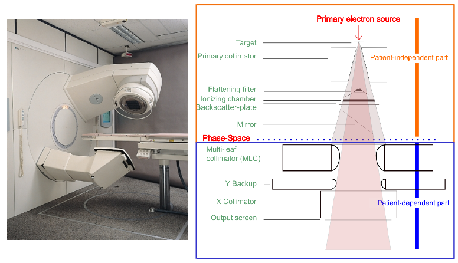
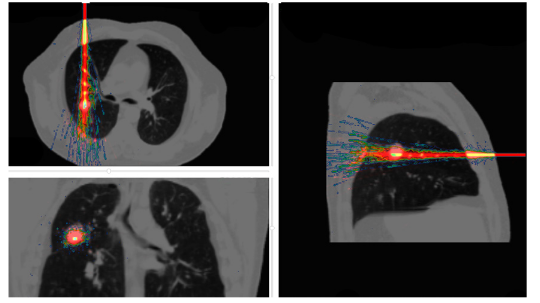
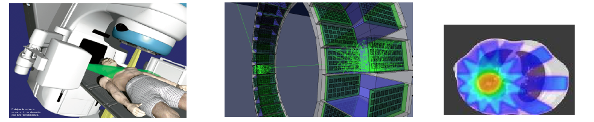
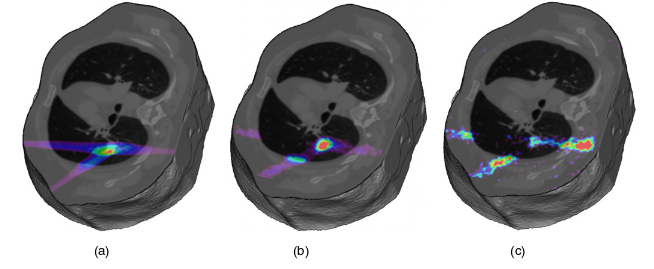

Beam modelling
==============

.. contents:: Table of Contents
   :depth: 15
   :local:

Photon beam : LINAC
-------------------

A realistic photon beam in a multilayer phantom can be modelled using GATE. The phantom is irradiated with a photon beam, originating from a uniform point source at a certain distance from the phantom surface and collimated at the surface of the phantom using :ref:`kill_track-label`. The energy spectrum of the point source is modelled using the configurations of a VARIAN Clinac for example. The depth dose distribution was calculated along the central axis with a 1D :ref:`dose_measurement_doseactor-label`. The production threshold can be set to different values in the world and in the phantom for electrons, positrons and photons.

   LINAC

Hadron therapy application
--------------------------

As an example of a hadron therapy application, we simulate a **C12** scanning **pencil beam** irradiation of an artificial spherical target inside a patient CT image. The treatment
plan comprised different pencil beams. :numref:`DoseDepositedCarbonIonBeamInCT` illustrates the dose deposition measured using GATE.

   Dose deposited by a carbon ion beam inside a CT image of a thorax. The colour scale is a warm metal scale, with high values (white) corresponding to high-dose deposit and low values (blue) corresponding to low-dose deposit.

In-beam PET modelling
---------------------

GATE is able to jointly model radiation therapy and emission tomography in order to monitor the deposited dose for a C12 treatment using PET imaging as shown in :numref:`PETmonitoringOfDose`. It models the Carbon beam, the nuclear fragmentation, the β+ emitters, back to back photon and dose monitoring!

   Monitoring of the deposited dose using PET imaging for a C12 treatment.

A 4D CT patient scan was used to define the numerical phantom.  A three **beam treatment** plan was modelled with a total production
of 3 beams of 10e9 C12 ions.  Each beam was composed of 195 independent spots with 42 different incident energies between 175 and 230 MeV/u.  All **hadronic and electromagnetic processes** were included in the simulation. Positron range and annihilation photon pair acollinearity were taken into account. A model of the **Siemens HR+ PET system** was used to simulate a 20 min static acquisition starting immediately after the irradiation.  PET data were normalized, corrected for attenuation using an attenuation map derived from the CT, and reconstructed using 3D back projection. The simulation was performed in less than 24 h on a cluster of 1000 Intel Nehalem 2.93 GHz CPUs. :numref:`DoseDistributionCarbonAndOxygen` shows the reconstructed PET images. It suggests that the C11 activity distribution contains most information regarding the location of the Spread Out Bragg Peak (SOBP), while the O15 activity might be relevant to derive information about the dose to normal tissues.

   (a)Dose distribution simulated for a C12 irradiation inside a CT image of a thorax. (b) Simulated PET image of the resulting C11 isotope distribution. (c) Simulated PET image of the O15 isotope distribution.

