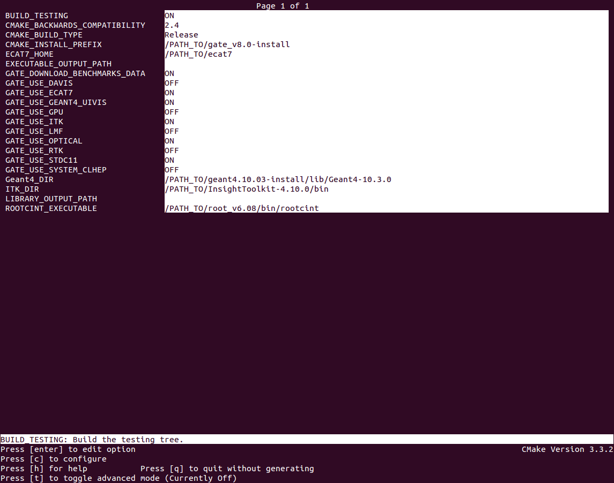

.. _compilation_instructions-label:

Compiling GATE (V9.0)
=============================

.. contents:: Table of Contents
   :depth: 15
   :local:

**IMPORTANT** Before continuing, make sure all required packages are properly installed on your system. See :ref:`package_requirements-label`

Required dependencies
----------------

For compiling GATE V9.0, the required dependencies are ::

   Geant4 10.06  # including the embedded CLHEP
   ROOT (ROOT 6.xx) # still required, but it may become optional in the future
   

Optional packages ::
 
   CLHEP 2.3.4.3  # by default the one provided in Geant4 is used
   ITK (version 5.xx or later)
   ECAT
   LMF
   libTorch # see section below
   

CLHEP
-----

Since the GATE V7.0 release, users can use the CLHEP embedded within each Geant4 distribution. This case, the CMAKE flag GEANT4_USE_SYSTEM_CLHEP, which is OFF by default, must stay OFF.

However, users can use an external CLHEP version (2.3.4.3) by turning flag GEANT4_USE_SYSTEM_CLHEP ON and following the CLHEP installation procedures: http://proj-clhep.web.cern.ch/proj-clhep

Geant4
------

First, download the Geant sources at this address: http://geant4.web.cern.ch/

During the cmake: QT and OPENGL are optional. We recommand to set GEANT4_INSTALL_DATA.

Finally, update your environment variables file with the following command lines:

* bash or zsh:

   source /PATH_TO/geant4.10.06-install/bin/geant4.sh

* [t]csh:

   source /PATH_TO/geant4.10.06-install/bin/geant4.csh

For details, read the official GEANT4 installation procedure.

ROOT
----

You can download ROOT at the following address: https://root.cern.ch/downloading-root

It is recommended to install directly the ROOT binaries. Users have to compile the ROOT sources only if necessary.

Depending on your environment, you need to source ROOT as follow (this final step is summarized in the item 5 of this documentation):

* bash or zsh::

   source /PATH_TO/root_v6.xx/bin/thisroot.sh

* [t]csh::

   source /PATH_TO/root_v6.xx/bin/thisroot.csh

.. _geant4-label:

.. _gate-label:

libtorch (optional)
---------

The goal is here to make Gate use the torch library, an open source machine learning framework : https://pytorch.org

Pytorch is usually used via a Python module, but here we need an additional library named 'libtorch' that will be used by Gate during compilation.

To download 'libtorch', go to https://pytorch.org at the section QUICK START LOCALLY, and select PyTorch Build stable, Your OS, Package libtorch, Language C++, your CUDA version if you have CUDA installed on your computer or None if you want to use only your CPU (Note: GATE is currently using only CPU with libtorch). Then download the zip archive. For Linux platform you can choose between Pre-cxx11 ABI or cxx11 ABI versions according to your gcc version. If you cannot compile (or link) Gate with the former version, try the latter version. Finally unziped somewhere on your disk. No compilation required here.

Then, during the installation of Gate (next section) use the following option to set the path to libtorch ::

    GATE_USE_TORCH     ON
    Torch_DIR          /home/YOURNAME/libtorch-1.3.0/share/cmake/Torch
    
In some configuration, the following path should also be set ::

    CUDNN_INCLUDE_DIR  /home/YOURNAME/cuda/include
    CUDNN_LIBRARY      /home/YOURNAME/cuda/lib64/libcudnn.so          

We recommend you to use libtorch version 1.4.0 but if you want to use a version greater than 1.7.0, check https://github.com/OpenGATE/Gate/pull/424

GATE V9.0
---------

First, download the GATE sources at this address: https://github.com/OpenGATE/Gate/archive/v9.0.zip
Unzip the downloaded file::

   unzip Gate-9.0.zip

Alternatively, if you are familiar with git, then instead of downloading and extracting the tar file, you can also clone the sources from github and check out the *v9.0* release tag.

   git clone https://github.com/OpenGATE/Gate.git Gate
   cd Gate
   git checkout v9.0

Create two directories to build and install GATE::

   mkdir gate_v9.0-build
   mkdir gate_v9.0-install

Move into the GATE build directory::

   cd gate_v9.0-build

Run ccmake as follows::

   ccmake ../Gate-9.0

You need to change the *CMAKE_INSTALL_PREFIX*, it should be set to the install directory (defined above). The default given by CMake is */usr/local*; if you have root/sudo permissions on your machine then it's possible to install Gate there, but it's not recommended, especially if you need to work with more than one version of Gate (for instance, if you want to do development on Gate, or if you want to verify that a new release is compatible with the old release that you have been using).
You should get something like this (the screen shot is taken from the 8.0 release, the only difference is the version number):

Warning Information about following environment variables::

   BUILD_TESTING                      OFF: by default, set to ON if you want to perform build testing
   GATE_DOWNLOAD_BENCHMARKS_DATA      OFF: by default, set to ON if you want to download the benchmark data to run validation tests (with the command *make test*)
   GATE_USE_ECAT7                     OFF: by default, set to ON if you want to use this library
   GATE_USE_GPU                       OFF: by default, set to ON if you want to use GPU modules
   GATE_USE_ITK                       OFF: by default, set to ON if you want to access DICOM reader and thermal therapy capabilities
   GATE_USE_LMF                       OFF: by default, set to ON if you want to use this library
   GATE_USE_OPTICAL                   OFF: by default, set to ON if you want to perform simulation for optical imaging applications
   GATE_USE_RTK                       OFF: by default, set to ON if you want to use this toolkit
   GATE_USE_STDC11                    ON : by default, set to OFF if you want to use another standard for the C programming language (advanced users)
   GATE_USE_DAVIS                     OFF: by default, set to ON if you want to use the Davis LUT model
   GEANT4_USE_SYSTEM_CLHEP            OFF: by default, set to ON if you want to use an external CLHEP version

As it was the case for Geant4, press 'c' to configure (you may need to do this multiple times) and then 'g' to generate the compilation environment. 

Finally::

   make -jN (N is the number of processor(s) in your PC)
   make install

Finally, update your environment variables file with the following command lines: (this part is summarized in the item 5 of this document)

* bash or zsh:

   export PATH=/PATH_TO/gate_v9.0-install/bin:$PATH

* [t]csh

   setenv PATH /PATH_TO/gate_v9.0-install/bin:${PATH}
   

Environment configuration and starting GATE
-------------------------------------------

We highly recommended to create a *gate_env.sh* (or *gate_env.csh* if you are a [t]csh user) file to set up all environment variables which are mandatory to perform a full GATE simulation, and save this file in the bin directory of your Gate installation. (In future releases of Gate we hope to provide such an environment setup file automatically.)

This file should be defined as follows:

* bash or zsh::

   source /PATH_TO/root_v6.XX/bin/thisroot.sh
   source /PATH_TO/geant4.10.06-install/bin/geant4.sh
   export PATH=$PATH:/PATH_TO/gate_v9.0-install/bin
   # the following lines only if you are using an external CLHEP library (and similar for ITK, if you enabled it):
   export PATH=$PATH:/PATH_TO/2.3.4.3/CLHEP/bin
   export LD_LIBRARY_PATH=$LD_LIBRARY_PATH:/PATH_TO/2.3.4.3/CLHEP/lib

* csh or tcsh::

   source /PATH_TO/root_v6.XX/bin/thisroot.csh
   source /PATH_TO/geant4.10.06-install/bin/geant4.csh
   setenv PATH ${PATH}:$/PATH_TO/gate_v9.0-install/bin
   # the following lines only if you are using an external CLHEP library (and similar for ITK, if you enabled it):
   setenv PATH ${PATH}:/PATH_TO/2.3.4.3/CLHEP/bin
   setenv LD_LIBRARY_PATH ${LD_LIBRARY_PATH}:/PATH_TO/2.3.4.3/CLHEP/lib

Save this file in */PATH_TO/gate_v8.2-install/bin*. Finally, before to start a GATE session::

   source /PATH_TO/gate_v9.0-install/bin/gate_env.sh

In order to save typing, you may want to define an alias for that: include the following line in your *$HOME/.bashrc* or *$HOME/.bash_aliases* file::

   alias gate90='source /PATH_TO/gate_v9.0-install/bin/gate_env.sh'

(For csh and tcsh the syntax is different but the idea is the same.)

With your shell environment properly set up, you should be able to run Gate. To try it out, just start it without any arguments::

   Gate

**!** If you are using the Qt interface on non-English locales then you must force Qt to use a locale with a dot for the decimal separator::

   LC_NUMERIC=C Gate --qt

ITK
---

See: https://itk.org and follow the instructions. 

Here are some additional cmake options::

   ccmake -DITK_USE_REVIEW=ON ..

You will obtain the following screen and you need to configure the different options as follows::

   BUILD_EXAMPLES                   OFF
   BUILD_TESTING                    OFF
   ITKV3_COMPATIBILITY              OFF
   ITK_BUILD_DEFAULT_MODULES        ON
   ITK_WRAP_PYTHON                  OFF

ECAT7
-----

First, create and enter an ecat7 sub-directory::

   mkdir /PATH_TO/ecat7
   cd /PATH_TO/ecat7

Download the ECAT library sources at this address:

http://www.opengatecollaboration.org/ECAT

Unzip and untar the downloaded file::
 
   tar -xzf ecat.tar.gz

**WARNING:** if you want to use ECAT7 output module, don't forget to set CMake option GATE_USE_ECAT7 to ON and to provide the path to ECAT7 source directory (i.e /PATH_TO/ecat7)

Copy the right Makefile.<os> to Makefile.
If Makefile exists this step is not necessary::

   cp Makefile.unix Makefile

Compile::

   make

This will build the library

Go to the utils directory
Copy the right Makefile.<os> to Makefile
if Makefile exists this step is not necessary::

   cp Makefile.unix Makefile

Compile (do not use make -j4 !!!)::

   make

This will create some utility programs

After compilation, create the following folder: include/::

   mkdir /PATH_TO/ecat7/include

In this folder copy all \*.h files::

   cp *.h /PATH_TO/ecat7/include

Check that the file libecat.a is in lib/.
If it isn't copy it there::

   mkdir lib
   cp libecat.a lib/

LMF 3
-----

(Disclaimer: the LMF code and build instructions are provided "as is", we do not give an warranty of it's correctness or usefulness for any purpose, and do not officially support LMF.)

Enter the source directory::

   /PATH_TO/lmf_3_0

Configure lmf

 ./configure

Make sure that you have ROOT in your environment. If this is not the case yet, then run *source /PATH/TO/ROOT/bin/thisroot.sh* (change the "path to root" according to your local ROOT installation).
Then edit the *makefile* to inform the modern compiler on your machine that the code is antique::

   obj/%.o : src/%.c
           gcc $(CFLAGS) -std=c99 -c -o $@ $<
   
   obj/outputRootMgr.o : src/outputRootMgr.cc
           gcc $(CFLAGS) $(ROOTCFLAGS) -std=c++98 -c -o $@ $<
   
   obj/%.o : src/%.cc
           gcc $(CFLAGS) -std=c++98 -c -o $@ $<

(And be careful, it's important that the whitespace in front of each *gcc* is a TAB; if you use normal spaces then it won't work!)

Compile (do not use make -j4 !!!)::

   make clean
   make

If it does not exist, after compilation create the following folder: includes::

   mkdir /PATH_TO/lmf_3_0/includes

In this folder copy all \*.h files, if they aren't in there already::

   cp *.h /PATH_TO/lmf_3_0/includes

Check that the file libLMF.a is in lib/
If it isn't copy it there

Installation of cluster tools
-----------------------------

jobsplitter
~~~~~~~~~~~

Go to /PATH_TO/gate_v9.0/cluster_tools/jobsplitter::

   cd /PATH_TO/gate_v9.0/cluster_tools/jobsplitter

Make sure ROOT and Geant4 environment variables are set::

   source /PATH_TO/root_v6.XX/bin/thisroot.sh
   source /PATH_TO/geant4.10.06-install/bin/geant4.sh

Compile::

   make

Copy the gjs executable file to the correct place::

   cp /PATH_TO/gate_v9.0/cluster_tools/jobsplitter/gjs /PATH_TO/gate_v9.0-install/bin

filemerger
~~~~~~~~~~~

Go to /PATH_TO/gate_v9.0/cluster_tools/filemerger
Make sure ROOT and Geant4 environment variables are set::

   source /PATH_TO/root_v6.XX/bin/thisroot.sh
   source /PATH_TO/geant4.10.06-install/bin/geant4.sh

Compile::

   make

Copy the gjs executable file to the correct place::

   cp /PATH_TO/gate_v9.0/cluster_tools/filemerger/gjm /PATH_TO/gate_v9.0-install/bin

