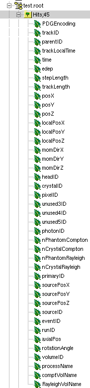
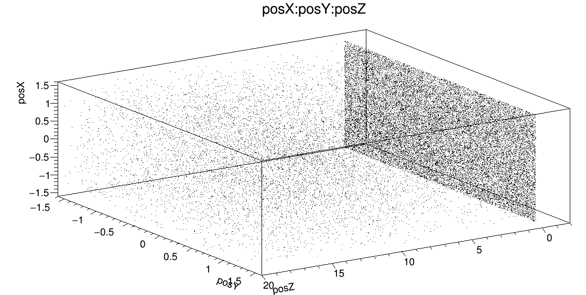
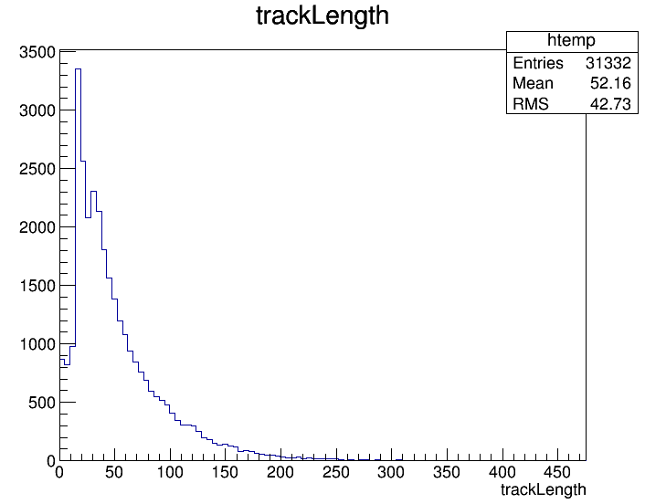
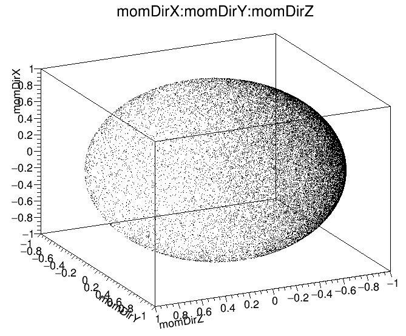
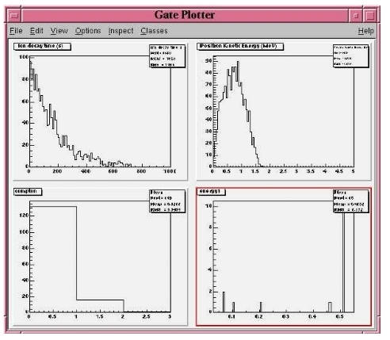
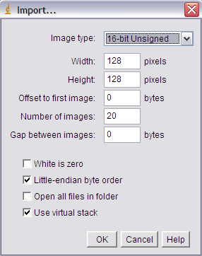
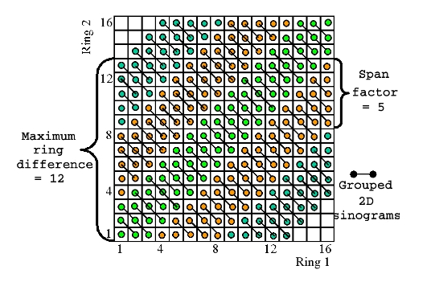
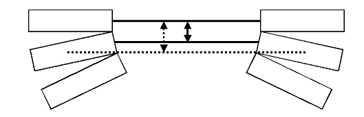

.. _data_output-label:

Data output
===========

.. contents:: Table of Contents
   :depth: 15
   :local:

In GATE, there are several types of output format, which can be enabled. By default all outputs are disabled and moreover there is no default output file name. You **must** give a file name, otherwise the output module will be automatically disabled.

All the output commands must always be written after the initialization line::

   /gate/output/...

ASCII and **binary** outputs
------------------------------

The GateToASCII/GateToBinary classes enable the ASCII/**binary** file output. It allows you to process your raw data with your own tools. On the other hand, this output is not compressed and the output files are very large. If the ASCII/**binary** files are not needed for analysis, it is strongly recommended not using this output to speed up the simulation and save space::

   /gate/output/ascii(**binary**)/enable
   /gate/output/ascii/setFileName   test

   # enable ascii(**binary**) output for hits
   /gate/output/ascii(**binary**)/setOutFileHitsFlag   1
   
   # enable ascii(**binary**) output for Singles (end of digitizer chain)
   /gate/output/ascii(**binary**)/setOutFileSinglesFlag   1
   
   # enable ascii(**binary**) output for coincidences
   /gate/output/ascii(**binary**)/setOutFileCoincidencesFlag   1
   
   # enable ascii(**binary**) output for singles (after a digitizer module)
   /gate/output/ascii(**binary**)/setOutFileSingles< name of the digitizer module >Flag   1

The names of the digitizer module are : *Adder*, *Readout*, *Spblurring*, *Blurring*, *Thresholder*, *Upholder*. Their actions are explained in :ref:`digitizer_and_readout_parameters-label`.

To disable these ASCII(**binary**) files which can be large, the macro should contain the following lines::

   /gate/output/ascii(**binary**)/setOutFileHitsFlag            0
   /gate/output/ascii(**binary**)/setOutFileSinglesFlag         0
   /gate/output/ascii(**binary**)/setOutFileCoincidencesFlag    0

Only the file *gateRun.dat* which contain the number of decay per run  will then be created.

Description of the ASCII(**binary**) file content
~~~~~~~~~~~~~~~~~~~~~~~~~~~~~~~~~~~~~~~~~~~~~~~~~

The units are : 

* MeV (energy)
* mm (position)
* s (time)
* deg (angle)

Hits file : gateHits.dat(**.bin**)
^^^^^^^^^^^^^^^^^^^^^^^^^^^^^^^^^^

Each line is a hit and the columns represent :

* Column 1 : ID of the run (i.e. time-slice) **(4-bytes, G4int)**
* Column 2 : ID of the event **(4-bytes, G4int)**
* Column 3 : ID of the primary particle whose descendant generated this hit **(4-bytes, G4int)**
* Column 4 : ID of the source which emitted the primary particle **(4-bytes, G4int)**
* Columns 5 to N+4 : Volume IDs at each level of the hierarchy of a system, so the number of columns depends on the system used.

Example : cylindricalPET system N=6

*  Column 5 : ID of volume attached to the "base" level of the system **(4-bytes, G4int)**
*  Column 6 : ID of volume attached to the "rsector" level of the system **(4-bytes, G4int)**
*  Column 7 : ID of volume attached to the "module" level of the system **(4-bytes, G4int)**
*  Column 8 : ID of volume attached to the "submodule" level of the system **(4-bytes, G4int)**
*  Column 9 : ID of volume attached to the "crystal" level of the system **(4-bytes, G4int)**
*  Column 10 : ID of volume attached to the "layer" level of the system **(4-bytes, G4int)**

Example : SPECTHead system N=3

*  Column 5 : ID of volume attached to the "base" level of the system **(4-bytes, G4int)**
*  Column 6 : ID of volume attached to the "crystal" level of the system **(4-bytes, G4int)**
*  Column 7 : ID of volume attached to the "pixel" level of the system **(4-bytes, G4int)**
*  Column N+5 : Time stamp of the hit **(8-bytes, G4double)**
*  Column N+6 : Energy deposited by the hit **(8-bytes, G4double)**
*  Column N+7 : Range of particle which has generated the hit **(8-bytes, G4double)**
*  Column N+8, N+9 ,N+10 : XYZ position of the hit in the world referential **(8-bytes, G4double)**
*  Column N+11 : Geant4 code of the particle which has generated the hit (11 for Electrons & 22 for Photons) **(4-bytes, G4int)**
*  Column N+12 : ID of the particle which has generated the hit **(4-bytes, G4int)**
*  Column N+13 : ID of the mother of the particle which has generated the hit **(4-bytes, G4int)**
*  Column N+14 : ID of the photon giving the particle which has generated the hit **(4-bytes, G4int)**
*  Column N+15 : Number of Compton interactions in phantoms before reaching the detector **(4-bytes, G4int)**
*  Column N+16 : Number of Rayleigh interactions in phantoms before reaching the detector **(4-bytes, G4int)**
*  Column N+17 : Name of the process which has generated the hit **(8-bytes, G4string)**
*  Column N+18 : Name of the last volume where a Compton effect occurred **(8-bytes, G4string)**
*  Column N+19 : Name of the last volume where a Rayleigh effect occurred **(8-bytes, G4string)**

Singles files : gateSingles.dat(**.bin**)
^^^^^^^^^^^^^^^^^^^^^^^^^^^^^^^^^^^^^^^^^

The system is set as a cylindricalPET system. Each line is a single and the columns are :

* Column 1 :        ID of the run (i.e. time-slice) **(4-bytes, G4int)**
* Column 2 :        ID of the event **(4-bytes, G4int)**
* Column 3 :        ID of the source **(4-bytes, G4int)**
* Column 4, 5, 6 :  XYZ position of the source in world referential **(8-bytes, G4double)**
* Column 7 to 12 :  Volume IDs*(cf. columns 5-10 of sec 11.) **(4-bytes, G4int)**
* Column 13 :       Time stamp of the single **(8-bytes, G4double)**
* Column 14 :       Energy deposited by the single **(8-bytes, G4double)**
* Column 15 to 17 : XYZ position of the single in the world referential **(8-bytes, G4double)**
* Column 18 :       Number of Compton interactions in phantoms before reaching the detector **(4-bytes, G4int)**
* Column 19 :       Number of Compton interactions in detectors before reaching the detector **(4-bytes, G4int)**
* Column 20 :       Number of Rayleigh interactions in phantoms before reaching the detector **(4-bytes, G4int)**
* Column 21 :       Number of Rayleigh interactions in detectors before reaching the detector **(4-bytes, G4int)**
* Column 22 :       Name of the phantom where a Compton effect occured **(8-bytes, G4string)**
* Column 23 :       Name of the phantom where a Rayleigh effect occured **(8-bytes, G4string)**

Coincidences files : gateCoincidences.dat(**.bin**)
^^^^^^^^^^^^^^^^^^^^^^^^^^^^^^^^^^^^^^^^^^^^^^^^^^^

The system is set as a cylindricalPET system. Each line is a coincidence created with two singles and the columns are :

* Column 1 : ID of the run (i.e. time-slice) (first single) **(4-bytes, G4int)**
* Column 2 : ID of the event (first single) **(4-bytes, G4int)**
* Column 3 : ID of the source (first single) **(4-bytes, G4int)**
* Column 4 to 6 : XYZ position of the source in world referential (first single) **(8-bytes, G4double)**
* Column 7 : Time stamp (first single) (8-bytes, G4double) **(8-bytes, G4double)**
* Column 8 : Deposited energy (first single) (8-bytes, G4double) **(8-bytes, G4double)**
* Column 9 to 11 : XYZ position in the world referential (first single) **(8-bytes, G4double)**
* Column 12 to 17 : volume IDs* (first single)
* For binary : Column 12 and 13 **(4-bytes, G4int)**
* For binary : Column 14 **(4-bytes, G4int)**
* For binary : Column 15 to 17 **(4-bytes, G4int)**
* Column 18 : Number of Compton interactions in phantoms before reaching the detector (first single) **(4-bytes, G4int)**
* Column 19 : Number of Compton interactions in detectors before reaching the detector (first single) **(4-bytes, G4int)**
* Column 20 : Number of Rayleigh interactions in phantoms before reaching the detector (first single) **(4-bytes, G4int)**
* Column 21 : Number of Rayleigh interactions in detectors before reaching the detector (first single) **(4-bytes, G4int)**
* Column 22 : Scanner axial position (first single) **(8-bytes, G4double)**
* Column 23 : Scanner angular position (first single) **(8-bytes, G4double)**
* Column 24 : ID of the run (i.e. time-slice) (second single) **(4-bytes, G4int)**
* Column 25 : ID of the event (second single) **(4-bytes, G4int)**
* Column 26 : ID of the source (second single) **(4-bytes, G4int)**
* Column 27 to 29 : XYZ position of the source in world referential (second single) **(8-bytes, G4double)**
* Column 30 : Time stamp (second single) **(8-bytes, G4double)**
* Column 31 : Energy deposited (second single) **(8-bytes, G4double)**
* Column 32 to 34 : XYZ position in the world referential (second single) **(8-bytes, G4double)**
* Column 35 to 40 : volume IDs
* For binary : Column 35 and 36 **(4-bytes, G4int)**
* For binary : Column 37 **(4-bytes, G4int)**
* For binary : Column 38 to 40 **(4-bytes, G4int)**

The number of different volumeIDs depends on the complexity of the system geometry (6 IDs for cylindricalPET system, 3 for ECAT system, ...). Then, the number of column of your ASCII file is not constant, but system-dependent.

* Column 41 : Number of Compton interactions in phantoms before reaching the detector (second single) **(4-bytes, G4int)**
* Column 42 : Number of Compton interactions in detectors before reaching the detector (second single) **(4-bytes, G4int)**
* Column 41 : Number of Rayleigh interactions in phantoms before reaching the detector (second single) **(4-bytes, G4int)**
* Column 42 : Number of Rayleigh interactions in detectors before reaching the detector (second single) **(4-bytes, G4int)**
* Column 45 : Scanner axial position (second single) **(8-bytes, G4double)**
* Column 46 : Scanner angular position (second single) **(8-bytes, G4double)**

Selection of the variables in Singles/Coincidences ASCII and binary outputs
~~~~~~~~~~~~~~~~~~~~~~~~~~~~~~~~~~~~~~~~~~~~~~~~~~~~~~~~~~~~~~~~~~~~~~~~~~~

The user can select which variables he/she wants in the ASCII(**binary**) file. The mechanism is based on a series of 0/1, one for each variable. By default all variables are enabled, but one can choose to enable only some of the variables listed in 10.4.1::

   /gate/output/ascii(**binary**)/setCoincidenceMask      1 0 1 0 1 1
   /gate/output/ascii(**binary**)/setSingleMask           0 0 1 1

**Note**: the VolumeID variables are enabled/disabled together, as a group. The component of the 3D vectors, instead, like the positions (components x,y,z), are enabled/disabled one by one.

Large files: automatic file swap
~~~~~~~~~~~~~~~~~~~~~~~~~~~~~~~~

When a user defined limit is reached by the Coincidence or Single ASCII(**binary**) output file, by default Gate closes the file and opens another one with the same name but a suffix _1 (and then _2, and so on).
By default the file limit is set to 2000000000 bytes. One can change the number of bytes with a command like::

   /gate/output/ascii(**binary**)/setOutFileSizeLimit 30000

If the value is < 10000, no file swapping is made (to avoid creating thousands of files by mistake).

For example, if one does not have any limit in the Operating System, one can put the number
to 0, and there will be only one large (large) file at the end.

In case of high statistics applications, one might consider enabling only the ROOT output (see :ref:`root_output-label`), which contains the same information as the binary one, but automatically compressed and ready for analysis.

What is the file gateRun.dat(**.bin**)?
~~~~~~~~~~~~~~~~~~~~~~~~~~~~~~~~~~~~~~~~

This file is the list of the number of decays generated by the source for each run (one by line).  
The Output manager is called for each event, even if the particle(s) of the 
decay do not reach the detector.  
Note that the number of processed decays can be slighly different
from the expected number :math:`\rm N=A \times \Delta t` where :math:`\rm A`
is the activity and :math:`\rm \Delta t` is the time of the
acquisition, due to the random character of the decay which governs the event 
generation (Poisson law). Gate generates the time delay from the 
previous event, if it is out of the time slice it stops the event 
processing for the current time slice and if needed it starts a new time slice.

.. _root_output-label:

Root output
-----------
Please, consider to use :ref:`new_unified_tree_output_general_set-label`.

Example::

   /gate/output/root/enable
   /gate/output/root/setFileName FILE_NAME

which will provide you with a FILE_NAME.root file. By default, this root file will contain: 2 Trees for SPECT systems (Hits and Singles) or 3 Trees for PET systems (Coincidences, Hits and Singles) in which several variables are stored.

If needed, and for a matter of file size, you could choose not to generate all trees. In this case, just add the following lines in your macro::

   /gate/output/root/setRootHitFlag            0
   /gate/output/root/setRootSinglesFlag        0
   /gate/output/root/setRootCoincidencesFlag   0
   /gate/output/root/setRootNtupleFlag         0

By turning to 1 (or 0) one of this tree flag, you will fill (or not) the given tree.  
 
In a debug mode, it can be useful to store in a Tree the informations after the action of one particular module of the digitizer chain. The following flags exist to turn on or off these intermediate trees::

   /gate/output/root/setOutFileSinglesAdderFlag         0
   /gate/output/root/setOutFileSinglesReadoutFlag       0
   /gate/output/root/setOutFileSinglesSpblurringFlag    0
   /gate/output/root/setOutFileSinglesBlurringFlag      0
   /gate/output/root/setOutFileSinglesThresholderFlag   0
   /gate/output/root/setOutFileSinglesUpholderFlag      0

If you want to disable the whole ROOT output, just do not call it, or use the following command::

   /gate/output/root/disable

Using TBrowser To Browse ROOT Objects
~~~~~~~~~~~~~~~~~~~~~~~~~~~~~~~~~~~~~

The ROOT graphical user interface TBrowser is a useful tool to interactively inspect and visualize produced simulation data. 

Since Gate 8.0 new branches are included in the ROOT Hits Tree: trackLength, trackLocalTime, momDirX, momDirY and momDirZ. The additional information that is now available can be used for applications like timing resolution and surface treatment studies of scintillation crystals when surfaces are defined (see :ref:`defining_surfaces-label`).

When launching ROOT with the command in a terminal::

   root FILE_NAME.root
   root [1] TBrowser t

you can easily see the content of your ROOT data file. 

Select desired outputfile (.root). 

The trees (Hits, Singles etc.) will be filled according to the flags set to 1 in your .mac-file::

   /gate/output/root/setRootHitFlag            1

   Root file test.root in the TBrowser.

The Hits tree is opened and shows many branches. 
Select a tree.
Either double click on each branch to see histogrammed/plotted data or use root commands like::

   Hits->Draw( “posX:posY:posZ”) 

This command plots the position of Hits in 3D.

   Position of Hits in 3D

Add conditions to specify your histogram e.g::

   Hits->Draw(“posX:posY:posZ”,”PDGEncoding==0”)

This command plots the position of Hits that are optical photons(PDGEncoding=0) in 3D::

   Hits->Draw(“posX:posY:posZ”,”PDGEncoding==0 && time<=1 ”)

Multiple conditions can be added e.g.: 3D position of optical photons in the first second of the simulation.

* PDGEncoding (Particle Data Group): The type of particle can be obtained (e.g.: “0” optical photon;  “22” gamma particle; for a complete list visit: http://pdg.lbl.gov/2007/reviews/montecarlorpp.pdf).
* trackLocalTime[s]: (available starting Gate 8.0) The time that it takes a particle to complete a track. 

:math:`t_0 =\text{start of particles path }`

:math:`t_{max} =\text{end  of  path}`

It correlates directly to the trackLength according to the following formula: 

:math:`trackLocalTime[s] = \frac{trackLength[mm]*10^{-3} *n}{ c}`

:math:`n =\text{refractive index of medium }`

:math:`c =\text{speed of light} =2.99792458 * 10^8  m`

* time[s]: The absolute time of a hit in the sensitive detector.

:math:`t_0 =\text{start of particles path }`

:math:`t_{max} =\text{end  of  path}`

* stepLength[mm]: The distance between two interactions of a particle (e.g.: distance between a gamma particle entering a sensitive volume and being scattered)
* trackLength[mm]:  (available starting Gate 8.0) The total distance of one particle often including multiple steps. Can also be derived by the trackLocalTime.

   trackLength

* momDirX,Y,Z:  (available starting Gate 8.0) The momentum direction of a detected/absorbed particle in the sensitive detector consisting of three components that make a 3D vector. 

Use::

   Hits->Draw(“momDirX: momDirY: momDirZ”) 

to look at vectors in 3D.

   Momentum direction of particles.

* processName: The process by which the particle ended its path in the sensitive detector (e.g.: Transportation (“T”), Optical Absorption(“O”), Comptonscatter(”C”), PhotoElectric(“P”), RaleighScattering(“R”)).  You might be interested in distinguishing between particles that are detected at the detector(“T”) and those that were absorbed(“O”). A particle that undergoes Comptonscatter(“C”) is counted as two hits when it splits up. 

(for more information see https://usermanual.wiki/Document/ROOTmanualforGATEusers.1287112941/view or http://www-root.fnal.gov/root/GettingStarted/GettingStarted.htm)

How to merge Root files?
~~~~~~~~~~~~~~~~~~~~~~~~~

Two or more Root files can be merged into one single file by using the **hadd** utility on the command line::

   hadd MergedFile.root file1.root file2.root ... fileN.root

How to analyze the Root output
~~~~~~~~~~~~~~~~~~~~~~~~~~~~~~

You can either plot the variables directly from the browser, or through a macro file (e.g. called PET_Analyse.C). Analysis macros are available in https://github.com/OpenGATE/GateContrib/tree/master/imaging/ROOT_Analyse

In this case, after launching ROOT::

   root [0] .x PET_Analyse.C

You may also use the root class called **MakeClass** (http://root.cern.ch/download/doc/ROOTUsersGuideHTML/ch12s21.html) which generates a skeleton class designed to **loop over the entries of a tree** from your root file. Please consult the ROOT Homepage: http://root.cern.ch/ for more details. In the location of your output.root file, launch root and do the following::

   root [0] TChain chain(“Hits”);          <<<=== name of the tree of interest : Hits
   root [1] chain.Add(“output1.root”);
   root [1] chain.Add(“output2.root”);
   root [2] chain.MakeClass(“MyAnalysis”); <<<==== name of your macro : MyAnalysis.C

MakeClass() will automatically create 2 files : **MyAnalysis.h** (a header file) and **MyAnalysis.C** (template to loop over your events). You can run this code in ROOT by doing::

   Root >  .L MyAnalysis.C
   Root >  MyAnalysis t
   Root >  t.Loop();

Writing a counter in ROOT
~~~~~~~~~~~~~~~~~~~~~~~~~

You can modify/improve the MyAnalysis.C macro by adding a counter as shown below::

   void MyAnalysis::Loop()
   {
   if (fChain == 0) return;
   Long64_t nentries = fChain->GetEntriesFast();
   Long64_t nbytes = 0, nb = 0;
   Int_t num_INITIAL = 0;
   Int_t num_DETECTED = 0;

   // Loop over photons
   for (Long64_t jentry=0; jentry Long64_t ientry = LoadTree(jentry);
   if (ientry < 0) break;
   nb = fChain->GetEntry(jentry); nbytes += nb;
   num_INITIAL++; // number of photons in the tree
   if(HitPos_Y == 0.3)       <== here you could apply some cuts which are analysis dependent
   num_DETECTED++;
   }
   }// End Loop over the entries.

   // You can print some results on the screen :
   std::cout<<"***************************** Results *****************************" << std::endl;
   std::cout<<"Number of Generated Photons: " << num_INITIAL << std::endl;
   std::cout<<"Number of Detected Photons: " << num_DETECTED << std::endl;

Draw all ROOT tree branches in a postscript file
~~~~~~~~~~~~~~~~~~~~~~~~~~~~~~~~~~~~~~~~~~~~~~~~

If you look at the GATE code optical example directory (https://github.com/OpenGATE/GateContrib/tree/master/imaging/Optical), you will see a macro named **DrawBranches.C**. If you modify it so it points to your root file and execute it in root::

  root> .x DrawBranches.C

This will draw/plot all the branches of your tree into a postscript file. That might be helpful.

Convert a ROOT file to a text file
~~~~~~~~~~~~~~~~~~~~~~~~~~~~~~~~~~

This link shows how to convert the data in a root file to a text file for further analysis: http://root.cern.ch/phpBB3/viewtopic.php?f=3&t=16590 ::

   // Name this file "dump.cxx" and use as:
   // root [0] .x dump.cxx(); > dump.txt
   // Produces "dump.txt" and "dump.xml" files.
   
   void dump(const char *fname = "dna.root", 
   const char *nname = "ntuple”)      // <=== If needed, change this line.
   {
   if (!fname || !(*fname) || !nname || !(*nname)) return; // just a precaution
       
   TFile *f = TFile::Open(fname, "READ");
   if (!f) return; // just a precaution
       
   TTree *t; f->GetObject(nname, t);
   if (!t) { delete f; return; } // just a precaution
       
   // See:
   // http://root.cern.ch/root/html/TTreePlayer.html#TTreePlayer:Scan
   // http://root.cern.ch/root/html/TTree.html#TTree:Scan
   t->SetScanField(0);
   t->Scan("*");
       
   // See:
   // http://root.cern.ch/root/html/TObject.html#TObject:SaveAs
   t->SaveAs("dump.xml");
   // t->SaveAs(TString::Format("%s.xml", nname));
       
   delete f; // no longer needed (automatically deletes "t")
   }

The ROOT online plotter
~~~~~~~~~~~~~~~~~~~~~~~

GATE provides a very convenient tool called the online plotter, which enables online display of several variables.  
This online analysis is available even if the root output is disabled in your macro, for instance  because the user does not want to save a large root file. **But Gate have to be compiled with certain options to have this output available.** The online plotter can be easily used with the following macro::

   /gate/output/plotter/enable
   /gate/output/plotter/showPlotter 
   /gate/output/plotter/setNColumns                2                             <=== sets the number of display windows to be used
   /gate/output/plotter/setPlotHeight              250
   /gate/output/plotter/setPlotWidth               300
   /gate/output/plotter/addPlot hist               Ion_decay_time_s              <=== plots an histogram previously defined in GATE
   /gate/output/plotter/addPlot hist               Positron_Kinetic_Energy_MeV   <=== plots a variable from one of the GATE trees
   /gate/output/plotter/addPlot tree Singles       comptonPhantom
   /gate/output/plotter/addPlot tree Coincidences  energy1
   /gate/output/plotter/listPlots

:numref:`Root_output` presents an example of online plotter, obtained with the above macro.

   The Online Plotter

.. _interfile_output_of_projection_set-label:

Interfile output of projection set
----------------------------------

The Interfile format is especially suited for acquisition protocol using 
a multiple headed rotating gamma camera.  The total description of the 
Interfilev3.3 format can be found on the Interfile website: http://www.medphys.ucl.ac.uk/interfile/index.htm.  
 
When images are acquired in multiple windows  (e.g. energy 
windows, time windows, multiple heads),  the images are recorded according 
to the order in which the corresponding keys are defined. Thus if multiple 
energy windows are used, all image data for the first window must be given 
first, followed by the image data for the second window, etc. This loop 
structure is defined in the Interfile syntax by the use of the  'for' 
statement. Two files are created when using the Interfile/Projection output: *your_file.hdr* and *your_file.sin*.  
The header file contains all information about the acquisition while 
the *your_file.sin* file contains the binary information. An example of such a 
header is::

   !INTERFILE :=
   !imaging modality := nucmed
   !version of keys := 3.3
   date of keys := 1992:01:01
   ;
   !GENERAL DATA :=
   data description := GATE simulation
   !data starting block := 0
   !name of data file := your_file.sin
   ;
   !GENERAL IMAGE DATA :=
   !type of data := TOMOGRAPHIC
   !total number of images := 64
   study date := 2003:09:15
   study time := 11:42:34
   imagedata byte order := LITTLEENDIAN
   number of energy windows := 1
   ;
   !SPECT STUDY (general) :=
   number of detector heads := 2
   ;
   !number of images/energy window := 64
   !process status := ACQUIRED
   !number of projections := 32
   !matrix size [1] := 16
   !matrix size [2] := 16
   !number format := UNSIGNED INTEGER
   !number of bytes per pixel := 2
   !scaling factor (mm/pixel) [1] := 1
   !scaling factor (mm/pixel) [2] := 1
   !extent of rotation := 180
   !time per projection (sec) := 10
   study duration (elapsed) sec : = 320
   !maximum pixel count : = 33
   ;
   !SPECT STUDY (acquired data) :=
   !direction of rotation := CW
   start angle := 0
   first projection angle in data set := 0
   acquisition mode := stepped
   orbit := circular
   camera zoom factor := 1
   ;
   !number of images/energy window := 64
   !process status := ACQUIRED
   !number of projections := 32
   !matrix size [1] := 16
   !matrix size [2] := 16
   !number format := UNSIGNED INTEGER
   !number of bytes per pixel := 2
   !scaling factor (mm/pixel) [1] := 1
   !scaling factor (mm/pixel) [2] := 1
   !extent of rotation := 180
   !time per projection (sec) := 10
   study duration (elapsed) sec : = 320
   !maximum pixel count : = 36
   ;
   !SPECT STUDY (acquired data) :=
   !direction of rotation := CW
   start angle := 180
   first projection angle in data set := 180
   acquisition mode := stepped
   orbit := circular
   camera zoom factor := 1
   ;
   GATE GEOMETRY :=
   head x dimension (cm) := 30
   head y dimension (cm) := 80
   head z dimension (cm) := 70
   head material := Air
   head x translation (cm) := -25
   head y translation (cm) := 0
   head z translation (cm) := 0
   crystal x dimension (cm) := 1.5
   crystal y dimension (cm) := 60
   crystal z dimension (cm) := 50
   crystal material := NaI
   ;
   GATE SIMULATION :=
   number of runs := 32
   ;
   !END OF INTERFILE :=

To use the Interfile output, the following lines have to be added to the macro::

   # PROJECTION
   /gate/output/projection/enable
   /gate/output/projection/setFileName      your_file
   /gate/output/projection/projectionPlane  YZ
   /gate/output/projection/pixelSizeY       1. mm
   /gate/output/projection/pixelSizeX       1. mm
   /gate/output/projection/pixelNumberY     16
   /gate/output/projection/pixelNumberX     16

The projectionPlane should be chosen correctly, according to the simulated experiment. The pixelSize and the pixelNumber are always 
described in a fixed XY-axes system.

Reading an interfile image with ImageJ
~~~~~~~~~~~~~~~~~~~~~~~~~~~~~~~~~~~~~~

The Interfile Output is available as a ".sin" and ".hdr" files directly into the folder of concern. Several software may be used to read the data,
among them the software ImageJ is quite often used. The procedure to use is the following: 

Once ImageJ is opened, click on the thumb **File** and select **Import -> Raw**. A window appears into which the **name.sin** can be selected. 

Once the image is selected, select the following information:

* Image Type: *16-bit Unsigned*
* *Width* & *Height* & *Number of Images* can be read into the **.hdr** files if unknown.
* Tick the case: *Little Endian byte Order*
* Tick the case: *Use Virtual Stack* if the data had multiple projection windows.

   Window snapshot in ImageJ for .sin files.

However one must be careful with this editing. Some users complained that the image in tomographic views provided image in stack in a strange fashion.

A second way to read Interfile images is to use this plugin with ImageJ `Interfile Plugin Decoder <http://www.med.harvard.edu/jpnm/ij/plugins/Interfile.html>`_.
The advantage is that the plugin seeks all the information in the .hdr files by itself.

Reading an interfile image with IDL
~~~~~~~~~~~~~~~~~~~~~~~~~~~~~~~~~~~

For a planar projection, the image projections created with GATE may also be read with IDL with the function *Read_Binary"". 
In the example below, the projection *name.sin* has to be inserted into the IDL main folder. The image size must 
be detailed into the READ_BINARY function which might lead to a false image if not specified properly. If in doubt, 
the image size information is to be obtained in the .hdr files. 

* **IDL>** file = 'name.sin'
* **IDL>** SizeIMageX = 128
* **IDL>** SizeImageZ = 128
* **IDL>** data=READ_BINARY(file,DATA_DIMS=[SizeIMageX,SizeIMageY],DATA_TYPE=12,ENDIAN='Little')

.. _sinogram_output-label:

Sinogram output
---------------

If the ecat system or the ecatAccel system have been selected (see :ref:`ecat-label`), the sinogram output module can be enable with the following commands:

For the **ecat** system::

   /gate/output/sinogram/enable
   /gate/output/sinogram/setFileName MySinogramFileName

For the **ecatAccel** system::

   /gate/output/sinoAccel/enable
   /gate/output/sinoAccel/setFileName MySinogramFileName

Using this format, the coincidence events are stored in an array of 2D sinograms. There is one 2D sinogram per pair of crystal-rings. For example, for the ECAT EXACT HR+ scanner (32 crystal-rings) from CPS Innovations, there are 1024 2D sinograms. The number of radial bins is specified using the command:

For the ecat system::
  
   /gate/output/sinogram/RadialBins 256

For the ecatAccel system::
  
   /gate/output/sinoAccel/RadialBins 256

There is a one-to-one correspondence between the sinogram bins and the lines-of-response (LOR) joining two crystals in coincidence. The sinogram bin assignment is not based on the true radial and azimuthal position of the LOR, but on the indexing of the crystals. This means that the sinograms are subject to curvature effects. By default, all coincident events are recorded, regardless of their origin (random, true unscattered or true scattered coincidence). It is possible to discard random events:

For the ecat system::

   /gate/output/sinogram/TruesOnly true

For the ecatAccel system::

   /gate/output/sinoAccel/TruesOnly true

In the trues, both scattered and unscattered coincidences are included. There is no simulation of a delayed coincidence window. At the beginning of each run, the content of the 2D sinograms is reset to zero. At the end of each run, the contents of the 2D sinograms can be optionally written to a raw file (one per run). This feature has to be enabled:

For the ecat system::

   /gate/output/sinogram/RawOutputEnable

For the ecatAccel system::

   /gate/output/sinoAccel/RawOutputEnable
 
Three files are written per run:

* the raw data (unsigned short integer) in MySinogramFileName.ima
* a mini ASCII header in MySinogramFileName.dim     **<=== contains the minimal information required to read MySinogram-FileName.ima**
* an information file in MySinogramFileName.info    **<=== describes the ordering of the 2D sinograms in MySinogram-FileName.ima.**

Here is an example of a header file with the default settings for the ECAT EXACT HR+ scanner::

   288 288 1024    <=== size of the matrix : 1024 2D sinograms with 288 radial bins and 288 azimuthal bins
   -type U16       <=== format : unsigned short integer
   -dx 1.0         <=== size of x-bin; set arbitrarly to 1.
   -dy 1.0         <=== size of y-bin; set arbitrarly to 1.
   -dz 1.0         <=== size of z-bin; set arbitrarly to 1.

Here is an example of the information file with the default settings for the ECAT EXACT HR+ scanner::

   1024 2D sinograms
   [RadialPosition;AzimuthalAngle;AxialPosition;RingDifference]
   RingDifference varies as 0,+1,-1,+2,-2, ...,+31,-31
   AxialPosition varies as |RingDifference|,...,62-|RingDifference| per increment of 2
   AzimuthalAngle varies as 0,...,287 per increment of 1
   RadialPosition varies as 0,...,287 per increment of 1
   Date type : unsigned short integer (U16)

Each 2D sinogram is characterized by the two crystal-rings in coincidence ring1 and ring2 . Instead of indexing the 2D sinograms by ring1 and ring2 , they are indexed by the ring difference ring2 − ring1
and the axial position ring2 + ring1::

   for RingDifference = 0,+1,-1,+2,-2,....,+31,-31
    for AxialPosition = |RingDifference|; AxialPosition <= 62-|RingDifference|; AxialPosition += 2
      ring_1 = (AxialPosition - RingDifference)/2
      ring_2 = RingDifference + (AxialPosition - RingDifference)/2
      Write Sinogram(ring_1;ring_2)

In addition to the sinogram output module, there is a conversion of the 2D sinograms to an ecat7 formatted 3D sinogram in the ecat7 output module. This 3D sinogram is then written to an ecat7 matrix
file.

.. _ecat7_output-label:

Ecat7 output
------------

If and only if both the ecat system and the sinogram output module have been selected, the ecat7 output
module can be enable using the following commands::

   /gate/output/ecat7/enable
   /gate/output/ecat7/setFileName MySinogramFile
 
This module writes the content of the 2D sinograms defined in the sinogram output module to an ecat7
formatted matrix scan file, the native file format from CPS Innovations (Knoxville (TN), U.S.A.) for
their *ECAT* scanner family. Due to the large size of a full 3D PET data set, the data set size is reduced
before writing it to disk. Therefore it is not possible to go back from an *ecat7* formatted 3D sinogram to
the original 2D sinograms set.

Installation
~~~~~~~~~~~~

In order to compile the ecat7 output module of Gate, the ecat library written at the PET Unit of the Catholic University of Louvain-la-Neuve (UCL, Belgium) is required. It can be downloaded from their
web site: http://www.topo.ucl.ac.be/ecat_Clib.html

Three files are required: the library file libecat.a and the two header files matrix.h and machine_indep.h.

To compile Gate with the ecat7 library without changing the env_gate.csh and GNUmakefile files, the environment variable ECAT7_HOME has to be defined and set to the name of the home directory where the
ecat7 library is installed (for example, /usr/local/ecat7). In this ecat7 home directory, two subdirectories should be created : lib and include. The header files are put in the ${ECAT7_HOME}/include directory.
For each system, a specific subdirectory named after the G4SYSTEM environment variable value should be created in the ${ECAT7_HOME}/lib directory. The corresponding library file libecat.a has to be located in this ${ECAT7_HOME}/lib/${G4SYSTEM} directory. The *matrix.h* file has to be modified to add the declaration of the mh_update() function. The following line can be added in the "high level user functions" part of matrix.h::

   int mh_update(MatrixFile*);

Data reduction
~~~~~~~~~~~~~~

The polar coordinate of a LOR is approximately defined by the crystal-ring index difference between
the 2 rings in coincidence. For a scanner with N crystal rings, the total number of polar samples is given
by 2 × N − 1. Usually, on ecat systems, not all crystal-ring differences are recorded. Only absolute
crystal-ring differences up to a given value, referred to as the maximum ring difference, are recorded. In Gate, this maximum ring difference is defined using::

   /gate/output/ecat7/maxringdiff 22

The value of the maximum ring difference should be smaller than N.

A polar mashing is applied to group 2D sinograms with adjacent polar coordinates. The size of this
grouping is called the span [reference]. Its minimum value is 3 and it should be an odd integer. The span value can be set using::

   /gate/output/ecat7/span 9

   Michelogram for a 16 crystal-ring scanner

The *Michelogram* represented in :numref:`Michelogram` graphically illustrates mashing
in the polar coordinate for a 16 crystal-ring scanner with a maximum ring difference set to 12 
and a span factor of 5, resulting to 5 polar samples instead of 31. 
Each dot represents a 2D sinogram for a given pair of crystal-rings.
The grouped 2D sinograms are connected by diagonal lines.

By default, the maximum ring difference is set to :math:`N-1`
and the span factor to 3. After choosing a maximum ring difference value :math:`MaxRingDiff`, only certain *span* factors are 
possible as the resulting number of polar samples must be an integer:

:math:`\frac{2 \times MaxRingDiff + 1}{span}`

In addition to the polar mashing, the number of azimuthal samples can also be reduced from 
:math:`N_{azi} = N_{cryst} / 2` to :math:`N_{azi} / m` where m is the mashing factor. The mashing factor can be set using::

   /gate/output/ecat7/mashing 2

The default mashing value is 1.

Sinogram file
~~~~~~~~~~~~~

At the end of each run, a new 3D sinogram is written with an incremental frame indexing. For example, with the following configuration, 5 frames of 60 seconds each will be generated::

   /gate/application/setTimeSlice   60 s
   /gate/application/setTimeStart    0 s
   /gate/appication/setTimeStop    300 s

The *ECAT* code of the scanner model is specified by::

   /gate/output/ecat7/system 962

This information can be needed by some **ecat7** based reconstruction routines. 

It should be noted that not all fields of the main-header or sub-header are filled. In particular, the *coincidence_sampling_mode* field of the main-header is always set to *Prompts and Delayed* (1), 
regardless of the value of the /gate/output/sinogram/TruesOnly tag. 

For the scan sub-header, the value of the *prompts* field is correctly filled and the value of the *delayed* field is set to the actual number of random coincidences, and not to the number of delayed coincidences (not simulated).

The radial bin size in the scan sub-header is set to half the value of the crystal transverse sampling and does not take into account the arc and depth-of-interaction (DOI) effects. 
After arc correction, the radial bin size should be slightly increased to account for the DOI effect. Note that this correction is included in the reconstruction software provided with the *ECAT* scanners.

   Increase of the radial bin size due to the DOI effect.

.. _lmf_output-label:

LMF output
----------

The Crystal Clear Collaboration has developed a List Mode Format (LMF) to store the data of ClearPET prototypes. Monte Carlo data generated by GATE can also be stored under the same format using the class **GateToLMF**. This format is only available for the cylindricalPET system (see :ref:`defining_a_system-label`) and GATE can only store *single* events.

Several tools enabling the reading of this format and the processing of events are implemented in the LMF library. As an example, coincidences can be created from GATE *single* events. It is also possible to apply different dead-times, and even to generate sinograms in the Interfile format as used by the STIR library, which implements several image reconstruction algorithms.

The LMF library and its documentation are available on the OpenGate web site.

.. table:: Size of information to be stored in LMF.
   :widths: auto
   :name: size_tab

   +--------------------------------+---------------------+---------------+------+
   | Information                    | Size (bytes/single) | Real machines | GATE |
   +================================+=====================+===============+======+
   | Time                           | 8                   | YES           | YES  |
   +--------------------------------+---------------------+---------------+------+
   | Energy                         | 1                   | YES           | YES  |
   +--------------------------------+---------------------+---------------+------+
   | detector ID                    | 2                   | YES           | YES  |
   +--------------------------------+---------------------+---------------+------+
   | PET's axial position           | 2                   | YES           | YES  |
   +--------------------------------+---------------------+---------------+------+
   | PET's angular position         | 2                   | YES           | YES  |
   +--------------------------------+---------------------+---------------+------+
   | run ID                         | 4                   | NO            | YES  |
   +--------------------------------+---------------------+---------------+------+
   | event ID                       | 4                   | NO            | YES  |
   +--------------------------------+---------------------+---------------+------+
   | source ID                      | 2                   | NO            | YES  |
   +--------------------------------+---------------------+---------------+------+
   | source XYZ Position            | 6                   | NO            | YES  |
   +--------------------------------+---------------------+---------------+------+
   | global XYZ Position            | 6                   | NO            | YES  |
   +--------------------------------+---------------------+---------------+------+
   | number of Compton in phantomSD | 1                   | NO            | YES  |
   +--------------------------------+---------------------+---------------+------+
   | number of Compton in crystalSD | 1                   | NO            | YES  |
   +--------------------------------+---------------------+---------------+------+

LMF data are composed of two files with the same base-name, but different extensions :

* An ASCII file with a .cch extension contains general information about the scan and about the scanner, like the scan duration, the sizes of the detectors, or the angular rotation speed.
* A binary file with a .ccs extension contains headers, which set the topology of the scanner, followed by fixed size records.

The user can generate these two output files automatically by using the macro scripting. All pieces of information are optional, except time, which makes the ClearPET LMF quite versatile. :numref:`size_tab` lists all options and memory requirements that can be stored in the **LMF event record** when using the cylindricalPET system::

   /gate/output/lmf/enable    ( or /gate/output/lmf/disable  to disable LMF output (but it is disable by default)
   /gate/output/lmf/setFileName           myLMFFile   <=== to set the LMF files name. Here the output files will be myLMFFile.ccs and myLMFFile.cch
   /gate/output/lmf/setDetectorIDBool        1        <=== to store (1) or to not store (0) the detector ID
   /gate/output/lmf/setEnergyBool            1        <=== to store (1) or to not store (0) the energy
   /gate/output/lmf/setGantryAxialPosBool    0        <=== to store (1) or to not store (0) the axial position
   /gate/output/lmf/setGantryAngularPosBool  0        <=== to store (1) or to not store (0) the angular position
   /gate/output/lmf/setSourcePosBool         0        <===The following lines must always be included, with option set to 0
   /gate/output/lmf/setNeighbourBool         0
   /gate/output/lmf/setNeighbourhoodOrder    0
   /gate/output/lmf/setCoincidenceBool       0
   /gate/output/lmf/setGateDigiBool          1        <===all information that is not available in real acquisitions is stored in a GateDigi record
   /gate/output/lmf/setComptonBool           1        <===to store (1) or to not store (0) the number of Compton scattering that occured in a phantomSD
   /gate/output/lmf/setComptonDetectorBool   1        <===to store (1) or to not store (0) the number of Compton scattering that occured in a crystalSD
   /gate/output/lmf/setSourceIDBool          0        <=== to store (1) or to not store (0) the source ID
   /gate/output/lmf/setSourceXYZPosBool      0        <=== to store (1) or to not store (0) the source XYZ position
   /gate/output/lmf/setGlobalXYZPosBool      0        <=== to store (1) or to not store (0) the real XYZ position
   /gate/output/lmf/setEventIDBool           1        <=== to store (1) or to not store (0) the event ID
   /gate/output/lmf/setRunIDBool             1        <=== to store (1) or to not store (0) the run ID

Limitations
~~~~~~~~~~~

The LMF format was originally designed for the development of small animal PET scanners for which the number of crystals is smaller than for clinical PET scanners. Consequently, the user should carefully read the LMF specifications and make sure that this format allows him to model his scanner design. In particular, the maximum number of sub-volumes in a volume (e.g. the maximum number of sub-modules in a module) is set by the number of bits used to encode the sub-volume ID. The final ID encoding the position of an event has to be stored on 16, 32, or 64 bits only.

Image CT output
---------------

The *imageCT* output is a binary matrix of float numbers that stores the number of Singles per pixel and is produced for each time slice::
 
   /gate/output/imageCT/enable
   /gate/output/imageCT/setFileName     test
 
The output file name is "test_xxx.dat", where xxx is the corresponding time slice number.

In the case of the fast simulation mode, the number of pixels is set by::

 /gate/output/imageCT/numPixelX   80
 /gate/output/imageCT/numPixelY   80

In the case of VRT simulation mode (see :ref:`ctscanner-label`), the VRT K factor is set by::

 /gate/output/imageCT/vrtFactor   10

Finally the random seed can be defined using::

 /gate/output/imageCT/setStartSeed   676567

.. _new_unified_tree_output_general_set-label:

New unified Tree output (ROOT, numpy and more)
----------------------------------------------

Introduction
~~~~~~~~~~~~

The GateToTree class in GATE enables a new unified way for saving Hits, Singles and Coincidences. This new system can be used alongside with current ROOT output system

This class can be used this way, for example if you want to save hits and Singles::

    /gate/output/tree/enable
    /gate/output/tree/addFileName /tmp/p.npy
    /gate/output/tree/hits/enable
    /gate/output/tree/addCollection Singles

Theses commands will create two new files::

    /tmp/p.hits.npy
    /tmp/p.Singles.npy

where data are saved (hits in /tmp/p.hits.npy and Singles /tmp/p.Singles.npy )

Because of the extension ".npy", file is a numpy compatible arrat and ca be used directly in python with something like::

    import numpy
    hits = numpy.open("/tmp/p.hits.npy")

'hits' is a   `Numpy structured array <https://docs.scipy.org/doc/numpy/user/basics.rec.html>`_

We can add easely add ROOT output::

    /gate/output/tree/enable
    /gate/output/tree/addFileName /tmp/p.npy
    /gate/output/tree/addFileName /tmp/p.root
    /gate/output/tree/hits/enable
    /gate/output/tree/addCollection Singles

Important to notice : in order to have same behavior between ROOT, numpy and ascci output, GateToTree do not save several arrays in same file but will create::

    /tmp/p.hits.root
    /tmp/p.Singles.root

In GateToTree, one can disable branch to limit size output (instead of mask)::

    /gate/output/tree/hits/enable
    /gate/output/tree/hits/branches/trackLocalTime/disable

for volumeID[0], volumeID[1], ...::

    /gate/output/tree/hits/branches/volumeIDs/disable

Also implemented for Singles::

    /gate/output/tree/addCollection Singles
    /gate/output/tree/Singles/branches/comptVolName/disable

and Coincidences::

    /gate/output/tree/addCollection Coincidences
    /gate/output/tree/Coincidences/branches/eventID/disable

Implemented output format
~~~~~~~~~~~~~~~~~~~~~~~~~

We take here example of an user which want to save Hits to a file. Output will on a file named "/tmp/p.hits.X" where X depends of the provided extension.

numpy-like format::

    /gate/output/tree/enable
    /gate/output/tree/addFileName /tmp/p.npy #saved to /tmp/p.hits.npy
    /gate/output/tree/hits/enable

ROOT format::

    /gate/output/tree/enable
    /gate/output/tree/addFileName /tmp/p.root  #saved to /tmp/p.hits.root
    /gate/output/tree/hits/enable

ASCII format::

    /gate/output/tree/enable
    /gate/output/tree/addFileName /tmp/p.txt #saved to /tmp/p.hits.txt
    /gate/output/tree/hits/enable

Binary format is not (yet implemented)

Choice of Collection output format
~~~~~~~~~~~~~~~~~~~~~~~~~~~~~~~~~~

If you want to save only Hits::

    /gate/output/tree/enable
    /gate/output/tree/addFileName /tmp/p.npy
    /gate/output/tree/hits/enable

If you want to save  Hits AND Singles::

    /gate/output/tree/enable
    /gate/output/tree/addFileName /tmp/p.npy
    /gate/output/tree/hits/enable               #saved to /tmp/p.hits.npy
    /gate/output/tree/addCollection Singles     #saved to /tmp/p.Singles.npy

If you want to save  Hits AND Singles AND Coincidences::

    /gate/output/tree/enable
    /gate/output/tree/addFileName /tmp/p.npy
    /gate/output/tree/hits/enable                   #saved to /tmp/p.hits.npy
    /gate/output/tree/addCollection Singles         #saved to /tmp/p.Singles.npy
    /gate/output/tree/addCollection Coincidences    #saved to /tmp/p.Coincidences.npy

If you want to save only Singles::

    /gate/output/tree/enable
    /gate/output/tree/addFileName /tmp/p.npy
    /gate/output/tree/addCollection Singles     #saved to /tmp/p.Singles.npy

Selection of the variables to save
~~~~~~~~~~~~~~~~~~~~~~~~~~~~~~~~~~

In GateToTree, there is a mechanism similar to mask for acscii and binary output in order to select variables to save.
However, contrary to mask, the new mechanism is avalaible for Hits, Singles and Coincidences.

For example, for disabling 'trackLocalTime' in hits ::

    /gate/output/tree/hits/enable
    /gate/output/tree/hits/branches/trackLocalTime/disable

Like for mask, the VolumeID variables are enabled/disabled together, as a group::

    /gate/output/tree/hits/branches/volumeIDs/disable

Also, for disabling 'comptVolName' in Singles::

    /gate/output/tree/addCollection Singles
    /gate/output/tree/Singles/branches/comptVolName/disable

In hits, variables that can be disabled are::

    PDGEncoding,
    trackID,parentID,
    trackLocalTime,
    time,
    runID,eventID,
    sourceID,
    primaryID,
    posX,posY,posZ,
    localPosX,localPosY,localPosZ,
    momDirX,momDirY,momDirZ,
    edep,
    stepLength,trackLength,
    rotationAngle,
    axialPos,
    processName,
    comptVolName,RayleighVolName,
    volumeID # for disabling volumeID[0],volumeID[1],volumeID[2],volumeID[3],volumeID[4],volumeID[5],volumeID[6],volumeID[7],volumeID[8],volumeID[9],
    sourcePosX,sourcePosY,sourcePosZ,
    nPhantomCompton,nCrystalCompton,
    nPhantomRayleigh,nCrystalRayleigh,
    gantryID,rsectorID,moduleID,submoduleID,crystalID,layerID,photonID, #/!\ depend on the system type
    gammaType,decayType,sourceType # for Extended source
    

In Singles, variables that can be disabled are::

    runID,eventID,
    sourceID,
    sourcePosX,sourcePosY,sourcePosZ,
    globalPosX,globalPosY,globalPosZ,
    gantryID,rsectorID,moduleID,submoduleID,crystalID,layerID, #/!\ depend on the system type
    time,
    energy,
    comptonPhantom,comptonCrystal,RayleighPhantom,RayleighCrystal,comptVolName,RayleighVolName,
    rotationAngle,axialPos

In Coincidences, variables that can be disabled are::

    runID,
    eventID1,eventID2,
    sourceID1,sourceID2,
    sourcePosX1,sourcePosX2,sourcePosY1,sourcePosY2,sourcePosZ1,sourcePosZ2,
    rotationAngle,
    axialPos,
    globalPosX1,globalPosX2,globalPosY1,globalPosY2,globalPosZ1,globalPosZ2,
    time1,time2,
    energy1,energy2,
    comptVolName1,comptVolName2,
    RayleighVolName1,RayleighVolName2,
    comptonPhantom1,comptonPhantom2,
    comptonCrystal1,comptonCrystal2,
    RayleighPhantom1,RayleighPhantom2,
    RayleighCrystal1,RayleighCrystal2,
    gantryID1,rsectorID1,moduleID1,submoduleID1,crystalID1,layerID1, #/!\ depend on the system type
    gantryID2,rsectorID2,moduleID2,submoduleID2,crystalID2,layerID2, #/!\ depend on the system type
    sinogramTheta,
    sinogramS

Multiple processor chains
~~~~~~~~~~~~~~~~~~~~~~~~~

To deal with multiple processor chains as explained here (see :ref:`digitizer_multiple_processor_chains-label`) data cas be saved with::

    /gate/output/tree/enable
    /gate/output/tree/addFileName /tmp/p.npy
    /gate/output/tree/addCollection Singles #optionnal
    /gate/output/tree/addCollection LESingles   #saved to /tmp/p.LESingles.npy
    /gate/output/tree/addCollection HESingles   #saved to /tmp/p.HESingles.npy

and for disabling variable output::

    /gate/output/tree/LESingles/branches/comptVolName/disable

Multi-system detectors
~~~~~~~~~~~~~~~~~~~~~~

When "Multi-system detectors" feature is used (see :ref:`multi-system-detector-label`), a new variable appears in Hits, Singles and Coincidences : *systemID". The systemID correspond to the number order of apparation in system definition. For example::

    /gate/world/daughters/name scanner_lead
    /gate/world/daughters/systemType scanner

    /gate/world/daughters/name scanner_water
    /gate/world/daughters/systemType cylindricalPET

Hits which belong to scanner_lead will have systemID equals to 0 and  scanner_water to 1.

Concerning componentsID, variables names become "SYSTEMNAME/COMPONENTNAME", for example, here we will have new variables::

    scanner_lead/level1ID, scanner_lead/level2ID, scanner_lead/level3ID, scanner_lead/level4ID, scanner_lead/level5ID
    scanner_water/gantryID, scanner_water/rsectorID, scanner_water/moduleID, scanner_water/submoduleID, scanner_water/crystalID, scanner_water/layerID

Additional output summary
~~~~~~~~~~~~~~~~~~~~~~~~~

The following output, named "summary", will write a txt file at the end of the simulation which indicates the numbers of Hits, Singles, Coincidences.:: 

     /gate/output/summary/enable
     /gate/output/summary/setFileName output/digit_summary.txt
     /gate/output/summary/addCollection Singles
     /gate/output/summary/addCollection Coincidences

Usually, the 'hits' and 'singles' output lead to very large files, often only needed for debug purpose. We recommend to disable the output of 'hits' and 'Singles' and only keep the 'Coincidences' output. The Summary output can still be used to get the total numbers. 

Numpy or Root outputs: what to choose?
You will remark that npy outputs are bigger than ROOT ones. You can therefore decide to zip your npy output in order to load it with Python as suggested after:
data = np.load('myfile.zip')
tab_1 = data['tab_1.npy']
tab_2 = data['tab_2.npy']

Or, you can decide to keep the ROOT files and analyse them using Python and the associated pandas and uproot libraries:

To load a ROOT tree file, read the Hits and/or Singles trees and recover some leaf information:

import uproot
import pandas as pd
f=uproot.open("myfile.root")
rawSingles = f['Singles'].pandas.df().to_records()
rawHits = f['Hits'].pandas.df().to_records()
posx = rawSingles['globalPosX']
posy = rawSingles['globalPosY']
posz = rawSingles['globalPosZ']

To load a ROOT histogram and plot it with Python, you can do:

import uproot
import matplotlib.pyplot as plt
f=uproot.open("myfile.root")
f.allclasses()
h1=f["histo;1"]
plt.plot(line.get_xdata(),line.get_ydata())

