.. _defining_a_geometry-label:

Defining a geometry
===================

.. contents:: Table of Contents
   :depth: 15
   :local:

The definition of a geometry is a key step in designing a simulation
because it is through the geometry definition that the imaging device
and object to be scanned are described. Particles are then tracked
through the components of the geometry. This section explains how to
define the different components of the geometry. 

The world
---------

Definition
~~~~~~~~~~

The *world* is the only volume already defined in GATE when starting a
macro. All volumes are defined as daughters or grand-daughters of the
*world*. The *world* volume is a typical example of a GATE volume and
has predefined properties. The *world* volume is a box centered at the
origin. For any particle, tracking stops when it escapes from the
*world* volume. The *world* volume can be of any size and has to be
large enough to include all volumes involved in the simulation.

Use
~~~

The first volume that can be created must be the daughter of the *world*
volume. Any volume must be included in the *world* volume. The geometry
is built from the *world* volume.

Description and modification
~~~~~~~~~~~~~~~~~~~~~~~~~~~~

The *world* volume has default parameters: shape, dimensions, material,
visibility attributes and number of children. These parameters can be
edited using the following GATE command::

  /gate/world/describe

The output of this command is shown in :numref:`World-updated`. The parameters
associated with the *world* volume can be modified to be adapted to a
specific simulation configuration. Only the shape of the *world* volume,
which is a box, cannot be changed. For instance, the X length can be
changed from 50 cm to 2 m using::

  /gate/world/geometry/setXLength 2. m

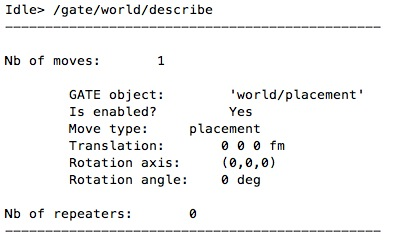

   Description of the default parameters associated with the world

The other commands needed to modify the *world* volume attributes will
be given in the next sections.

Creating a volume
-----------------

Generality - Tree creation
~~~~~~~~~~~~~~~~~~~~~~~~~~

When a volume is created with GATE, it automatically appears in the GATE
tree. All commands applicable to the new volume are then available from
this GATE tree. For instance, if the name of the created volume is
*Volume_Name*, all commands applicable to this volume start with::

  /gate/Volume_Name/

The tree includes the following commands:

-  setMaterial: To assign a material to the volume
-  attachCrystalSD: To attach a crystal-SensitiveDetector to the volume
-  attachPhantomSD: To attach a phantom-SensitiveDetector to the volume
-  enable: To enable the volume
-  disable: To disable the volume
-  describe: To describe the volume

The tree includes sub-trees that relate to different attributes of the
volume *Volume_Name*. The available sub-trees are:

-  daughters: To insert a new 'daughter' in the volume
-  geometry: To control the geometry of the volume
-  vis: To control the display attributes of the volume
-  repeaters: To apply a new 'repeater' to the volume
-  moves: To 'move' the volume
-  placement: To control the placement of the volume

The commands available in each sub-tree will be described in :ref:`building_a_volume-label`, :ref:`repeating_a_volume-label`, :ref:`placing_a_volume-label`, :ref:`moving_a_volume-label`.

Units
~~~~~

Different units are predefined in GATE (see :numref:`units_tab`) and shall be
referred to using the corresponding abbreviation. Inside the GATE
environment, the list of units available in GATE can be edited using::

  /units/list

Axes
~~~~

Any position in the *world* is defined with respect to a three-axis
system: X, Y and Z. These three axes can be seen in the display window
using::

  /vis/scene/add/axes

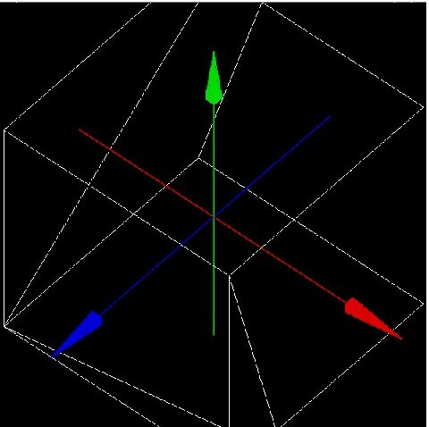

   Three-axis system defined in GATE. The red, green and blue axes are the X, Y
   and Z axes respectively

.. table:: List of units available in GATE and corresponding abbreviations
   :widths: auto
   :name: units_tab

   +---------------------+-------------------------+------------------------+-------------------------------------------+
   | LENGTH              | SURFACE                 | VOLUME                 | ANGLE                                     |
   +=====================+=========================+========================+===========================================+
   | parsec pc           |                         |                        | radian rad                                |
   +---------------------+-------------------------+------------------------+-------------------------------------------+
   | kilometer km        | kilometer2 km2          | kilometer3 km3         | milliradian mrad                          |
   +---------------------+-------------------------+------------------------+-------------------------------------------+
   | meter m             | meter2 m2               | meter33 m3             | steradian sr                              |
   +---------------------+-------------------------+------------------------+-------------------------------------------+
   | centimeter cm       | centimeter2 cm2         | centimeter3 cm3        | degre deg                                 |
   +---------------------+-------------------------+------------------------+-------------------------------------------+
   | micrometer mum      | millimeter2 mm2         | millimeter3 mm3        |                                           |
   +---------------------+-------------------------+------------------------+-------------------------------------------+
   | nanometer nm        |                         |                        |                                           |
   +---------------------+-------------------------+------------------------+-------------------------------------------+
   | angstrom Ang        |                         |                        |                                           |
   +---------------------+-------------------------+------------------------+-------------------------------------------+
   | **TIME**            | **SPEED**               | **ANGULAR SPEED**      | **ENERGY**                                |
   +---------------------+-------------------------+------------------------+-------------------------------------------+
   | second s            | meter/s m/s             | radian/s rad/s         | electronvolt eV                           |
   +---------------------+-------------------------+------------------------+-------------------------------------------+
   | millisecond ms      | centimeter/s cm/s       | degree/s deg/s         | kiloelectronvolt KeV                      |
   +---------------------+-------------------------+------------------------+-------------------------------------------+
   | microsecond mus     | millimeter/s mm/s       | rotation/s rot/s       | megaelectronvolt MeV                      |
   +---------------------+-------------------------+------------------------+-------------------------------------------+
   | nanosecond ns       | meter/min m/min         | radian/min rad/min     | gigaelectronvolt GeV                      |
   +---------------------+-------------------------+------------------------+-------------------------------------------+
   | picosecond ps       | centimeter/min cm/min   | degree/min deg/min     | teraelectronvolt TeV                      |
   +---------------------+-------------------------+------------------------+-------------------------------------------+
   |                     | millimeter/min m/min    | rotation/min rot/min   | petaelectronvolt PeV                      |
   +---------------------+-------------------------+------------------------+-------------------------------------------+
   |                     | meter/h m/h             | radian/h rad/h         | joule j                                   |
   +---------------------+-------------------------+------------------------+-------------------------------------------+
   |                     | centimer/h cm/h         | degree/h deg/h         |                                           |
   +---------------------+-------------------------+------------------------+-------------------------------------------+
   |                     | millimeter/h mm/h       | rotation/h rot/h       |                                           |
   +---------------------+-------------------------+------------------------+-------------------------------------------+
   | **ACTIVITY DOSE**   | **AMOUNT OF SUBSTANCE** | **MASS**               | **VOLUMIC MASS**                          |
   +---------------------+-------------------------+------------------------+-------------------------------------------+
   | becquerel Bq        | mole mol                | milligram mg           | g/cm3 g/cm3                               |
   +---------------------+-------------------------+------------------------+-------------------------------------------+
   | curie Ci            |                         |                        | mg/cm3 mg/cm3                             |
   +---------------------+-------------------------+------------------------+-------------------------------------------+
   | gray Gy             |                         | kilogram kg            | kg/m3 kg/m3                               |
   +---------------------+-------------------------+------------------------+-------------------------------------------+
   | **ELECTRIC CHARGE** | **ELECTRIC CURRENT**    | **ELECTRIC POTENTIAL** | **MAGNETIC FLUX - MAGNETIC FLUX DENSITY** |
   +---------------------+-------------------------+------------------------+-------------------------------------------+
   | eplus e+            | ampere A                | volt V                 | weber Wb                                  |
   +---------------------+-------------------------+------------------------+-------------------------------------------+
   | coulomb C           | milliamper mA           | kilovolt kV            | tesla T                                   |
   +---------------------+-------------------------+------------------------+-------------------------------------------+
   | microampere muA     |                         | megavolt MV            | gauss G                                   |
   +---------------------+-------------------------+------------------------+-------------------------------------------+
   | nanoampere nA       |                         | kilogauss kG           |                                           |
   +---------------------+-------------------------+------------------------+-------------------------------------------+
   | **TEMPERATURE**     | **FORCE - PRESSURE**    | **POWER**              | **FREQUENCY**                             |
   +---------------------+-------------------------+------------------------+-------------------------------------------+
   | kelvin K            | newton N                | watt W                 | hertz Hz                                  |
   +---------------------+-------------------------+------------------------+-------------------------------------------+
   |                     | pascal Pa               |                        | kilohertz kHz                             |
   +---------------------+-------------------------+------------------------+-------------------------------------------+
   |                     | bar bar                 |                        | megaherz MHz                              |
   +---------------------+-------------------------+------------------------+-------------------------------------------+
   |                     | atmosphere atm          |                        |                                           |
   +---------------------+-------------------------+------------------------+-------------------------------------------+

.. _building_a_volume-label:

Building a volume
~~~~~~~~~~~~~~~~~

Any new volume must be created as the daughter of another volume (i.e.,
*World* volume or another volume previously created).

Three rules must be respected when creating a new volume:

-  A volume which is located inside another must be its daughter
-  A daughter must be fully included in its mother
-  Volumes must not overlap

Errors in building the geometry yield wrong particle transportation,
hence misleading results!

**Creating a new volume**

To create a new volume, the first step is to give it a name and a mother
using::

  /gate/mother_Volume_Name/daughters/name Volume_Name

This command prepares the creation of a new volume named *Volume_Name*
which is the daughter of *mother_Volume_Name.*

Some names should not be used as they have precise meanings in gate.
These names are the names of the GATE systems (see :ref:`defining_a_system-label`) currently defined in GATE:
*scanner*, *PETscanner*, *cylindricalPET*, *SPECTHead*, *ecat*, *CPET*,
*OPET* and *OpticalSystem*.

The creation of a new volume is completed only when assigning a shape to
the new volume. The tree ::

  /gate/Volume_Name/

is then generated and all commands in the tree and the sub-trees are
available for the new volume.

Different volume shapes are available, namely: **box, sphere, cylinder,
cone, hexagon, general or extruded trapezoid, wedge, elliptical tube,
tessellated and TetMeshBox.**

The command line for listing the available shapes is::

  /gate/world/daughters/info

The command line for assigning a shape to a volume is::

  /gate/mother_Volume_Name/daughters/insert Volume_shape

where *Volume_shape* is the shape of the new volume.

*Volume_shape* must necessarily be one of the available names:

**box** for a box - **sphere** for a sphere - **cylinder** for a
cylinder - **ellipsoid** for an ellipsoid - **cone** for a cone -
**eltub** for a tube with an elliptical base - **hexagone** for an
hexagon - **polycone** for a polygon - **trap** for a general trapezoid
- **trpd** for an extruded trapezoid - **wedge** for a wedge -
**tessellated** for a tessellated volume and **TetMeshBox** for a box
which contains a tetrahedral mesh.

The command line assigns the shape to the last volume that has been
named.

The following command lists the daughters of a volume::

  /gate/Volume_Name/daughters/list

-  Example::

   /gate/world/daughters/name Phantom
   /gate/world/daughters/insert box

The new volume *Phantom* with a box shape is inserted in the *World*
volume.

**Defining a size**

After creating a volume with a shape, its dimensions are the default
dimensions associated with that shape. These default dimensions can be
modified using the sub-tree /geometry/

The commands available in the sub-tree depend on the shape. The
different commands for each type of shape are listed in :numref:`shape_tab`

These commands can be found in the directory::

  /gate/Volume_Name/geometry   (Some volumes visualisation are available here: http://gphysics.net/geant4/geant4-gdml-format.html )

.. table:: Commands of the sub-tree geometry for different shapes
   :widths: auto
   :name: shape_tab

   +-----------------------------------------------------------------------------+-------------------------------------------------------------------------------------------------+
   | BOX                                                                         | TRPD                                                                                            |
   +=============================================================================+=================================================================================================+
   | setXLength: Set the length of the box along the X axis                      | setX1Length: Set half length along X of the plane at -dz position                               |
   +-----------------------------------------------------------------------------+-------------------------------------------------------------------------------------------------+
   | setYLength: Set the length of the box along the Y axis                      | setY1Length: Set half length along Y of the plane at -dz position                               |
   +-----------------------------------------------------------------------------+-------------------------------------------------------------------------------------------------+
   | setZLength: Set the length of the box along the Z axis                      | setX2Length: Set half length along X of the plane at +dz position                               |
   +-----------------------------------------------------------------------------+-------------------------------------------------------------------------------------------------+
   | **SPHERE**                                                                  | setY2Length: Set half length along Y of the plane at +dz position                               |
   +-----------------------------------------------------------------------------+-------------------------------------------------------------------------------------------------+
   | setRmin: Set the internal radius of the sphere (0 for full sphere)          | setZLength: Set half length along Z of the trapezoid                                            |
   +-----------------------------------------------------------------------------+-------------------------------------------------------------------------------------------------+
   | setRmax: Set the external radius of the sphere                              | setXBoxLength: Set half length along X of the extruded box                                      |
   +-----------------------------------------------------------------------------+-------------------------------------------------------------------------------------------------+
   | setPhiStart: Set the start phi angle                                        | setYBoxLength: Set half length along Y of the extruded box                                      |
   +-----------------------------------------------------------------------------+-------------------------------------------------------------------------------------------------+
   | setDeltaPhi: Set the phi angular span (2PI for full sphere)                 | setZBoxLength: Set half length along Z of the extruded box                                      |
   +-----------------------------------------------------------------------------+-------------------------------------------------------------------------------------------------+
   | setThetaStart: Set the start theta angle                                    | setXBoxPos: Set center position X of the box                                                    |
   +-----------------------------------------------------------------------------+-------------------------------------------------------------------------------------------------+
   | setDeltaTheta: Set the theta angular span (2PI for full sphere)             | setYBoxPos: Set center position Y of the box                                                    |
   +-----------------------------------------------------------------------------+-------------------------------------------------------------------------------------------------+
   | **CYLINDER**                                                                | setZBoxPos: Set center position Z of the box                                                    |
   +-----------------------------------------------------------------------------+-------------------------------------------------------------------------------------------------+
   | setRmin: Set the internal radius of the cylinder (0 for full cylinder)      | **PARALLELEPIPED (... not yet implemented...)**                                                 |
   +-----------------------------------------------------------------------------+-------------------------------------------------------------------------------------------------+
   | setRmax: Set the external radius of the cylinder                            | setDx: Set Dx dimension of the parallelepiped                                                   |
   +-----------------------------------------------------------------------------+-------------------------------------------------------------------------------------------------+
   | setHeight: Set the height of the cylinder                                   | setDy: Set Dy dimension of the parallelepiped                                                   |
   +-----------------------------------------------------------------------------+-------------------------------------------------------------------------------------------------+
   | setPhiStart: Set the start phi angle                                        | setDz: Set Dz dimension of the parallelepiped                                                   |
   +-----------------------------------------------------------------------------+-------------------------------------------------------------------------------------------------+
   | setDeltaPhi: Set the phi angular span (2PI for full cylinder)               | setAlpha: Set Alpha angle                                                                       |
   +-----------------------------------------------------------------------------+-------------------------------------------------------------------------------------------------+
   | **CONE**                                                                    | setTheta: Set Theta angle                                                                       |
   +-----------------------------------------------------------------------------+-------------------------------------------------------------------------------------------------+
   | setRmin1: Set the internal radius of one side of the cone (0 for full cone) | setPhi: Set Phi angle                                                                           |
   +-----------------------------------------------------------------------------+-------------------------------------------------------------------------------------------------+
   | setRmax1: Set the external radius of one side of the cone                   | **POLYCONE (... not yet implemented...)**                                                       |
   +-----------------------------------------------------------------------------+-------------------------------------------------------------------------------------------------+
   | setRmin2: Set the internal radius of one side of the cone (0 for full cone) | setProfile: Set vectors of z, rInner, rOuter positions                                          |
   +-----------------------------------------------------------------------------+-------------------------------------------------------------------------------------------------+
   | setRmax2: Set the external radius of one side of the cone                   | setPhiStart: Set the start phi angle                                                            |
   +-----------------------------------------------------------------------------+-------------------------------------------------------------------------------------------------+
   | setHeight: Set the height of the cone                                       | setDeltaPhi: Set the phi angular span (2PI for full cone)                                       |
   +-----------------------------------------------------------------------------+-------------------------------------------------------------------------------------------------+
   | setPhiStart: Set the start phi angle                                        | **HEXAGONE**                                                                                    |
   +-----------------------------------------------------------------------------+-------------------------------------------------------------------------------------------------+
   | setDeltaPhi: Set the phi angular span (2PI for full cone)                   | setRadius: Set the radius of the hexagon                                                        |
   +-----------------------------------------------------------------------------+-------------------------------------------------------------------------------------------------+
   | **ELLIPSOID**                                                               | setHeight: Set the height of the hexagon                                                        |
   +-----------------------------------------------------------------------------+-------------------------------------------------------------------------------------------------+
   | setXLength: Set the half axis length in the X direction                     | **WEDGE**                                                                                       |
   +-----------------------------------------------------------------------------+-------------------------------------------------------------------------------------------------+
   | setYLength: Set the half axis length in the Y direction                     | NarrowerXLength: Set the length of the shorter side of the wedge in the X direction             |
   +-----------------------------------------------------------------------------+-------------------------------------------------------------------------------------------------+
   | setZLength: Set the half axis length in the Z direction                     | XLength: Set the length of the wedge in the X direction                                         |
   +-----------------------------------------------------------------------------+-------------------------------------------------------------------------------------------------+
   | setZBottomCut: To cut the ellipsoide along the Z axis                       | YLength: Set the length of the wedge in the Y direction                                         |
   +-----------------------------------------------------------------------------+-------------------------------------------------------------------------------------------------+
   | setZTopCut: To cut the ellipsoide along the Z axis                          | ZLength: Set the length of the wedge in the Z direction                                         |
   +-----------------------------------------------------------------------------+-------------------------------------------------------------------------------------------------+
   | **ELLIPTICAL TUBE**                                                         | **TET-MESH BOX**                                                                                |
   +-----------------------------------------------------------------------------+-------------------------------------------------------------------------------------------------+
   | setLong: Set the length of the semimajor axis                               | reader/setPathToELEFile: Set path to '.ele' input file, which describes a tetrahedral mesh      |
   +-----------------------------------------------------------------------------+-------------------------------------------------------------------------------------------------+
   | setShort: Set the length of the semiminor axis                              | reader/setUnitOfLength: Set unit of length for the values in the '.ele' input file              |
   +-----------------------------------------------------------------------------+-------------------------------------------------------------------------------------------------+
   | setHeight: Set the height of the tube                                       | setPathToAttributeMap: Set path to txt-file which defines material and colour of the tetrahedra |
   +-----------------------------------------------------------------------------+-------------------------------------------------------------------------------------------------+
   | **TESSELLATED**                                                             |                                                                                                 |
   +-----------------------------------------------------------------------------+-------------------------------------------------------------------------------------------------+
   | setPathToVerticesFile: Set the path to vertices text file                   |                                                                                                 |
   +-----------------------------------------------------------------------------+-------------------------------------------------------------------------------------------------+

For a box volume called *Phantom* , the X, Y and Z dimensions can be
defined by::

  /gate/Phantom/geometry/setXLength 20. cm
  /gate/Phantom/geometry/setYLength 10. cm
  /gate/Phantom/geometry/setZLength 5. cm

The dimensions of the *Phantom* volume are then 20 cm, 10 cm and 5 cm
along the X, Y and Z axes respectively.

**Defining a material**

A material must be associated with each volume. The default material
assigned to a new volume is Vacuum. The list of available materials is
defined in the GateMaterials.db file. (see :ref:`materials-label`).

The following command fills the volume *Volume_Name* with a material
called *Material*::

  /gate/Volume_Name/setMaterial Material

-  Example::

   /gate/Phantom/setMaterial Water

The *Phantom* volume is filled with Water.

**Defining a color or an appearance**

To make the geometry easy to visualize, some display options can be set
using the sub-tree /vis/

The commands available in this sub-tree are: setColor, setVisible,
setDaughtersInvisible, setLineStyle, setLineWidth, forceSolid and
forceWireframe (see :numref:`geometry_tab`)

.. table:: List of commands of the GATE sub-tree geometry
   :widths: auto
   :name: geometry_tab

   +-----------------------+-------------------------------------------------+----------------------------------------------------------------+
   | Command               | Action                                          | Argument                                                       |
   +=======================+=================================================+================================================================+
   | setColor              | Selects the color for the current volume        | white, gray, black, red, green, blue, cyan, magenta and yellow |
   +-----------------------+-------------------------------------------------+----------------------------------------------------------------+
   | setVisible            | Shows or hides the current volume               |                                                                |
   +-----------------------+-------------------------------------------------+----------------------------------------------------------------+
   | setDaughtersInvisible | Shows or hides the current volume daughters     |                                                                |
   +-----------------------+-------------------------------------------------+----------------------------------------------------------------+
   | setLineStyle          | Sets the current volume line-style              | dashed, dotted and unbroken                                    |
   +-----------------------+-------------------------------------------------+----------------------------------------------------------------+
   | setLineWidth          | Sets the current volume line-width              |                                                                |
   +-----------------------+-------------------------------------------------+----------------------------------------------------------------+
   | forceSolid            | Forces solid display for the current volume     |                                                                |
   +-----------------------+-------------------------------------------------+----------------------------------------------------------------+
   | forceWireframe        | Forces wireframe display for the current volume |                                                                |
   +-----------------------+-------------------------------------------------+----------------------------------------------------------------+

These commands can be found in the tree /gate/Volume_Name/vis.

-  Example::

   /gate/Phantom/vis/setColor blue
   /gate/Phantom/vis/forceWireframe

The *Phantom* volume will be displayed in blue and will be transparent.

**Enabling or disabling a volume**

A volume cannot be destroyed. The only possible action is to disable it:
this makes the volume disappear from the display window but not from the
geometry.

Only the *world* volume cannot be disabled.

To disable a volume *Volume_Name*, the command is::

  /gate/Volume_Name/disable

The volume *Volume_Name* can be enabled again using::

  /gate/Volume_Name/enable

-  Example::

   /gate/Phantom/disable

The *Phantom* volume is disabled.

**Describing a volume**

The parameters associated with a volume *Volume_name* can be listed
using::

  /gate/Volume_Name/describe

-  Example::

   /gate/Phantom/describe

The parameters associated with the *Phantom* volume are listed.

Examples
^^^^^^^^

How to build a NaI crystal
++++++++++++++++++++++++++

A volume named crystal is created as the daughter of a volume whose
shape is defined as a box::

   /gate/mother_Volume_Name/daughters/name     crystal 
   /gate/mother_Volume_Name/daughters/insert   box 

The X, Y and Z dimensions of the volume crystal are set to 1 cm, 40 cm,
and 54 cm respectively::

  /gate/crystal/geometry/setXLength           1. cm 
  /gate/crystal/geometry/setYLength           40. cm
  /gate/crystal/geometry/setZLength           54. cm

The new volume crystal is filled with NaI::

  /gate/crystal/setMaterial                   NaI

The new volume crystal is colored in yellow::

  /gate/crystal/vis/setColor                  yellow

The next command lists the parameters associated with the crystal
volume::

  /gate/crystal/describe

The crystal volume is disabled::

  /gate/crystal/disable

How to build a "trpd" volume
++++++++++++++++++++++++++++

An alternative way of describing complicated geometries is to use a
so-called "boolean" volume in order to describe one piece using a single
volume instead of using a mother-children couple. This can make the
description easier and more synthetic. The example below describes how
the shape shown in :numref:`trapeze_name` can be defined using a trpd shape, based
on a "boolean" volume consisting of a trapezoid "minus" a box::

  # V I S U A L I S A T I O N
  /vis/open OGLSX /vis/viewer/reset
  /vis/viewer/viewpointThetaPhi 60 60
  /vis/viewer/zoom 1
  /vis/viewer/set/style surface
  /vis/drawVolume /tracking/storeTrajectory 1
  /vis/scene/endOfEventAction accumulate
  /vis/viewer/update
  /vis/verbose 2
  /gate/geometry/enableAutoUpdate
  /gate/world/daughters/name                Volume_Name
  /gate/world/daughters/insert              box
  /gate/Volume_Name/geometry/setXLength     40 cm
  /gate/Volume_Name/geometry/setYLength     40 cm
  /gate/Volume_Name/geometry/setZLength     40 cm
  /gate/Volume_Name/vis/forceWireframe
  /gate/Volume_Name/daughters/name          trapeze_name
  /gate/Volume_Name/daughters/insert        trpd
  /gate/trapeze_name/geometry/setX1Length   23.3 mm
  /gate/trapeze_name/geometry/setY1Length   21.4 mm
  /gate/trapeze_name/geometry/setX2Length   23.3 mm
  /gate/trapeze_name/geometry/setY2Length   23.3 mm
  /gate/trapeze_name/geometry/setZLength    6. mm
  /gate/trapeze_name/geometry/setXBoxPos    0. mm
  /gate/trapeze_name/geometry/setYBoxPos    0. m
  /gate/trapeze_name/geometry/setZBoxPos    0.7501 mm
  /gate/trapeze_name/geometry/setXBoxLength 20.3 mm
  /gate/trapeze_name/geometry/setYBoxLength 20.3 mm
  /gate/trapeze_name/geometry/setZBoxLength 4.501 mm

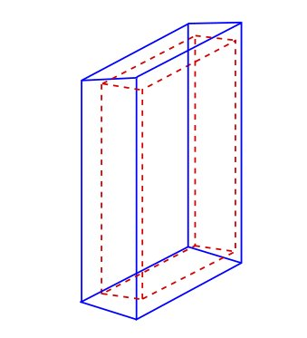

   Side view of an extruded trapezoid based on a boolean solid. The contours in
   blue and dashed red represent the contours of the trapezoid and the box
   respectively

The new volume called *trapeze_name*, which is the daughter of the
*Volume_Name* volume, is described with 5+6 parameters. The first 5
parameters relate to the trapezoid, whereas the last 6 parameters
describe the extruded volume using a box shape.

How to build a "wedge" volume
+++++++++++++++++++++++++++++

Gate provides the class **GateTrapCreator** to create and insert
trapezoidal volumes into the geometry. To create a trapezoid, the user
needs to specify eleven parameters (besides its name and material),
which does not make it easy to use.

To model "slanted" crystals, a new class called **GateWedgeCreator**
(derived from **G4Trap**) builds right angular wedges. As shown in
:numref:`wedge2`, a wedge is defined by only three parameters that are easily
understood:

#. XLength: is the length of the wedge in the X direction.
#. NarrowerXLength: is the length of the shorter side of the wedge in
   the X direction.
#. YLength: is the length in the Y direction.
#. ZLength: is the length in the Z direction.

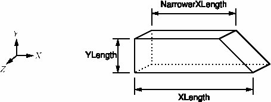

   When a wedge is inserted, it is oriented as shown in this figure

For instance, the following macro lines insert a wedge crystal as a
daughter of a module::

  /gate/module/daughters/name                wedge0 
  /gate/module/daughters/insert              wedge 
  /gate/wedge0/geometry/setXLength           10 mm 
  /gate/wedge0/geometry/setNarrowerXLength   8.921 mm 
  /gate/wedge0/geometry/setYLength           2.1620 mm 
  /gate/wedge0/geometry/setZLength           2.1620 mm 
  /gate/wedge0/setMaterial                   LSO 
  /gate/wedge0/vis/setColor                  yellow

How to build a "tessellated" volume
+++++++++++++++++++++++++++++++++++

In GATE, you have the possibility to create a tessellated volume from an
STL file. STL is a common file format that uses triangular facets to
define the surface of a three-dimensional object. This allows to
simulate a complex geometry imported from a CAD software. The surface
described in the STL file is used to create a volume in GATE using the
Geant4 G4TessellatedSolid class. It's important to note that only one
material is associated to a tessellated volume. You can use either ASCII
or binary STL files.

Here is an example to create a tessellated volume from an STL file in a
GATE macro::

  /gate/world/daughters/name                                        kidneyLeft
  /gate/world/daughters/insert                                      tessellated
  /gate/kidneyLeft/placement/setTranslation                         -265.3625 -121.5875 -842.16 mm
  /gate/kidneyLeft/geometry/setPathToSTLFile                        data/Label89.stl
  /gate/kidneyLeft/setMaterial                                      Kidney

Label89.stl being the STL file containing the triangular facets.

Declaring other tessellated volumes (including daughters), one can
create a complex geometry (for example kidneys) for accurate dosimetry:

.. figure:: kidneys_STL.png
   :alt: Figure 5: kidneys_STL
   :name: kidneys_STL

The complete code used to generate this figure can be found in the
GateContrib GitHub repository under
`misc/geometry_STL/kidneys <https://github.com/OpenGATE/GateContrib/tree/master/misc/geometry_STL/kidneys>`__.

How to build a "TetMeshBox" volume
++++++++++++++++++++++++++++++++++

The **TetMeshBox** volume is a box volume which contains a tetrahedral
mesh. The tetrahedral mesh can be loaded from an '.ele/.node' file pair,
which can be generated by `TetGen <http://www.tetgen.org>`__, an
open-source tetrahedral mesh generator. Please refer to the `TetGen
manual <http://wias-berlin.de/software/tetgen/1.5/doc/manual/manual006.html>`__
for a comprehensive explanation of the structure of '.ele' and '.node'
files. An example usage of the TetMeshBox would look like this::

  /gate/world/daughters/name                    meshPhantom
  /gate/world/daughters/insert                  TetMeshBox
  /gate/meshPhantom/setMaterial                 Air
  /gate/meshPhantom/reader/setPathToELEFile     data/BodyHasHeart.ele
  /gate/meshPhantom/reader/setUnitOfLength      1.0 mm
  /gate/meshPhantom/setPathToAttributeMap       data/RegionAttributeTable.dat

Here, GATE would implicitly assume that two files exist, namely
'data/BodyHasHeart.node' and 'data/BodyHasHeart.ele'. The numerical
values defined in those files are interpreted according to the
'setUnitOfLength' command. GATE assumes that the '.ele' input file
defines a region attribute for each tetrahedron -- an integer attribute,
which logically groups tetrahedra that form a sub-structure of the mesh.
The user has to provide an 'attribute map', which defines material and
colour for each region within the tetrahedral mesh. An attribute map is
a txt-file and looks as follows::

  # [first region,    last region]    material    visible   r       g       b      alpha
  # ------------------------------------------------------------------------------------
  1                   1               Heart       true      1.00    0.0     0.0    1.0
  2                   3               Adipose     true      1.00    0.89    0.77   1.0

The first two columns refer to the region attributes defined in the
'.ele' file.

The size of the bounding box will adapt to the extent of the tetrahedral
mesh and the material of the bounding box can be set via the
'setMaterial'. Here, a visual example of the TetMeshBox volume:

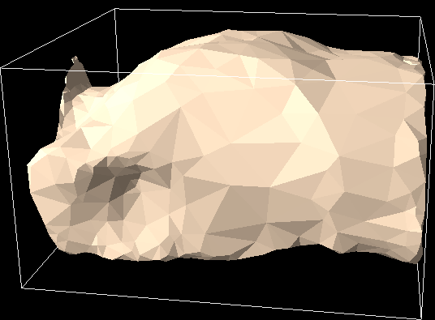

   tet_mesh_box.png

The complete code used to generate this figure can be found in the
GateContrib repository on Github under
`misc/TetrahedralMeshGeometry <https://github.com/OpenGATE/GateContrib/tree/master/misc/TetrahedralMeshGeometry>`__.

.. _repeating_a_volume-label:

Repeating a volume
------------------

To create X identical volumes, there is no need to create X different
volumes. Only one volume must be created and then repeated. There are
four different ways to repeat a volume: the linear repeater, the ring
repeater, the cubic array repeater and the quadrant repeater.

To list the repeaters defined for the volume *Name_Volume*, use::

  /gate/Name_Volume/repeaters/info

Linear repeater
~~~~~~~~~~~~~~~

The linear repeater is appropriate to repeat a volume along a direction
(X, Y or Z axis). To use the linear repeater, first select this type of
repeater using::

  /gate/Name_Volume/repeaters/insert linear

Then define the number of times N the volume *Name_Volume* has to be
repeated using::

  /gate/Name_Volume/linear/setRepeatNumber N

Finally, define the step and direction of the repetition using::

  /gate/Name_Volume/linear/setRepeatVector 0. 0. dZ. mm

A step of dZ mm along the Z direction is defined.

The "autoCenter" command allows the user to set the position of the
repeated volumes::

  /gate/Name_Volume/linear/autoCenter true or false

The "true" option centers the group of repeated volumes around the
position of the initial volume that has been repeated.

The "false" option centers the first copy around the position of the
initial volume that has been repeated. The other copies are created by
offset. The default option is true.

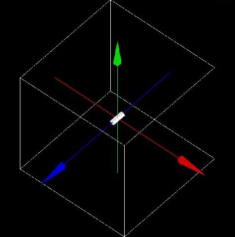

   Illustration of the application of the linear repeater

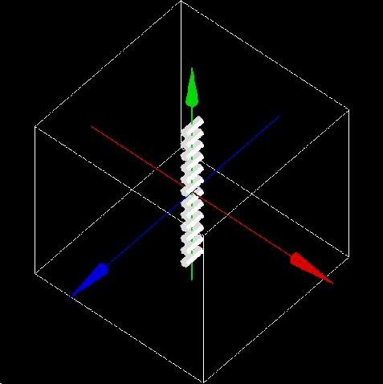

   Illustration of the application of the linear repeater

-  Example::

     /gate/hole/repeaters/insert          linear
     /gate/hole/linear/setRepeatNumber    12
     /gate/hole/linear/setRepeatVector    0. 4. 0. cm

The *hole* volume is repeated 12 times every 4 cm along the Y axis. The
application of this linear repeater is illustrated in :numref:`avant_linear`.

Ring repeater
~~~~~~~~~~~~~

The ring repeater makes it possible to repeat a volume along a ring. It
is useful to build a ring of detectors in PET.

To select the ring repeater, use::

  /gate/Name_Volume/repeaters/insert ring

To define the number of times *N* the volume *Name_Volume* has to be
repeated, use::

  /gate/Name_Volume/ring/setRepeatNumber N

Finally, the axis around which the volume *Name_Volume* will be repeated
must be defined by specifying two points using::

  /gate/Name_Volume/ring/setPoint1 0. 1. 0. mm
  /gate/Name_Volume/ring/setPoint2 0. 0. 0. mm

The default rotation axis is the Z axis. Note that the default ring
repetition goes counter clockwise.

These three commands are enough to repeat a volume along a ring over
360°. However, the repeat action can be further customized using one or
more of the following commands. To set the rotation angle for the first
copy, use::

  /gate/Name_Volume/ring/setFirstAngle x deg

The default angle is 0 deg.

To set the rotation angle difference between the first and the last
copy, use::

  /gate/Name_Volume/ring/setAngularSpan x deg

The default angle is 360 deg.

The AngularSpan, the FirstAngle and the RepeatNumber allow one to define
the rotation angle difference between two adjacent copies
(AngularPitch).

:math:`\frac{AngularSpan-FirstAngle}{RepeatNumber-1} = AngularPitch`

To set the number of objects in the periodic structure, hence the
periodicity, use::

  /gate/Name_Volume/ring/setModuloNumber M

When the volume auto-rotation option is enabled, the volume itself is
rotated so that its axis remains tangential to the ring (see :numref:`autorotenable`). If this option is disabled, all repeated volumes keep the same
orientation (see :numref:`autorotdisable`). The commands for enabling or disabling the
auto-rotation option are::

  /gate/Name_Volume/ring/enableAutoRotation
  /gate/Name_Volume/ring/disableAutoRotation

A volume can also be shifted along Z periodically. Each element of a
sequence is shifted according to its position *inside* the sequence,
defined as "j" below. In a sequence composed of :math:`M_{ModuloNumber}`
elements, the shift values are defined as
:math:`Zshift_{i} \quad \equiv \quad Zshift_{j}` where :

-  i is the position in the full ring
-  j =(i % :math:`M_{ModuloNumber}`)+1 is the position in a sequence,
   starting at 1.

To set a shift and the value of this shift, use::

  /gate/Name_Volume/ring/setModuloNumber 1
  /gate/Name_Volume/ring/setZShift1 Z mm

Up to 8 shifts and different shift values can be defined (setZShift1 to
setZShift8).

Remark: This geometry description conforms to the document "List Mode
Format Implementation: Scanner geometry description Version 4.1
M.Krieguer et al " and is fully described in the LMF output, in
particular in the ASCII header file entry:

z shift sector j mod :math:`M_{ModuloNumber}` : Zshift_j units

Here j (j starting here at 0) stands for the :math:`n^{th.}` object
being shifted each :math:`M_{ModuloNumber}` object. Each shift value
introduced in the command line below corresponds to a new line in the
.cch file.

The LMF version 22.10.03 supports a geometry with a cylindrical
symmetry. As an example, a repeater starting at 0 degree and finishing
at 90 degree (a quarter of ring) will not be supported by the LMF
output.

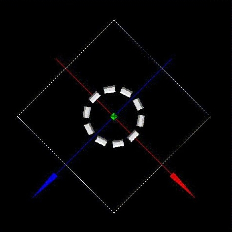

   Illustration of the application of the auto-rotation option

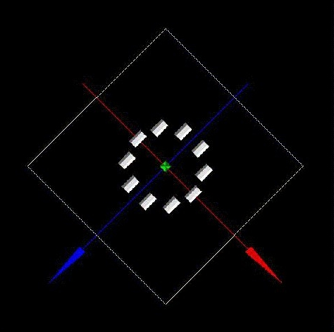

   Illustration of the application of the ring-repeater when the auto-rotation
   option is disabled

-  Example 1::

   /gate/hole/repeaters/insert          ring
   /gate/hole/ring/setRepeatNumber      10
   /gate/hole/ring/setPoint1            0. 1. 0. mm
   /gate/hole/ring/setPoint2            0. 0. 0. mm

The *hole* volume is repeated 10 times around the Y axis. The
application of this ring repeater is illustrated in :numref:`avant_ring`.

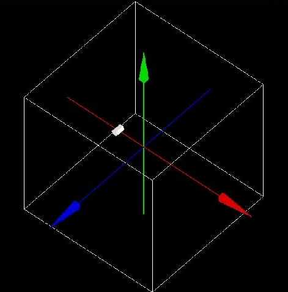

   Illustration of the application of the ring repeater

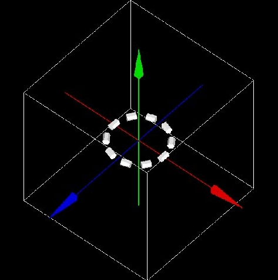

   Illustration of the application of the ring repeater

-  Example 2::

   /gate/rsector/repeaters/insert       ring
   /gate/rsector/ring/setRepeatNumber   20
   /gate/rsector/ring/setModuloNumber   2
   /gate/rsector/ring/setZShift1        -3500 mum
   /gate/rsector/ring/setZShift2        +3500 mum
   /gate/rsector/ring/enableAutoRotation

The *rsector* volume is repeated 20 times along a ring. The sequence
length is 2, with the first and the second volume shifted by -3500 µ m
and 3500 µ m respectively. The *rsector* volume could also include
several volumes itself, each of them being duplicated, which is
illustrated in :numref:`3ringscaps`.

Cubic array repeater
~~~~~~~~~~~~~~~~~~~~

The cubic array repeater is appropriate to repeat a volume along one,
two or three axes. It is useful to build a collimator for SPECT
simulations.

To select the cubic array repeater, use::

  /gate/Name_Volume/repeaters/insert cubicArray

To define the number of times *Nx, Ny and Nz* the volume *Name_Volume*
has to be repeated along the X, Y and Z axes respectively, use::

  /gate/hole/cubicArray/setRepeatNumberX Nx
  /gate/hole/cubicArray/setRepeatNumberY Ny
  /gate/hole/cubicArray/setRepeatNumberZ Nz

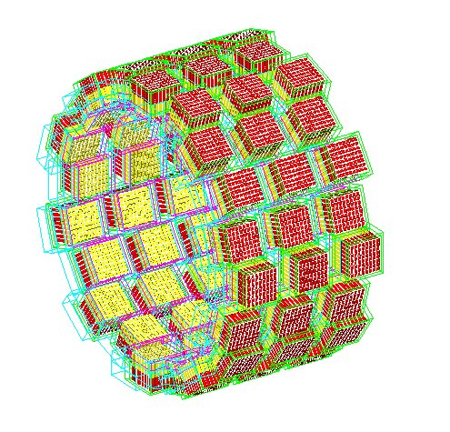

   Example of a ring repeater with a shift. An array of 3 crystal matrices has
   been repeated 20 times with a modulo N=2 shift

To define the step of the repetition *X mm*, *Y mm* and *Z mm* along the
X, Y and Z axes respectively, use::

  /gate/hole/cubicArray/setRepeatVector X Y Z mm

The autocentering options are available for the cubic array repeater. If
a volume is initially at a position P, the set of volumes after the
repeater has been applied is centered on P if autoCenter is true
(default). If autoCenter is false, the first copy of the group is
centered on P.

-  Example::

     /gate/hole/repeaters/insert               cubicArray
     /gate/hole/cubicArray/setRepeatNumberX    1
     /gate/hole/cubicArray/setRepeatNumberY    5
     /gate/hole/cubicArray/setRepeatNumberZ    2
     /gate/hole/cubicArray/setRepeatVector     0. 5. 15. cm

The *hole* volume is repeated 5 times each 5 cm along the Y axis and
twice each 15 cm along the Z axis. The application of this cubic array
repeater is illustrated in figure :numref:`avant_cubic`.

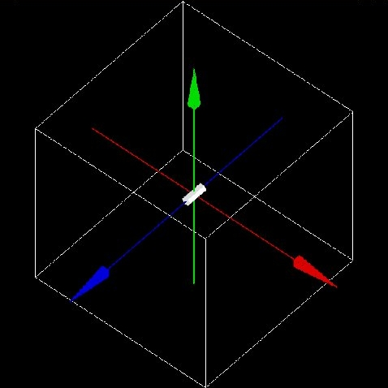

   Illustration of the application of the cubic array repeater

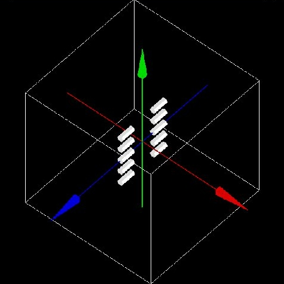

   Illustration of the application of the cubic array repeater (after)

Quadrant repeater
~~~~~~~~~~~~~~~~~

The quadrant repeater is appropriate to repeat a volume in a
triangle-like pattern similar to that of a Derenzo resolution phantom.

To select the quadrant repeater, use::

  /gate/Name_Volume/repeaters/insert quadrant

To define the number of repetition lines, use::

  /gate/hole/quadrant/setLineNumber X

To define the orientation of the quadrant (the direction of line
repetition), use::

  /gate/hole/quadrant/setOrientation N deg

To define the distance between adjacent copies, use::

  /gate/hole/quadrant/setCopySpacing xx cm

To define the maximum range of the repeater which is the maximum
distance between a copy and the original volume, use::

  /gate/hole/quadrant/setMaxRange xx cm

This command can be used to remove corner-copies that would fall outside
your phantom

-  Example::

     /gate/hole/repeaters/insert           quadrant
     /gate/hole/quadrant/setLineNumber     5
     /gate/hole/quadrant/setOrientation    90 deg
     /gate/hole/quadrant/setCopySpacing    6 cm
     /gate/hole/quadrant/setMaxRange       30 cm

The *hole* volume is repeated in a triangle-like pattern. The
application of this quadrant repeater is illustrated in :numref:`avant_linear`.

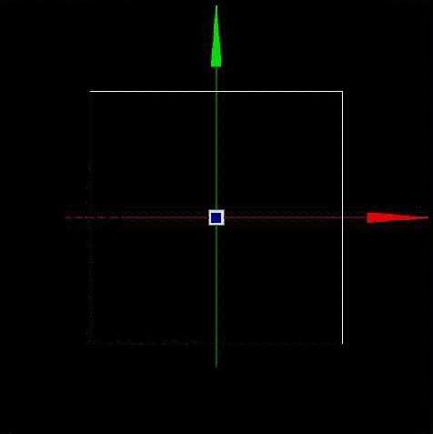

   Illustration of the application of the cubic array repeater

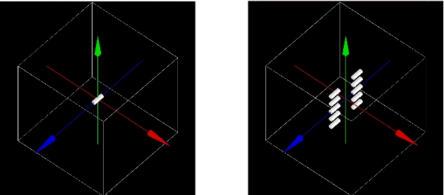

   Illustration of the application of the cubic array repeater (after)

Remark: The repeaters that are applied to the *Name_Volume* volume can
be listed using::

  /gate/Name_Volume/repeaters/list

Sphere repeater
~~~~~~~~~~~~~~~

The sphere repeater makes it possible to repeat a volume along a
spherical ring. It is useful to build rings of detectors for PET
scanners having gantry of spherical shape (e.g. SIEMENS Ecat Accel,
Hi-Rez, ....)

To select the sphere repeater, use::

  /gate/Name_Volume/repeaters/insert sphere

Then, the radius R of the sphere can be set using::

  /gate/Name_Volume /sphere/setRadius X cm

To define the number of times N1 and N2 the volume *Name_Volume* has to
repeated in the transaxial plane and the axial plane respectively, use::

  /gate/Name_Volume/sphere/setRepeatNumberWithTheta N1
  /gate/Name_Volume/sphere/setRepeatNumberWithPhi N2

To set the rotation angle difference between two adjacent copies in the
transaxial direction, use::

  /gate/Name_Volume/sphere/setThetaAngle x deg

To set the rotation angle difference between two adjacent copies in the
axial direction, use::

  /gate/Name_Volume/sphere/setPhiAngle y deg

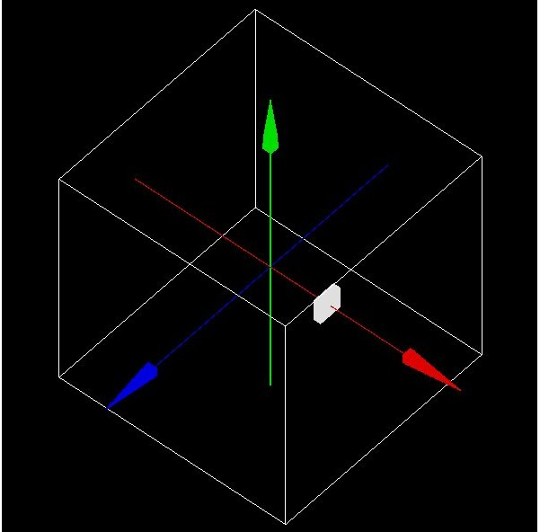

   Illustration of the application of the sphere repeater

The replicates of the volume *Name_Volume* will be placed so that its
axis remains tangential to the ring.

Example :numref:`sphere_lazaro_0`::

  /gate/block/repeaters/insert                   sphere
  /gate/block/sphere/setRadius                   25. cm
  /gate/block/sphere/setRepeatNumberWithTheta    10
  /gate/block/sphere/setRepeatNumberWithPhi      3
  /gate/block/setThetaAngle                      36 deg
  /gate/block/setThetaAngle                      20 deg

The block volume is repeated 10 times along the transaxial plane, with a
rotation angle between two neighbouring blocks of 36 deg, and is
repeated 3 times in the axial direction with a rotation angle between
two neighbouring blocks of 20 deg. The sphere defined here has a 25 cm
radius.

.. _generic_repeater-label:

Generic repeater
~~~~~~~~~~~~~~~~

It is also possible to repeat a volume according to a list of
transformations (rotation and translation). The time column is ignored by 
the generic repeater.

The following macros read
the transformations into a simple text file::

  /gate/myvolume/repeaters/insert                       genericRepeater
  /gate/myvolume/genericRepeater/setPlacementsFilename  data/myvolume.placements
  /gate/myvolume/genericRepeater/useRelativeTranslation 1

The text file "myvolume.placements" is composed as follows::

  ###### List of placement (translation and rotation)
  ###### Column 1      is time in seconds
  ###### Column 2      is rotationAngle in degree
  ###### Columns 3,4,5 are rotation axis 
  ###### Columns 6,7,8 are translation in mm
  Time     s
  Rotation deg
  Translation mm
  0      0       0 1 0       0 0 10
  0      10      0 1 0       0 0 10
  0      15      0 1 0       0 0 20

-  line with # are ignored
-  first word must be Time followed with the units
-  next words must be Rotation then Translation followed with the units
   (deg and mm here)
-  Rotation are described with 4 columns, the first for the angle, three
   others for the rotation axis
-  Translation are described with X Y Z.
-  using "useRelativeTranslation 1" (default) allows to compose the
   transformation according to the initial volume translation. If set to
   0, the transformation is set as is (in the coordinate system of the
   mother volume).

See example :ref:`gatert-label`

.. _placing_a_volume-label:

Placing a volume
----------------

The position of the volume in the geometry is defined using the sub-tree::

  /placement/

Three types of placement are available: translation, rotation and
alignment.

Translation
~~~~~~~~~~~

To translate the *Name_Volume* volume along the X direction by x cm, the
command is::

  /gate/Name_Volume/placement/setTranslation x. 0. 0. cm

The position is always given with respect to the center of the mother
volume.

To set the Phi angle (in XY plane) of the translation vector, use::

  /gate/Name_Volume/placement/setPhiOfTranslation N deg

To set the Theta angle (with regard to the Z axis) of the translation
vector, use::

  /gate/Name_Volume/placement/setThetaOfTranslation N deg

To set the magnitude of the translation vector, use::

  /gate/Name_Volume/placement/setMagOfTranslation xx cm

-  Example::

     /gate/Phantom/placement/setTranslation           1. 0. 0. cm
     /gate/Phantom/placement/setMagOfTranslation      10. cm

The *Phantom* volume is placed at 10 cm, 0 cm and 0 cm from the center
of the mother volume (here the *world* volume). The application of this
translation placement is illustrated in :numref:`avant_place`.

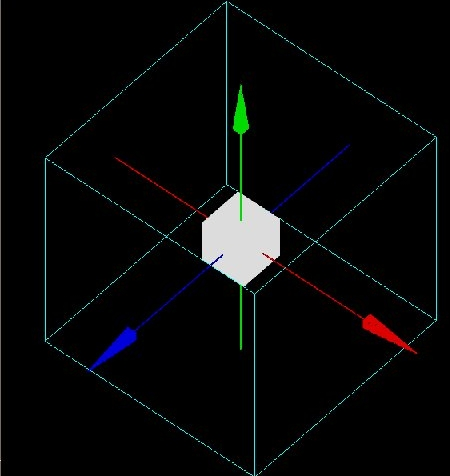

   Illustration of the translation placement

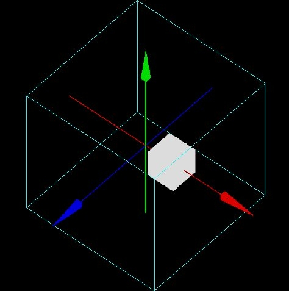

   Illustration of the translation placement

Rotation
~~~~~~~~

To rotate the *Name_Volume* volume by *N* degrees around the *X* axis,
the commands are::

  /gate/Name_Volume/placement/setRotationAxis    X 0 0
  /gate/Name_Volume/placement/setRotationAngle   N deg
  /gate/Name_Volume/placement/setAxis            0 1 0

The default rotation axis is the Z axis.

-  Example::

     /gate/Phantom/placement/setRotationAxis        0 1 0 
     /gate/Phantom/placement/setRotationAngle       90 deg

The *Phantom* volume is rotated by 90 degrees around the Y axis. The
application of this rotation placement is illustrated in :numref:`Avant_rot`.

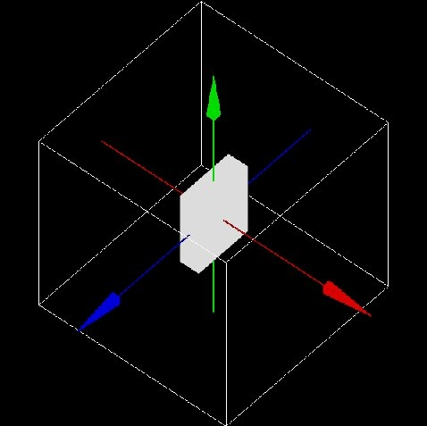

   Illustration of the rotation placement

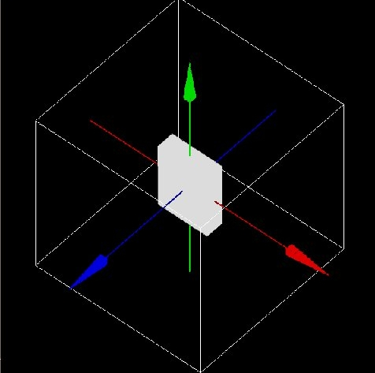

   Illustration of the rotation placement

Alignment
~~~~~~~~~

Using the alignment command, a volume having an axis of symmetry
(cylinder, ellipso, cone and hexagone) can be aligned parallel to one of
the three axes of the axis system.

To align the *Name_Volume* volume along the X axis, use::

  /gate/Name_Volume/placement/alignToX

The rotation parameters of the *Name_Volume* volume are then set to +90
degree around the Y axis.

To align the *Name_Volume* volume along the Y axis, use::

  /gate/Name_Volume/placement/alignToY

The rotation parameters of the *Name_Volume* volume are then set to -90
degree around the X axis.

To align the *Name_Volume* volume along the Z axis (default axis of
rotation) use::

  /gate/Name_Volume/placement/alignToZ

The rotation parameters of the *Name_Volume* volume are then set to 0
degree.

Special example: Wedge volume and OPET scanner
~~~~~~~~~~~~~~~~~~~~~~~~~~~~~~~~~~~~~~~~~~~~~~

The wedge is always created as shown in :numref:`wedge2`, that is with the
slanted plane oriented towards the positive X direction. If one needs to
have it oriented differently, one could, for instance, rotate it::

  /gate/wedge0/placement/setRotationAxis 0 1 0
  /gate/wedge0/placement/setRotationAngle 180 deg

The center of a wedge in the Y and Z directions are simply

:math:`\frac{setYLength}{2}, \frac{setZLength}{2}`

respectively. For the X direction, the center is located such that

:math:`2 \Delta = \frac{setXLength + setNarrowerXLength}{2}`

where Delta is the length of the wedge across the middle of the Y
direction, as shown in :numref:`wedge2d`.

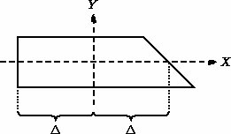

   Center of wedge

Wedge crystals are used to build the OPET scanner, in which the scanner
ring geometry approximates a true circular ring.

By knowing the radius gantry R and the length of the longest crystal, it
is possible to arrange a series of 8 crystals with varying the lengths
as shown in :numref:`opetblock`.

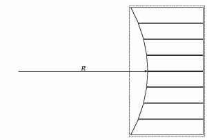

   A block approximating a true circular geometry

It is first necessary to create by-hand the first row of crystals. This
is accomplished by first creating a module just big enough to contain
one row of wedge crystals::

  /gate/rsector/daughters/name        module
  /gate/rsector/daughters/insert      box
  /gate/module/geometry/setXLength    10 mm
  /gate/module/geometry/setYLength    17.765 mm
  /gate/module/geometry/setZLength    2.162 mm
  /gate/module/setMaterial            Air

.. figure:: OPET2.jpg
   :alt: Figure 25: OPET2
   :name: OPET2

   The OPET scanner

Then, a box that will contain the first wedge crystal is located inside
the module::

  /gate/module/daughters/name                  crystal0
  /gate/module/daughters/insert                box
  /gate/crystal0/geometry/setXLength           10 mm
  /gate/crystal0/geometry/setYLength           2.1620 mm
  /gate/crystal0/geometry/setZLength           2.1620 mm
  /gate/crystal0/placement/setTranslation      0. -7.8015 0. mm
  /gate/crystal0/setMaterial                   Air
  /gate/crystal0/vis/setColor                  black
  /gate/crystal0/vis/setVisible                false

Finally, the actual crystal is placed inside its box::

  /gate/crystal0/daughters/name                LSO0
  /gate/crystal0/daughters/insert              wedge
  /gate/LSO0/geometry/setXLength               10 mm
  /gate/LSO0/geometry/setNarrowerXLength       8.921 mm
  /gate/LSO0/geometry/setYLength               2.1620 mm
  /gate/LSO0/geometry/setZLength               2.1620 mm
  /gate/LSO0/placement/setRotationAxis         0 1 0
  /gate/LSO0/placement/setRotationAngle        180 deg
  /gate/LSO0/placement/setTranslation          0.2698 0. 0. mm
  /gate/LSO0/setMaterial                       BGO

It is necessary to locate each crystal in separate "layers".

The last two steps are repeated for each crystal inside the module. Then
the module is repeated along the Z axis and the block is repeated 6
times around the center of the scanner.

:numref:`OPET2` shows the final OPET scanner.

.. _moving_a_volume-label:

Moving a volume
---------------

The GEANT geometry architecture requires the geometry to be static
during a simulation. However, the typical duration of a single event
(*e.g.* ps for the particle transport, µs for scintillation, or ms for
the response of the electronics) is very short when compared to most of
the geometrical changes to be modeled (*e.g.* movements of the phantom
or of the detector or bio-kinetics). Therefore, the elements of the
geometry are considered to be at rest during each time-step. Between
every time-step, the position and the orientation of a subset of
daughter volumes can be changed to mimic a movement such as a rotation
or a translation. These displacements are parametrized by their
velocity. Hence, the amplitude of the volume displacement is deduced
from the duration of the time-step multiplied by the velocity of the
displacement.

Given the speed of the components of the geometry, it is the
responsibility of the user to set the time step duration short enough in
order to produce smooth changes.

A volume can be moved during a simulation using five types of motion:
rotation, translation, orbiting, wobbling and eccentric rotation, as
explained below.

.. _translation-1:

Translation
~~~~~~~~~~~

To translate a *Name_Volume* volume during the simulation, the commands
are::

  /gate/Name_Volume/moves/insert translation
  /gate/Name_Volume/translation/setSpeed x 0 0 cm/s

where x is the speed of translation and the translation is performed
along the X axis. These commands can be useful to simulate table motion
during a scan for instance.

-  Example::

     /gate/Table/moves/insert           translation
     /gate/Table/translation/setSpeed   0 0 1 cm/s

The *Table* volume is translated along the Z axis with a speed of 1 cm
per second.

.. _rotation-1:

Rotation
~~~~~~~~

To rotate a *Name_Volume* volume around an axis during the simulation,
with a speed of N degrees per second, the commands are::

  /gate/Name_Volume/moves/insert rotation
  /gate/Name_Volume/rotation/setSpeed N deg/s
  /gate/Name_Volume/rotation/setAxis 0 y 0

-  Example::

   /gate/Phantom/moves/insert         rotation
   /gate/Phantom/rotation/setSpeed    1 deg/s
   /gate/Phantom/rotation/setAxis     0 1 0

The *Phantom* volume rotates around the Y axis with a speed of 1 degree
per second.

Orbiting
~~~~~~~~

Rotating a volume around any axis during a simulation is possible using
the orbiting motion. This motion is needed to model the camera head
rotation in SPECT. To rotate the *Name_Volume* volume around the X axis
with a speed of N degrees per second, the commands are::

  /gate/SPECThead/moves/insert orbiting
  /gate/SPECThead/orbiting/setSpeed N. deg/s
  /gate/SPECThead/orbiting/setPoint1 0 0 0 cm
  /gate/SPECThead/orbiting/setPoint2 1 0 0 cm

The last two commands define the rotation axis.

It is possible to enable or disable the volume auto-rotation option
using::

  /gate/Name_Volume/orbiting/enableAutoRotation
  /gate/Name_Volume/orbiting/disableAutoRotation

Example::

  /gate/camera_head/moves/insert            orbiting
  /gate/camera_head/orbiting/setSpeed       1. deg/s
  /gate/camera_head/orbiting/setPoint1      0 0 0 cm
  /gate/camera_head/orbiting/setPoint2      0 0 1 cm

The *camera_head* volume is rotated around the Z axis during the
simulation with a speed of 1 degree per second.

Wobbling
~~~~~~~~

The wobbling motion enables an oscillating translation movement to the
volume.

This motion is needed to mimic the behavior of certain PET scanners that
wobble to increase the spatial sampling of the data during the
acquisition.

The movement that is modeled is defined by
:math:`dM(t) = A . sin (2.PI.f.t + phi)` where dM(t) is the translation
vector at time t, A is the maximum displacement vector, f is the
movement frequency, phi is the phase at t=0, and t is the time.

To set the parameters of that equation, use::

  /gate/Name_Volume/moves/insert osc-trans

To set the amplitude vector of the oscillating translation::

  /gate/Name_Volume/osc-trans/setAmplitude x. 0. 0. cm

To set the frequency of the oscillating translation::

  /gate/Name_Volume/osc-trans/setFrequency N Hz

To set the period of the oscillating translation::

  /gate/Name_Volume/osc-trans/setPeriod N s

To set the phase at t=0 of the oscillating translation::

  /gate/Name_Volume/osc-trans/setPhase N deg

-  Example::

     /gate/crystal/moves/insert               osc-trans
     /gate/crystal/osc-trans/setAmplitude     10. 0. 0. cm
     /gate/crystal/osc-trans/setFrequency     50 Hz
     /gate/crystal/osc-trans/setPeriod        1 s
     /gate/crystal/osc-trans/setPhase         90 deg

In this example, the movement that is modeled is defined by
:math:`dM(t) = 10 . sin (100.PI.t + 90)`

Eccentric rotation
~~~~~~~~~~~~~~~~~~

The eccentric rotation motion enables an eccentric rotation movement of
the volume. It is a particular case of the orbiting movement. To set the
object in eccentric position (X-Y-Z) and rotate it around the OZ lab
frame axis, use::

  /gate/Name_Volume/moves/insert eccent-rot

To set the shifts in the X-Y-Z directions::

  /gate/Name_Volume/eccent-rot/setShiftXYZ x y z cm

To set the orbiting angular speed::

  /gate/Name_Volume/eccent-rot/setSpeed N deg/s

Remark: This particular move is closely related to the LMF definition
since the move parameters (shifts in all 3 directions and angular speed)
are propagated in the .cch header.

-  Example::

     /gate/crystal/moves/insert                 eccent-rot
     /gate/crystal/eccent-rot/setShiftXYZ       5. 0. 0. cm
     /gate/crystal/eccent-rot/setSpeed          10 deg/s

The *crystal* volume is placed at 10 cm, 0 cm and 0 cm from the center
of its mother volume and will rotate around the Z axis during the
simulation with a speed of 10 degrees per second.

Generic move
~~~~~~~~~~~~

A volume can be move at given time value thanks to the following macros::

  /gate/myvolume/moves/insert                       genericMove
  /gate/myvolume/genericMove/setPlacementsFilename  data/myvolume.placements

In the same idea than :ref:`generic_repeater-label`, the
placements file contains the transformations (rotation, translation) and
the time value where this transformations is applied::

  ###### List of placement (translation and rotation) according to time
  ###### Column 1      is Time in s (second)
  ###### Column 2      is rotationAngle in degree
  ###### Columns 3,4,5 are rotation axis
  ###### Columns 6,7,8 are translation in mm
  Time s
  Rotation deg
  Translation mm
  0           0      0 1 0      0  0 100
  250.7       3      0 1 0      0 10 100
  492.9       4      0 1 0      0 20 100
  742.9       8      0 1 0      30 0 100

*WARNING*. The time values given here do not necessarily correspond to
simulation's *run*. The real runs are defined with the time slices (see
:ref:`eighth_step_starting_an_acquisition-label` for example).
At each new run, GATE looks into the time-placements list and chooses
the one that corresponds to the starting time of the run. It leads that
some placements can be not applied (if one run start before the
placement time and the next run start after the next placement time). If
run time is after the last placements time in the list, the last
placements is applied.

See example :ref:`gatert-label`

Generic repeater move
~~~~~~~~~~~~~~~~~~~~~

You can combine generic repeater and generic move to allow different
repeated configurations according to time. This is for example useful to
describe multi-leaf collimator from a single leaf which is repeated at
different positions, and which move according to each beam::

  /gate/myvolume/moves/insert                               genericRepeaterMove
  /gate/myvolume/genericRepeaterMove/setPlacementsFilename  data/myvolume.placements
  /gate/myvolume/genericRepeaterMove/useRelativeTranslation 1

  ###### List of placement (translation and rotation)
  ###### Column 1      is rotationAngle in degree
  ###### Columns 2,3,4 are rotation axis
  ###### Columns 5,6,7 are translation in mm
  Time s
  NumberOfPlacements 3
  Rotation deg
  Translation mm
  #Time  # Placement 1             # Placement 2           # Placement 3
  0      10  0 1 0  20  0  0       10 0 1 0   80  0  0     10 0 1 0    -60  0  0
  1      20  0 1 0  20 10  0       20 0 1 0   80 10  0     20 0 1 0    -60 10  0
  2      30  1 1 0  20  0  0       30 1 1 0   80  0  0     30 1 1 0    -60  0  0
  4      40  0 1 1  20  0 40       40 0 1 1   80  0 40     40 0 1 1    -60  0 40

The 'NumberOfPlacements' is needed to indicate how many different
repetition are performed at each motion.

Updating the geometry
---------------------

Updating the geometry is needed to take into account any change in the
geometry. It also refreshes the display window. The geometry can be
updated with the following command::

  /gate/geometry/rebuild
