.. _defining_a_system-label:

Defining a system
=================

.. contents:: Table of Contents
   :depth: 15
   :local:

Definition
----------

A System is a key-concept of GATE. It provides a *template* of a predefined geometry to simulate a scanner. A system can be used to model several scanners shating the same general geometrical characteristics. It can be considered as sort of a template described by key components organized in a certain way, what is called a *tree level structure*, each component having its own specific role or ordering.

For instance, in the cylindricalPET scanner system, the geometrical *volumes* containing crystals are grouped in matrices, themselves assembled in submodules and modules. At the top level of this structure, the sectors composed of modules are *repeated* on a cylindrical surface to build up the whole device. Thus, a family of PET scanners obeying this structure can be described using this system, illustrated in :numref:`5sector`, composed of volumes called *rsectors*, *modules*, *submodules*, *crystal* and finaly (crystal) *layer*.

Different systems are available in GATE : *scanner*, *SPECTHead*, *cylindricalPET*, *ecat*, *CPET*, *OPET* and *OpticalSystem*, which can be used to simulate most of the existing imaging devices. 

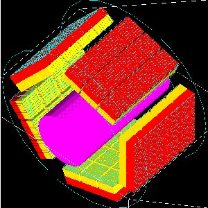

   Picture of a phantom and a cylindricalPET system composed of 5 rsectors, 4 modules (repeated along Z axis), 3 submodules (repeated along Y axis), 64 crystals (8 x 8) and 2 layers (red and yellow)

Choice of the system
--------------------

It is possible to use GATE without using a system, but in that case, no information regarding particle interaction in the detector will be available. The reason is that the volumes where the *hits* (interactions that occur inside the detector parts of the scanner, see :ref:`digitizer_and_readout_parameters-label`) are recorded only for volumes belonging to a defined system (those volumes are declared as *crystalS*, *SD* for *sensitive detector*, see :ref:`attaching_the_sensitive_detectors-label`). When the user is only testing a scanner geometry, the use of a predefined system is not necessary. But if the user wants to record information related to the particle history inside the detector, the geometry has to be associated with a system. This section explains the elements and rules to associate a geometry with a system.

Geometry constraints
~~~~~~~~~~~~~~~~~~~~

Except for the general system *scanner*, one should first take into account the *geometrical* shape of the different components (gantry, sector, bucket, etc.) and also the shape of the crystal or the detector material (*e.g.* scintillators). 

Each *level* has to be assigned to a physical volume of the geometry. A level volume has to be fully enclosed in the upper level volume. 

The number of levels has to be set and must conform to the specifications listed in :numref:`system_tab`. The numbering of different sensitive volumes is completely set by the choice of the system and conforms to a specific output format.

The maximum number of components in each level depends on the output format since it can be limited by the number of bits used for the numbering of the crystals. See :ref:`data_output-label` for further details.

Constraints related to the simulation of the DAQ electronics
~~~~~~~~~~~~~~~~~~~~~~~~~~~~~~~~~~~~~~~~~~~~~~~~~~~~~~~~~~~~

Several points have to be considered when designing the simulation of the electronics cards. First, the whole readout electronic components should be analyzed in order to define its main components. This concerns not only the single channel simulation, with effects like thresholder response, but also the crosstalk between different channels including the electronic or the optical crosstalk among components in a same level. For a PET scanner, the coincidence between two channels have to be simulated, based on the *single component* simulations. In GATE, it is possible to introduce all these signal processing steps through the digitizer modules (see :ref:`digitizer_and_readout_parameters-label`), operating at different levels or depths, as shown in :numref:`keywords_tab`. The depth value is used here to tag a group of similar components operating at a certain level, which could be the scintillator block level (crystal with depth=5, or a group of crystal matrices with depth=1, depth values given in these examples refer to the cylindricalPET system).

To simulate the electronic processing consistenly with the system used to model the detector, the following procedure should be used: 

* Regroup the detector electronic components in different levels.
* List the signal processing to be used for rach of the resulting groups (see *adder*, *readout*, *dead time* in :ref:`digitizer_and_readout_parameters-label`),
* Combine the signals coming from different volumes with, for example, the readout module for the signals summation of a volume, or the crosstalk and/or the coincidence between signals and coincidence. 

NOTE : One or several crosstalk processing can be applied to components of different levels, for instance crosstalk between crystals, followed by crosstalk between modules. Such processing involves components at the same level. For PET scanners, coincidences are validated by testing the number difference in the uppermost level (as defined as depth = 1 in table ). This test can reject accidental coincidence between adjacent logic structures. When the user builds a geometry, this logic organisation should correspond to the fisrt level of a system to use this coincidence sorting (see :ref:`digitizer_and_readout_parameters-label`).

How to connect the geometry to a system
---------------------------------------

The connection between the geometry and a system is performed in several steps:

* The geometrical structure needs first to be  defined, keeping in mind that it must fulfill some constraints, as described before. 
* The system geometry has then to be introduced, or *attached*, in the simulation process with the "attach" command and a specific *keyword* argument corresponding to one level of the geometrical structure. The general macro line for this attachment is::

   systems/SystemName/Level/attach UserVolumeName

where :

  * *SystemName* is the specific name of the system (one of the entry in column 1),
  * *Level* is the specific name of the level (see column 2),
  * *UserVolumeName* is the name the user gave to a volume, according to the conventions of :ref:`defining_a_geometry-label`.

* Finally, the specific output corresponding to the system has to be defined for further data analysis (see :ref:`data_output-label`).

.. table:: Different systems available in GATE and their characteristics. In the second column are listed some of the keyword that are also used at in the macro (see also table 2 for a complete list). The shape in the third column describe the mother volume, composed of “daughter” volumes as described in Chap. 3 : a box means a box shaped mother volume containing an array of daughter boxes, a cylinder mother volumes will contains cylinders. Cylinders are understood here as tube sectors defined by an inner and outer radius.
   :widths: auto
   :name: system_tab

   +----------------+--------------------------------+-----------------------------------------------------------------+
   | System         | Components and Shape           | Available Outputs                                               |
   +================+===========+====================+=================================================================+
   | scanner or     | level1    | geometry not fixed | Basic output: ASCII or ROOT. Coincidences are only available    |
   | PETscanner     +-----------+                    | for the "PETscanner" system                                     |
   |                | level2    |                    |                                                                 |
   |                +-----------+                    | The "level5" key was introduced after Gate v8.2. For Gate v8.2, |
   |                | level3    |                    | the key layer0 and layer1 were used                             |
   |                +-----------+                    |                                                                 |
   |                | level4    |                    |                                                                 |
   |                +-----------+                    |                                                                 |
   |                | level5    |                    |                                                                 |
   +----------------+-----------+--------------------+-----------------------------------------------------------------+
   | CTscanner      | module    | box                | Raw Data, ASCII, ROOT                                           |
   |                +-----------+--------------------+                                                                 |
   |                | cluster   | box                |                                                                 |
   |                +-----------+--------------------+                                                                 |
   |                | pixel     | box                |                                                                 |
   +----------------+-----------+--------------------+-----------------------------------------------------------------+
   | CPET           | sector    | cylinder           | Basic Output: ASCII, ROOT                                       |
   |                +-----------+--------------------+                                                                 |
   |                | cassette  | cylinder           |                                                                 |
   |                +-----------+--------------------+                                                                 |
   |                | module    | box                |                                                                 |
   |                +-----------+--------------------+                                                                 |
   |                | crystal   | box                |                                                                 |
   |                +-----------+--------------------+                                                                 |
   |                | layer     | box                |                                                                 |
   +----------------+-----------+--------------------+-----------------------------------------------------------------+
   | cylindricalPET | rsector   | box                | Basic Output: ASCII, ROOT and Raw. Specific: LMF                |
   |                +-----------+--------------------+                                                                 |
   |                | module    | box                |                                                                 |
   |                +-----------+--------------------+                                                                 |
   |                | submodule | box                |                                                                 |
   |                +-----------+--------------------+                                                                 |
   |                | crystal   | box                |                                                                 |
   |                +-----------+--------------------+                                                                 |
   |                | layer     | box                |                                                                 |
   +----------------+-----------+--------------------+-----------------------------------------------------------------+
   | SPECThead      | crystal   | geometry not fixed | Basic Output: ASCII, ROOT and Raw. Specific:                    |
   |                +-----------+                    |                                                                 |
   |                | pixel     |                    | PROJECTIONSET or INTEFILE, no coincidences                      |
   +----------------+-----------+--------------------+-----------------------------------------------------------------+
   | ecat           | block     | box                | Basic Output: ASCII, ROOT and Raw. Specific: SINOGRAM or ECAT7  |
   |                +-----------+                    |                                                                 |
   |                | crystal   |                    |                                                                 |
   +----------------+-----------+--------------------+-----------------------------------------------------------------+
   | ecatAccel      | block     | box                | Basic Output: ASCII, ROOT and Raw. Specific: SINOGRAM or ECAT7  |
   |                +-----------+                    |                                                                 |
   |                | crystal   |                    |                                                                 |
   +----------------+-----------+--------------------+-----------------------------------------------------------------+
   | OPET           | rsector   | box                | Basic Output: ASCII, ROOT and Raw. Specific: LMF                |
   |                +-----------+--------------------+                                                                 |
   |                | module    | box                |                                                                 |
   |                +-----------+--------------------+                                                                 |
   |                | submodule | box                |                                                                 |
   |                +-----------+--------------------+                                                                 |
   |                | crystal   | box                |                                                                 |
   |                +-----------+--------------------+                                                                 |
   |                | layer     | wedge              |                                                                 |
   +----------------+-----------+--------------------+-----------------------------------------------------------------+
   | OpticalSystem  | crystal   | geometry not fixed | Basic Output: ROOT and Raw. Specific: PROJECTIONSET             |
   |                +-----------+                    |                                                                 |
   |                | pixel     |                    |                                                                 |
   +----------------+-----------+--------------------+-----------------------------------------------------------------+

.. table:: Keywords corresponding to system components definition to be used with an “attach” command. At least one level has to be attached to the system. If necessary, these level’s names can be possibly used as input to digitizers modules: for example, different electronic dead times for each level’s electronics can be modelised. The two last lines, listed here for information, are related to “hits” which apply only for “sensitive” volume. Please refer to Chap. 5 for more details on this topic.
   :widths: auto
   :name: keywords_tab

   +----------------+--------------------------------+--------------------------------+
   | System         | Attach Keyword Argument        | Depth for readout segmentation |
   +================+================================+================================+
   | scanner        | "level1"                       | 1                              |
   |                +--------------------------------+--------------------------------+
   |                | "level2"                       | 2                              |
   |                +--------------------------------+--------------------------------+
   |                | "level3"                       | 3                              |
   |                +--------------------------------+--------------------------------+
   |                | "level4"                       | 4                              |
   |                +--------------------------------+--------------------------------+
   |                | "level5"                       | 5                              |
   +----------------+--------------------------------+--------------------------------+
   | CTscanner      | "module"                       | 1                              |
   |                +--------------------------------+--------------------------------+
   |                | "cluster_0...2"                | 2                              |
   |                +--------------------------------+--------------------------------+
   |                | "pixel_0...2"                  | 3                              |
   +----------------+--------------------------------+--------------------------------+
   | cylindricalPET | "rsector"                      | 1                              |
   |                +--------------------------------+--------------------------------+
   |                | "module"                       | 2                              |
   |                +--------------------------------+--------------------------------+
   |                | "submodule"                    | 3                              |
   |                +--------------------------------+--------------------------------+
   |                | "crystal"                      | 4                              |
   |                +--------------------------------+--------------------------------+
   |                | "layer[i], i=0,3"              | 5                              |
   +----------------+--------------------------------+--------------------------------+
   | CPET           | "sector"                       | 1                              |
   |                +--------------------------------+--------------------------------+
   |                | "cassette"                     | 2                              |
   |                +--------------------------------+--------------------------------+
   |                | "module"                       | 3                              |
   |                +--------------------------------+--------------------------------+
   |                | "crystal"                      | 4                              |
   |                +--------------------------------+--------------------------------+
   |                | "layer[i], i=0,3"              | 5                              |
   +----------------+--------------------------------+--------------------------------+
   | SPECThead      | "crystal"                      | 1                              |
   |                +--------------------------------+--------------------------------+
   |                | "pixel"                        | 2                              |
   +----------------+--------------------------------+--------------------------------+
   | ecat           | "block"                        | 1                              |
   |                +--------------------------------+--------------------------------+
   |                | "crystal"                      | 2                              |
   +----------------+--------------------------------+--------------------------------+
   | ecatAccel      | "block"                        | 1                              |
   |                +--------------------------------+--------------------------------+
   |                | "crystal"                      | 2                              |
   +----------------+--------------------------------+--------------------------------+
   | OPET           | "rsector"                      | 1                              |
   |                +--------------------------------+--------------------------------+
   |                | "module"                       | 2                              |
   |                +--------------------------------+--------------------------------+
   |                | "submodule"                    | 3                              |
   |                +--------------------------------+--------------------------------+
   |                | "crystal"                      | 4                              |
   |                +--------------------------------+--------------------------------+
   |                | "layer[i], i=0,7"              | 5                              |
   +----------------+--------------------------------+--------------------------------+
   | OpticalSystem  | "crystal"                      | 1                              |
   |                +--------------------------------+--------------------------------+
   |                | "pixel"                        | 2                              |
   +----------------+--------------------------------+--------------------------------+

Different types of systems
--------------------------

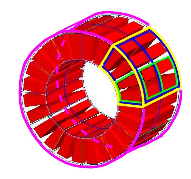

   Illustration of the scanner system. The different volumes, in particular the sensitive ones, can be of any shape, here cylindrical sector crystals, instead of boxes in other systems. The scanner cylinder is drawn in magenta, whereas one of the sector components : Level1, Level2, Level3, Level4 is shown in yellow, blue, green, red, respectively. The “Detector” volumes of cylindrical sector shapes are shown in plain red.

Scanner
~~~~~~~

Description
^^^^^^^^^^^

The *scanner* system is the most generic system in Gate. There is no geometrical constraints on the five different components.

Use
^^^

Different shapes of the volumes inside the tree level can be choosen, among those listed in :numref:`shape_tab`

:numref:`onesectorCPET` illustrates the kind of detector that can be simulated with this system without any geometry constraint. On the other hand, there is no specific output format associated with this system and information regarding the hits are only available in ROOT or ASCII format.

.. _ctscanner-label:

CTscanner
~~~~~~~~~

The CTscanner system allows you to simulate a simple CT scanner. It has three possible levels: 

* **module** component, that can be linearly repeated along the Y axis.
* **cluster** component, repeated inside the module, allowing you to simulate many kind of pixels
* **pixel** component, repeated inside the cluster. Raw data are the standard imageCT output to store the simulated CT projections and to produce it at each time slice. The image type is a float matrix (32-bits) of dimension given by the product of the number of pixels in X and Y, the content corresponds to the number of counts per pixel per acquisition (time slice). 

Three types of simulations are proposed to the user:

* **Complete simulation:** The modules, the clusters, and the pixels are user defined. All volumes are created by Geant4 and the digitalization can be made at the pixel level (level 3).
* **Fast simulation:** Only the module level is defined. Geant4 creates one volume corresponding to the CT module (only one block possible) and the digitalization is made by the output module. The number of pixels per module are given through the output module messenger. This mode is faster since only one Geant4 volume is simulated, but obviously, only a rather approximated scanner response can be garanteed.
* **Complete simulation with a Variance Reduction Technique (VRT):** In the same way as the complete simulation, the components (pixels, clusters, and modules) are user defined. Unlike the complete simulation, using Geant4 in the detector, the user handles the particle on the surface of the CT scanner. For more informations see the part below.

This variance reduction technique (VRT) has been developped with the aim to making the simulation time faster. Here are the successive steps of the implementation:

* **Generation and Propagation** of the particles through the World, then detection of those on the surface of the detector. The propagation of the particles through the detector are 'killed', in order to handle ourself the detection and not by Geant4.
* **Computation of the mean free path** (MFP) of the particle through the detector with the standard model (the compatibility with the low energy model being not implemented yet)
* **Computation of the path** of the particle in the detector:

:math:`PATH = MFP * - log( 1 - R )`

R being a distribution uniformly random number between 0 and 1

The user may perform this last step for each particle K times, in order to decrease the simulation time by avoiding a new generation and propagation of the particle. However it has an influence on the variance of the output data. The following scheme shows the differences with a simulation with a without VRT:

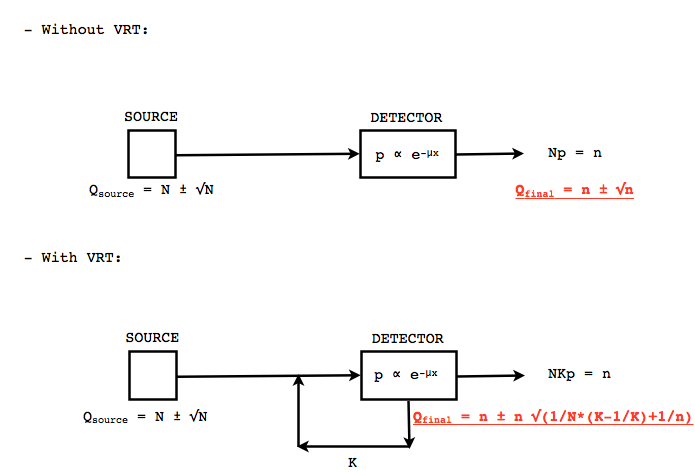

   VRT sheme

N: mean of the generated particles, and :math:`\sqrt{N}` its standard deviation.

p: binomial probability of detection of the particle.

n = Np: mean of the number of detected particles, and :math:`\sqrt{n} = \sqrt{Np}` its standard deviation.

The simulation time decreases linearly with K. But K:math:`\geqslant 10`, because of the reduction of the variance should be avoided. For deeper insight, see the following table and graph.

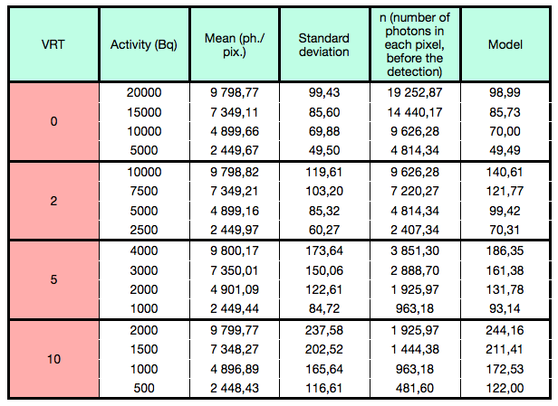

   VRT table

The simulation corresponding to the table is:

* A detector with 10,000 pixels (0.5x0.5x0.5 mm3) in Silicon (Si)
* A monochromatic source (17.6 keV)
* A time of exposition of 1 second

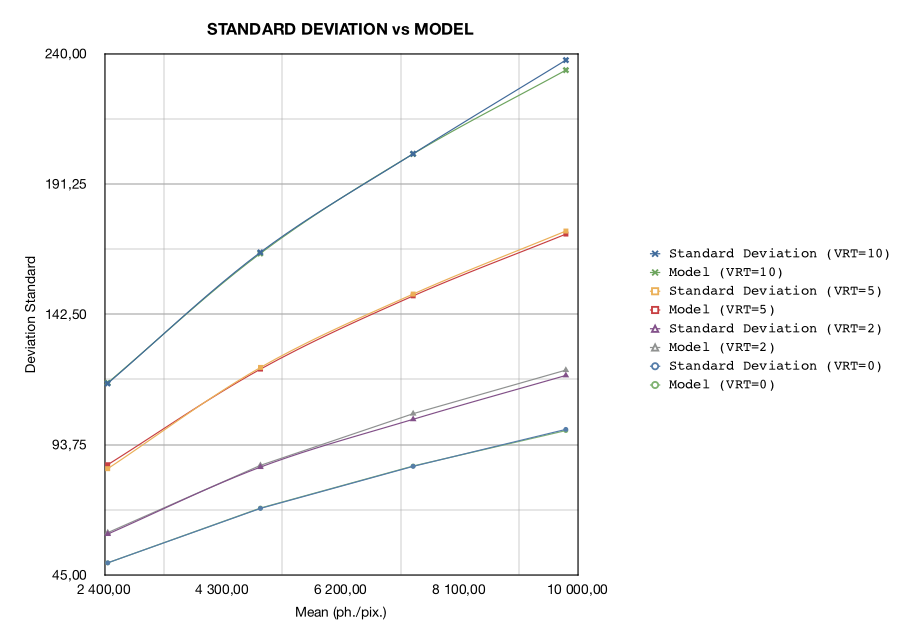

   VRT graph

Use
^^^

**example 1: complete CT simulation**::

  ##############
  # CT SCANNER #
  ############## 
  /gate/world/daughters/name CTscanner
  /gate/world/daughters/insert box
  /gate/CTscanner/placement/setTranslation 0.00 0.00 100 mm
  /gate/CTscanner/geometry/setXLength 100 mm
  /gate/CTscanner/geometry/setYLength 100 mm
  /gate/CTscanner/geometry/setZLength 0.5 mm
  /gate/CTscanner/setMaterial Air
  /gate/CTscanner/vis/forceWireframe
  /gate/CTscanner/vis/setColor white

  #############           ############
  # CTSCANNER #   ---->   #  MODULE  #
  #############           ############
  /gate/CTscanner/daughters/name module
  /gate/CTscanner/daughters/insert box
  /gate/module/geometry/setXLength 100 mm
  /gate/module/geometry/setYLength 100 mm
  /gate/module/geometry/setZLength 0.5 mm
  /gate/module/setMaterial Air
  /gate/module/vis/forceWireframe
  /gate/module/vis/setColor white

  ############           #############
  #  MODULE  #   ---->   # CLUSTER_0 #
  ############           #############
  /gate/module/daughters/name cluster
  /gate/module/daughters/insert box
  /gate/cluster/geometry/setXLength 100 mm
  /gate/cluster/geometry/setYLength 100 mm
  /gate/cluster/geometry/setZLength 0.5 mm
  /gate/cluster/setMaterial Air
  /gate/cluster/vis/forceWireframe
  /gate/cluster/vis/setColor white

  ############             #############           ###########
  #  MODULE  #   ---->     # CLUSTER_0 #   ---->   # PIXEL_0 #
  ############             #############           ###########
  /gate/cluster/daughters/name pixel
  /gate/cluster/daughters/insert box
  /gate/pixel/geometry/setXLength 1 mm
  /gate/pixel/geometry/setYLength 1 mm
  /gate/pixel/geometry/setZLength 1 mm
  /gate/pixel/setMaterial Silicon
  /gate/pixel/vis/setColor red

  # REPEAT PIXEl_0
  /gate/pixel/repeaters/insert cubicArray
  /gate/pixel/cubicArray/setRepeatNumberX 100
  /gate/pixel/cubicArray/setRepeatNumberY 100
  /gate/pixel/cubicArray/setRepeatNumberZ   1
  /gate/pixel/cubicArray/setRepeatVector 1 1 0.0 mm
  /gate/pixel/cubicArray/autoCenter true

  # ATTACH SYSTEM
  /gate/systems/CTscanner/module/attach module
  /gate/systems/CTscanner/cluster_0/attach cluster
  /gate/systems/CTscanner/pixel_0/attach pixel

  # ATTACH LAYER
  /gate/pixel/attachCrystalSD

**example 2: complete CT simulation with VRT**

In the same way as the complete simulation, the difference is the output (K = 5)::

  /gate/output/imageCT/vrtFactor 5

**Exemple 3 : Fast CT simulation**::

  ##############
  # CT SCANNER #
  ############## 
  /gate/world/daughters/name CTscanner
  /gate/world/daughters/insert box
  /gate/CTscanner/placement/setTranslation 0.00 0.00 100 mm
  /gate/CTscanner/geometry/setXLength 1.00 mm
  /gate/CTscanner/geometry/setYLength 1.00 mm
  /gate/CTscanner/geometry/setZLength 0.50 mm
  /gate/CTscanner/setMaterial Air
  /gate/CTscanner/vis/forceWireframe
  /gate/CTscanner/vis/setColor white

  #############           ############
  # CTSCANNER #   ---->   #  MODULE  #
  #############           ############
  /gate/CTscanner/daughters/name module
  /gate/CTscanner/daughters/insert box
  /gate/module/geometry/setXLength 1. mm
  /gate/module/geometry/setYLength 1. mm
  /gate/module/geometry/setZLength 0.50 mm
  /gate/module/setMaterial Air
  /gate/module/vis/forceWireframe
  /gate/module/vis/setColor white

  ############           #############
  #  MODULE  #   ---->   # CLUSTER_0 #
  ############           #############
  /gate/module/daughters/name cluster
  /gate/module/daughters/insert box
  /gate/cluster/geometry/setXLength 1. mm
  /gate/cluster/geometry/setYLength 1. mm
  /gate/cluster/geometry/setZLength 0.50 mm
  /gate/cluster/setMaterial Air
  /gate/cluster/vis/forceWireframe
  /gate/cluster/vis/setColor white

  ############             #############           ###########
  #  MODULE  #   ---->     # CLUSTER_0 #   ---->   # PIXEL_0 #
  ############             #############           ###########
  /gate/cluster/daughters/name pixel
  /gate/cluster/daughters/insert box
  /gate/pixel/geometry/setXLength 1. mm
  /gate/pixel/geometry/setYLength 1. mm
  /gate/pixel/geometry/setZLength 0.5 mm
  /gate/pixel/setMaterial Silicon
  /gate/pixel/vis/setColor red

  # ATTACH SYSTEM                     
  /gate/systems/CTscanner/module/attach module
  /gate/systems/CTscanner/cluster_0/attach cluster
  /gate/systems/CTscanner/pixel_0/attach pixel

  # ATTACH LAYER
  /gate/pixel/attachCrystalSD

  /gate/output/imageCT/numFastPixelX 100
  /gate/output/imageCT/numFastPixelY 100
  /gate/output/imageCT/numFastPixelZ 1

CylindricalPET
~~~~~~~~~~~~~~

Description
^^^^^^^^^^^

**CylindricalPET** is a PET system that can describe most of the small animal PET scanners. The main specificity of *cylindricalPET* is the possibility to record output data in the List Mode Format (LMF) developed by the Crystal Clear Collaboration. A complete description of LMF is can be found in :ref:`lmf_output-label`.

A CylindricalPET is based on a cylindrical geometry, and consists of 5 hierarchic levels, from mother to daughter, as defined below:

* **world** **cylindricalPET** is defined as a cylinder in the world, with a non zero inner radius. 
* **rsector** (depth=1) is defined as a box, and repeated with a *ring repeater* in cylindricalPET.
* **module** (depth=2) is a box inside *rsector*. It is repeated by a *cubicarray repeater* with no X repetition (*repeatNumberX = 1*). This level is optional. 
* **submodule** (depth=3) is a box inside *module*. It is repeated by a *cubicarray repeater* with no X repetition (*repeatNumberX = 1*). This level is optional.
* **crystal** (depth=4) is a box inside *submodule*. It is repeated by a *cubicarray repeater* with no X repetition (*repeatNumberX = 1*).
* **layer** (depth=5) is a (or several, in the case of a phoswich system) radially arranged box(es) inside *crystal*. A repeater should not be used for layers, but the should be build them one by one in the macro. *layer* must be set as a sensible detector with the macro command::

   /attachCrystalSD

The words in bold characters are dedicated. See also keywords in :numref:`keywords_tab`.

Material of *layer* (s) must be the material of the detector, for instance LSO or BGO + GSO for a double layer phoswich system. Materials of other levels (crystals, submodules, modules, rsectors, cylindricalPET) can be anything else. 

**IMPORTANT :** Visualization should help you build this geometry with no overlap. GATE performs a test for detecting volume overlap, but with a limited precision. This test is performed at the end of the initialization of Gate (see :ref:`getting_started-label`)::

   /run/initialize
   /geometry/test/recursive_test 

Users should carefully check that volumes are not bigger than the mother volume they are included in.

Use
^^^

An example of definition of a PET scanner following the CylindricalPET system structure is given below. The definition of the scanner should be performed at the beginning of the macro, before initializations::

   # W O R L D 
   /gate/world/geometry/setXLength 40 cm 
   /gate/world/geometry/setYLength 40. cm 
   /gate/world/geometry/setZLength 40. cm
   
   # M O U S E 
   /gate/world/daughters/name mouse 
   /gate/world/daughters/insert cylinder 
   /gate/mouse/setMaterial Water 
   /gate/mouse/vis/setColor red 
   /gate/mouse/geometry/setRmax 18.5 mm 
   /gate/mouse/geometry/setRmin 0. mm 
   /gate/mouse/geometry/setHeight 68. mm
   
   # C Y L I N D R I C A L 
   /gate/world/daughters/name cylindricalPET 
   /gate/world/daughters/insert cylinder 
   /gate/cylindricalPET/setMaterial Water 
   /gate/cylindricalPET/geometry/setRmax 145 mm 
   /gate/cylindricalPET/geometry/setRmin 130 mm 
   /gate/cylindricalPET/geometry/setHeight 80 mm 
   /gate/cylindricalPET/vis/forceWireframe
   
   # R S E C T O R 
   /gate/cylindricalPET/daughters/name rsector 
   /gate/cylindricalPET/daughters/insert box 
   /gate/rsector/placement/setTranslation 135 0 0 mm 
   /gate/rsector/geometry/setXLength 10. mm 
   /gate/rsector/geometry/setYLength 19. mm 
   /gate/rsector/geometry/setZLength 76.6 mm 
   /gate/rsector/setMaterial Water 
   /gate/rsector/vis/forceWireframe
   
   # M O D U L E 
   /gate/rsector/daughters/name module 
   /gate/rsector/daughters/insert box 
   /gate/module/geometry/setXLength 10. mm 
   /gate/module/geometry/setYLength 19. mm 
   /gate/module/geometry/setZLength 19. mm 
   /gate/module/setMaterial Water 
   /gate/module/vis/forceWireframe 
   /gate/module/vis/setColor gray
   
   # C R Y S T A L 
   /gate/module/daughters/name crystal 
   /gate/module/daughters/insert box 
   /gate/crystal/geometry/setXLength 10. mm 
   /gate/crystal/geometry/setYLength 2.2 mm 
   /gate/crystal/geometry/setZLength 2.2 mm 
   /gate/crystal/setMaterial Water 
   /gate/crystal/vis/forceWireframe 
   /gate/crystal/vis/setColor magenta
   
   # L A Y E R 
   /gate/crystal/daughters/name LSO 
   /gate/crystal/daughters/insert box 
   /gate/LSO/geometry/setXLength 10. mm 
   /gate/LSO/geometry/setYLength 2.2 mm 
   /gate/LSO/geometry/setZLength 2.2 mm 
   /gate/LSO/placement/setTranslation 0 0 0 mm 
   /gate/LSO/setMaterial LSO 
   /gate/LSO/vis/setColor yellow
   
   # R E P E A T C R Y S T A L 
   /gate/crystal/repeaters/insert cubicArray 
   /gate/crystal/cubicArray/setRepeatNumberX 1 
   /gate/crystal/cubicArray/setRepeatNumberY 8 
   /gate/crystal/cubicArray/setRepeatNumberZ 8 
   /gate/crystal/cubicArray/setRepeatVector 10. 2.4 2.4 mm
   
   # R E P E A T M O D U L E 
   /gate/module/repeaters/insert cubicArray 
   /gate/module/cubicArray/setRepeatNumberZ 4 
   /gate/module/cubicArray/setRepeatVector 0. 0. 19.2 mm
   
   # R E P E A T R S E C T O R 
   /gate/rsector/repeaters/insert ring 
   /gate/rsector/ring/setRepeatNumber 42
   
   # A T T A C H S Y S T E M 
   /gate/systems/cylindricalPET/rsector/attach rsector 
   /gate/systems/cylindricalPET/module/attach module 
   /gate/systems/cylindricalPET/crystal/attach crystal 
   /gate/systems/cylindricalPET/layer0/attach LSO
   
   # A T T A C H L A Y E R SD 
   /gate/LSO/attachCrystalSD 
   /gate/mouse/attachPhantomSD

CPET
~~~~

This system was defined for the simulation of a CPET-like scanner (C-PET Plus, Philips Medical Systems, the Netherlands), with one ring of NaI crystal with a curved shape. For this scanner, a single level in addition to the system level is enough to describe the volume hierarchy.

Description
^^^^^^^^^^^

This system has the particularity to have cylindrical shaped sector components, based on the *cylinder* shape (see :numref:`pie_sector` and :ref:`defining_a_geometry-label` for definitions), whereas these components are generally boxes in other systems.

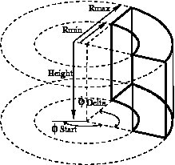

   Definition of a CPET sector volume. This system allows one to define sectors with a cylindrical shape instead of sectors with a box shape,like in other PET systems

Use
^^^

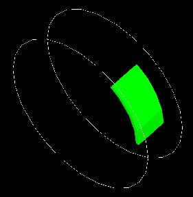

   One NaI crystal with a curved shape

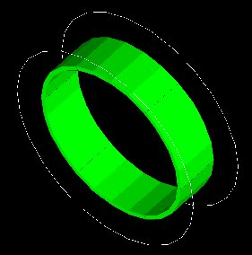

   After the ring repeater, the scanner consists of 6 NaI crystals

Described below is an example of code appropriate for modeling a one ring scanner of NaI crystal with a curved shape::

   # BASE = CPET SYSTEM 
   /gate/world/daughters/name CPET 
   /gate/world/daughters/insert cylinder 
   /gate/CPET/setMaterial Air 
   /gate/CPET/geometry/setRmax 60 cm 
   /gate/CPET/geometry/setRmin 0.0 cm 
   /gate/CPET/geometry/setHeight 35.0 cm 
   /gate/CPET/vis/forceWireframe
   
   # FIRST LEVEL = CRYSTAL 
   /gate/CPET/daughters/name crystal 
   /gate/CPET/daughters/insert cylinder 
   /gate/crystal/geometry/setRmax 47.5 cm 
   /gate/crystal/geometry/setRmin 45.0 cm 
   /gate/crystal/geometry/setHeight 25.6 cm 
   /gate/crystal/geometry/setPhiStart 0 deg 
   /gate/crystal/geometry/setDeltaPhi 60 deg
   
   # REPEAT THE CURVE SECTOR INTO THE WHOLE RING 
   /gate/crystal/repeaters/insert ring 
   /gate/crystal/ring/setRepeatNumber 6
   
   # CRYSTAL VOLUME IS MADE OF NAI 
   /gate/crystal/setMaterial NaI 
   /gate/crystal/vis/setColor green 

The object *crystal* is then attached to its corresponding component in the CPET system (level 1 : the sector level for CPET system - see previous section for details)::

   /gate/systems/CPET/sector/attach crystal 

The crystals are set as sensitive detectors (see :ref:`the_crystalsd-label`)::

   /gate/crystal/attachCrystalSD 

The digitizer part (see :ref:`digitizer_modules-label`) is made of the *adder* module and some blurring module (see :ref:`digitizer_and_readout_parameters-label`).

.. _ecat-label:

Ecat
~~~~

Description
^^^^^^^^^^^

The ecat system is a simplified version of *cylindricalPET* and was named *ecat* because it is appropriate for modelling PET scanners from the **ECAT** family, from CPS Innovations (Knoxville, TN, U.S.A.). Such scanners are based on the block detector principle, consisting in an array of crystals, typically 8 x 8 read by few photomultipliers, typically 4. The blocks are organized along an annular geometry to yield multi-ring detectors.

An example of macro with an ecat definition is provided in: 
 
 https://github.com/OpenGATE/GateContrib/blob/master/imaging/PET/PET_Ecat_System.mac

The ecat system has only three hierarchical levels: one is for the entire detector (*base*), one for the block (*block*), and one for the crystals within the block (*crystal*).

In addition to the standard output modules (*ASCII* and *root*), two additional output modules are specifically associated to the *ecat* system, and correspond to sinogram formats. These are the *sinogram* and the *ecat7* output modules and are discussed in :ref:`sinogram_output-label` and :ref:`ecat7_output-label`.

Use
^^^

Described below is an example of code for modeling a four block-ring scanner.

It has to be named after the selected system (*ecat* here) and is defined as a volume daughter of the *world*. It has a ring shape and should include all detectors (see :numref:`EcatBase`)::

   /gate/world/daughters/name ecat 
   /gate/world/daughters/insert cylinder 
   /gate/ecat/setMaterial Air 
   /gate/ecat/geometry/setRmax 442.0 mm 
   /gate/ecat/geometry/setRmin 412.0 mm 
   /gate/ecat/geometry/setHeight 155.2 mm 
   /gate/ecat/setTranslation 0.0 0.0 0.0 mm 

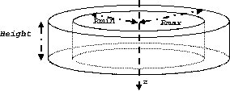
   
   Definition of the base

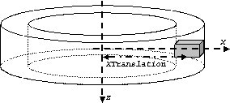
   
   Definition of the block

The following commands set the size and the position of the first block within the base *ecat*. It is a rectangular parallelepiped and should include all crystals within a block. For a multiple block-ring system centered axially on the base *ecat*, the axial position of this first block should be set to zero (see :numref:`EcatBase`)::

   /gate/ecat/daughters/name block 
   /gate/ecat/daughters/insert box 
   /gate/block/placement/setTranslation 427.0 0.0 0.0 mm 
   /gate/block/geometry/setXLength 30.0 mm 
   /gate/block/geometry/setYLength 35.8 mm 
   /gate/block/geometry/setZLength 38.7 mm 
   /gate/block/setMaterial Air 

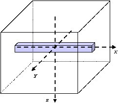
   
   Definition of the crystal

The next commands set the size and the position of the first crystal within the *block*. For a crystal array centered on the *block*, the position of this first crystal should be at the center of the block (see :numref:`EcatCrystal`)::

   /gate/block/daughters/name crystal 
   /gate/block/daughters/insert box 
   /gate/crystal/placement/setTranslation 0.0 0.0 0.0 mm 
   /gate/crystal/geometry/setXLength 30.0 mm 
   /gate/crystal/geometry/setYLength 4.4 mm 
   /gate/crystal/geometry/setZLength 4.75 mm 
   /gate/crystal/setMaterial BGO 

Finally, the crystal array is described. The sampling of the crystals within a block is defined, together with the size and the sampling of the crystal array within one block. The crystal array is centered on the position of the original crystal::

   /gate/crystal/repeaters/insert cubicArray 
   /gate/crystal/cubicArray/setRepeatNumberX 1 
   /gate/crystal/cubicArray/setRepeatNumberY 8 
   /gate/crystal/cubicArray/setRepeatNumberZ 8 
   /gate/crystal/cubicArray/setRepeatVector 0. 4.45 4.80 mm 

To create the full scanner, the rings have then to be defined. The following commands set the number of blocks per block-ring and the number of block-rings. Multiple block-ring systems will be centered axially on the axial position of the original block::

   /gate/block/repeaters/insert linear 
   /gate/block/linear/setRepeatNumber 4 
   /gate/block/linear/setRepeatVector 0. 0. 38.8 mm 
   /gate/block/repeaters/insert ring 
   /gate/block/ring/setRepeatNumber 72 

This description results in a 4 block-ring scanner, *i.e.* a 32 crystal-ring scanner, with 576 crystals per crystal-ring.

Command lines are then used to attach the objects *block* and *crystal* to their corresponding components in the ecat system::

   systems/ecat/block/attach block 
   systems/ecat/crystal/attach crystal 

To detect events, the crystals are finally set as sensitive detectors (see :ref:`the_crystalsd-label`)::

   /gate/crystal/attachCrystalSD 

The digitizer part (see :ref:`digitizer_modules-label`) can be the same as for the cylindricalPET system.

ecatAccel
~~~~~~~~~

Description
^^^^^^^^^^^

The ecatAccel system was introduced to model a new PET scanner family ECAT ACCEL (from CPS Innovations, Knoxville, TN, U.S.A.). The ecatAccel system differs from the ecat system by its geometrical shape : the detection blocks are arranged along a spherical ring whereas they are arranged along annular rings for the ecat system. As data processing and output format are highly dependent on the scanner geometry, it was necessary to introduce a new system even though it has many common features with the ecat system. The same hierarchical levels (base, block and crystal) as for the ecat system are used to describe the geometry of the ecatAccel system, and the same standard output modules (ASCII and root) and specific outputs (sinogram and ecat7) are also available. Please refer to :ref:`sinogram_output-label` and :ref:`ecat7_output-label` for further information on sinogram and ecat7 outputs for the ecatAccel system.

Use
^^^

Described below is an example of code for modeling the ACCEL PET scanner of the BIOGRAPH-LSO (SIEMENS - CTI) PET-CT scanner.

The scanner is named after the selected system (ecatAccel here) and is defined as a volume daughter of the world. As for the ecat system, it has a ring shape and should include all detectors (see :numref:`EcatBase`). For the BIOGRAPH, it can be described as follows:
 
The base is described::

   /gate/world/daughters/name ecatAccel 
   /gate/world/daughters/insert cylinder 
   /gate/ecatAccel/setMaterial Air 
   /gate/ecatAccel/geometry/setRmax 437.0 mm 
   /gate/ecatAccel/geometry/setRmin 412.0 mm 
   /gate/ecatAccel/geometry/setHeight 162. mm 
   /gate/ecatAccel/setTranslation 0.0 0.0 0.0 mm

The block is then described: the size and the position of the first block are set within the base ecatAccel. As for the ecat system, it is a rectangular parallelepiped and should include all crystals within a block. For a multiple block-ring system centered axially on the base ecatAccel, the axial position of this first block should be set to zero::

   /gate/ecatAccel/daughters/name block 
   /gate/ecatAccel/daughters/insert box 
   /gate/block/geometry/setXLength 51.6 mm 
   /gate/block/geometry/setYLength 25.0 mm 
   /gate/block/geometry/setZLength 51.6 mm 
   /gate/block/setMaterial Air 

The crystal geometry and settings are then specified. The following commands set the size and the position of the first crystal within the block. For a crystal array centered on the block, the position of this first crystal should be at the center of the block::

   /gate/block/daughters/name crystal 
   /gate/block/daughters/insert box 
   /gate/crystal/placement/setTranslation 0.0 0.0 0.0 mm 
   /gate/crystal/geometry/setXLength 6.45 mm 
   /gate/crystal/geometry/setYLength 25.0 mm 
   /gate/crystal/geometry/setZLength 6.45 mm 
   /gate/crystal/setMaterial LSO 

Then the crystal array is described within a block. The crystal array will be centered on the position of the original crystal::

   /gate/crystal/repeaters/insert cubicArray 
   /gate/crystal/cubicArray/setRepeatNumberX 8 
   /gate/crystal/cubicArray/setRepeatNumberY 1 
   /gate/crystal/cubicArray/setRepeatNumberZ 8 
   /gate/crystal/cubicArray/setRepeatVector 6.45 0.0 6.45 mm 

Finally, the different rings of the scanner are described. The number of blocks per block-ring (command setRepeatNumberWithTheta) is indicated as well as the number of block-rings (command setRepeatNumberWithPhi). The angle between two adjacent blocks in a block-ring is set with the command setThetaAngle and the angle between two adjacent blocks belonging to two neighbouring rings in the axial direction is set with the command setPhiAngle. Multiple block-ring will be centered axially on the axial position of the original block::

   /gate/block/repeaters/insert sphere 
   /gate/block/sphere/setRadius 424.5 mm 
   /gate/block/sphere/setRepeatNumberWithTheta 3ionSource 
   /gate/block/sphere/setRepeatNumberWithPhi 48 
   /gate/block/setThetaAngle 7.5 deg 
   /gate/block/setPhiAngle 7.5 deg 

This description results in a 3 block-ring scanner, i.e. a 24 crystal-ring scanner, with 384 crystals per crystal-ring.
 
The objects block and crystal are attached to their corresponding components in the ecatAccel system::
 
   /gate/systems/ecatAccel/block/attach block 
   /gate/systems/ecatAccel/crystal/attach crystal 

The sensitive detector is set to the crystals as for the ecat system and the digitizer part remains the same as for the cylindricalPET system.

OPET
~~~~

Description
^^^^^^^^^^^

The OPET system was introduced to model a new PET prototype. 

Use
^^^

Described below is an example of code for modeling the OPET PET scanner::
 
   # R S E C T O R (Create a box to put the crystals in: one PMT) 
   /gate/OPET/daughters/name rsector 
   /gate/OPET/daughters/insert box 
   /gate/rsector/placement/setTranslation 20.4955 0 0 mm 
   /gate/rsector/geometry/setXLength 10 mm 
   /gate/rsector/geometry/setYLength 17.765 mm 
   /gate/rsector/geometry/setZLength 17.765 mm 
   /gate/rsector/setMaterial Air 
   /gate/rsector/vis/setVisible False 
   /gate/rsector/vis/forceWireframe 
   /gate/rsector/vis/setColor yellow
   
   # M O D U L E (Make a box for one row of 8 crystals) 
   /gate/rsector/daughters/name module 
   /gate/rsector/daughters/insert box 
   /gate/module/geometry/setXLength 10 mm 
   /gate/module/geometry/setYLength 17.765 mm 
   /gate/module/geometry/setZLength 2.162 mm 
   /gate/module/setMaterial Air 
   /gate/module/vis/setVisible False 
   /gate/module/vis/forceWireframe 
   /gate/module/vis/setColor black
   
   # Daughter crystal inside mother crystal 
   /gate/module/daughters/name crystal0 
   /gate/module/daughters/insert box 
   /gate/crystal0/geometry/setXLength 10 mm 
   /gate/crystal0/geometry/setYLength 2.1620 mm 
   /gate/crystal0/geometry/setZLength 2.1620 mm 
   /gate/crystal0/placement/setTranslation 0. -7.8015 0. mm 
   /gate/crystal0/setMaterial Air 
   /gate/crystal0/vis/setColor black 
   /gate/crystal0/vis/setVisible false
   
   # L A Y E R (Put the LSO in the small box) 
   /gate/crystal0/daughters/name LSO0 
   /gate/crystal0/daughters/insert wedge 
   /gate/LSO0/geometry/setXLength 10 mm 
   /gate/LSO0/geometry/setNarrowerXLength 8.921 mm 
   /gate/LSO0/geometry/setYLength 2.1620 mm 
   /gate/LSO0/geometry/setZLength 2.1620 mm 
   /gate/LSO0/placement/setRotationAxis 0 1 0 
   /gate/LSO0/placement/setRotationAngle 180 deg 
   /gate/LSO0/placement/setTranslation 0.2698 0. 0. mm 
   /gate/LSO0/setMaterial BGO 
   /gate/LSO0/vis/setColor yellow
    
   # Daughter crystal inside mom crystal 
   /gate/module/daughters/name crystal1 
   /gate/module/daughters/insert box 
   /gate/crystal1/geometry/setXLength 10 mm 
   /gate/crystal1/geometry/setYLength 2.1620 mm 
   /gate/crystal1/geometry/setZLength 2.1620 mm 
   /gate/crystal1/placement/setTranslation 0. -5.5725 0. mm 
   /gate/crystal1/setMaterial Air 
   /gate/crystal1/vis/setColor magenta 
   /gate/crystal1/vis/forceWireframe 
   /gate/crystal1/vis/setVisible false
    
   # L A Y E R (Put the LSO in the small box) 
   /gate/crystal1/daughters/name LSO1 
   /gate/crystal1/daughters/insert wedge 
   /gate/LSO1/geometry/setXLength 8.921 mm 
   /gate/LSO1/geometry/setNarrowerXLength 8.193 mm 
   /gate/LSO1/geometry/setYLength 2.1620 mm 
   /gate/LSO1/geometry/setZLength 2.1620 mm 
   /gate/LSO1/placement/setRotationAxis 0 1 0 
   /gate/LSO1/placement/setRotationAngle 180 deg 
   /gate/LSO1/placement/setTranslation 0.7215 0. 0. mm 
   /gate/LSO1/setMaterial BGO 
   /gate/LSO1/vis/setColor red
    
   # Daughter crystal inside mom crystal 
   /gate/module/daughters/name crystal2 
   /gate/module/daughters/insert box 
   /gate/crystal2/geometry/setXLength 10 mm 
   /gate/crystal2/geometry/setYLength 2.1620 mm 
   /gate/crystal2/geometry/setZLength 2.1620 mm 
   /gate/crystal2/placement/setTranslation 0. -3.3435 0. mm 
   /gate/crystal2/setMaterial Air 
   /gate/crystal2/vis/setColor black 
   /gate/crystal2/vis/setVisible false
   
   # L A Y E R (Put the LSO in the small box) 
   /gate/crystal2/daughters/name LSO2 
   /gate/crystal2/daughters/insert wedge 
   /gate/LSO2/geometry/setXLength 8.193 mm 
   /gate/LSO2/geometry/setNarrowerXLength 7.773 mm 
   /gate/LSO2/geometry/setYLength 2.1620 mm 
   /gate/LSO2/geometry/setZLength 2.1620 mm 
   /gate/LSO2/placement/setRotationAxis 0 1 0 
   /gate/LSO2/placement/setRotationAngle 180 deg 
   /gate/LSO2/placement/setTranslation 1.0085 0. 0. mm 
   /gate/LSO2/setMaterial BGO 
   /gate/LSO2/vis/setColor green
    
   # Daughter crystal inside mom crystal 
   /gate/module/daughters/name crystal3 
   /gate/module/daughters/insert box 
   /gate/crystal3/geometry/setXLength 10 mm 
   /gate/crystal3/geometry/setYLength 2.1620 mm 
   /gate/crystal3/geometry/setZLength 2.1620 mm 
   /gate/crystal3/placement/setTranslation 0. -1.1145 0. mm 
   /gate/crystal3/setMaterial Air #
   /gate/crystal3/vis/forceWireframe 
   /gate/crystal3/vis/setColor black 
   /gate/crystal3/vis/setVisible false
    
   # L A Y E R (Put the LSO in the small box) 
   /gate/crystal3/daughters/name LSO3 
   /gate/crystal3/daughters/insert wedge 
   /gate/LSO3/geometry/setXLength 7.773 mm 
   /gate/LSO3/geometry/setNarrowerXLength 7.637 mm 
   /gate/LSO3/geometry/setYLength 2.1620 mm 
   /gate/LSO3/geometry/setZLength 2.1620 mm 
   /gate/LSO3/placement/setRotationAxis 0 1 0 
   /gate/LSO3/placement/setRotationAngle 180 deg 
   /gate/LSO3/placement/setTranslation 1.1475 0. 0. mm 
   /gate/LSO3/setMaterial BGO 
   /gate/LSO3/vis/setColor blue
    
   # Daughter crystal inside mom crystal 
   /gate/module/daughters/name /gate/crystal4/ 
   /gate/module/daughters/insert box 
   /gate/crystal4//geometry/setXLength 10 mm 
   /gate/crystal4//geometry/setYLength 2.1620 mm 
   /gate/crystal4//geometry/setZLength 2.1620 mm 
   /gate/crystal4//placement/setTranslation 0. 1.1145 0. mm 
   /gate/crystal4//setMaterial Air 
   /gate/crystal4//vis/setColor black 
   /gate/crystal4//vis/setVisible false
    
   # L A Y E R (Put the LSO in the small box) 
   /gate/crystal4//daughters/name /gate/LSO4 
   /gate/crystal4//daughters/insert wedge 
   /gate/LSO4/geometry/setXLength 7.773 mm 
   /gate/LSO4/geometry/setNarrowerXLength 7.637 mm 
   /gate/LSO4/geometry/setYLength 2.1620 mm 
   /gate/LSO4/geometry/setZLength 2.1620 mm 
   /gate/LSO4/placement/setRotationAxis 0 0 1 
   /gate/LSO4/placement/setRotationAngle 180 deg 
   /gate/LSO4/placement/setTranslation 1.1475 0. 0. mm 
   /gate/LSO4/setMaterial BGO 
   /gate/LSO4/vis/setColor blue
    
   # Daughter crystal1 inside mom crystal 
   /gate/module/daughters/name crystal5 
   /gate/module/daughters/insert box 
   /gate/crystal5/geometry/setXLength 10 mm 
   /gate/crystal5/geometry/setYLength 2.1620 mm 
   /gate/crystal5/geometry/setZLength 2.1620 mm 
   /gate/crystal5/placement/setTranslation 0. 3.3435 0. mm 
   /gate/crystal5/setMaterial Air 
   /gate/crystal5/vis/setColor black 
   /gate/crystal5/vis/setVisible false
    
   # L A Y E R (Put the LSO in the small box) 
   /gate/crystal5/daughters/name LSO5 
   /gate/crystal5/daughters/insert wedge 
   /gate/LSO5/geometry/setXLength 8.193 mm 
   /gate/LSO5/geometry/setNarrowerXLength 7.773 mm 
   /gate/LSO5/geometry/setYLength 2.1620 mm 
   /gate/LSO5/geometry/setZLength 2.1620 mm 
   /gate/LSO5/placement/setRotationAxis 0 0 1 
   /gate/LSO5/placement/setRotationAngle 180 deg 
   /gate/LSO5/placement/setTranslation 1.0085 0. 0. mm 
   /gate/LSO5/setMaterial BGO 
   /gate/LSO5/vis/setColor green
    
   # Daughter crystal1 inside mom crystal 
   /gate/module/daughters/name /gate/crystal6 
   /gate/module/daughters/insert box 
   /gate/crystal6/geometry/setXLength 10 mm 
   /gate/crystal6/geometry/setYLength 2.1620 mm 
   /gate/crystal6/geometry/setZLength 2.1620 mm 
   /gate/crystal6/placement/setTranslation 0. 5.5725 0. mm 
   /gate/crystal6/setMaterial Air 
   /gate/crystal6/vis/forceWireframe 
   /gate/crystal6/vis/setColor black 
   /gate/crystal6/vis/setVisible false
    
   # L A Y E R (Put the LSO in the small box) 
   /gate/crystal6/daughters/name /gate/LSO6 
   /gate/crystal6/daughters/insert wedge 
   /gate/LSO6/geometry/setXLength 8.921 mm 
   /gate/LSO6/geometry/setNarrowerXLength 8.193 mm 
   /gate/LSO6/geometry/setYLength 2.1620 mm 
   /gate/LSO6/geometry/setZLength 2.1620 mm 
   /gate/LSO6/placement/setRotationAxis 0 0 1 
   /gate/LSO6/placement/setRotationAngle 180 deg 
   /gate/LSO6/placement/setTranslation 0.7215 0. 0. mm 
   /gate/LSO6/setMaterial BGO 
   /gate/LSO6/vis/setColor red
    
   # Daughter crystal1 inside mom crystal 
   /gate/module/daughters/name /gate/crystal7 
   /gate/module/daughters/insert box 
   /gate/crystal7/geometry/setXLength 10 mm 
   /gate/crystal7/geometry/setYLength 2.1620 mm 
   /gate/crystal7/geometry/setZLength 2.1620 mm 
   /gate/crystal7/placement/setTranslation 0. 7.8015 0. mm 
   /gate/crystal7/setMaterial Air 
   /gate/crystal7/vis/forceWireframe 
   /gate/crystal7/vis/setColor black 
   /gate/crystal7/vis/setVisible false
    
   # L A Y E R (Put the LSO in the small box) 
   /gate/crystal7/daughters/name /gate/LSO7 
   /gate/crystal7/daughters/insert wedge 
   /gate/LSO7/geometry/setXLength 10 mm 
   /gate/LSO7/geometry/setNarrowerXLength 9.07 mm 
   /gate/LSO7/geometry/setYLength 2.1620 mm 
   /gate/LSO7/geometry/setZLength 2.1620 mm 
   /gate/LSO7/placement/setTranslation 0.2698 0. 0. mm 
   /gate/LSO7/placement/setRotationAxis 0 0 1 
   /gate/LSO7/placement/setRotationAngle 180 deg 
   /gate/LSO7/setMaterial BGO 
   /gate/LSO7/vis/setColor yellow
    
   # Repeat 8 time the level2 to get 8 rings (Z direction) 
   /gate/module/repeaters/insert linear 
   /gate/module/linear/setRepeatNumber 8 
   /gate/module/linear/setRepeatVector 0. 0. 2.2275 mm
    
   /gate/rsector/repeaters/insert ring 
   /gate/rsector/ring/setRepeatNumber 6
    
   /gate/OPET/placement/setRotationAxis 0 0 1 #
   /gate/OPET/placement/setRotationAngle 30 deg
   
   # A T T A C H S Y S T E M
   /gate/systems/OPET/rsector/attach rsector 
   /gate/systems/OPET/module/attach module 
   /gate/systems/OPET/layer0/attach LSO0 
   /gate/systems/OPET/layer1/attach LSO1 
   /gate/systems/OPET/layer2/attach LSO2 
   /gate/systems/OPET/layer3/attach LSO3 
   /gate/systems/OPET/layer4/attach /gate/LSO4 
   /gate/systems/OPET/layer5/attach LSO5 
   /gate/systems/OPET/layer6/attach /gate/LSO6 
   /gate/systems/OPET/layer7/attach /gate/LSO7
    
   #A T T A C H L A Y E R SD : definition of your sensitive detector 
   /gate/LSO0/attachCrystalSD 
   /gate/LSO1/attachCrystalSD 
   /gate/LSO2/attachCrystalSD 
   /gate/LSO3/attachCrystalSD 
   /gate/LSO4/attachCrystalSD 
   /gate/LSO5/attachCrystalSD 
   /gate/LSO6/attachCrystalSD 
   /gate/LSO7/attachCrystalSD

:numref:`OPET2-1` shows the final OPET scanner.

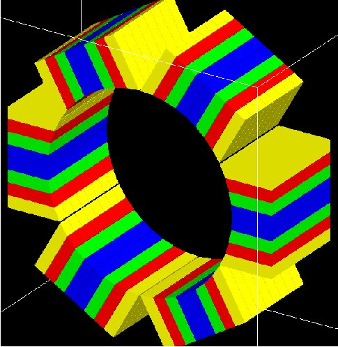
   
   The OPET scanner

SPECTHead
~~~~~~~~~

Description
^^^^^^^^^^^

*SPECTHead* is a SPECT system appropriate to model SPECT dedicated scanners within GATE. The main reason for specifying SPECThead is that it can be coupled to the InterFile output which is discussed in :ref:`interfile_output_of_projection_set-label`. An example macro defining a typical SPECT scanner can be found in:
 
 https://github.com/OpenGATE/GateContrib/blob/master/imaging/SPECT/SPECT.mac

wherein the specific Interfile output module is called. 

A SPECThead system is a box-shaped geometry element and consists of three hierarchic levels: 

* **base** which is always attached to the volume SPECThead, which is a dedicated word. 
* **crystal** which is coupled to the main detector block.
* **pixel** which can be used for modeling a pixelated detector.

If a uniform detector block is being used, then the *crystal* material should be that of the detector. If the detector is pixelated, then the *pixel* material definition should correspond to the detector material, while the crystal material can be anything non-specific.

Use
^^^

Below is part of the SPECT benchmark macro, which is distributed with the GATE software, and which involves the SPECTHead system::
 
   # World
   # Define the world dimensions
   /gate/world/ dimensions 
   /gate/world/geometry/setXLength 100 cm 
   /gate/world/geometry/setYLength 100 cm 
   /gate/world/geometry/setZLength 100 cm
 
   # SPECThead is the name of the predefined SPECT system 

   # Create the SPECT system, which will yield 
   # an Interfile output of the projection data 
   /gate/world/daughters/name /gate/SPECThead 
   /gate/world/daughters/insert box
   
   # Define the dimensions 
   /gate/SPECThead/geometry/setXLength 7. cm 
   /gate/SPECThead/geometry/setYLength 21. cm 
   /gate/SPECThead/geometry/setZLength 30. cm
   
   # Define the position 
   /gate/SPECThead/placement/setTranslation 20.0 0. 0. cm
   
   # Set the material associated with the main volume 
   /gate/SPECThead/setMaterial Air
   
   # Replicate the head (around the Z axis by default)
   # to get a hypothetical four-headed system 
   /gate/SPECThead/repeaters/insert ring 
   /gate/SPECThead/ring/setRepeatNumber 4 
   /gate/SPECThead/ring/setAngularPitch 90. deg
   
   #  Define the rotation speed of the head 
   #  Define the orbiting around the Z axis 
   /gate/SPECThead/moves/insert orbiting 
   /gate/SPECThead/orbiting/setSpeed 0.15 deg/s 
   /gate/SPECThead/orbiting/setPoint1 0 0 0 cm 
   /gate/SPECThead/orbiting/setPoint2 0 0 1 cm
   
   # Define visualisation options 
   /gate/SPECThead/vis/forceWireframe
   
   # Collimator
   # Create a full volume defining the shape of
   # the collimator (typical for SPECT) 
   /gate/SPECThead/daughters/name /gate/collimator 
   /gate/SPECThead/daughters/insert box
   
   # Define the dimensions of the collimator volume 
   /gate/collimator/geometry/setXLength 3. cm 
   /gate/collimator/geometry/setYLength 19. cm 
   /gate/collimator/geometry/setZLength 28. cm
   
   # Define the position of the collimator volume 
   /gate/collimator/placement/setTranslation -2. 0. 0. cm
   
   # Set the material of the collimator volume 
   /gate/collimator/setMaterial Lead
   
   # Define some visualisation options 
   /gate/collimator/vis/setColor red 
   /gate/collimator/vis/forceWireframe
   
   # Insert the first hole of air in the collimator 
   /gate/collimator/daughters/name /gate/hole 
   /gate/collimator/daughters/insert hexagone 
   /gate/hole/geometry/setHeight 3. cm 
   /gate/hole/geometry/setRadius .15 cm 
   /gate/hole/placement/setRotationAxis 0 1 0 
   /gate/hole/placement/setRotationAngle 90 deg 
   /gate/hole/setMaterial Air
    
   # Repeat the hole in an array 
   /gate/hole/repeaters/insert cubicArray 
   /gate/hole/cubicArray/setRepeatNumberX 1 
   /gate/hole/cubicArray/setRepeatNumberY 52 
   /gate/hole/cubicArray/setRepeatNumberZ 44 
   /gate/hole/cubicArray/setRepeatVector 0. 0.36 0.624 cm 
    
   # Repeat linearly these holes 
   /gate/hole/repeaters/insert linear 
   /gate/hole/linear/setRepeatNumber 2 
   /gate/hole/linear/setRepeatVector 0. 0.18 0.312 cm 
   /gate/hole/attachPhantomSD
   
   # Crystal 
   # Create the crystal volume 
   /gate/SPECThead/daughters/name crystal 
   /gate/SPECThead/daughters/insert box
   
   # Define the dimensions of the crystal volume 
   /gate/crystal/geometry/setXLength 1. cm 
   /gate/crystal/geometry/setYLength 19. cm 
   /gate/crystal/geometry/setZLength 28. cm
   
   # Define the position of the crystal volume 
   /gate/crystal/placement/setTranslation 0. 0. 0. cm
   
   # Set the material associated with the crystal volume 
   /gate/crystal/setMaterial NaI 
   /gate/crystal/attachCrystalSD
   
   # The SPECThead system is made of three levels: base (for the head), 
   #crystal (for the crystal and crystal matrix) and pixel 
   #(for individual crystals for pixelated gamma camera)
    
   /gate/systems/SPECThead/crystal/attach crystal
   
   # Look at the system 
   /gate/systems/SPECThead/describe

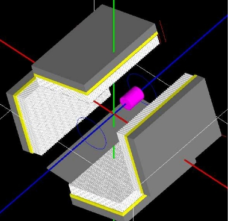
   
   Example of a hypothetical four-headed SPECThead system.  The detectors are not pixelated in this example

Modelling the collimator
^^^^^^^^^^^^^^^^^^^^^^^^

SPECT systems need collimator. A parameterized collimator setup was developed for both parallel hole collimators and fan beam collimators. It is based on the GEANT4 replica system in which a single volume represents multiple copies of a volume (the air holes) within its mother volume (the collimator itself). SPECT collimator geometries are built using this approach in less than a second. 

Example for parallel hole collimators::

   /gate/SPECThead/daughters/name colli 
    
   #specify that the parallel beam collimator setup must be used
   /gate/SPECThead/daughters/insert parallelbeam 
    
   #set the collimator material
   /gate/colli/setMaterialName Lead
    
   #set the collimator dimensions
   /gate/colli/geometry/setDimensionX 70 cm
   /gate/colli/geometry/setDimensionY 80 cm
    
   #set the thickness of the collimator
   /gate/colli/geometry/setHeight 3 cm
    
   #specify the hole radius
   /gate/colli/geometry/setInnerRadius 0.5 cm
    
   #set the septal thickness to the required distance between the holes
   /gate/colli/geometry/setSeptalThickness 0.2 cm 
   /gate/colli/placement/alignToX
   /gate/colli/placement/setRotationAxis 0 0 1
   /gate/colli/placement/setRotationAngle -90 deg

**! Fan Beam option is out of order - Should be debug ASAP !**

Example of code for modelling fanbeam collimators::

   /gate/SPECThead/daughters/name fanbeam
   /gate/SPECThead/daughters/insert collimator
    
   #set the material for the collimator
   /gate/fanbeam/setMaterial Lead #define the X and Y size of the collimator
   /gate/fanbeam/geometry/setDimensionY 53.5 cm
   /gate/fanbeam/geometry/setDimensionX 25.0 cm
    
   #specify the focal length
   /gate/fanbeam/geometry/setFocalDistanceY 0.0 cm
   /gate/fanbeam/geometry/setFocalDistanceX 35.0 cm
    
   #specify the thickness of the collimator
   /gate/fanbeam/geometry/setHeight 5.8 cm
    
   #set the septal thickness to the required distance between the holes
   /gate/fanbeam/geometry/setSeptalThickness 0.8 cm
    
   #specify the hole radius
   /gate/fanbeam/geometry/setInnerRadius 1.70 cm
   /gate/fanbeam/placement/setRotationAxis 0 0 1 
   /gate/fanbeam/placement/setRotationAngle -90 deg 
   /gate/fanbeam/vis/setColor blue
   /gate/fanbeam/vis/forceWireframe

Septal Penetration
^^^^^^^^^^^^^^^^^^

If one wants to record, for every photon detected, how many times they crossed the collimator septa, the command recordSeptalPenetration must be turned on (default value is false) and the septal volume name must be attached to a PhantomSD::

   /gate/output/analysis/recordSeptalPenetration true
   /gate/output/analysis/setSeptalVolumeName collimator

If the septal volume name does not exist, the simulation is aborted.

.. _opticalsystem-label:

OpticalSystem
~~~~~~~~~~~~~

Description
^^^^^^^^^^^

*OpticalSystem* is appropriate to model Optical Imaging within GATE. An example macro defining a typical Optical Imaging system can be found in:
 
 https://github.com/OpenGATE/GateContrib/blob/master/imaging/Optical/Optical_System.mac

An OpticalSystem is a box-shaped geometry element and consists of three hierarchic levels: 

* **base** which is always attached to the volume OpticalSystem. 
* **crystal** which is coupled to the main detector block.
* **pixel** which can be used for modeling a pixelated detector.

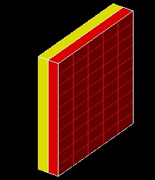
   
   Example of a hypothetical OpticalImaging pixelated system. A pixelated camera is simulated in red. The additional volume in yellow could represent some electronic board.

Use
^^^

Below is part of the Optical Imaging benchmark macro, which is distributed with the GATE softwar::
 
   # World
   # Define the world dimensions
   /gate/world/geometry/setXLength       100. cm
   /gate/world/geometry/setYLength       100. cm
   /gate/world/geometry/setZLength       100. cm
   /gate/world/setMaterial               Air
   
   # Create the Optical Imaging system, which will yield 
   # a binary output of the projection data 
   /gate/world/daughters/name                      OpticalSystem
   /gate/world/daughters/insert                    box
   
   # Define the dimensions, position and material 
   /gate/OpticalSystem/geometry/setXLength         10.5 cm
   /gate/OpticalSystem/geometry/setYLength         10.5 cm
   /gate/OpticalSystem/geometry/setZLength         2.0 cm
   /gate/OpticalSystem/placement/setTranslation    0 0 0 cm
   /gate/OpticalSystem/setMaterial                 Air
   
   # Define pixelated detector: 
   /gate/OpticalSystem/daughters/name              crystal
   /gate/OpticalSystem/daughters/insert            box
   /gate/crystal/geometry/setXLength               10.5 cm
   /gate/crystal/geometry/setYLength               10.5 cm
   /gate/crystal/geometry/setZLength               1.0 cm
   /gate/crystal/placement/setTranslation          0 0 -0.5 cm
   /gate/crystal/setMaterial                       Air
   /gate/crystal/vis/forceWireframe                1
   /gate/systems/OpticalSystem/crystal/attach      crystal
   
   /gate/crystal/daughters/name                    pixel
   /gate/crystal/daughters/insert                  box
   /gate/pixel/geometry/setXLength                 2.0  cm
   /gate/pixel/geometry/setYLength                 2.0  cm
   /gate/pixel/geometry/setZLength                 1.0 cm
   /gate/pixel/setMaterial                         Air
   /gate/pixel/placement/setTranslation            0 0 0 cm
   /gate/pixel/vis/setColor                        red
   /gate/pixel/repeaters/insert                    cubicArray
   /gate/pixel/cubicArray/setRepeatNumberX         5
   /gate/pixel/cubicArray/setRepeatNumberY         5
   /gate/pixel/cubicArray/setRepeatNumberZ         1
   /gate/pixel/cubicArray/setRepeatVector          2.1 2.1 0 cm
   /gate/pixel/vis/forceSolid           
   /gate/pixel/attachCrystalSD
   /gate/systems/OpticalSystem/pixel/attach        pixel
   
   # Define an additional volume behind the pixels
   /gate/OpticalSystem/daughters/name              Electronics
   /gate/OpticalSystem/daughters/insert            box
   /gate/Electronics/geometry/setXLength           10.5  cm
   /gate/Electronics/geometry/setYLength           10.5  cm
   /gate/Electronics/geometry/setZLength           1.0 cm
   /gate/Electronics/setMaterial                   Air                  
   /gate/Electronics/placement/setTranslation      0 0 0.5 cm
   /gate/Electronics/vis/setColor                  yellow
   /gate/Electronics/vis/forceSolid

.. _multi-system-detector-label:

How to define a multi-system detector
-------------------------------------

To simulate a multi-system device consisting of several detectors (PET,SPECT,CT,..) you need to add in your macro special commands as explained below. This will allow you to simultaneously register Hits inside every detector.

Defining the systems
~~~~~~~~~~~~~~~~~~~~

The standard definition of a GATE system is done according to the command::

   /gate/world/daughters/name  SystemName

Where SystemName must be one of available system names in GATE (see :numref:`system_tab`). Unfortunately, defining a system with this command prevent you to insert more than one system of the same type.
Another method has been inserted in GATE to define more than one system at a time. Using this more general method, users can simulate several systems simultaneously. A system is now defined by its own name and its type according to the next two command lines::

   /gate/world/daughters/name AnyName
   /gate/world/daughters/systemType SystemType

Where AnyName can be any name as for any Geant4 volume name and SystemType must be one the names of GATE systems mentioned in :numref:`system_tab`.

How to connect the geometry to the systems
~~~~~~~~~~~~~~~~~~~~~~~~~~~~~~~~~~~~~~~~~~

By using more than one system, we have to change the attachment commands to connect the geometrical elements of every system with its defined components, to do that we use the next command::

   /gate/systems/SystemName/Level/attach UserVolumeName

This command has the same form as for one system, but the essential difference is that SystemName here can be any name gave by the user to the system.

Example of multi-system
~~~~~~~~~~~~~~~~~~~~~~~

An example for the creation of three systems, one system of type “cylindricalPET” and two systems of type “scanner” is explained below. Note that it is not necessary to use the “ systemType” command for cylindricalPET system because there is only one system of this type::

   # W O R L D 
   /gate/world/geometry/setXLength 40. cm 
   /gate/world/geometry/setYLength 40. cm 
   /gate/world/geometry/setZLength 60. cm 
   
   # M O U S E 
   /gate/world/daughters/name mouse 
   /gate/world/daughters/insert cylinder 
   /gate/mouse/setMaterial Water 
   /gate/mouse/vis/setColor red 
   /gate/mouse/geometry/setRmax 18.5 mm 
   /gate/mouse/geometry/setRmin 0. mm 
   /gate/mouse/geometry/setHeight 68. mm 
   
   # SYSTEM 1: cylindricalPET 
   /gate/world/daughters/name cylindricalPET   # standard definition
   /gate/world/daughters/insert cylinder 
   /gate/cylindricalPET/setMaterial Water 
   /gate/cylindricalPET/geometry/setRmax 145 mm 
   /gate/cylindricalPET/geometry/setRmin 130 mm 
   /gate/cylindricalPET/geometry/setHeight 80 mm 
   /gate/cylindricalPET/vis/forceWireframe 
   
   #cylindricalPET => rsector 
   /gate/cylindricalPET/daughters/name rsector 
   /gate/cylindricalPET/daughters/insert box 
   /gate/rsector/placement/setTranslation 135 0 0 mm 
   /gate/rsector/geometry/setXLength 10. mm 
   /gate/rsector/geometry/setYLength 19. mm 
   /gate/rsector/geometry/setZLength 76.6 mm 
   /gate/rsector/setMaterial Water 
   /gate/rsector/vis/forceWireframe 
   
   #cylindricalPET => module 
   /gate/rsector/daughters/name module 
   /gate/rsector/daughters/insert box 
   /gate/module/geometry/setXLength 10. mm 
   /gate/module/geometry/setYLength 19. mm 
   /gate/module/geometry/setZLength 19. mm 
   /gate/module/setMaterial Water 
   /gate/module/vis/forceWireframe 
   /gate/module/vis/setColor gray 
   
   #cylindricalPET => crystal 
   /gate/module/daughters/name crystal 
   /gate/module/daughters/insert box 
   /gate/crystal/geometry/setXLength 10. mm 
   /gate/crystal/geometry/setYLength 2.2 mm 
   /gate/crystal/geometry/setZLength 2.2 mm 
   /gate/crystal/setMaterial Water 
   /gate/crystal/vis/forceWireframe 
   /gate/crystal/vis/setColor magenta 
   
   #cylindricalPET => LSO 
   /gate/crystal/daughters/name LSO 
   /gate/crystal/daughters/insert box 
   /gate/LSO/geometry/setXLength 10. mm 
   /gate/LSO/geometry/setYLength 2.2 mm 
   /gate/LSO/geometry/setZLength 2.2 mm 
   /gate/LSO/placement/setTranslation 0 0 0 mm 
   /gate/LSO/setMaterial LSO 
   /gate/LSO/vis/setColor yellow 
   
   # R E P E A T C R Y S T A L 
   /gate/crystal/repeaters/insert cubicArray 
   /gate/crystal/cubicArray/setRepeatNumberX 1 
   /gate/crystal/cubicArray/setRepeatNumberY 8 
   /gate/crystal/cubicArray/setRepeatNumberZ 8 
   /gate/crystal/cubicArray/setRepeatVector 10. 2.4 2.4 mm 
   
   # R E P E A T M O D U L E 
   /gate/module/repeaters/insert cubicArray 
   /gate/module/cubicArray/setRepeatNumberZ 4 
   /gate/module/cubicArray/setRepeatVector 0. 0. 19.2 mm 
   
   # R E P E A T R S E C T O R 
   /gate/rsector/repeaters/insert ring 
   /gate/rsector/ring/setRepeatNumber 42 
   
   
   # SYSTEM 2: Scanner_1 
   /gate/world/daughters/name Scanner_1       #  System name  definition for scanner 1
   /gate/world/daughters/systemType scanner   #  System type  definition for scanner 1
   /gate/world/daughters/insert box 
   /gate/Scanner_1/setMaterial Air 
   /gate/Scanner_1/geometry/setXLength 20  cm 
   /gate/Scanner_1/geometry/setYLength 20 cm 
   /gate/Scanner_1/geometry/setZLength 10 cm 
   /gate/Scanner_1/placement/setTranslation  0 0 -18 cm 
   /gate/Scanner_1/vis/forceWireframe 
   /gate/Scanner_1/vis/setVisible 1 
   
   # Scanner_1 => Cryostat_1 
   /gate/Scanner_1/daughters/name Cryostat_1 
   /gate/Scanner_1/daughters/insert box 
   /gate/Cryostat_1/placement/setTranslation  0 0 0 cm 
   /gate/Cryostat_1/geometry/setXLength 19  cm 
   /gate/Cryostat_1/geometry/setYLength 19  cm 
   /gate/Cryostat_1/geometry/setZLength 9   cm 
   /gate/Cryostat_1/setMaterial Stainless 
   /gate/Cryostat_1/vis/setColor yellow 
   /gate/Cryostat_1/vis/forceWireframe 
   
   # Scanner_1 => ActiveZone_1 
   /gate/Cryostat_1/daughters/name ActiveZone_1 
   /gate/Cryostat_1/daughters/insert box 
   /gate/ActiveZone_1/placement/setTranslation 0 0 0 cm 
   /gate/ActiveZone_1/geometry/setXLength 18   cm 
   /gate/ActiveZone_1/geometry/setYLength 18   cm 
   /gate/ActiveZone_1/geometry/setZLength 8    cm 
   /gate/ActiveZone_1/setMaterial LXenon 
   /gate/ActiveZone_1/vis/setColor white 
   
   
   # SYSTEM 3: Scanner_2 
   /gate/world/daughters/name Scanner_2      #  System name  definition for scanner 2
   /gate/world/daughters/systemType scanner  #  System Type  definition for scanner 2
   
   /gate/world/daughters/insert box 
   /gate/Scanner_2/setMaterial Air 
   /gate/Scanner_2/geometry/setXLength 20  cm 
   /gate/Scanner_2/geometry/setYLength 20 cm 
   /gate/Scanner_2/geometry/setZLength 10 cm 
   /gate/Scanner_2/placement/setTranslation  0 0 18 cm 
   /gate/Scanner_2/vis/forceWireframe 
   /gate/Scanner_2/vis/setVisible 1 
   
   # Scanner_2 => Cryostat_2 
   /gate/Scanner_2/daughters/name Cryostat_2 
   /gate/Scanner_2/daughters/insert box 
   /gate/Cryostat_2/placement/setTranslation  0 0 0 cm 
   /gate/Cryostat_2/geometry/setXLength 19  cm 
   /gate/Cryostat_2/geometry/setYLength 19  cm 
   /gate/Cryostat_2/geometry/setZLength 9   cm 
   /gate/Cryostat_2/setMaterial Stainless 
   /gate/Cryostat_2/vis/setColor yellow 
   /gate/Cryostat_2/vis/forceWireframe 
   
   # Scanner_2 => ActiveZone_2 
   /gate/Cryostat_2/daughters/name ActiveZone_2 
   /gate/Cryostat_2/daughters/insert box 
   /gate/ActiveZone_2/placement/setTranslation 0 0 0 cm 
   /gate/ActiveZone_2/geometry/setXLength 18   cm 
   /gate/ActiveZone_2/geometry/setYLength 18   cm 
   /gate/ActiveZone_2/geometry/setZLength 8    cm 
   /gate/ActiveZone_2/setMaterial LXenon 
   /gate/ActiveZone_2/vis/setColor white 
   
   
   # A T T A C H S Y S T E M S 
   /gate/systems/cylindricalPET/rsector/attach rsector 
   /gate/systems/cylindricalPET/module/attach module 
   /gate/systems/cylindricalPET/crystal/attach crystal 
   /gate/systems/cylindricalPET/layer0/attach LSO 
   
   # New attachment commands
   /gate/systems/Scanner_1/level1/attach Cryostat_1    
   /gate/systems/Scanner_1/level2/attach ActiveZone_1 
   
   /gate/systems/Scanner_2/level1/attach Cryostat_2    
   /gate/systems/Scanner_2/level2/attach ActiveZone_2 
   
   
   # A T T A C H L A Y E R SD 
   /gate/LSO/attachCrystalSD 
   /gate/mouse/attachPhantomSD 
   
   /gate/ActiveZone_1/attachCrystalSD 
   
   /gate/ActiveZone_2/attachCrystalSD

Notes
~~~~~

1)	The command “systemType” is optional in case of using only one system, but the system name must be one GATE systems (first column in :numref:`system_tab`) as for standard definition
2)	Same remark, in the case where all systems have different types.
3)	In general, one has to use the “systemType” command only for simulating more than one system of the same type.
