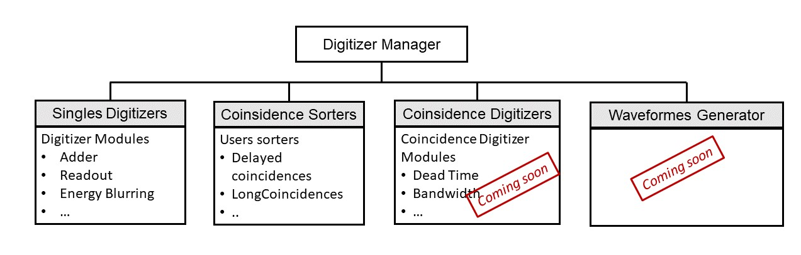
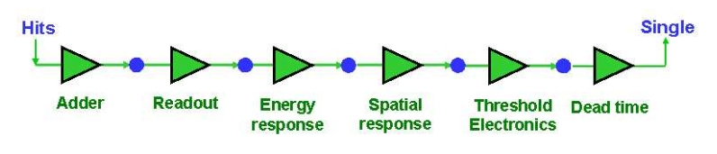
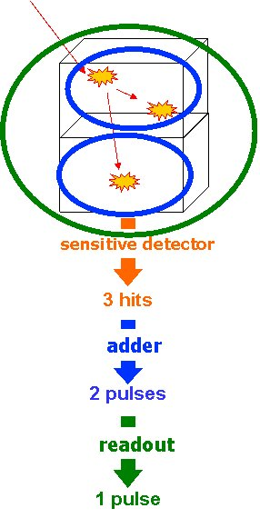
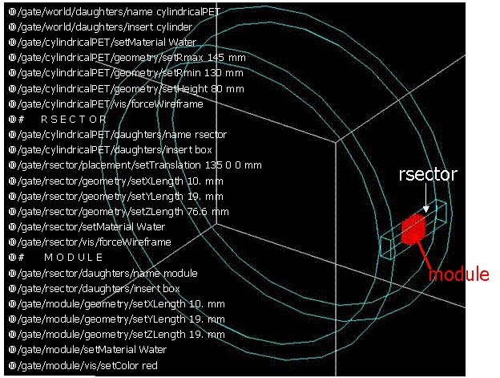
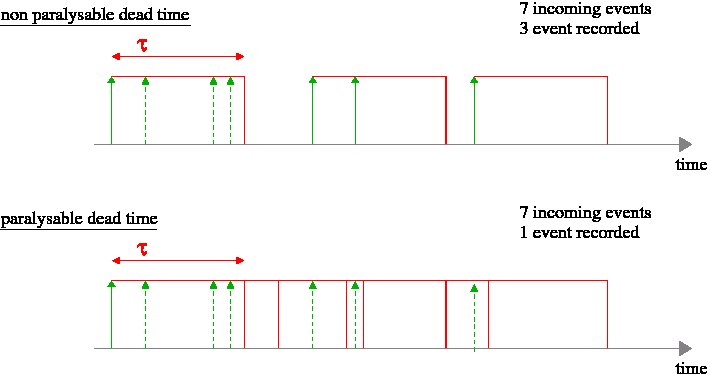
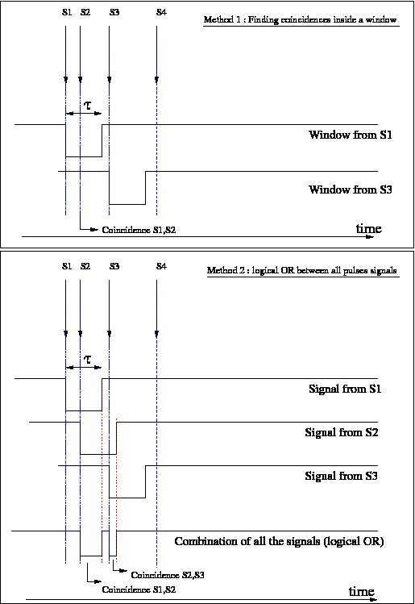
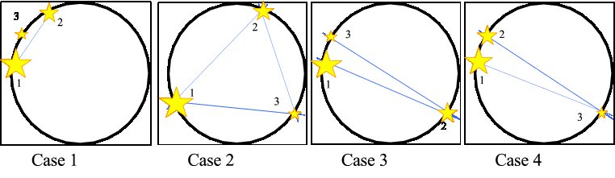
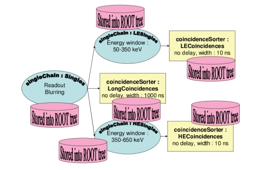
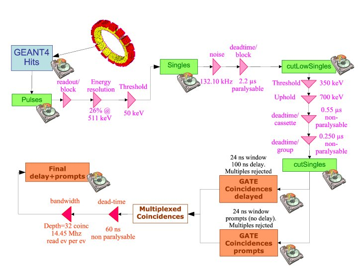

.. _digitizer_and_readout_parameters-label:

Digitizer and readout parameters
================================

.. contents:: Table of Contents
   :depth: 15
   :local:

General Purpose
---------------

The purpose of the digitizer module is to simulate the behaviour of the scanner detectors and signal processing chain.

New version of Digitizer was proposed since Gate 9.3.

General architerure and main commends were changed.

**Please, do not hesitate to use a helping script to convert your old digitizer macros to new ones:**:ref:`_digi_mac-convertor-label`.  

From particle detection to coincidences in GATE
~~~~~~~~~~~~~~~~~~~~~~~~~~~~~~~~~~~~~~~~~~~~~~~

GATE uses Geant4 to generate particles and transport them through the materials. This mimics *physical* interactions between particles and matter. The information generated during this process is used by GATE to simulate the detector pulses (*digits*), which correspond to the *observed data*. The digitizer represents the series of steps and filters that make up this process.

The typical data-flow for an event is as follows:

* A particle is generated, with its parameters, such as initial type, time, momentum, and energy. 
* An elementary trajectory step is applied. A step corresponds to the trajectory of a particle between discrete interactions (i.e. photoelectric, Compton, pair production, etc). During a step, the changes to a particle's energy and momentum are calculated. The length of a step depends upon the nature of the interaction, the type of particle and material, etc. The calculation of the step length is complex and is mentioned here only briefly. For more details, please refer to the Geant4 documentation.
* If a step occurs within a volume corresponding to a *sensitive* detector, the interaction information between the particle and the material is stored. For example, this information may include the deposited energy, the momentum before and after the interaction, the name of the volume where the interaction occurred, etc. This set of information is referred to as a *Hit*.
* Steps 2 and 3 are repeated until the energy of the particle becomes lower than a predefined value, or the particle position goes outside the predefined limits. The entire series of steps form a simulated trajectory of a particle, that is called a *Track* in Geant4.
* The amount of energy deposited in a crystal is filtered by the digitizer module. The output from the digitizer corresponds to the signal after it has been processed by the Front End Electronics (FEE). Generally, the FEE is made of several processing units, working in a serial and/or in parallel. This process of transforming the energy of a *Hit* into the final digital value is called *Digitization* and is performed by the GATE digitizer. Each processing unit in the FEE is represented in GATE by a corresponding digitizer module. The final value obtained after filtering by a set of these modules is called a *Single*. *Singles* can be saved as output. Each transient value, between two modules, is called a *Digi*.

This process is repeated for each event in the simulation in order to produce one or more sets of Singles. These *Singles* can be stored into an output file (as a ROOT tree, for example).

In case of PET systems, a second processing stage can be inserted to sort the *Singles* list for coincidences. To do this, the algorithm searches in this list for a set of *Singles* that are detected within a given time interval (the so called 'coincident events').

Finally, the coincidence data may be filtered-out to mimic any possible data loss which could occur in the coincidence logical circuit or during the data transportation. As for the *Singles*, the processing is performed by specifying a list of generic modules to apply to the coincidence data flow.

Definition of a hit in Geant4
^^^^^^^^^^^^^^^^^^^^^^^^^^^^^

A hit is a snapshot of the physical interaction of a track within a sensitive region of a detector. The information given by a hit is 

*  Position and time of the step
*  Momentum and energy of the track
*  Energy deposition of the step
*  Interaction type of the hit 
*  Volume name containing the hit

As a result, the history of a particle is saved as a series of *hits* generated along the particles trajectory. In addition to the physical hits, Geant4 saves a special *hit*. This *hit* takes place when a particle moves from one volume to another (this type of *hit* deposits zero energy). The *hit* data represents the basic information that a user has with which to construct the physically observable behaviour of a scanner. To see the information stored in a *hit*, see the file *GateHit.hh*.

A *Hits Collection* is automatically stored by Geant4 for each event. Hits must be stored in a collection of hits, *GateHitsCollection* (instantiated from G4THitsCollection template class). The name of hits collection is declared in SensitiveDetector constructor.
A SD can declare more than one hits collection per event. 

Definition of a digi in Geant4
^^^^^^^^^^^^^^^^^^^^^^^^^^^^^

*Digis* in Geant4 are intended to be used to simulate the process of reading-out of the signal: for example “true” energy could be transformed into
collected charge and electronic noise can be applied. In the case of Gate, it mainly applies distortion due to instrumental effects (detection, readout of electronics, signal processing chain, the response of the photodetection components etc.). 

*Digis* are described by class *GateDigi* inherited from G4VDigi. Digis are stored in a container, an instance of *GateDigiCollection* (from G4TDigiCollection) class which is very similar to hits mechanism. 

Digitizer Manager
---------------

The general operation of conversion of *Hits* into *Digis*, that are saved as *Singles*, is managed by Digitizer Manager, *GateDigitizerMgr*, inherited from G4DigiManager.
It manages several functionalities needed for imaging applications (see Figure below):

*  Construction of *Singles* made by **Singles Digitizers** that in their turn manage sequences of *Digitizer Modules* set by the user.  
*  Construction of *Coincidences* made by **Coincidence Sorters**
*  (to be added) Combination of *Coincidences* from different Coincidence Sorters made by **Coincidence Digitizers**
*  (to be added) Generation of waveforms corresponding to electronic pulse 

It also manages *GateDigiCollections* created in a simulation, output flags for writing down for Singles and Coincidences, different collections of Singles Digitizers, Coincidence Sorters, Coincidence Digitizers (to be added) and Waveform generators (to be added). 

It also runs all Singles Digitizers, Coincidence Sorters, Coincidence Digitizers and Waveform generators.

Commands for Gate New Digitizer (since Gate 9.3)
~~~~~~~~~~~~~~~~~~~~~~~~~~~~~~~~~~~~~~~~~~~~~~~~

One of the changes for Gate New Digitizer was making more explicit the macro command lines.

Instead of::

/gate/digitizer/Singles/

where *Singles* is the name of Singles collection to which user would like to attach a Digitizer Module (name "Singles" is default value)

Now the command like looks like::

/gate/digitizerMgr/<sensitive_detector_name>/SinglesDigitizer/<singles_digitizer_name>/setInputCollection Singles

where *<sensitive_detector_name>* is a name of a sensitive detector from which user would like to analyse Hits with a digitizer (it is the same name that is set in command /gate/<sensitive_detector_name>/attachCrystalSD), *SinglesDigitizer* is a type of functionalities available in the Digitizer Manager (ex, "SinglesDigitizer", "CoincidenceSorter", "CoincidencesDigitizer", "WaveformGenerator"), *<singles_digitizer_name>* is a name of chosen, for example, SinglesDigitizer, it is the same name as the output singles collection (name "Singles" is default value). 

Separate digitizers for multiple sensitive detectors (since Gate 9.3)
~~~~~~~~~~~~~~~~~~~~~~~~~~~~~~~~~~~~~~~~~~~~~~~~

Since Gate 9.3 it is possible to apply different Singles Digitizers to different sensitive detectors' hits. 
In case if your have only one sensitive detector attached with a command:: 

/gate/<sensitive_detector_name>/attachCrystalSD

in the digitizer the commands will look like:: 

/gate/digitizerMgr/<sensitive_detector_name>/SinglesDigitizer/<singles_digitizer_name>/....

and in output file you will have the output as before (ex., Root output):: 

   Hits
   Singles

In case if your have only several sensitive detector attached with a command:: 

/gate/<sensitive_detector_name1>/attachCrystalSD
/gate/<sensitive_detector_name2>/attachCrystalSD

in the digitizer the commands will look like:: 

/gate/digitizerMgr/<sensitive_detector_name1>/SinglesDigitizer/<singles_digitizer_name>/....
/gate/digitizerMgr/<sensitive_detector_name2>/SinglesDigitizer/<singles_digitizer_name>/....

and in output file you will have the output as before (ex., Root output)::

   Hits_<sensitive_detector_name1>
   Hits_<sensitive_detector_name2>
   Singles_<sensitive_detector_name1>
   Singles_<sensitive_detector_name2>

In case if you want to merge at some point the Singles in Detector1 and in Detector2 you can use merger :ref:`_merger-label`.

It also means that in case of multiple sensitive detectors one should pay attention which one should be used as input for CoincidenceSorter (if used)::

 /gate/digitizerMgr/CoincidenceSorter/Coincidences/setInputCollection Singles_<sensitive_detector_name1>
 or
 /gate/digitizerMgr/CoincidenceSorter/Coincidences/setInputCollection Singles_<sensitive_detector_name2>

Disabling the digitizer
~~~~~~~~~~~~~~~~~~~~~~~

If you want to disable the digitizer process and all output (that are already disabled by default), you can use the following commands::

  /gate/digitizerMgr/disable

Note for developers (if you want to develop something in digitizer) 
------------------------------------

If you want to develop something in digitizer, here is some important information that would help:

**Singles Digitizers** 

Singles Digitizers(*GateSinglesDigitizer* class) manage Digitizer Modules. However, it is important to note that DigitizerMgr starts all digitization with *GateDigitizerInitializationModule* that converts *GateHit* into *GateDigi* and *GateHitsCollecion* into *GateDigiCollection*. It also removes hits with zero energy. 

A *GateSinglesDigitizer* uses several names:

* m_digitizerName = users' defined name for a SinglesDigitizer (the default one is "Sinlges", or it is set by /gate/digitizerMgr/name <singles_digitizer_name>) 
* m_outputName =  <singles_digitizer_name>_<sensitive_detector_name>
* m_inputName = <input_singles_digitizer_name>_<sensitive_detector_name>, where <input_singles_digitizer_name>=<singles_digitizer_name> by default or can be changed by user with /gate/digitizerMgr/<sensitive_detector_name>/SinglesDigitizer/<singles_digitizer_name>/setInputCollection <input_singles_digitizer_name>.

**Digitizer Modules**

If you would like to create a new Digitizer Module, you can use example classes: *GateDummyDigitizerModule* and *GateDummyDigitizerModuleMessenger*. Some development advices also could be found there. 
Your Digitizer Module should be inherited from *GateVDigitizerModule*.
In the method *Digitize()* put the action of your Digitizer Module.

It is also important to add your Digitizer Module in *GateSinglesDigitizerMessenger*, method *DoInsertion(const G4String&)*.
 

**Coincidence Sorter**

If you would like to create a new Coincidence Sorter, as a Digitizer Module, it should be inherited from *GateVDigitizerModule*. In the method *Digitize()* put the action of your Coincidence Sorter.
It will operate with *GateCoincidenceDigi* and *GateCoincidenceDigiCollection*.

Tools
---------------

.. _digi_mac-convertor-label:

Digitizer Macro converter (9.2 and before to 9.3 and after)
~~~~~~~~~~~~~
Since version 9.3 Gate digitizer had a big upgrade, thus, some of macro commands had changed. 
However, the collaboration provide a tool to convert your old macros to new macros which work quite direct in case of a simulation with pone sensitive detector. In case of multiple sensitive detectors the converter also can be used but special care should be taken in order to obtain correct result (Digitizer Module :ref:`_merger-label` could also be useful for you). 

To use the macro convert, the following commands to be done:: 

   pip install gatetools
   git clone --recursive https://github.com/OpenGATE/GateTools.git
   cd GateTools
   pip install -e .
 
Example of usage::

   gt_digi_mac_converter -i digitizer_old.mac -o digitizer_new.mac -sd <SDname> -multi SinglesDigitizer

where *-i* defines input old digitizer macro, *-o* defines output new digitizer macro, *-sd* defines the sensitive detector name (the same as in     /gate/<SDname>/attachCrystalSD), *-multi  <mode>* is the option if you have several SinglesDigitizers or CoincidenceSorters, where <mode> = *SinglesDigitizer* or *CoincidenceSorter*.

.. _Distributions-label:

Distributions
~~~~~~~~~~~~~

Since many of the modules presented below have to deal with functions or probability density, a generic tool is provided to describe such mathematical objects in GATE. Basically, a distribution in GATE is defined by its name, its type (Gaussian, Exponential, etc...) and the parameters specifics to each distribution type (such as the mean and the standard deviation of a Gaussian function). Depending on the context, these objects are used directly as functions, or as probability densities into which a variable is randomly chosen. In the following, the generic term of distribution will be used to describe both of these objects, since their declaration is unified under this term into GATE.

Five types of distribution are available in GATE, namely: 

*  Flat distributions, defined by the range into which the function is not null, and the value taken within this range. 
*  Gaussian distributions, defined by a mean value and a standard deviation. 
*  Exponential distributions, defined by its power. 
*  Manual distributions, defined by a discrete set of points specified in the GATE macro file. The data are linearly interpolated to define the function in a continuous range. 
*  File distribution, acting as the manual distribution, but where the points are defined in a separate ASCII file, whose name is given as a parameter. This method is appropriate for large numbers of points and allows to describe any distribution in a totally generic way.

A distribution is declared by specifying its name then by creating a new instance, with its type name::

   /gate/distributions/name my_distrib 
   /gate/distributions/insert Gaussian 

The possible type name available corresponds to the five distributions described above, that is *Flat*, *Gaussian*, *Exponential*, *Manual* or *File*. Once the distribution is created (for example a Gaussian), the related parameters can be set::

   /gate/distributions/my_distrib/setMean 350 keV 
   /gate/distributions/my_distrib/setSigma 30 keV 

.. table:: Summary of the parameters for each distribution type
   :widths: auto
   :name: distribution_tab

   +----------------+--------------------------------------------------------------------------------+
   | Parameter name | Description                                                                    |
   +================+================================================================================+
   | FLAT DISTRIBUTION                                                                               |
   +----------------+--------------------------------------------------------------------------------+
   | setMin         | set the low edge of the range where the function is not null (default is 0)    | 
   +----------------+--------------------------------------------------------------------------------+
   | setMax         | set the high edge of the range where the function is not null (default is 1)   | 
   +----------------+--------------------------------------------------------------------------------+
   | setAmplitude   | set the value taken by the function within the non null range (default is 1)   | 
   +----------------+--------------------------------------------------------------------------------+
   | GAUSSIAN DISTRIBUTION                                                                           |
   +----------------+--------------------------------------------------------------------------------+
   | setMean        | set the mean value of the distribution (default is 0)                          | 
   +----------------+--------------------------------------------------------------------------------+
   | setSigma       | set the standard deviation of the distribution (default is 1)                  | 
   +----------------+--------------------------------------------------------------------------------+
   | setAmplitude   | set the amplitude of the distribution (default is 1)                           | 
   +----------------+--------------------------------------------------------------------------------+
   | EXPONENTIAL DISTRIBUTION                                                                        |
   +----------------+--------------------------------------------------------------------------------+
   | setLambda      | set the power of the distribution (default is 1)                               | 
   +----------------+--------------------------------------------------------------------------------+
   | setAmplitude   | set the amplitude of the distribution (default is 1)                           | 
   +----------------+--------------------------------------------------------------------------------+
   | MANUAL DISTRIBUTION                                                                             |
   +----------------+--------------------------------------------------------------------------------+
   | setUnitX       | set the unit for the x axis                                                    | 
   +----------------+--------------------------------------------------------------------------------+
   | setUnitY       | set the unit for the y axis                                                    | 
   +----------------+--------------------------------------------------------------------------------+
   | insertPoint    | insert a new point, giving a pair of (x,y) values                              | 
   +----------------+--------------------------------------------------------------------------------+
   | addPoint       | add a new point, giving its y value, and auto incrementing the x value         | 
   +----------------+--------------------------------------------------------------------------------+
   | autoXstart     | in case of auto incremental x value, set the first x value to use              | 
   +----------------+--------------------------------------------------------------------------------+
   | FILE DISTRIBUTION                                                                               |
   +----------------+--------------------------------------------------------------------------------+
   | setUnitX       | set the unit for the x axis                                                    | 
   +----------------+--------------------------------------------------------------------------------+
   | setUnitY       | set the unit for the y axis                                                    | 
   +----------------+--------------------------------------------------------------------------------+
   | autoX          | specify if the x values are read from file or if they are auto-incremented     | 
   +----------------+--------------------------------------------------------------------------------+
   | autoXstart     | in case of auto incremental x value, set the first x value to use              | 
   +----------------+--------------------------------------------------------------------------------+
   | setFileName    | the name of the ASCII file where the data have to be read                      | 
   +----------------+--------------------------------------------------------------------------------+
   | setColumnX     | which column of the ASCII file contains the x axis data                        | 
   +----------------+--------------------------------------------------------------------------------+
   | setColumnY     | which column of the ASCII file contains the y axis data                        | 
   +----------------+--------------------------------------------------------------------------------+
   | read           | do read the file (should be called after specifying all the other parameters)  | 
   +----------------+--------------------------------------------------------------------------------+

Singles Digitizers
-------------------
As mentioned above, the information contained in the *hit* does not correspond to what is provided by a real detector. To simulate the digital values (*digis*) that result from the output of the Front End Electronics, the sampling methods of the signal must be specified. To do this, a number of digitizer modules are available and are described below. 

The role of *singles digitizer* is to build, from the *hit* information, the physical observables, which include energy, position, and time of detection for each particle. In addition, the digitizer must implement the required logic to simulate coincidences during PET simulations. Typical usage of digitizer module includes the following actions: 

* simulate detector response 
* simulate readout scheme 
* simulate trigger logic

The Singles Digitizer is organized as a chain of digitizer modules that begins with the hit and ends with the single which represents the physical observable seen from the detector.
   
As the user creates a GATE simulation with enabled option to save *Singles* and at least one digitizer module, a default *Single Digitizer* named *Singles_<SDname>* is created automatically. 

If one more, new Singles Digitizer is needed, the following command template should be used::

   /gate/digitizerMgr/name <singles_digitizer_name>
   /gate/digitizerMgr/chooseSD <sensitive_detector_name>
   /gate/digitizerMgr/insert SinglesDigitizer 
   
It is also possible to define input Singles Collection if needed::
   /gate/digitizerMgr/<sensitive_detector_name>/SinglesDigitizer/<singles_digitizer_name>/setInputCollection Singles

The digitization consists of a series of signal processors, *digitizer modules* in GATE. The output at each step along the series is defined as a *digi* and can be saved at each step (see Output section !!!). These *digis* or*Singles* realistically simulate the physical observables of a detector response to a particle interacting with it. An example is shown in :numref:`Digitizer`.

   
   It is important to notice that the order of the digitizer module declaration should make sense. The data flow follows the same order as the module declaration in the macro. In a typical scanner, the following sequence works well, although it is not mandatory (the module names will be explained in the rest of the section):

* insert adder before readout 
* insert readout before energy framing
* insert resolution before energy framing

.. _digitizer_modules-label:

Digitizer modules
~~~~~~~~~~~~~~~~~

The *Digitizer module* (electronic read-out simulator) can be used to transform *Hits* to *Digis*.  

The output from a digitizer module corresponds to the signal after it has been processed by the Front End Electronics (FEE).

In order to reproduce in a simulation all distortion effects, generaly, one should use a sequence of Digitizer Modules. Each of them represents a corresponding analytical model. 

Adder
^^^^^

One particle often creates multiple interactions, and consequently multiple *hits*, within a crystal. The first step of the digitizer is to sum all the *hits* that occur within the same crystal (i.e. the same volume). This is due to the fact that the electronics always measure an integrated signal, and do not have the time or energy resolution necessary to distinguish between the individual interactions of the particle within a crystal. This digitizer action is completed by a module called the adder. The adder should be the first module of a digitizer chain. It acts on the lowest level in the system hierarchy, as explained in :ref:`defining_a_system-label`:

* A system must be used to describe the geometry (also the mother volume name must corresponds to a system name)
* The lowest level of this system must be attached to the detector volume and must be declared as a *sensitive detector*

If one particle that enters a detector makes multiple *hits* within two different crystal volumes before being stopped, the output of the adder module will consist of two *Singles*. Each *Single* is computed as follows : the energy is taken to be the total of energies in each volume, the position is obtained with an energy-weighted centroid of the different *hit* positions. The time is equal to the time at which the first *hit* occured.

The command to use the adder module is::

   /gate/digitizerMgr/<detector_name>/SinglesDigitizer/<singles_digitizer_name>/insert    adder

Default energy policy is EnergyCentroid. The following commands can be used to select users energy policy::

   /gate/digitizerMgr/<detector_name>/SinglesDigitizer/<singles_digitizer_name>/adder/positionPolicy energyWeightedCentroid
   /gate/digitizerMgr/<detector_name>/SinglesDigitizer/<singles_digitizer_name>/adder/positionPolicy takeEnergyWinner

**Example**::
   
   /gate/digitizerMgr/crystal/SinglesDigitizer/Singles/insert    adder 
   /gate/digitizerMgr/crystal/SinglesDigitizer/Singles/adder/positionPolicy energyWeightedCentroid

Adder Compton
^^^^^^^^^^^^^^^^^^^^^^^^^^^^^

The adderCompton module has a different behavior than the classic adder, which performs an energy-weighted centroid addition of all electronic and photonic hits.
Instead, for each electronic energy deposition, the energy is added to the previous photonic hit in the same volume ID (or discarded if none), but the localization remains that of the photonic interaction. That way, the Compton kinematics becomes exact for photonic interations, enabling further studies. The user must use the classic adder afterwards, to handle multiple photonic interactions in the same crystal. The commands to use the adder module are::

   /gate/digitizerMgr/<detector_name>/SinglesDigitizer/<singles_digitizer_name>/insert adderCompton
   /gate/digitizerMgr/<detector_name>/SinglesDigitizer/<singles_digitizer_name>/insert adder
   
  
**Example**::
   
   /gate/digitizerMgr/crystal/SinglesDigitizer/Singles/insert    adderCompton 
   /gate/digitizerMgr/crystal/SinglesDigitizer/Singles/insert    adder 

Readout
^^^^^^^

With the exception of a detector system where each crystal is read by an individual photo-detector, the readout segmentation is often different from the basic geometrical structures of the detector. The readout geometry is an artificial geometry that is usually associated with a group of sensitive detectors. There are two ways of modelling this readout process : either a winner-takes-all approach that will somewhat model APD-like readout, or an energy-centroid approach that will be closer to the block-PMT readout. Using the winner-takes-all policy, the grouping has to be determined by the user through a variable named *depth* corresponding to the component in the volume hierarchy at which pulses are summed together. There is also the *setReadoutVolume* option to choose the level of readout by the name of your system element. Using this variable, the *digis* are summed if their volume ID's are identical to this level of depth. Using the energy-centroid policy, the depth of the grouping is forced to occur at the 'crystal' level whatever the system used, so the depth variable is ignored. This means that the pulses in the same level just above the crystal level are summed together.

The readout module regroups pulses per block (group of *sensitive detectors*). For both policy, the resulting pulse in the block has the total energy of all pulses summed together. For the winner-takes-all policy, the position of the pulse is the one with the maximum energy. For the energy-centroid policy, the position is determined by weighting the crystal indices of each pulse by the deposited energy in order to get the energy centroid position. In this case, only the crystal index is determined, and the actual cartesian coordinates of the resulting pulse are reset to the center of this crystal. If a sub-level of the crystal is used (different layers), then the final sub-level is determined by the one having the maximum energy deposited (so a winner-takes-all approach for these sublevels of the crystal is used)::

   /gate/digitizerMgr/<detector_name>/SinglesDigitizer/<singles_digitizer_name>/insert readout
   /gate/digitizerMgr/<detector_name>/SinglesDigitizer/<singles_digitizer_name>/readout/setPolicy myPolicy
   /gate/digitizerMgr/<detector_name>/SinglesDigitizer/<singles_digitizer_name>/readout/setDepth X
   or equivalent to setDepth command
   /gate/digitizerMgr/<detector_name>/SinglesDigitizer/<singles_digitizer_name>/setReadoutVolume <YourVolumeName>
   
The parameter *myPolicy* can be *TakeEnergyWinner* for the winner-takes-all policy or *TakeEnergyCentroid* for the energy centroid policy.
If the energy centroid policy is used, the depth is forced to be at the level just above the crystal level, whatever the system used. To set/force your own depth for centroid policy, one can use::

   /gate/digitizerMgr/<detector_name>/SinglesDigitizer/<singles_digitizer_name>/readout/forceReadoutVolumeForEnergyCentroid true 
 
If the winner-takes-all policy is used, then the user must choose the *depth* or *Volume* at which the readout process takes place. If the *setPolicy* command is not set, then the winner-takes-all policy is chosen by default in order to be back-compatible with previous Gate releases.

:numref:`Hittosingle` illustrates the actions of both the *adder* and *readout* modules. The *adder* module transforms the *hits* into a *pulse* in each individual volume and then the *readout* module sums a group of these *pulses* into a single *pulse* at the level of depth as defined by the user for the winner-takes-all policy.

   Actions of the *it adder* and *it readout* modules

The importance of the *setDepth* command line when using the winner-takes-all policy is illustrated through the following example from a PET system (see :ref:`defining_a_system-label`). In a *cylindricalPET* system, where the first volume level is *rsector*, and the second volume level is *module*, as  shown in :numref:`Depth-p4`, the *readout* *depth* depends upon how the electronic readout functions.

If one PMT reads the four modules in the axial direction, the *depth* should be set with the command::

   /gate/digitizerMgr/crystal/SinglesDigitizer/Singles/readout/setDepth 1 

The energy of this *single* event is the sum of the energy of the pulses inside the white rectangle (*rsector*) of :numref:`Depth-p4`. However, if individual PMTs read each module (group of crystals), the *depth* should be set with the command::

   /gate/digitizerMgr/crystal/SinglesDigitizer/Singles/readout/setDepth 2 

In this case, the energy of the *single* event is the sum of the energies of the pulses inside the red box (*module*) of :numref:`Depth-p4`.

   Setting the *readout depth* in a CylindricalPET system

The next task is to transform this output *pulse* from the readout module into a *single* which is the physical observable of the experiment. This transformation is the result of the detector response and should mimic the behaviors of the photo-detector, electronics, and acquisition system.

Energy resolution 
^^^^^^^^^^^^^^^^^
*(Previously blurring, crystal blurring, local energy blurring, Crystal Blurring(partially))*

The *energy resolution* digitizer module simulates Gaussian blurring of the energy spectrum of a pulse after the *readout* module. This is accomplished by introducing a resolution, :math:`R_0` (FWHM), at a given energy, :math:`E_0`. To enable module::
 
   /gate/digitizerMgr/<detector_name>/SinglesDigitizer/<singles_digitizer_name>/insert   energyResolution
   /gate/digitizerMgr/<detector_name>/SinglesDigitizer/<singles_digitizer_name>/energyResolution/fwhm 0.15
   /gate/digitizerMgr/<detector_name>/SinglesDigitizer/<singles_digitizer_name>/energyResolution/energyOfReference 511. keV
   
In the case of a scanner where all the detectors are made of the same type of crystal, it is often useful to assign a different energy resolution for each crystal in the detector block, between a minimum and a maximum value. To model the efficiency of the system, a coefficient (between 0 and 1) can also be set. As an example, a random blurring of all the crystals between 15% and 35% at a reference energy of 511 keV, and with a quantum efficiency of 90% can be modelled using the following commands::

   /gate/digitizerMgr/<detector_name>/SinglesDigitizer/<singles_digitizer_name>/insert   energyResolution
   /gate/digitizerMgr/<detector_name>/SinglesDigitizer/<singles_digitizer_name>/energyResolution/fwhmMin 0.15
   /gate/digitizerMgr/<detector_name>/SinglesDigitizer/<singles_digitizer_name>/energyResolution/fwhmMax 0.35
   /gate/digitizerMgr/<detector_name>/SinglesDigitizer/<singles_digitizer_name>/energyResolution/energyOfReference 511. keV
    
According to the camera, the energy resolution may follow different laws, such as an inverse square law or a linear law. 

The inverse square law (:math:`R=R_0\frac{\sqrt{E_0}}{\sqrt{E}}`), is used by default.

For linear law, one must specify the linear law and fix the attributes like the energy of reference, the resolution and the slope::

   /gate/digitizerMgr/<detector_name>/SinglesDigitizer/<singles_digitizer_name>/energyResolution/slope -0.055 1/MeV

**Example**::
 
   /gate/digitizerMgr/crystal/SinglesDigitizer/Singles/insert   energyResolution
   /gate/digitizerMgr/crystal/SinglesDigitizer/Singles/energyResolution/fwhm 0.15
   /gate/digitizerMgr/crystal/SinglesDigitizer/Singles/energyResolution/energyOfReference 511. keV
   /gate/digitizerMgr/crystal/SinglesDigitizer/Singles/energyResolution/slope -0.055 1/MeV
 

Time resolution
^^^^^^^^^^^^^^^
The *time resolution* module introduces a Gaussian blurring in the detection time. It works in the same manner as the *energy resolution* module, but with time instead of energy. To set a Gaussian temporal resolution (FWHM) of 1.4 ns, use the following commands::

   /gate/digitizerMgr/<detector_name>/SinglesDigitizer/<singles_digitizer_name>/insert timeResolution 
   /gate/digitizerMgr/<detector_name>/SinglesDigitizer/<singles_digitizer_name>/timeResolution/fwhm 1.4 ns
   
It is possible to set Coincidecne Time Resolution (CTR) directly if you work with a PET system. To calculate the equivalent of *fwhm* the used formula is:  :math:`CTR=\sqrt{2*STR^2+S^2}`, where STR = single time resolution or *fwhm*, S = time spread due to geometry dimensions of the detector/DOI (in this approximation), i. e. :math:`S=\frac{DOIdimention}{c_{light}}`. This is why it is important to set correct value for the geometry dimensions of the detector:: 
       
  /gate/digitizerMgr/<detector_name>/SinglesDigitizer/<singles_digitizer_name>/timeResolution/CTR 300 ps
  /gate/digitizerMgr/<detector_name>/SinglesDigitizer/<singles_digitizer_name>/timeResolution/DOIdimention4CTR 25 mm

**Important note**: This is an approximation for inorganic scintillators of typical length. However, one needs to be careful with other scintillators or short crystals, because in this approximation of the DOI contribution to CTR. It is assumed that the exponential attenuation is sufficiently truncated, whereas in fact it is not normally distributed          (10.1186/s40658-020-00309-8). 

**Example**::
 
   /gate/digitizerMgr/crystal/SinglesDigitizer/Singles/insert   timeResolution
   /gate/digitizerMgr/crystal/SinglesDigitizer/Singles/timeResolution/fwhm 1.4 ns

or::
   
   /gate/digitizerMgr/crystal/SinglesDigitizer/Singles/timeResolution/CTR 300 ps
   /gate/digitizerMgr/crystal/SinglesDigitizer/Singles/timeResolution/DOIdimention4CTR 25 mm

Spatial resolution
^^^^^^^^^^^^^^^^^^
*(Previously spatial blurring)*

The spatial resolution is assumed to follow a Gaussian distribution defined by its width::

   /gate/digitizerMgr/<detector_name>/SinglesDigitizer/<singles_digitizer_name>/insert spatialResolution 
   /gate/digitizerMgr/<detector_name>/SinglesDigitizer/<singles_digitizer_name>/spatialResolution/fwhm 2.0 mm 

or if resolution is varying for X, Y and Z:: 

   /gate/digitizerMgr/<detector_name>/SinglesDigitizer/<singles_digitizer_name>/spatialResolution/fwhmX 2.0 mm  
   /gate/digitizerMgr/<detector_name>/SinglesDigitizer/<singles_digitizer_name>/spatialResolution/fwhmY 3.0 mm 
   /gate/digitizerMgr/<detector_name>/SinglesDigitizer/<singles_digitizer_name>/spatialResolution/fwhmZ 1.0 mm 

In case if the position obtained after applying a Gaussian blurring exceeds the limits of the original volume, it is set to the surface of that volume (ex, crystal) or surface of a group of volumes (ex, block of crystals). For example, in SPECT the final position should be located within the original detector volume (smallest volume), in this case one should apply the following commande::

   /gate/digitizerMgr/<detector_name>/SinglesDigitizer/<singles_digitizer_name>/spatialResolution/confineInsideOfSmallestElement true

BEWARE: This relocation procedure is validated only for the first group level of crystals.

**Example**::
 
   /gate/digitizerMgr/crystal/SinglesDigitizer/Singles/insert   spatialResolution
   /gate/digitizerMgr/crystal/SinglesDigitizer/Singles/spatialResolution/fwhm 1.0 mm
   /gate/digitizerMgr/crystal/SinglesDigitizer/Singles/spatialResolution/confineInsideOfSmallestElement true 
   
Energy Framing
^^^^^^^^^^^^^^
*Previously Thresholder and Upholder*
   
The *Energy Framing* module allows the user to select an energy window to discard low and high energy events. The low energy cut, supplied by the user, represents a threshold response, below which the detector remains inactive. The user-supplied high energy cut is the maximum energy the detector will register. In both PET and SPECT analysis, the proper setting of these windows is crucial to mimic the behavior of real scanners, in terms of scatter fractions and count rate performances for instance. The energy selection for the photo-peak is performed using the following commands::

   /gate/digitizerMgr/<detector_name>/SinglesDigitizer/<singles_digitizer_name>/insert    energyFraming
   /gate/digitizerMgr/<detector_name>/SinglesDigitizer/<singles_digitizer_name>/energyFraming/setMin 400. keV
   /gate/digitizerMgr/<detector_name>/SinglesDigitizer/<singles_digitizer_name>/energyFraming/setMax 600. keV

**Example**: 

In SPECT analysis, subtractive scatter correction methods such as the dual-energy-window or the triple-energy-window method may be performed in post processing on images obtained from several energy windows. If one needs multiple energy windows, several digitizer branches will be created. Furthermore, the projections associated with each energy window can be recorded into one interfile output. In the following example, 3 energy windows are defined separately with their names and energy frames::

   /gate/digitizerMgr/name Window1
   /gate/digitizerMgr/chooseSD crystal
   /gate/digitizerMgr/insert SinglesDigitizer
   /gate/digitizerMgr/crystal/SinglesDigitizer/Window1/setInputCollection Singles
   /gate/digitizerMgr/crystal/SinglesDigitizer/Window1/insert energyFraming
   /gate/digitizerMgr/crystal/SinglesDigitizer/Window1/energyFraming/setMin 315 keV
   /gate/digitizerMgr/crystal/SinglesDigitizer/Window1/energyFraming/setMax 328 keV
   
   /gate/digitizerMgr/name Window2
   /gate/digitizerMgr/chooseSD crystal
   /gate/digitizerMgr/insert SinglesDigitizer
   /gate/digitizerMgr/crystal/SinglesDigitizer/Window2/setInputCollection Singles
   /gate/digitizerMgr/crystal/SinglesDigitizer/Window2/insert energyFraming
   /gate/digitizerMgr/crystal/SinglesDigitizer/Window2/energyFraming/setMin 328 keV
   /gate/digitizerMgr/crystal/SinglesDigitizer/Window2/energyFraming/setMax 400 keV
   
   /gate/digitizerMgr/name Window3
   /gate/digitizerMgr/chooseSD crystal
   /gate/digitizerMgr/insert SinglesDigitizer
   /gate/digitizerMgr/crystal/SinglesDigitizer/Window3/setInputCollection Singles
   /gate/digitizerMgr/crystal/SinglesDigitizer/Window3/insert energyFraming
   /gate/digitizerMgr/crystal/SinglesDigitizer/Window3/energyFraming/setMin 328 keV
   /gate/digitizerMgr/crystal/SinglesDigitizer/Window3/energyFraming/setMax 400 keV 

   
 When specifying the interfile output (see :ref:`interfile_output_of_projection_set-label`), the different window names must be added with the following commands::

   /gate/output/projection/setInputDataName Window1
   /gate/output/projection/addInputDataName Window2
   /gate/output/projection/addInputDataName Window3
   
   
Efficiency
^^^^^^^^^^
*(Previously Energy Efficiency, Local efficiency, Crystal Blurring(partially))*
The efficiency of an imaging system is an important parameter, as it defines its sensitivity: photoelectron conversion probability, transport efficiency inside of a crystal and on its border on the way toward photocathode, quantum efficiency of the photocathode and other types of efficiencies. 

GATE proposes an efficiency digitizer module to take into account such kind of effects::

   /gate/digitizerMgr/<detector_name>/SinglesDigitizer/<singles_digitizer_name>/insert    efficiency
   
Simplest way is to define efficiency independently of energy and same for all crystals::

    /gate/digitizerMgr/<detector_name>/SinglesDigitizer/<singles_digitizer_name>/efficiency/setUniqueEfficiency <value between 0 and 1>
 

Energy mode
"""""""""""
To assign efficiency as a function of energy with a help of GATE Distribution :ref:`Distributions-label`, use::

   /gate/digitizerMgr/<detector_name>/SinglesDigitizer/<singles_digitizer_name>/efficiency/setMode energy
   /gate/digitizerMgr/<detector_name>/SinglesDigitizer/<singles_digitizer_name>/efficiency/setEfficiency <User_Distribution>

**Example**:: 
/gate/distributions/name energy_eff_distrib
/gate/distributions/insert Exponential
/gate/distributions/energy_eff_distrib/setLambda 1 keV
/gate/distributions/energy_eff_distrib/setAmplitude 100 keV

and after::

/gate/digitizerMgr/crystal/SinglesDigitizer/Singles/efficiency/setMode energy
/gate/digitizerMgr/crystal/SinglesDigitizer/Singles/efficiency/setEfficiency energy_eff_distrib

Or read efficiencies from a file:

**Example**:: 

/gate/distributions/name energy_eff_distrib
/gate/distributions/insert File
/gate/distributions/energy_eff_distrib_file/autoX false
/gate/distributions/energy_eff_distrib_file/setUnitX keV
/gate/distributions/energy_eff_distrib_file/setColumnX 0
/gate/distributions/energy_eff_distrib_file/setColumnY 1
/gate/distributions/energy_eff_distrib_file/setFileName energy_efficiency.dat
/gate/distributions/energy_eff_distrib_file/read

where *energy_efficiency.dat* has structure <energy in keV or MeV specified with ``/setUnitX`` above> and <efficiency> (do not forget to end the last line with a return) :: 

   100 0.01
   200 0.12
   511 0.43

Crystal mode
""""""""""""

The different crystals, or groups of crystals, composing a PET/SPECT system can be characterized by their own efficiency. GATE offers a method to describe such efficiency per crystal or volume. To define the efficiency distribution in the scanner, one can specify which level of the volume hierarchy of the system are differentiated (see the examples in :ref:`command_line-label`). Then the distribution of efficiency, for each differentiated volume, is specified via a generic distribution, as described in :ref:`Distributions-label`::

   /gate/digitizerMgr/<detector_name>/SinglesDigitizer/<singles_digitizer_name>/efficiency/setMode crystal
   /gate/digitizerMgr/<detector_name>/SinglesDigitizer/<singles_digitizer_name>/efficiency/setEfficiency <User_Distribution>

**Example**

In the following examples, one assumes that the system is composed of 8 blocks (level1) of 64 crystals (level2). The first example shows how to specify one efficiency per block, defined in a file named **eff_per_block.dat**, containing 8 values (one per block, one per line in the file, do not forget to end the last line with a return)::

   /gate/distributions/name block_eff_distrib 
   /gate/distributions/insert File 
   /gate/distributions/block_eff_distrib/autoX true 
   /gate/distributions/block_eff_distrib/setFileName eff_per_block.dat 
   /gate/distributions/block_eff_distrib/read
   
   /gate/digitizerMgr/crystal/SinglesDigitizer/Singles/insert efficiency 
   /gate/digitizerMgr/crystal/SinglesDigitizer/Singles/efficiency/enableLevel 1 
   /gate/digitizerMgr/crystal/SinglesDigitizer/Singles/efficiency/disableLevel 2 
   /gate/digitizerMgr/crystal/SinglesDigitizer/Singles/efficiency/setEfficiency block_eff_distrib 

In the second example, one specifies a different efficiency for each crystal inside a block, but the scheme is repeated from one block to another. So a pattern of 64 efficiency values is defined in the file **eff_within_block.dat**::

   /gate/distributions/name within_block_eff_distrib 
   /gate/distributions/insert File 
   /gate/distributions/within_block_eff_distrib/autoX true 
   /gate/distributions/within_block_eff_distrib/setFileName eff_within_block.dat 
   /gate/distributions/within_block_eff_distrib/read
   
   /gate/digitizerMgr/crystal/SinglesDigitizer/Singles/insert efficiency 
   /gate/digitizerMgr/crystal/SinglesDigitizer/Singles/efficiency/disableLevel 1 
   /gate/digitizerMgr/crystal/SinglesDigitizer/Singles/efficiency/enableLevel 2 
   /gate/digitizerMgr/crystal/SinglesDigitizer/Singles/efficiency/setEfficiency within_block_eff_distrib 

Finally, in the next example, each crystal has its own efficiency, described in the file **eff_per_crystal.dat** containing 8 x 64 elements::

   /gate/distributions/name crystal_eff_distrib 
   /gate/distributions/insert File 
   /gate/distributions/crystal_eff_distrib/autoX true 
   /gate/distributions/crystal_eff_distrib/setFileName eff_per_crystal.dat 
   /gate/distributions/crystal_eff_distrib/read
   
   /gate/digitizerMgr/crystal/SinglesDigitizer/Singles/insert efficiency 
   /gate/digitizerMgr/crystal/SinglesDigitizer/Singles/efficiency/enableLevel 1 
   /gate/digitizerMgr/crystal/SinglesDigitizer/Singles/efficiency/enableLevel 2 
   /gate/digitizerMgr/crystal/SinglesDigitizer/Singles/efficiency/setEfficiency crystal_eff_distrib

.. _pile-up-label:

Pile-up
^^^^^^^^^^^^^^^^^^^^^^^^^^^^^

An important characteristic of a detector is its response time, which is the time that the detector takes to form the signal after the arrival of the radiation. The duration of the signal is also important. During this period, if a second event can be accepted, this second signal will *pile up* on the first. The resulting digi is a combinaison in terms of time and energy, of the two signals. If N pulses enter in the time window of the same sensitive volume (set by the depth of the system level), the output digi of the pile-up module will be a digi with an output energy defined by the sum of the energies :math:`( E_{out}= \sum_{i=0}^{N} E_{i} )` and a time set to the last time of the last digi participating to the pile-up :math:`t_{out}=t_{N}`. Since multiple events are grouped into a unique event with the pile-up effect, one can consider this as a loss of events occuring during a given time length, which can be seen as a dead time effect. Moreover, since the pile-up end time is always updated with the last single occuring, the effect is more or less represented by a paralysable dead-time. To insert a pile-up corresponding to a signal formation time of 100 ns in a module corresponding to the crystal group as described by the 4th level of the system or by its volume_name (which has to be previously attached to a level of the system), one should use::

   /gate/digitizerMgr/crystal/SinglesDigitizer/Singles/insert pileup 
   /gate/digitizerMgr/crystal/SinglesDigitizer/Singles/pileup/setDepth 4 # to set depth 
   or
   /gate/digitizerMgr/crystal/SinglesDigitizer/Singles/pileup/setPileupVolume your_volume_name # to set volume name
   /gate/digitizerMgr/crystal/SinglesDigitizer/Singles/pileup/setPileup 100 ns

Dead time
^^^^^^^^^^^^^^^^^^^^^^^^^^^^^

Due to the shaping time of signals or for any other reason, each detection of a single event can hide the subsequent single detected on the same electronic module. This loss lasts a certain amount of time, depending on the characteristics of the detectors used as well as of the readout electronics. The dead time can be modelled in GATE as shown below. Two models of the dead-time have been implemented in the digitizer: *paralysable* and *nonparalysable* response. These models can be implemented *event by event* during a simulation. The detailed method underlying these models can be found in Knoll 1979 (Radiation detection and measurement, John Wiley & Sons, New York). The fundamental assumptions made by these two models are illustrated in :numref:`Like_knoll`.

   For 7 incoming particles and a fixed dead-time :math:`\tau`, the *nonparalysable* electronic readout will accept 3 particles, and the *paralysable* will accept only 1 particle (the dashed arrows represents the removed events, while the solid arrows are the accepted singles)

The dead time module is applied to a specific volume within the Sensitive Detector system hierarchy. All events taking place within this volume level will trigger a dead-time detector response. This action of the digitizer simulates the time during which this detector, busy at processing a particle, will not be able to process the next one. Moreover, one can simulate the case where data are accumulated into a buffer, which is written to a mass storage having a time access, during which no other data can be processed. In such a case, the dead time is not started after the first data, but once the buffer is full. This case can also be simulated in GATE.

To apply a dead-time to the volume_name (which has to be previously attached to a level of the system), the following commands can be used::

   # ATTACHEMENT TO THE SYSTEM 
   /gate/systems/system_name/system_level_name/attach volume_name 
   ..
   ..
   # DEADTIME 
   /gate/digitizerMgr/crystal/SinglesDigitizer/Singles/insert deadtime 
   /gate/digitizerMgr/crystal/SinglesDigitizer/Singles/deadtime/setDeadTime 100000. ns 
   /gate/digitizerMgr/crystal/SinglesDigitizer/Singles/deadtime/setMode paralysable 
   /gate/digitizerMgr/crystal/SinglesDigitizer/Singles/deadtime/chooseDTVolume volume_name 

The name *system_name* and its corresponding *system_level_name* do not exist and have to be chosen in the tables given in :ref:`defining_a_system-label`.

In the second example, a dead time corresponding to a disk access of 1 µs for a memory buffer of 1 Mbyte is given. The *setMode* command specifies the behavior of the dead time during the disk access. If this mode is set to 0, the memory buffer is assumed to be a shared resource for the computer, and thus is not available during the disk writing. So, no data can fill the buffer during the disk access. On the other hand, in case of model 1, the buffer is immediately freed after being sent to the disk controller. Data are thus not rejected, unless the buffer is filled up again, before the disk access is finished. In such a case, the dead time module will be totally transparent (ie. will not reject any data), unless the counting rate is high enough to fill the buffer in a time lower than the disk access dead time::

   # ATTACHEMENT TO THE SYSTEM 
   /gate/systems/system_name/system_level_name/attach volume_name
   ..
   ..
   # DEADTIME 
   /gate/digitizerMgr/<detector_name>/SinglesDigitizer/<singles_digitizer_name>/insert deadtime 
   /gate/digitizerMgr/<detector_name>/SinglesDigitizer/<singles_digitizer_name>/deadtime/setDeadTime 1 mus 
   /gate/digitizerMgr/<detector_name>/SinglesDigitizer/<singles_digitizer_name>/deadtime/setMode nonparalysable 
   /gate/digitizerMgr/<detector_name>/SinglesDigitizer/<singles_digitizer_name>/deadtime/chooseDTVolume volume_name 
   /gate/digitizerMgr/<detector_name>/SinglesDigitizer/<singles_digitizer_name>/deadtime/setBufferSize 1 MB 
   /gate/digitizerMgr/<detector_name>/SinglesDigitizer/<singles_digitizer_name>/deadtime/setBufferMode 0
   
   
   or in case of sensitive detector with a name "crystal":
   /gate/digitizerMgr/crystal/SinglesDigitizer/Singles/insert deadtime 
   /gate/digitizerMgr/crystal/SinglesDigitizer/Singles/deadtime/setDeadTime 1 mus 
   /gate/digitizerMgr/crystal/SinglesDigitizer/Singles/deadtime/setMode nonparalysable 
   /gate/digitizerMgr/crystal/SinglesDigitizer/Singles/deadtime/chooseDTVolume volume_name 
   /gate/digitizerMgr/crystal/SinglesDigitizer/Singles/deadtime/setBufferSize 1 MB 
   /gate/digitizerMgr/crystal/SinglesDigitizer/Singles/deadtime/setBufferMode 0

Noise
^^^^^^^^^^^^^^^^^^^^^^^^^^^^^

Different sources of background noise exist in a PET/SPECT architecture. For example, the electronics can introduce its own noise, or some crystals used for the detection, such as LSO, contains radioactive nucleus, which can contribute to the background detection count rate. Within GATE, the *noise* module adds such background events, in a totally generic way, so that any kind of source of noise can be simulated. To do so, the energy and the inter-event time interval are chosen randomly, for each event, into user defined distributions, by using the mechanism described in :ref:`Distributions-label`.

In the following example, a noise source is introduced, whose energy is distributed according to a Gaussian law, and whose time distribution follows a Poisson process. To do this, one first defines the two necessary distributions. Since the noise description uses the distribution of the time interval between consecutive events, one has to define an exponential distribution. Indeed, if the probability of detecting k events in a time interval of t is distributed along a Poisson law :math:`P_1(k,t) = e^{-\lambda t }\frac{(\lambda t)^k}{k!}`, then the probability density of having a time interval in the range :math:`[t;t+dt]` between two consecutive events is given by :math:`dP_2(t) = \lambda e^{-\lambda t}dt`::

   /gate/distributions/name energy_distrib 
   /gate/distributions/insert Gaussian 
   /gate/distributions/energy_distrib/setMean 450 keV 
   /gate/distributions/energy_distrib/setSigma 1 keV
   
   /gate/distributions/name dt_distrib 
   /gate/distributions/insert Exponential 
   /gate/distributions/dt_distrib/setLambda 7.57 mus
   
   /gate/digitizerMgr/<detector_name>/SinglesDigitizer/<singles_digitizer_name>/insert noise
   /gate/digitizerMgr/<detector_name>/SinglesDigitizer/<singles_digitizer_name>/noise/setDeltaTDistribution dt_distrib 
   /gate/digitizer/Mgr/<detector_name>/SinglesDigitizer/<singles_digitizer_name>/noise/setEnergyDistribution energy_distrib
   
   or in case of sensitive detector with a name "crystal":
   
   /gate/digitizerMgr/crystal/SinglesDigitizer/Singles/insert noise 
   /gate/digitizerMgr/crystal/SinglesDigitizer/Singles/noise/setDeltaTDistribution dt_distrib 
   /gate/digitizerMgr/crystal/SinglesDigitizer/Singles/noise/setEnergyDistribution energy_distrib

The special event ID, **event_ID=-2**, is assigned to these noise events.

.. _merger-label:

Merger (for multiple sensitive detectors)
^^^^^^^^^^^^^^^^^^^^^^^^^^^^^
In case of multiple sensitive detectors::

   /gate/<detector1>/attachCrystalSD
   /gate/<detector2>/attachCrystalSD

it is possible at some point of your simulation to merge Singles from these different sensitive detectora by doing :: 
  
  /gate/digitizerMgr/<detector2>/SinglesDigitizer/<singles_digitizer_name>/insert merger
  /gate/digitizerMgr/<detector2>/SinglesDigitizer/<singles_digitizer_name>/addInput <FullNameOfInputSinglesCollectionForDetector1>

where <FullNameOfInputSinglesCollection> is **composed specific name**: <lastDigitizerModuleUsedForDetector2>/<singles_digitizer_name>_<detector1>

It is easy to see the correct use of the module on the exemple:: 
   
   # ATTACH SD
   /gate/crystal1/attachCrystalSD
   /gate/crystal2/attachCrystalSD
   ...
   # DIGITIZER
   /gate/digitizerMgr/crystal1/SinglesDigitizer/Singles/insert adder
   /gate/digitizerMgr/crystal2/SinglesDigitizer/Singles/insert adder
   
   /gate/digitizerMgr/crystal2/SinglesDigitizer/Singles/insert       merger
   /gate/digitizerMgr/crystal2/SinglesDigitizer/Singles/addInput     adder/Singles_crystal1
   
**Important note:** merger must be inserted for the last attached sensitive detector otherwise it will not work.

In the following of merger digitizer module, apply other modules only on the senstivie detector to which the merger was inserted. 

Example:: 

   /gate/digitizerMgr/crystal2/SinglesDigitizer/Singles/insert                        readout

In the output you will have Singles collections stored for both sensitive detectors, however only for the last attached you will have the result corresponding to merged output(ex., in Root):: 

   Singles_crystal1 #(contains the outpout of last digitizer module used for crystal1. adder in this ex.) 
   Singles_crystal2 #(contains the outpout of last digitizer module used for crystal2. adder+merger+readout in this ex.) 

Thus, the output of *Singles_crystal2* should be used in the following analysis or be inserted for CoincideneSorter::

   /gate/digitizerMgr/CoincidenceSorter/Coincidences/setInputCollection Singles_crystal2

    

Modules to be addapted (NOT YET INCLUDED IN GATE NEW DIGITIZER)
~~~~~~~~~~~~~~~~~~~~~~~~~~~~~~~~~~~~~~~~~~~~~~~~~~~~~~~~~~~~~~~~~~~~~~~~~~~~~~~

Blurring: Intrinsic resolution blurring with crystals of different compositions
^^^^^^^^^^^^^^^^^^^^^^^^^^^^^^^^^^^^^^^^^^^^^^^^^^^^^^^^^^^^^^^^^^^^^^^^^^^^^^^^^^^^^^^

This blurring pulse-processor simulates a local Gaussian blurring of the energy spectrum (different for different crystals) based on the following model:

:math:`R=\sqrt{{2.35}^2\cdot\frac{1+\bar{\nu}}{{\bar{N}}_{ph}\cdot \bar{\epsilon} \cdot \bar{p}} +{R_i}^2}`

where :math:`N_{ph}=LY\cdot E` and :math:`LY`, :math:`\bar p` and :math:`\bar \epsilon`, are the Light Yield, Transfer, and Quantum Efficiency for each crystal. 

:math:`\bar{\nu}` is the relative variance of the gain of a Photo Multiplier Tube (PMT) or of an Avalanche Photo Diode (APD). It is hard-codded and set to 0.1. 

If the intrinsic resolutions, :math:`( R_i )`, of the individual crystals are not defined, then they are set to one.

To use this *digitizer* module properly, several modules must be set first. These digitizer modules are **GateLightYield**, **GateTransferEfficiency**, and **GateQuantumEfficiency**. The light yield pulse-processor simulates the crystal light yield. Each crystal must be given the correct light yield. This module converts the *pulse* energy into the number of scintillation photons emitted, :math:`N_{ph}`. The transfer efficiency pulse-processor simulates the transfer efficiencies of the light photons in each crystal. This digitizer reduces the "pulse" energy (by reducing the number of scintillation photons) by a transfer efficiency coefficient which must be a number between 0 and 1. The quantum efficiency pulse-processor simulates the quantum efficiency for each channel of a photo-detector, which can be a Photo Multiplier Tube (PMT) or an Avalanche Photo Diode (APD).

The command lines are illustrated using an example of a phoswich module made of two layers of different crystals. One crystal has a light yield of 27000 photons per MeV (LSO crystal), a transfer efficiency of 28%, and an intrinsic resolution of 8.8%. The other crystal has a light yield of 8500 photons per MeV (LuYAP crystal), a transfer efficiency of 24% and an intrinsic resolution of 5.3%

In the case of a *cylindricalPET* system, the construction of the crystal geometry is truncated for clarity (the truncation is denoted by ...). The *digitizer* command lines are::

   # LSO layer 
   /gate/crystal/daughters/name LSOlayer .... 
   
   # BGO layer 
   /gate/crystal/daughters/name LuYAPlayer .... 
   
   # A T T A C H S Y S T E M .... 
   /gate/systems/cylindricalPET/crystal/attach crystal 
   /gate/systems/cylindricalPET/layer0/attach LSOlayer 
   /gate/systems/cylindricalPET/layer1/attach LuYAPlayer 
   
   # A T T A C H C R Y S T A L S D 
   /gate/LSOlayer/attachCrystalSD 
   /gate/LuYAPlayer/attachCrystalSD 
   
   # In this example the phoswich module is represented by the *crystal* volume and is made of two different material layers. 
   # To apply the resolution blurring of equation , the parameters discussed above must be defined for each layer 
   #(i.e. Light Yield, Transfer, Intrinsic Resolution, and the Quantum Efficiency).
   # DEFINE TRANSFER EFFICIENCY FOR EACH LAYER 
   /gate/digitizer/Singles/insert transferEfficiency 
   /gate/digitizer/Singles/transferEfficiency/chooseNewVolume LSOlayer 
   /gate/digitizer/Singles/transferEfficiency/LSOlayer/setTECoef 0.28 
   /gate/digitizer/Singles/transferEfficiency/chooseNewVolume LuYAPlayer 
   /gate/digitizer/Singles/transferEfficiency/LuYAPlayer/setTECoef 0.24
   
   # DEFINE LIGHT YIELD FOR EACH LAYER 
   /gate/digitizer/Singles/insert lightYield 
   /gate/digitizer/Singles/lightYield/chooseNewVolume LSOlayer 
   /gate/digitizer/Singles/lightYield/LSOlayer/setLightOutput 27000 
   /gate/digitizer/Singles/lightYield/chooseNewVolume LuYAPlayer 
   /gate/digitizer/Singles/lightYield/LuYAPlayer/setLightOutput 8500
   
   # DEFINE INTRINSIC RESOLUTION FOR EACH LAYER 
   /gate/digitizer/Singles/insert intrinsicResolutionBlurring 
   /gate/digitizer/Singles/intrinsicResolutionBlurring/ chooseNewVolume LSOlayer 
   /gate/digitizer/Singles/intrinsicResolutionBlurring/ LSOlayer/setIntrinsicResolution 0.088 
   /gate/digitizer/Singles/intrinsicResolutionBlurring/ LSOlayer/setEnergyOfReference 511 keV 
   /gate/digitizer/Singles/intrinsicResolutionBlurring/ chooseNewVolume LuYAPlayer 
   /gate/digitizer/Singles/intrinsicResolutionBlurring/ LuYAPlayer/setIntrinsicResolution 0.053 
   /gate/digitizer/Singles/intrinsicResolutionBlurring/ LuYAPlayer/setEnergyOfReference 511 keV
   
   # DEFINE QUANTUM EFFICIENCY OF THE PHOTODETECTOR 
   /gate/digitizer/Singles/insert quantumEfficiency 
   /gate/digitizer/Singles/quantumEfficiency/chooseQEVolume crystal 
   /gate/digitizer/Singles/quantumEfficiency/setUniqueQE 0.1 

Note: A complete example of a phoswich module can be in the PET benchmark. 

**Note for Quantum Efficiency**

With the previous commands, the same quantum efficiency will be applied to all the detector channels. The user can also provide lookup tables for each detector module. These lookup tables are built from the user files.

To set multiple quantum efficiencies using files (*fileName1*, *fileName2*, ... for each of the different modules), the following commands can be used::

   /gate/digitizer/Singles/insert quantumEfficiency 
   /gate/digitizer/Singles/quantumEfficiency/chooseQEVolume crystal 
   /gate/digitizer/Singles/quantumEfficiency/useFileDataForQE fileName1 
   /gate/digitizer/Singles/quantumEfficiency/useFileDataForQE fileName2 

If the *crystal* volume is a daughter of a *module* volume which is an array of 8 x 8 crystals, the file *fileName1* will contain 64 values of quantum efficiency. If several files are given (in this example two files), the program will choose randomly between theses files for each *module*.

**Important note**

After the introduction of the lightYield  (LY), transferEfficiency :math:`(\bar{p})` and quantumEfficiency} :math:`(\bar{\epsilon})` modules, the energy variable of a *pulse* is not in energy unit (MeV) but in number of photoelectrons :math:`N_{pe}`.

:math:`N_{phe}={N}_{ph} \cdot \bar{\epsilon} \cdot \bar{p} = LY \cdot E \cdot \bar{\epsilon} \cdot \bar{p}`

In order to correctly apply a threshold on a phoswhich module, the threshold should be based on this number and not on the real energy. In this situation, to apply a threshold at this step of the digitizer chain, the threshold should be applied as explained in :ref:`thresholder_upholder-label`. In this case, the GATE program knows that these modules have been used, and  will apply threshold based upon the number :math:`N_{pe}` rather than energy. The threshold set with this sigmoidal function in energy unit by the user is translated into number :math:`N_{pe}` with the lower light yield of the phoswish module. To retrieve the energy it is necessary to apply a calibration module.

Calibration
^^^^^^^^^^^^^^^^^^^^^^^^^^^^^

The Calibration module of the pulse-processor models a calibration between :math:`N_{phe}` and :math:`Energy`. This is useful when using the class(es) GateLightYield, GateTransferEfficiency, and GateQuantumEfficiency. In addition, a user specified calibration factor can be used. To set a calibration factor on the energy, use the following commands::

   /gate/digitizer/Singles/insert calibration 
   /gate/digitizer/Singles/setCalibration VALUE 

If the calibration digitizer is used without any value, it will correct the energy as a function of values used in GateLightYield, GateTransferEfficiency, and GateQuantumEfficiency.

Crosstalk
^^^^^^^^^^^^^^^^^^^^^^^^^^^^^

The crosstalk module simulates the optical and/or electronic crosstalk of the scintillation light between neighboring crystals. Thus, if the input pulse arrives in a crystal array, this module creates pulses around it (in the edge and corner neighbor crystals). The percentage of energy that is given to the neighboring crystals is determined by the user. To insert a crosstalk module that distributes 10% of input pulse energy to the adjacent crystals and 5% to the corner crystals, the following commands can be used::

   /gate/digitizer/Singles/insert crosstalk 
   /gate/digitizer/Singles/crosstalk/chooseCrosstalkVolume crystal 
   /gate/digitizer/Singles/crosstalk/setEdgesFraction 0.1 
   /gate/digitizer/Singles/crosstalk/setCornersFraction 0.05 

In this example, a pulse is created in each neighbor of the crystal that received the initial pulse. These secondary pulses have 10% (5% for each corner crystals) of the initial energy of the pulse.

**BEWARE:** this module works only for a chosen volume that is an array repeater!!!

Spatial blurring in sinogrmas
^^^^^^^^^^^^^^^^^^^^^^^^^^^^^

In PET analysis, coincidence events provide the lines of response (LOR) needed for the image reconstruction. Only the two crystal numbers are transferred by the simulation. The determination of these crystal numbers is based on the crystal in which the highest energy has been deposited. Without additional spatial blurring of the crystal, simulation results will always have a better spatial resolution than experimental measurements. This module is only available for the *ecat* system. The spatial blurring is based on a 2D Gaussian function::

   # E C A T 7 
   /gate/output/sinogram/enable 
   /gate/output/sinogram/RadialBins Your_Sinogram_Radial_Bin_Number 
   /gate/output/sinogram/setTangCrystalBlurring Your_Value_1 mm 
   /gate/output/sinogram/setAxialCrystalBlurring Your_Value_2 mm

Memory buffers and bandwidth
^^^^^^^^^^^^^^^^^^^^^^^^^^^^^

To mimic the effect of limited transfer rate, a module models the data loss due to an overflow of a memory buffer, read periodically, following a given reading frequency. This module uses two parameters, the reading frequency :math:`\nu ` and the memory depth :math:`D` . Moreover, two reading methods can be modelled, that is, in an event per event basis (an event is read at each reading clock tick), or in a full buffer reading basic (at each reading clock tick, the whole buffer is emptied out). In the first reading method, the data rate is then limited to :math:`\nu` , while in the second method, the data rate is limited to :math:`D\cdot\nu`. When the size limit is reached, any new pulse is rejected, until the next reading clock tick arrival which frees a part of the buffer. In such a case, a non null buffer depth allows to manage a local rise of the input data flow. To specify a buffer, read at 10 MHz, with a buffer depth of 64 events, in a mode where the whole buffer is read in one clock tick, one can use::

   /gate/digitizer/Your_Single_chain/insert buffer 
   /gate/digitizer/Your_Single_chain/buffer/setBufferSize 64 B 
   /gate/digitizer/Your_Single_chain/buffer/setReadFrequency 10 MHz 
   /gate/digitizer/Your_Single_chain/buffer/setMode 1 

The chain *Your_Single_chain* can be the default chain *Singles* or any of single chain that the user has defined. The size of the buffer represents the number of elements, 64 Singles in this example, that the user can store in a buffer. To read the buffer in an event by event basis, one should replace the last line by **setMode = 0.**

.. _digitizer_multiple_processor_chains-label:

Examples of multiple Single Digitizers 
~~~~~~~~~~~~~~~~~~~~~~~~~~~~~~~~~~~~~~

The following sequence of commands will generate three outputs: 

* *Singles* with no energy cut 
* *LESingles* with a low-energy window
* *HESingles* with a high-energy window 

For a standard PET (with BGO crystals), the components of the standard processor chain will consist in the following commands::

   /gate/digitizerMgr/crystal/SinglesDigitizer/Singles/insert adder 
   /gate/digitizerMgr/crystal/SinglesDigitizer/Singles/insert readout 
   /gate/digitizerMgr/crystal/SinglesDigitizer/Singles/readout/setDepth 1 

To add the energy resolution to the "Single" branch::

  /gate/digitizerMgr/crystal/SinglesDigitizer/Singles/insert energyResolution 
  /gate/digitizerMgr/crystal/SinglesDigitizer/Singles/energyResolution/fwhm 0.26 
  /gate/digitizerMgr/crystal/SinglesDigitizer/Singles/energyResolution/energyOfReference 511. keV 

The following commands create a low-energy chain branching from the output of "Singles" chain::

   /gate/digitizerMgr/name LESingles 
   /gate/digitizerMgr/chooseSD crystal 
   /gate/digitizerMgr/insert SinglesDigitizer 
   /gate/digitizerMgr/crystal/SinglesDigitizer/LESingles/setInputCollection Singles 
   /gate/digitizerMgr/crystal/SinglesDigitizer/LESingles/insert energyFraming 
   /gate/digitizerMgr/crystal/SinglesDigitizer/LESingles/energyFraming/setMin 50. keV 
   /gate/digitizerMgr/crystal/SinglesDigitizer/LESingles/energyFraming/setMax 350. keV 

These next commands create a high-energy chain branching from the output of the "Singles" chain::

   /gate/digitizerMgr/name HESingles 
   /gate/digitizerMgr/chooseSD crystal 
   /gate/digitizerMgr/insert SinglesDigitizer 
   /gate/digitizerMgr/crystal/SinglesDigitizer/HESingles/setInputCollection Singles 
   /gate/digitizerMgr/crystal/SinglesDigitizer/HESingles/insert energyFraming 
   /gate/digitizerMgr/crystal/SinglesDigitizer/HESingles/energyFraming/setMin 350. keV 
   /gate/digitizerMgr/crystal/SinglesDigitizer/HESingles/energyFraming/setMax 650. keV

Coincidence sorter
------------------

The coincidence sorter searches, into the singles list, for pairs of coincident singles. Whenever two or more *singles* are found within a coincidence window, these *singles* are grouped to form a *Coincidence* event. Two methods are possible to find coincident singles within GATE. In the first method, when a single is detected, it opens a new coincidence window, and search for a second single occurring during the length of the window. In this method, as long as the window opened by the first single is not closed, no other single can open its own coincidence window. In the second method, all singles open their own coincidence window, and a logical OR is made between all the individual signals to find coincidences. The two methods are available in GATE, and can lead to slightly different results, for a given window width. A comparison of the difference of these two behaviors in a real case is sketched in :numref:`Comp_allOpen_or_not`.

   Comparison between the two methods of coincidence sorting, for a given succession of singles. In the first one (top), the S2 single does not open its own window since its arrival time is within the window opened by S1. With this method, only one coincidence is created, between S1 and S2. With the second method (bottom), where all singles open their own coincidence window, 2 different coincidences are identified.

To exclude coincidence coming from the same particle that scattered from a block to an adjacent block, the proximity of the two blocks forming the coincidence event is tested. By default, the coincidence is valid only if the difference in the block numbers is greater or equal to two, but this value can be changed in GATE if needed. 

Delayed coincidences
~~~~~~~~~~~~~~~~~~~~

Each *Single* emitted from a given source particle is stored with an event ID number, which uniquely identifies the decay from which the single is coming from. If two event ID numbers are not identical in a coincidence event, the event is defined as a *Random* coincidence.

An experimental method used to estimate the number of random coincidences consists of using a delayed coincidence window. By default, the coincidence window is opened when a particle is detected (i.e. when a *Single* is created). In this method, a second coincidence window is created in parallel to the normal coincidence window (which in this case is referred to as the prompt window). The second window (usually with the same width) is open, but is shifted in time. This shift should be long enough to ensure that two particles detected within it are coming from different decays. The resulting number of coincidences detected in this delayed window approximates the number of random events counted in the prompt window. GATE offers the possibility to specify an offset value, for the coincidence sorter, so that prompts and/or delayed coincidence lines can be simulated.

Multiple coincidences
~~~~~~~~~~~~~~~~~~~~~

When more than two *singles* are found in coincidence, several type of behavior could be implemented. GATE allows to model 9 different rules that can be used in such a case. The list of rules along with their explanation are given in :numref:`policy_tab`, and a comparison of the effects of each processing rule for various cases of multiple coincidences is shown in :numref:`MultipleCases`. If no policy is specified, the default one used is: keepIfAllAreGoods.

.. table:: Available multiple policy and associated meaning. When a multiple coincidence involving n *singles* is peocessed, it is first decomposed into a list of n·(n−1) pairs which are analyzed individually. In this table, the term "good" means that a pair of singles are in coincidence and that the 2 singles are separated by a number of blocks greater than or equal to the **minSectorDifference** parameter of the coincidence sorter. The prefix "take" means that 1 or more pairs of coincidences will be stored, while the prefix "keep" means that a unique coincidence, composed of at least three singles will be kept in the data flow and is called "multicoincidence". In the latter case, the multicoincidence will not be written to the disk, but may participate to a possible deadtime or bandwidth occupancy. The user may clear the multicoincidence at any desired step of the acquisition, by using the multipleKiller pulse processor (described in #Multiple coincidence removal). The "kill" prefix means that all events will be discarded and will not produce any coincidence.
   :widths: auto
   :name: policy_tab

   +-------------------------+--------------------------------------------------------------------------------------------------------+
   | Policy name             | Description                                                                                            |
   +=========================+========================================================================================================+
   | takeAllGoods            | Each good pairs are considered                                                                         | 
   +-------------------------+--------------------------------------------------------------------------------------------------------+
   | takeWinnerOfGoods       | Only the good pair with the highest energy is considered                                               | 
   +-------------------------+--------------------------------------------------------------------------------------------------------+
   | takeWinnerIfIsGood      | If the pair with the highest energy is good, take it, otherwise, kill the event                        | 
   +-------------------------+--------------------------------------------------------------------------------------------------------+
   | takeWinnerIfAllAreGoods | If all pairs are goods, take the one with the highest energy                                           | 
   +-------------------------+--------------------------------------------------------------------------------------------------------+
   | keepIfOnlyOneGood       | If exactly one pair is good, keep the multicoincidence                                                 | 
   +-------------------------+--------------------------------------------------------------------------------------------------------+
   | keepIfAnyIsGood         | If at least one pair is good, keep the multicoincidence                                                | 
   +-------------------------+--------------------------------------------------------------------------------------------------------+
   | keepIfAllAreGoods       | If all pairs are goods, keep the multicoincidence                                                      | 
   +-------------------------+--------------------------------------------------------------------------------------------------------+
   | killAllIfMultipleGoods  | If more than one pairs is good, the event is seen as a real "multiple" and thus, all events are killed | 
   +-------------------------+--------------------------------------------------------------------------------------------------------+
   | killAll                 | No multiple coincidences are accepted, no matter how many good pairs are present                       | 
   +-------------------------+--------------------------------------------------------------------------------------------------------+

   Comparison of the behavior of the available multiple processing policies, for various multiple coincidence situations. The stars represent the detected singles. The size of the star, as well as the number next to it, indicate the energy level of the single (ie. single no 1 has more energy than single no 2, which has itself more energy than the single no 3). The lines represent the possible good coincidences (ie. with a sector difference higher than or equal to the minSectorDifference of the coincidence sorter). In the table, a minus(-) sign indicates that the event is killed (ie. no coincidence is formed). The ⋆ sign indicates that all the singles are kept into a unique multicoincidence, which will not be written to disk, but which might participate to data loss via dead time or bandwidth occupancy. In the other cases, the list of pairs which are written to the disk (unless being removed thereafter by possible filter applied to the coincidences) is indicated

.. table:: Table associated with :numref:`MultipleCases`
   :widths: auto
   :name: case_tab

   +-------------------------+--------+---------------------+--------------+--------------+
   | Policy name             | Case 1 | Case 2              | Case 3       | Case 4       |
   +=========================+========+=====================+==============+==============+
   | takeAllGoods            | (1,2)  | (1,2); (1,3); (2,3) | (1,2); (2,3) | (1,3); (2,3) | 
   +-------------------------+--------+---------------------+--------------+--------------+
   | takeWinnerOfGoods       | (1,2)  | (1,2)               | (1,2)        | (1,3)        | 
   +-------------------------+--------+---------------------+--------------+--------------+
   | takeWinnerIfIsGood      | (1,2)  | (1,2)               | (1,2)        | \-           | 
   +-------------------------+--------+---------------------+--------------+--------------+
   | takeWinnerIfAllAreGoods | \-     | (1,2)               | \-           | \-           | 
   +-------------------------+--------+---------------------+--------------+--------------+
   | keepIfOnlyOneGood       | \*     | \-                  | \-           | \-           | 
   +-------------------------+--------+---------------------+--------------+--------------+
   | keepIfAnyIsGood         | \*     | \*                  | \*           | \*           | 
   +-------------------------+--------+---------------------+--------------+--------------+
   | keepIfAllAreGoods       | \-     | \*                  | \-           | \-           | 
   +-------------------------+--------+---------------------+--------------+--------------+
   | killAllIfMultipleGoods  | (1,2)  | \-                  | \-           | \-           | 
   +-------------------------+--------+---------------------+--------------+--------------+
   | killAll                 | \-     | \-                  | \-           | \-           | 
   +-------------------------+--------+---------------------+--------------+--------------+

.. _command_line-label:

Command line
~~~~~~~~~~~~

To set up a coincidence window of 10 ns, the user should specify::

   /gate/digitizerMgr/CoincidenceSorter/Coincidences/setWindow 10. ns 

To change the default value of the minimum sector difference for valid coincidences (the default value is 2), the command line should be used::

   /gate/digitizerMgr/CoincidenceSorter/Coincidences/minSectorDifference <number> 

By default, the offset value is equal to 0, which corresponds to a prompt coincidence sorter. If a delayed coincidence sorter is to be simulated, with a 100 ns time shift for instance, the offset value should be set using the command::

   /gate/digitizerMgr/CoincidenceSorter/Coincidences/setOffset 100. ns 

To change the size of Presort Buffer (min 32, default 256), the following command should be used::

   /gate/digitizerMgr/CoincidenceSorter/Coincidences/setPresortBufferSize 512

To specify the depth of the system hierarchy for which the coincidences have to be sorted, the following command should be used::

   /gate/digitizerMgr/CoincidenceSorter/Coincidences/setDepth <system's depth (1 by default)> 

As explained in :numref:`Comp_allOpen_or_not`, there are two methods for building coincidences. The default one is the method 1. To switch to method 2, one should use::

   /gate/digitizerMgr/CoincidenceSorter/Coincidences/allDigiOpenCoincGate true

So when set to false (by default) the method 1 is chosen, and when set to true, this is the method 2.
**Be aware that the method 2 is experimental and not validated at all, so potentially containing non-reported bugs.**

Finally, the rule to apply in case of multiple coincidences is specified as follows::

   /gate/digitizerMgr/CoincidenceSorter/Coincidences/MultiplesPolicy <policyName>

The default multiple policy is keepIfAllAreGoods.

Multiple coincidence sorters
~~~~~~~~~~~~

Multiple coincidence sorters can be used in GATE. To create a coincidence sorter, the sorter must be named and a location specified for the input data. In the example below, three new coincidence sorters are created: 

* One with a very long coincidence window::

   /gate/digitizerMgr/name LongCoincidences 
   /gate/digitizerMgr/insert CoincidenceSorter 
   /gate/digitizerMgr/CoincidenceSorter/LongCoincidences/setInputName Singles 
   /gate/digitizerMgr/CoincidenceSorter/LongCoincidences/setWindow 1000. ns 

* One for low-energy singles::

   /gate/digitizerMgr/name LECoincidences 
   /gate/digitizerMgr/insert CoincidenceSorter 
   /gate/digitizerMgr/CoincidenceSorter/LECoincidences/setWindow 10. ns 
   /gate/digitizerMgr/CoincidenceSorter/LECoincidences/setInputName LESingles 

* One for high-energy-singles::

   /gate/digitizerMgr/name HECoincidences 
   /gate/digitizerMgr/insert coincidenceSorter 
   /gate/digitizerMgr/CoincidenceSorter/HECoincidences/setWindow 10. ns 
   /gate/digitizerMgr/CoincidenceSorter/HECoincidences/setInputName HESingles 

A schematic view corresponding to this example is shown in :numref:`Readout_scheme1`.

   Readout scheme produced by the listing from the sections

Coincidence sorters in case of multiple sensitive detectors
~~~~~~~~~~~~
In case of multiple sensitive detectors one should pay attention which one should be used as input for CoincidenceSorter (if used)::

   # ATTACH SD
   /gate/crystal1/attachCrystalSD
   /gate/crystal2/attachCrystalSD
   ...
   #CHOOSE INPUT FOR COINCIDENCE SORTER
   /gate/digitizerMgr/CoincidenceSorter/Coincidences/setInputCollection Singles_<sensitive_detector_name1>
   or
   /gate/digitizerMgr/CoincidenceSorter/Coincidences/setInputCollection Singles_<sensitive_detector_name2>

Coincidence processing and filtering
------------------------------------

Coincidence pulse processors (NOT YET IN GATE NEW DIGITIZER)
~~~~~~~~~~~~~~~~~~~~~~~~~~~~

Once the coincidences are identified, further processing can be applied to mimic count losses that may occur because of the acquisition limitations, such as dead time. Count loss may also be due to the limited bandwidth of wires or buffer capacities of the I/O interface. The modelling of such effects within GATE is explained below. Moreover, for PET scanners using a delayed coincidence line, data coming from the two types of coincidences (ie. prompts and delayed) can be processed by a unique coincidence sorter. If so, the rate of a coincidence type can affect the rate of the other. For instance, a prompt coincidence can produce dead time which will hide a delayed coincidence. The prompt coincidence events can also saturate the bandwidth, so that the random events are partially hidden.

The modelling of such effects consists in grouping the two different coincidence types into a unique one, which is then processed by a unique filter.

A coincidence pulse processor is a structure that contains the list of coincidence sources onto which a set of filters will be applied, along with the list of filters themselves. The order of the list of coincidence may impact the repartition of the data loss between the prompt and the delay lines. For example, if the line of prompt coincidences has priority over the line of delayed coincidences, then the events of the latter have more risk to be rejected by a possible buffer overflow than those of the former. This kind of effects can be suppressed by specifying that, inside an event, all the coincidences arriving with the same time flag are merged in a random order.

To implement a coincidence pulse processor merging two coincidence lines into one, and apply an XXX module followed by another YYY module on the total data flow, one should use the following commands, assuming that the two coincidence lines named *prompts* and *delayed* are already defined::

   /gate/digitizer/name myCoincChain 
   /gate/digitizer/insert coincidenceChain 
   /gate/digitizer/myCoincChain/addInputName prompts 
   /gate/digitizer/myCoincChain/addInputName delayed 
   /gate/digitizer/myCoincChain/insert XXX
   # set parameter of XXX.... 
   /gate/digitizer/myCoincChain/insert YYY
   # set parameter of YYY.... 

To specify that two coincidences arriving with the same time flag have to be processed in random order, one should use the command::

   /gate/digitizer/myCoincChain/usePriority false

Coincidence dead time
~~~~~~~~~~~~~~~~~~~~~

The dead time for coincidences works in the same way as that acting on the *singles* data flow. The only difference is that, for the *single* dead time, one can specify the hierarchical level to which the dead time is applied on (corresponding to the separation of detectors and electronic modules), while in the coincidence dead time, the possibility to simulate separate coincidence units (which may exist) is not implemented. Apart from this limitation, the command lines for coincidence dead time are identical to the ones for *singles* dead time, as described in :ref:`pile-up-label`. When more than one coincidence can occur for a unique GEANT4 event (if more than one coincidence line are added to the coincidence pulse processor, or if multiple coincidences are processed as many coincidences pairs), then the user can specify that the whole event is kept or rejected, depending on the arrival time of the first coincidence. To do so, one should use the command line: :

   /gate/digitizer/myCoincChain/deadtime/conserveAllEvent true

Coincidence buffers
~~~~~~~~~~~~~~~~~~~

For a coincidence sorter user can chose a presort buffer with a following command: 

   /gate/digitizer/Coincidences/setPresortBufferSize 256 

A presort buffer contains singles that have not yet been checked for coincidence with the already open coincidence windows. The default value is 256, the minimum value is 32. For more details, check https://iopscience.iop.org/article/10.1088/0031-9155/61/18/N522

Multiple coincidence removal
~~~~~~~~~~~~~~~~~~~~~~~~~~~~

If the multiple coincidences are kept and not splitted into pairs (ie. if any of the **keepXXX** multiple coincidence policy is used), the multicoincidences could participate to dataflow occupancy, but could not be written to the disk. Unless otherwise specified, any multicoincidence is then cleared from data just before the disk writing. If needed, this clearing could be performed at any former coincidence processing step, by inserting the **multipleKiller** module at the required level. This module has no parameter and just kill the multicoincidence events. Multiple coincidences split into many pairs are not affected by this module and cannot be distinguished from the normal "simple" coincidences. To insert a multipleKiller, one has to use the syntax::

   /gate/digitizer/myCoincChain/insert multipleKiller

Example of a digitizer setting
------------------------------

Here, the digitizer section of a GATE macro file is analyzed line by line. The readout scheme produced by this macro, which is commented on below, is illustrated in :numref:`Schema_listing`.

   Readout scheme produced by the listing below. The disk icons represent the data written to the GATE output files

Example::

   1 # A D D E R  
   2 /gate/digitizerMgr/crystal/SinglesDigitizer/Singles/insert adder 
   3 
   4 # R E A D O U T  
   5 /gate/digitizerMgr/crystal/SinglesDigitizer/Singles/insert readout  
   6 /gate/digitizerMgr/crystal/SinglesDigitizer/Singles/readout/setDepth 
   7
   8 # E N E R G Y B L U R R I N G  
   9 /gate/digitizerMgr/crystal/SinglesDigitizer/Singles/insert blurring  
   10 /gate/digitizerMgr/crystal/SinglesDigitizer/Singles/blurring/setResolution 0.26  
   11 /gate/digitizerMgr/crystal/SinglesDigitizer/Singles/blurring/setEnergyOfReference 511. keV 
   12 
   13 # L O W E N E R G Y C U T
   14 /gate/digitizerMgr/crystal/SinglesDigitizer/Singles/insert thresholder
   15 /gate/digitizerMgr/crystal/SinglesDigitizer/Singles/thresholder/setThreshold 50. keV
   16
   17 /gate/digitizerMgr/name cutLowSingles
   18 /gate/digitizerMgr/insert SinglesDigitizer
   19 /gate/digitizerMgr/crystal/SinglesDigitizer/cutLowSingles/setInputName Singles
   20 
   21 # N O I S E
   22 
   23 /gate/distributions/name energy_distrib
   24 /gate/distributions/insert Gaussian 
   25 /gate/distributions/energy_distrib/setMean 450 keV  
   26 /gate/distributions/energy_distrib/setSigma 30 keV  
   27 
   28 /gate/distributions/name dt_distrib  
   29 /gate/distributions/insert Exponential  
   30 /gate/distributions/dt_distrib/setLambda 7.57 mus  
   31 
   32 /gate/digitizerMgr/crystal/SinglesDigitizer/cutLowSingles/insert noise (NOT YET IMPLEMENTED)
   33 /gate/digitizerMgr/crystal/SinglesDigitizer/cutLowSingles/noise setDeltaTDistributions dt_distrib  
   34 /gate/digitizerMgr/crystal/SinglesDigitizer/cutLowSingles/noise setEnergyDistributions energy_distrib
   35
   36  # D E A D T I M E  
   37 /gate/digitizerMgr/crystal/SinglesDigitizer/cutLowSingles/insert deadtime  
   38 /gate/digitizerMgr/crystal/SinglesDigitizer/cutLowSingles/deadtime/setDeadTime 2.2 mus  
   39 /gate/digitizerMgr/crystal/SinglesDigitizer/cutLowSingles/deadtime/setMode paralysable  
   40 /gate/digitizerMgr/crystal/SinglesDigitizer/cutLowSingles/deadtime/chooseDTVolume module 
   41
   42 # H I G H E N E R G Y C U T  
   43 /gate/digitizerMgr/name cutSingles  
   44 /gate/digitizerMgr/insert SinglesDigitizer  
   45 /gate/digitizerMgr/crystal/SinglesDigitizer/cutSingles/setInputName cutLowSingles  
   46
   47 /gate/digitizerMgr/crystal/SinglesDigitizer/cutSingles/insert energyFraming  
   48 /gate/digitizerMgr/crystal/SinglesDigitizer/cutSingles/energyFraming/setMin 350. keV  
   49 
   50 /gate/digitizerMgr/crystal/SinglesDigitizer/cutSingles/energyFraming/setMax 700. keV 
   51 
   52 /gate/digitizerMgr/crystal/SinglesDigitizer/cutSingles/name deadtime_cassette 
   53 /gate/digitizerMgr/crystal/SinglesDigitizer/cutSingles/insert deadtime 
   54 /gate/digitizerMgr/crystal/SinglesDigitizer/cutSingles/deadtime_cassette/setDeadTime 0.55 mus  
   55 /gate/digitizerMgr/crystal/SinglesDigitizer/cutSingles/deadtime_cassette/setMode nonparalysable  
   56 /gate/digitizerMgr/crystal/SinglesDigitizer/cutSingles/deadtime_cassette/chooseDTVolume cassette  
   57 /gate/digitizerMgr/crystal/SinglesDigitizer/cutSingles/name deadtime_group  
   58 /gate/digitizerMgr/crystal/SinglesDigitizer/cutSingles/insert deadtime 
   59 /gate/digitizerMgr/crystal/SinglesDigitizer/cutSingles/deadtime_group/setDeadTime 0.250 mus  
   60 /gate/digitizerMgr/crystal/SinglesDigitizer/cutSingles/deadtime_group/setMode nonparalysable  
   61 /gate/digitizerMgr/crystal/SinglesDigitizer/cutSingles/deadtime_group/chooseDTVolume group
   62
   63 
   64 # C O I N C I S O R T E R 65 
   65 /gate/digitizerMgr/CoincidenceSorter/Coincidences/setInputName cutSingles 
   66 /gate/digitizerMgr/CoincidenceSorter/Coincidences/setOffset 0. ns 
   67 /gate/digitizerMgr/CoincidenceSorter/Coincidences/setWindow 24. ns 
   68 /gate/digitizerMgr/CoincidenceSorter/Coincidences/minSectorDifference 3  
   69 
   70 /gate/digitizerMgr/name delayedCoincidences  
   71 /gate/digitizerMgr/insert coincidenceSorter  
   72 /gate/digitizerMgr/CoincidenceSorter/delayedCoincidences/setInputName cutSingles  
   73 /gate/digitizerMgr/CoincidenceSorter/delayedCoincidences/setOffset 100. ns  
   74 /gate/digitizerMgr/CoincidenceSorter/delayedCoincidences/setWindow 24. ns  
   75 /gate/digitizerMgr/CoincidenceSorter/delayedCoincidences/minSectorDifference 3  
   76 
   77 /gate/digitizer/name finalCoinc  (NOT YET ADDED IN 9.3)  
   78 /gate/digitizer/insert coincidenceChain 
   79 /gate/digitizer/finalCoinc/addInputName delay 
   80 /gate/digitizer/finalCoinc/addInputName Coincidences  
   81 /gate/digitizer/finalCoinc/usePriority true  
   82 /gate/digitizer/finalCoinc/insert deadtime  
   83 /gate/digitizer/finalCoinc/deadtime/setDeadTime 60 ns  
   84 /gate/digitizer/finalCoinc/deadtime/setMode nonparalysable  
   85 /gate/digitizer/finalCoinc/deadtime/conserveAllEvent true  
   86 /gate/digitizer/finalCoinc/insert buffer  
   87 /gate/digitizer/finalCoinc/buffer/setBufferSize 32 B 
   88 /gate/digitizer/finalCoinc/buffer/setReadFrequency 14.45 MHz  
   89 /gate/digitizer/finalCoinc/buffer/setMode 0 

Lines 1 to 15: The branch named "Singles" contains the result of applying the adder, readout, blurring, and threshold (50 keV) modules.

Lines 17 to 20: A new branch (line 18) is defined, named "cutLowSingles" (line 17), which follows the "Singles" branch in terms of data flow (line 19).

Lines 21 to 35: Two distributions are created, which will be used for defining a background noise. The first distributions, named energy_distribution (line 23) is a Gaussian centered on 450 keV and of 30 keV standard deviation, while the second one is an exponential distribution with a power of 7.57 \mu s. These two distributions are used to add noise.  The energy distribution of this source of noise is Gaussian, whileThe exponential distribution represents the distribution of time interval between two consecutive noise events (lines 32-34).

Lines 37 to 40: A paralysable (line 39) dead time of 2.2 \mu s is applied on the resulting signal+noise events.

Lines 43 to 62: Another branch (line 44) named "cutSingles" (line 43) is defined. This branch contains a subset of the "cutLowSingles" branch (line 45) (after dead-time has been applied), composed of those events which pass through the 350 keV/700 keV threshold/uphold window (lines 46-50). In addition, the events tallied in this branch must pass the two dead-time cuts (lines 52 to 61) after the energy window cut.

Lines 65 to 68: The "default" coincidence branch consists of data taken from the output of the high threshold and two dead-time cuts ("cutSingles") (line 65). At this point, a 24 ns window with no delay is defined for this coincidence sorter.

Lines 70 to 75: A second coincidence branch is defined (line 71), which is named "delayedCoincidences". This branch takes its data from the same output ("cutSingles"), but is defined by a delayed coincidence window of 24 ns, and a 100 ns delay (line 73).

Lines 77 to 89: The delayed and  the prompts coincidence lines are grouped (lines 79-80). Between two coincidences coming from these two lines and occuring within a given event, the priority is set to the delayed line, since it is inserted before the prompt line, and the priority is used (line 81). A non-paralysable dead time of 60 ns is applied on the delayed+prompt coincidences (lines 82-85). If more than one coincidence occur inside a given event, the dead time can kill all of them or none of them, depending on the arrival time of the first one. As a consequence, if a delay coincidence is immediately followed by a prompt coincidence due to the same photon, then, the former will not hide the latter (line 85). Finally, a memory buffer of 32 coincidences, read at a frequency of 14.45 MHz, in an event-by-event basis (line 89) is applied to the delayed+prompt sum (lines 86-89).

Digitizer optimization
----------------------

In GATE standard operation mode, primary particles are generated by the source manager, and then propagated through the attenuating geometry before generating *hits* in the detectors, which feed into the digitizer chain. While this operation mode is suited for conventional simulations, it is inefficient when trying to optimize the parameters of the digitizer chain. In this case, the user needs to compare the results obtained for different sets of digitizer parameters that are based upon the same series of hits. Thus, repeating the particle generation and propagation stages of a simulation is unnecessary for tuning the digitizer setting.

For this specific situation, GATE offers an operation mode dedicated to digitizer optimization, known as *DigiGATE*. In this mode, *hits* are no longer generated: instead, they are read from a hit data-file (obtained from an initial GATE run) and are fed directly into the digitizer chain. By bypassing the generation and propagation stages, the computation speed is significantly reduced, thus allowing the user to compare various sets of digitizer parameters quickly, and optimize the model of the detection electronics. *DigiGATE* is further explained in chapter 13.

.. _angular_response_functions_to_speed-up_planar_or_spect_simulations-label:

Angular Response Functions to speed-up planar or SPECT simulations
------------------------------------------------------------------

The ARF is a function of the incident photon direction and energy and represents the probability that a photon will either interact with or pass through the collimator, and be detected at the intersection of the photon direction vector and the detection plane in an energy window of interest. The use of ARF can significantly speed up planar or SPECT simulations. The use of this functionality involves 3 steps.

Calculation of the data needed to derive the ARF tables
~~~~~~~~~~~~~~~~~~~~~~~~~~~~~~~~~~~~~~~~~~~~~~~~~~~~~~~

In this step, the data needed to generate the ARF tables are computed from a rectangular source located at the center of FOV. The SPECT head is duplicated twice and located at roughly 30 cm from the axial
axis.

The command needed to compute the ARF data is::

   /gate/systems/SPECThead/arf/setARFStage generateData

The ARF data are stored in ROOT format as specified by the GATE command output::

   /gate/output/arf/setFileName testARFdata

By default the maximum size of a ROOT file is 1.8 Gbytes. Once the file has reached this size, ROOT automatically closes it and opens a new file name testARFdata_1.root. When this file reaches 1.8 Gb, it
is closed and a new file testARFdata_2.root is created etc. A template macro file is provided in https://github.com/OpenGATE/GateContrib/blob/master/imaging/ARF/generateARFdata.mac which illustrates the use of the commands listed before.

Computation of the ARF tables from the simulated data
~~~~~~~~~~~~~~~~~~~~~~~~~~~~~~~~~~~~~~~~~~~~~~~~~~~~~

Once the required data are stored in ROOT files, the ARF tables can be calculated and stored in a binary file::

   /gate/systems/SPECThead/arf/setARFStage computeTables

The digitizer parameters needed for the computation of the ARF table are defined by::

   /gate/systems/SPECThead/ARFTables/setEnergyDepositionThreshHold 328. keV
   /gate/systems/SPECThead/ARFTables/setEnergyDepositionUpHold 400. keV
   /gate/systems/SPECThead/ARFTables/setEnergyResolution 0.10
   /gate/systems/SPECThead/ARFTables/setEnergyOfReference 140. keV

In this example, we shot photons with 364.5 keV as kinetic energy. We chose an energy resolution of 10% @ 140 keV and the energy window was set to [328-400] keV. The simulated energy resolution at an energy Edep will be calculated by:

:math:`FWHM = 0.10 * \sqrt{140 * Edep}` where Edep is the photon deposited energy.

If we want to discard photons which deposit less than 130 keV, we may use::

   /gate/systems/SPECThead/setEnergyDepositionThreshHold 130. keV

The ARF tables depend strongly on the distance from the detector to the source used in the previous step. The detector plane is set to be the half-middle plan of the detector part of the SPECT head. In our example, the translation of the SPECT head was 34.5 cm along the X direction (radial axis), the detector was 2 cm wide along X and its center was located at x = 1.5 cm with respect to the SPECThead frame. This is what we call the detector plane (x = 1.5 cm) so the distance from the source to the detector plane is 34.5 + 1.5 = 36 cm::

   # DISTANCE FROM SOURCE TO DETECTOR PLANE TAKEN TO BE THE PLANE HALF-WAY THROUGH THE CRYSTAL RESPECTIVELY TO THE SPECTHEAD FRAME : here it is 34.5 cm + 1.5 cm
   /gate/systems/SPECThead/ARFTables/setDistanceFromSourceToDetector 36 cm

The tables are then computed from a text file which contains information regarding the incident photons called ARFData.txt which is provided in https://github.com/OpenGATE/GateContrib/tree/master/imaging/ARF ::

   # NOW WE ARE  READY TO COMPUTE THE ARF TABLES
   /gate/systems/SPECThead/ARFTables/ComputeTablesFromEnergyWindows ARFData.txt

The text file reads like this::

   #   this file contains all the energy windows computed during first step
   #   with their associated root files
   #   it has to be formatted the following way
   # [Emin,Emax] is the energy window of the incident photons
   # the Base FileName is the the name of the root files name.root, name_1.root name_2.root ...
   # the number of these files has to be given as the last parameter
   #
   # enter the data for each energy window
   # Incident Energy Window: Emin - Emax (keV) | Root FileName | total file number
                           0.     365.         test1head            20

Here we have only one incident energy window for which we want to compute the corresponding ARF tables. The data for this window are stored inside 20 files whose base file name is test1head. These ARF data files were generated from the first step and were stored under the names of test1head.root, test1head_1.root ... test1head_19.root.

Finally the computed tables are stored to a binary file::

   /gate/systems/SPECThead/ARFTables/list
   # SAVE ARF TABLES TO A BINARY FILE FOR PRODUCTION USE
   /gate/systems/SPECThead/ARFTables/saveARFTablesToBinaryFile ARFSPECTBench.bin

Use of the ARF tables
~~~~~~~~~~~~~~~~~~~~~

The command to tell GATE to use ARF tables is::

   /gate/systems/SPECThead/arf/setARFStage useTables

The ARF sensitive detector is attached to the SPECThead::

   /gate/SPECThead/attachARFSD

These tables are loaded from binary files with::

   /gate/systems/SPECThead/ARFTables/loadARFTablesFromBinaryFile ARFTables.bin

Multi-system approaches: how to use more than one system in one simuation set-up ?
----------------------------------------------------------------------------------

Singles arriving from different systems request different treatment in the digitizer. So we have to use multiple digitizer chains and to separate between theses singles according to their systems.

SystemFilter  (NOT YET IMPLEMENTED)
~~~~~~~~~~~~
The systemFilter module separates between the singles coming from systems. This module have one parameter which is the name of the system::

   /gate/digitizer/SingleChain/insert systemFilter 
   /gate/digitizer/SingleChain/systemFilter/selectSystem SystemName

SingleChain is the singles chain, Singles by default, and SystemName is the name of the selected system.

Suppose that we have two systems with the names “cylindricalPET” and “Scanner_1”, so to select singles in cylindricalPET system we use::

   /gate/digitizer/Singles/insert systemFilter 
   /gate/digitizer/Singles/systemFilter/selectSystem cylindricalPET

Note we didn't insert a singles chain because we have the default chain “Singles”, on the other side for “Scanner_1” we to insert a new singles chain “Singles_S1”::

   /gate/digitizer/name Singles_S1 
   /gate/digitizer/insert singleChain 

Then we insert the system filter::

   /gate/digitizer/Singles_S1/insert systemFilter 
   /gate/digitizer/Singles_S1/systemFilter/selectSystem Scanner_1

How to manage the coincidence sorter with more than one system: the Tri Coincidence Sorter approach
~~~~~~~~~~~~~~~~~~~~~~~~~~~~~~~~~~~~~~~~~~~~~~~~~~~~~~~~~~~~~~~~~~~~~~~~~~~~~~~~~~~~~~~~~~~~~~~~~~~

The aim of this module is to obtain the coincidence between coincidence pulses and singles of
another singles chain (between TEP camera and scanner for example). In this module we search the
singles, of the concerned singles chain, which are in coincidence with the coincidence pulses
according to a time window.
In fact, this module, from the point of view of the code, is coincidence pulses processor. So we have
a coincidence chain as input with a singles chain. We have also to define a time window to search
the coincident coincidence-singles within this window. We test the time difference between the
average time of the tow singles of the coincidence pulse and the time of every single of the singles
chain in question.
We have as output of this module two trees of ROOT: one tree contain the coincidences which have
at first one coincident single with every one of them. The second tree contain the coincident singles
and it is generated automatically with name of coincidence tree+”CSingles”. For example if we call
the coincidence “triCoinc”, so the name of the singles tree will be “ triCoincCSingles”.
This singles tree contain the same branches as any singles tree with an additional branch named
“triCID” from (tri coincidence ID) and it has the same value for all singles which are in coincidence
with one coincidence pulse.

In this module we store the singles event by event in a singles buffer that have a semi-constant size
that the user can adjust. When we have a coincidence pulse we compare between the average time
of this coincidence pulse and the time of each single pulse in the buffer. When we have coincident
singles with the coincidence pulse, we store them in two trees as mentioned above.

Define the classical coincidence sorter applied on the cylindrical PET system::

   /gate/digitizer/Coincidences/setWindow 30. ns

Define now a "coincidenceChain" where you will plug the first coincidence sorter (named 'Coincidences' in that case)::

   /gate/digitizer/name TriCoinc
   /gate/digitizer/insert coincidenceChain
   /gate/digitizer/TriCoinc/addInputName Coincidences

Finally, we call the 'triCoincProcessor' module and we plug on it the second system which define in that case by the 'Singles_S1' chain::
 
   /gate/digitizer/TriCoinc/insert triCoincProcessor
   /gate/digitizer/TriCoinc/triCoincProcessor/setSinglesPulseListName Singles_S1
   /gate/digitizer/TriCoinc/triCoincProcessor/setWindow 15 ns
   /gate/digitizer/TriCoinc/triCoincProcessor/setSinglesBufferSize 40

