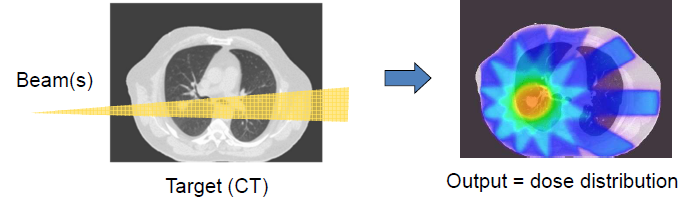

Radiotherapy General Concept
============================

.. contents:: Table of Contents
   :depth: 15
   :local:

General concept
---------------

The Radiotherapy and Dosimetry reference paper *GATE V6: a major enhancement of the GATE simulation platform enabling modelling of CT and radiotherapy* is available `here <http://www.opengatecollaboration.org/sites/default/files/Jan2011.pdf>`_. If you are interested in Gate simulations in a clinical environment for light ion beam radiotherapy, then you may want to have a look at `GateRTion <http://www.opengatecollaboration.org/GateRTion>`_

A **list of radionuclides** is availabe at `NUCLEIDE.ORG <http://www.nucleide.org/DDEP_WG/DDEPdata.htm>`_.

The concept of Actors is very important for the simulation of radiotherapy treatments and dosimetry. :ref:`tools_to_interact_with_the_simulation_actors-label` and :ref:`filters-label` are tools which allow to interact with the simulation. They can collect information during the simulation, such as energy deposit, number of particles created in a given volume, etc. They can also modify the behavior of the simulation. There are different types of actors which collect different types of information, however some commands and behavior are common to all actors. To use selection criteria, it is possible to add filters.

Insert a CT image in the therapy simulation
-------------------------------------------

For a realistic radiotherapy simulation, one wants to use a patient CT image as the voxelized phantom. For that, the following steps must be followed.

Step1: convert Dicom image to Analyze image file format
~~~~~~~~~~~~~~~~~~~~~~~~~~~~~~~~~~~~~~~~~~~~~~~~~~~~~~~

The `vv, the 4D Slicer <https://www.creatis.insa-lyon.fr/rio/vv>`_ software can be used for this purpose. It opens the  DICOM image and saves it as a header plus raw data. It can also resample the image.

Step2: define HU to materials conversion
~~~~~~~~~~~~~~~~~~~~~~~~~~~~~~~~~~~~~~~~

The following macro can be used to generate Hounsfield Unit (HU) to material conversion::

   /gate/HounsfieldMaterialGenerator/SetMaterialTable                       MaterialsTable.txt
   /gate/HounsfieldMaterialGenerator/SetDensityTable                        DensitiesTable.txt
   /gate/HounsfieldMaterialGenerator/SetDensityTolerance                    0.1 g/cm3
   /gate/HounsfieldMaterialGenerator/SetOutputMaterialDatabaseFilename 	 myimage-HUmaterials.db
   /gate/HounsfieldMaterialGenerator/SetOutputHUMaterialFilename            myimage-HUmat.txt
   /gate/HounsfieldMaterialGenerator/Generate

Step3: insert image as a volume
~~~~~~~~~~~~~~~~~~~~~~~~~~~~~~~

Example::

   /gate/world/daughters/name                    patient
   /gate/world/daughters/insert                  ImageNestedParametrisedVolume
   /gate/patient/geometry/SetImage               myimage.hdr
   /gate/geometry/setMaterialDatabase            myimage-HUmaterials.db
   /gate/patient/geometry/SetHUToMaterialFile    myimage-HUmat.txt
   /gate/patient/placement/setTranslation        0 0 0 mm

Dose distribution (Dosimetry)
-----------------------------

GATE allows to simulate the dose distribution in a phantom during radiotherapy (therapy with photons) and hadrontherapy (therapy with hadrons : proton, Carbon...). It also allows to perform other radiation simulations such as brachytherapy, dose deposited during x-ray imaging... :numref:`RadiotherapyWithGATE` shows an example of a dose distribution map obtained after radiotherapy treatment on a phantom.

   Dose distribution after radiotherapy treatment on a phantom.

The :ref:`dose_measurement_doseactor-label` is the tool that is used to store the **deposited dose in a 3D matrix** which size and resolution can be specified. It can also be used for 1D and 2D dose maps. It can store *dose*, *edep* or *number of hits* and computes associated statistical uncertainty. The **DoseActor** is attached to a volume which can be voxelized or not.
