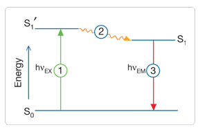
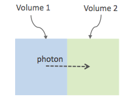
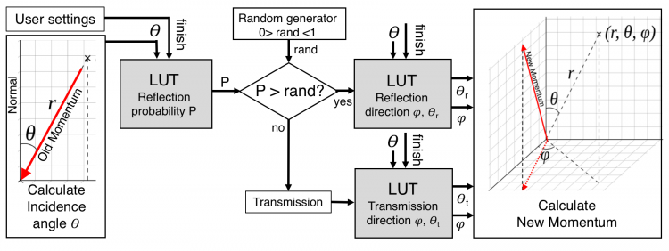
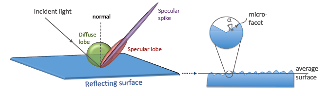
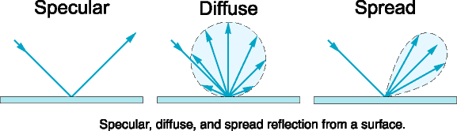
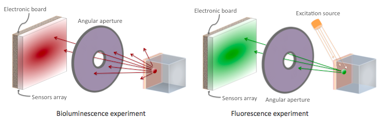

.. _generating_and_tracking_optical_photons-label:

Generating and tracking optical photons
=======================================

.. contents:: Table of Contents
   :depth: 15
   :local:

Introduction
------------

To use the optical photon capabilities of GATE, the **GATE_USE_OPTICAL** variable has to be set to **ON** in the configuration process using ccmake. 

Before discussing how to use the optical photon tracking, it has to be mentioned that there are a few disadvantages in using optical transport. First, the simulation time will increase dramatically. For example, most scintillators used in PET generate in the order of 10,000 optical photons at 511 keV, which means that approximately 10,000 more particles have to be tracked for each annihilation photon that is detected. Although the tracking of optical photons is relatively fast, a simulation with optical photon tracking can easily be a factor thousand slower than one without. Finally, in order to perform optical simulations, many parameters are needed for the materials and surfaces, some of which may be difficult to determine.

Optical Photon Generation
-------------------------

Example::

   /gate/source/addSource                           Mysource gps
   /gate/source/Mysource/gps/particle               opticalphoton
   /gate/source/Mysource/gps/energytype             Mono
   /gate/source/Mysource/gps/angtype                iso

An optical photon with a wave length of 530nm corresponds to an optical photon of energy=2.34eV [approximation: 1240/E(eV) = wavelength (nm)]::

   /gate/source/Mysource/gps/monoenergy             2.34 eV

An optical photon which is not assigned a polarization at production may not be Rayleigh scattered::

   /gate/source/Mysource/gps/polarization           1 0 0

Optical System
--------------

The GATE **OpticalSystem** is appropriate to model Optical Imaging systems. This system is defined in the following section :ref:`opticalsystem-label`.

Defining material properties
----------------------------

The optical properties of materials are stored in a material property table. In this table each of the properties of a material is identified by a name. There are two kinds of properties. The first are constant properties, these contain only one value. The second are property vectors, these contain properties that depend on the energy of the optical photon. Such a vector is a list of energy-value pairs. 

The property tables for the materials used in a simulation are to be stored in a file separate from the material database. This makes it easier to change the properties without having to change the material database. This file should be named **Materials.xml**. When Gate reads in a material from the materials database, it also checks if the *Materials.xml* file contains a property table for this material. If so, this table is read in and coupled to the material. 

Scintillation
~~~~~~~~~~~~~

A scintillator is characterized by its photon emission spectrum. The scintillation follows an exponential decay with two time constants, a fast and a slow one. The relative strength of the fast component **FASTCOMPONENT** as a fraction of total scintillation yield is given by the **YIELDRATIO**. The emission spectra of both decays are given by the property vectors **FASTCOMPONENT** and **SLOWCOMPONENT** and the time constants **FASTTIMECONSTANT** and **SLOWTIMECONSTANT**. These vectors specify the probability that a photon with the given energy is emitted. The sum of each of the vectors should therefore be one.

In order to have scintillation in a material, the first parameter that has to be specified is the **SCINTILLATIONYIELD** (1/Mev, 1/keV), which gives the number of photons that is emitted per amount of energy absorbed, or, more precisely, it gives the *expectation* value of this number, since the real number of emitted photons follows a normal distribution. The variance of this normal distribution is **RESOLUTION-SCALE** times this expectation value. Thus, for example, when a gamma photon deposits :math:`E` amount of energy in the scintillator, :math:`N` optical photons are emitted with an expectation value of
:math:`\mu_N` = *E* . SCINTILLATIONYIELD

and a standard deviation of 
:math:`\sigma_N = RESOLUTIONSCALE \cdot\sqrt{E\cdot SCINTILLATIONYIELD}`

The parameters *RESOLUTIONSCALE* can be calculated from the energy resolution of the scintillator. The energy resolutions specified in the literature may contain contributions of electronic noise. The energy resolution needed to calculate the *RESOLUTIONSCALE* should be the intrinsic energy resolution of the scintillator.

:math:`RESOLUTIONSCALE = \frac{R}{2.35}\cdot\sqrt{E\cdot SCINTILLATIONYIELD}`

where :math:`R` is the energy resolution (FWHM - Full width at half maximum ) at energy :math:`E`::

    <material name="LSO">
      <propertiestable>
        <property name="SCINTILLATIONYIELD" value="26000" unit="1/MeV"/>
        <property name="RESOLUTIONSCALE" value="4.41"/>
        <property name="FASTTIMECONSTANT" value="40" unit="ns"/>
        <property name="YIELDRATIO" value="1"/>
        <propertyvector name="FASTCOMPONENT" energyunit="eV">
          <ve energy="2.95167" value="1"/>
        </propertyvector>
        <propertyvector name="ABSLENGTH" unit="m" energyunit="eV">
          <ve energy="1.84" value="50"/>
          <ve energy="4.08" value="50"/>
        </propertyvector>
        <propertyvector name="RINDEX" energyunit="eV">
          <ve energy="1.84" value="1.82"/>
          <ve energy="4.08" value="1.82"/>
        </propertyvector>
      </propertiestable>
    </material>

Absorption
~~~~~~~~~~

This process kills the particle. It requires the Material.xml properties filled by the user with the Absorption length *ABSLENGTH* (average distance traveled by a photon before being absorbed by the medium)::

    /gate/physics/addProcess OpticalAbsorption

Mie/Rayleigh Scattering
~~~~~~~~~~~~~~~~~~~~~~~

Mie Scattering is an analytical solution of Maxwell’s equations for scattering of optical photons by spherical particles. It is significant only when the radius of the scattering object is of order of the wave length.The analytical expressions for Mie Scattering are very complicated. One common approximation (followed by Geant4) made is called **Henyey-Greenstein** (HG). For small size parameter (scattering particle diameter) regime the Mie theory reduces to the Rayleigh approximation::

    /gate/physics/addProcess OpticalRayleigh
    /gate/physics/addProcess OpticalMie

For Rayleigh or Mie scattering, we require the final momentum, initial polarization and final polarization to be in the same plane. Mie/Rayleigh processes require material properties to be filled by the user with Mie/Rayleigh scattering length data: **MIEHG/RAYLEIGH**, which is the average distance traveled by a photon before it is Mie/Rayleigh scattered in the medium. In the case of the Mie scattering, the user also needs to provide parameters of the HG approximation: **MIEHG_FORWARD** (forward anisotropy), **MIEHG_BACKWARD** (backward anisotropy), and **MIEHG_FORWARD_RATIO** (ratio between forward and backward angles). Geant4 code allows the forward and backward angles to be treated separately. If your material characteristics provides only one number for the **anisotropy** (= average cosine of the scattering angle), below is an example of how (part of) the Materials.xml file could look like::

    <material name="Biomimic">
      <propertiestable>
       <propertyvector name="ABSLENGTH" unit="cm" energyunit="eV">
         <ve energy="1.97" value="0.926"/>
         <ve energy="2.34" value="0.847"/>
        </propertyvector>
        <propertyvector name="RINDEX" energyunit="eV">
          <ve energy="1.97" value="1.521"/>
          <ve energy="2.34" value="1.521"/>
        </propertyvector>
     <property name="MIEHG_FORWARD" value="0.62" />
        <property name="MIEHG_BACKWARD" value="0.62" />
        <property name="MIEHG_FORWARD_RATIO" value="1.0" />
        <propertyvector name="MIEHG" unit="cm" energyunit="eV">
          <ve energy="1.97" value="0.04"/>
          <ve energy="2.34" value="0.043"/>
        </propertyvector>
      </propertiestable>
    </material>

Fluorescence
~~~~~~~~~~~~

Fluorescence is a 3 step process: The fluorophore is in an excited state after the absorption of an optical photon provided by an external source (laser, lamp). The life time of the excited state is of order of 1-10ns during which the fluorophore interacts with its environment and ends-up in a relaxed-excited state. The last step is the emission of a fluorescent photon which energy/wave length is smaller(larger) than the one of the excitation optical photon.

   Optical Fluorescence

Geant4 simulates the **W** ave **L** ength **S** hifting (WLS) fibers that are used in High Energy Physics experiments. As an example, the CMS hadronic EndCap calorimeter is made of scintillator tiles with WLS fibers embedded. These fibers collect/absorb blue light produced in tiles and re-emit green light so that as much light reaches the PMTs. A new class in Gate has been implemented as a physics builder class that inherits from the G4OpWLS class. The following command line enables the optical photon fluorescence::

    /gate/physics/addProcess OpticalWLS

Gate user needs to provide four parameters/properties to define the fluorescent material:  **RINDEX**, **WLSABSLENGTH**, **WLSCOMPONENT** and **WLSTIMECONSTANT**. The **WLSABSLENGTH** defines the fluorescence absorption length which is the average distance travelled by a photon before it is absorbed by the fluorophore. This distance could be very small but probably not set to 0 otherwise the photon will be absorbed immediately upon entering the fluorescent volume and fluorescent photon will appear only from the surface. The **WLSCOMPONENT** describes the emission spectrum of the fluorescent volume by giving the relative strength between different photon energies. Usually these numbers are taken from measurements (i.e. emission spectrum). The **WLSTIMECONSTANT** defines the time delay between the absorption and re-emission. 

**Simulation of the Fluorescein** `see <http://en.wikipedia.org/wiki/Fluorescein>`_ ::

   We define the refractive index of the fluorophore’s environment (water or alcohol):
   <material name="Fluorescein">
   <propertiestable>
   <propertyvector name="RINDEX" energyunit="eV">
   <ve energy="1.0" value="1.4"/>
   <ve energy="4.13" value="1.4"/>
   </propertyvector> 

The WLS process has an absorption spectrum and an emission spectrum. If these overlap then a WLS photon may in 
turn be absorpted and emitted again. If you do not want that you need to avoid such overlap. The WLS process does 
not distinguish between 'original' photons and WLS photons::

   We describe the fluorescein absorption length taken from measurements or literature as function of the photon energy:
   <propertyvector name="WLSABSLENGTH" unit="cm" energyunit="eV">
   <ve energy="3.19" value="2.81"/>
   <ve energy="3.20" value="2.82"/>
   <ve energy="3.21" value="2.81"/>
   </propertyvector>

   We describe the fluorescein Emission spectrum taken from measurements or literature as function of the photon energy:
   <propertyvector name="WLSCOMPONENT" energyunit="eV">
   <ve energy="1.771"  value="0.016"/>
   <ve energy="1.850"  value="0.024"/>
   <ve energy="1.901"  value="0.040"/>
   <ve energy="2.003"  value="0.111"/>
   <ve energy="2.073"  value="0.206"/>
   <ve energy="2.141"  value="0.325"/>
   <ve energy="2.171"  value="0.413"/>
   <ve energy="2.210"  value="0.540"/>
   <ve energy="2.250"  value="0.683"/>
   <ve energy="2.343"  value="0.873"/>
   <ve energy="2.384"  value="0.968"/>
   <ve energy="2.484"  value="0.817"/>
   <ve energy="2.749"  value="0.008"/>
   <ve energy="3.099"  value="0.008"/>
   </propertyvector>
   <property name="WLSTIMECONSTANT" value="1.7" unit="ns"/>
   </propertiestable>
   </material>

Boundary Processes
~~~~~~~~~~~~~~~~~~

When a photon arrives at a medium boundary its behavior depends on the nature of the two materials that join at that boundary::

    /gate/physics/addProcess OpticalBoundary

In the case of two dielectric materials, the photon can undergo total internal reflection, refraction or reflection, depending on the photon’s wavelength, angle of incidence, and the refractive indices on both sides of the boundary. In the case of an interface between a dielectric and a metal, the photon can be absorbed by the metal or reflected back into the dielectric.
When simulating a perfectly smooth surface, the user doesn't have to provide a G4Surface. The only relevant property is the refractive index (RINDEX) of the two materials on either side of the interface. Geant4 will calculate from Snell's Law the probabilities of refraction and reflections.

.. _defining_surfaces-label:

Defining surfaces
-----------------

   Surface definition

The photon travels through the surface between the two volumes **Volume1** and **Volume2**. To create an optical surface with the name **Surface-From-Volume1-To-Volume2**, the following commands should be used::

   /gate/**Volume2**/surfaces/name   Surface-From-Volume1-To-Volume2
   /gate/**Volume2**/surfaces/insert **Volume1**

The surface between **Volume1** and **Volume2** is NOT the same surface as that between Volume2 and Volume1; the surface definition is directional. When there is optical transport in both directions, two surfaces should be created.
To load the surface properties stored in the Surfaces.xml file. Surface_name can be any surface defined in the Surfaces.xml file::

   /gate/Volume2/surfaces/Surface-From-Volume1-To-Volume2/SetSurface Surface_name

In Gate, two simulation models that are used at the boundary are available. The recently implemented LUTDavis model (GATE V8.0) and the traditional UNIFIED model (see: source/geometry/src/GateSurface.cc).

LUT Davis Model
~~~~~~~~~~~~~~~

**Please Note:** Necessary modifications in Geant4 are not implemented until Summer 2017. The user can manually modify the Geant4 code. Find detailed instructions here: :ref:`enabling_lut_davis_model-label`

Available in GATE V8.0 is a model for optical transport called the LUT Davis model [Roncali& Cherry(2013)]. The model is based on measured surface data and allows the user to choose from a list of available surface finishes. Provided are a rough and a polished surface that can be used without reflector, or in combination with a specular reflector (e.g. ESR) or a Lambertian reflector (e.g. Teflon). The specular reflector can be coupled to the crystal with air or optical grease. Teflon tape is wrapped around the crystal with 4 layers.

.. table:: Surface names of available LUTs.
   :widths: auto
   :name: surface_tab

   +----------+--------------+--------------------+-----------------+-----------------------+
   |          | BARE         | TEFLON             | ESR AIR         | ESR GREASE            |
   +==========+==============+====================+=================+=======================+
   | POLISHED | Polished_LUT | PolishedTeflon_LUT | PolishedESR_LUT | PolishedESRGrease_LUT |
   +----------+--------------+--------------------+-----------------+-----------------------+
   | ROUGH    | Rough_LUT    | RoughTeflon_LUT    | RoughESR_LUT    | RoughESRGrease_LUT    |
   +----------+--------------+--------------------+-----------------+-----------------------+

The user can extend the list of finishes with custom measured surface data. In GATE V8.0, this can be achieved by contacting the developers of the LUT Davis model. In future releases, a tool to calculate LUTs will be provided in form of a graphical user interface. In the LUT database, typical roughness parameters obtained from the measurements are provided to characterize the type of surface modelled:

* **ROUGH**  Ra=0.48 µm, σ=0.57 µm, Rpv=3.12 µm
* **POLISHED** Ra=20.8 nm, σ=26.2 nm, Rpv=34.7 nm

with Ra = average roughness; σ = rms roughness, Rpv = peak-to-valley ratio.

The desired finish should be defined in Surfaces.xml (file available in https://github.com/OpenGATE/GateContrib/tree/master/imaging/LUTDavisModel)::

   <surface model="DAVIS" name="RoughTeflon_LUT" type="dielectric_LUTDAVIS" finish="RoughTeflon_LUT">
    </surface>

  The detector surface, called **Detector_LUT**, defines a polished surface coupled to a photodetector with optical grease or a glass interface (similar index of refraction 1.5). Any surface can be used as a detector surface when the Efficiency is set according to the following example:
   <surface model="DAVIS" name="**Detector_LUT**" type="dielectric_LUTDAVIS" finish="Detector_LUT">
       <propertiestable>
        <propertyvector name="**EFFICIENCY**" energyunit="eV">
          <ve energy="1.84" value="**1**"/>
          <ve energy="4.08" value="**1**"/>
        </propertyvector>
      </propertiestable>
    </surface>

Running the simulation produces an output in the terminal confirming that the LUT data is read in correctly. The user should check the presence of these lines in the terminal. For example::

   ===== XML PATH ====: ./Surfaces.xml 
   ===== XML PATH ====: ...
   LUT DAVIS - data file: .../Rough_LUT.dat read in! 
   Reflectivity LUT DAVIS - data file: .../Rough_LUTR.dat read in! 
   ===== XML PATH ====: ./Surfaces.xml
   ===== XML PATH ====: ...
   LUT DAVIS - data file: .../Detector_LUT.dat read in! 
   Reflectivity LUT DAVIS - data file: .../Detector_LUTR.dat read in!

**Detection of optical photons**

Once the simulation is finished, the optical photon data can be found in the Hits Tree in the ROOT output. The Hits Tree consists of events that ended their path in the geometry defined as the sensitive detector (SD). Thus, photons can either be detected or absorbed in the crystal material when set as SD. The user can identify the optical photons from other particles using the PDGEncoding (0 for optical photons).

**Example**

The example (https://github.com/OpenGATE/GateContrib/tree/master/imaging/LUTDavisModel) includes a 3 mm x 3 mm x 20 mm scintillation crystal coupled to a 3 mm x 3 mm detector area. The source is positioned at the side of the crystal, irradiating it at 10 mm depth. The set surface is RoughTeflon_LUT in combination with the Detector_LUT as the photo detector surface. 

.. figure:: Example_LUTDavisModel.png
   :alt: Figure 3: Example_LUTDavisModel
   :name: Example_LUTDavisModel

   LUT Davis Model

**Background**

The crystal topography is obtained with atomic force microscopy (AFM). From the AFM data, the probability of reflection (1) and the reflection directions (2) are computationally determined, for incidence angles ranging from 0° to 90°. Each LUT is computed for a given surface and reflector configuration. The reflection probability in the LUT combines two cases: directly reflected photons from the crystal surface and photons that are transmitted to the reflector surface and later re-enter the crystal. 
The key operations of the reflection process are the following: The angle between the incident photon (Old Momentum) and the surface normal are calculated. The probability of reflection is extracted from the first LUT. A Bernoulli test determines whether the photon is reflected or transmitted. In case of reflection two angles are drawn from the reflection direction LUT.

   FlowChart LUT Model

Old Momentum to New Momentum. The old momentum is the unit vector that describes the incident photon. The reflected/transmitted photon is the New Momentum described by two angles φ, 𝛳.

UNIFIED Model
~~~~~~~~~~~~~

The UNIFIED model allows the user to **control the radiant intensity** of the surface: **Specular lobe**, **Specular spike**, **Backscatter spike** (enhanced on very rough surfaces) and **Reflectivity** (Lambertian or diffuse distribution). The sum of the four constants is constrained to unity.
In that model, the micro-facet normal vectors follow a Gaussian distribution defined by **sigmaalpha** (:math:`\sigma_{\alpha}`) given in degrees. This parameter defines the standard deviation of the Gaussian distribution of micro-facets around the average surface normal. In the case of a perfectly polished surface, the normal used by the G4BoundaryProcess is the normal to the surface.

   Reflection Types and Microfacets

To load the surface properties stored under **rough_teflon_wrapped** in the Surface.xml file::

   /gate/**Volume2**/surfaces/Surface-From-Volume1-To-Volume2/SetSurface rough_teflon_wrapped

An example of a surface definition looks like::

   <surface name="rough_teflon_wrapped" type="dielectric_dielectric" sigmaalpha="0.1" finish="groundbackpainted">
    <propertiestable>
      <propertyvector name="SPECULARLOBECONSTANT" energyunit="eV">
        <ve energy="4.08" value="1"/>
        <ve energy="1.84" value="1"/>
      </propertyvector>
      <propertyvector name="RINDEX" energyunit="eV">
        <ve energy="4.08" value="1"/>
        <ve energy="1.84" value="1"/>
      </propertyvector>
      <propertyvector name="REFLECTIVITY" energyunit="eV">
        <ve energy="1.84" value="0.95"/>
        <ve energy="4.08" value="0.95"/>
      </propertyvector>
      <propertyvector name="EFFICIENCY" energyunit="eV">
        <ve energy="1.84" value="0"/>
        <ve energy="4.08" value="0"/>
      </propertyvector>
    </propertiestable>
   </surface>

The attribute *type* can be either *dielectric_dielectric* or *dielectric_metal*, to model either a surface between two dielectrica or between a dielectricum and a metal. The attribute *sigma-alpha* models the surface roughness and is discussed in the next section. The attribute *finish* can have one of the following values: *ground*, *polished*, *ground-back-painted*, *polished-back-painted*, *ground-front-painted* and *polished-front-painted*. It is therefore possible to cover the surface on the inside or outside with a coating that reflects optical photons using **Lambertian reflection**. In case the finish of the surface is *polished*, the surface normal is used to calculate the probability of reflection. In case the finish of the surface is *ground*, the surface is modeled as consisting of small **micro-facets**. When an optical photon reaches a surface, a random angle :math:`\alpha` is drawn for the micro facet that is hit by the optical photon. Using the angle of incidence of the optical photon with respect to this micro facet and the refractive indices of the two media, the probability of reflection is calculated. 

In case the optical photon is reflected, four kinds of reflection are possible. The probabilities of the first three are given by the following three property vectors: 

* **SPECULARSPIKECONSTANT** gives the probability of specular reflection about the average surface normal 
* **SPECULARLOBECONSTANT** gives the probability of specular reflection about the surface normal of the micro facet
* **BACKSCATTERCONSTANT** gives the probability of reflection in the direction the optical photon came from

**LAMBERTIAN (diffuse)** reflection occurs when none of the other three types of reflection happens. The probability of Lambertian reflection is thus given by one minus the sum of the other three constants.

   Reflections Specular Diffuse Spread

When the photon is refracted, the angle of refraction is calculated from the surface normal (of the average surface for *polished* and of the micro facet for *rough*) and the refractive indices of the two media.

When an optical photon reaches a painted layer, the probability of reflection is given by the property vector **REFLECTIVITY**. In case the paint is on the inside of the surface, the refractive indices of the media are ignored, and when the photon is reflected, it undergoes Lambertian reflection.

When the paint is on the outside of the surface, whether the photon is reflected on the interface between the two media is calculated first, using the method described in the previous section. However, in this case the refractive index given by the property vector *RINDEX* of the surface is used. When the photon is refracted, it is reflected using Lambertian reflection with a probability *REFLECTIVITY*.  It then again has to pass the boundary between the two media. For this, the method described in the previous section is used again and again, until the photon is eventually reflected back into the first medium or is absorbed by the paint.

A **dielectric_dielectric** surface may have a wavelength dependent property **TRANSMITTANCE**. If this is specified for a surface it overwrites the Snell's law's probability. This allows the simulation of anti-reflective coatings.

**Detection of optical photons**

Optical photons can be detected by using a **dielectric-metal** boundary. In that case, the probability of reflection should be given by the REFLECTIVITY property vector. When the optical photon is reflected, the UNIFIED model is used to determine the reflection angle. When it is absorbed, it is possible to detect it. The property vector EFFICIENCY gives the probability of detecting a photon given its energy and can therefore be considered to give the internal quantum efficiency. Note that many measurements of the quantum efficiency give the external quantum efficiency, which includes the reflection: external quantum efficiency = efficiency*(1-reflectivity).

The hits generated by the detection of the optical photons are generated in the volume from which the optical photons reached the surface. This volume should therefore be a sensitive detector.

Digitizer
---------

The hits generated in the sensitive detector are first processed by *analysis*. Unfortunately *analysis* is quite slow when there are a large number of hits, as is the case when there is optical transport. Therefore, an alternative has been created that is faster ans is therefore called *fastanalysis*::

   /gate/output/analysis/disable
   
   /gate/output/fastanalysis/enable

Switching both on has no effect on the results, but only affects the speed of the simulation. After processing the hits with one of the analysis routines, the singles should be created from the hits. This is usually done using the **opticaladder** which adds all hits generated by optical photons. In this way, it is possible to create a digitizer chain containing the singles generated by optical photons::

   /gate/digitizer/Singles/insert opticaladder
   /gate/digitizer/Singles/insert readout
   /gate/digitizer/Singles/readout/setDepth your_detector_readout_level

Digitizer modules like **threshold** or **uphold** can be used (see :ref:`thresholder_upholder-label`). This is crucial when you do a fluorescence experience for example. If you want to detect only fluorescent photons you need to apply an energy cut (upholder) in order to discard high energy photons (non-fluorescent photons have higher energy than fluorescent
photons)::

   /gate/digitizer/Singles/insert upholder
   /gate/digitizer/Singles/upholder/setUphold 2.0 eV
   /gate/digitizer/Singles/insert thresholder
   /gate/digitizer/Singles/thresholder/setThreshold 1.0 eV

The **projection** (see :ref:`binary_output_of_projection_set-label`) associated to this digitizer records only photons corresponding to the defined energy window. The projection image is therefore the fluorescence image.

Optical Imaging Simulation Outputs
----------------------------------

Root output
~~~~~~~~~~~

When working with optical photons, an additional ROOT tree is created: OpticalData. You can decide
to fill this tree or not by using the following command::

    /gate/output/root/setRootOpticalFlag 0 or 1

OpticalData tree is generated with the following information::

   CrystalLastHitEnergy  CrystalLastHitPos_X CrystalLastHitPos_Y CrystalLastHitPos_Z
   Energy and Positions of the photon **last hit** in the Crystal (Detected photon position)

   PhantomLastHitEnergy  PhantomLastHitPos_X PhantomLastHitPos_Y PhantomLastHitPos_Z
   Energy and Positions of the photon **last hit** in the Phantom

   NumCrystalWLS 
   Number of Fluorescence processes per event(photon) in the Crystal

   NumPhantomWLS 
   Number of Fluorescence processes per event(photon) in the Phantom

   NumScintillation
   Number of Scintillation processes per event(photon) in the Crystal

   CrystalProcessName   PhantomProcessName
   List of process names that occured in the Crystal or in the Phantom

   MomentumDirectionx MomentumDirectiony MomentumDirectionz
   Optical photon momentum direction

New unified Tree output (ROOT, numpy and more)
~~~~~~~~~~~~~~~~~~~~~~~~~~~~~~~~~~~~~~~~~~~~~~

One can save optical data in precedent section with new system (see :ref:`new_unified_tree_output_general_set-label`) like this::

    /gate/output/tree/enable
    /gate/output/tree/addFileName p.npy
    /gate/output/tree/optical/enable

And variables to save can also be disabled, for example::

    /gate/output/tree/optical/branches/CrystalLastHitEnergy/disable

.. _binary_output_of_projection_set-label:

Binary output of projection set
~~~~~~~~~~~~~~~~~~~~~~~~~~~~~~~

In order to create a projection set (see :ref:`interfile_output_of_projection_set-label`) using the Optical System in GATE, the following lines have to be added to the macro::

   /gate/output/projection/enable
   /gate/output/projection/setFileName        your_name
   /gate/output/projection/projectionPlane    XY
   /gate/output/projection/pixelSizeX    	   0.105 cm
   /gate/output/projection/pixelSizeY    	   0.105 cm
   /gate/output/projection/pixelNumberX  	   100
   /gate/output/projection/pixelNumberY  	   100

The result of projection set is saved in a binary file (.bin). A header file (.hdr) is also provided with the following information::

    !INTERFILE :=
    !imaging modality := optical imaging
    ;
    !GENERAL DATA :=
    data description := GATE simulation
    !name of data file := ./OpticalSimulationProjection.bin
    ;
    !GENERAL IMAGE DATA :=
    !type of data := OPTICAL
    !total number of images := 1
    ;
    !OPTICAL STUDY (general) :=
    number of detector heads := 1 
    ;
    !number of images divided by number of energy window := 1
    projection matrix size [1] := 100
    projection matrix size [2] := 100
    projection pixel size along X-axis (cm) [1] := 0.105
    projection pixel size along Y-axis (cm) [2] := 0.105
    !number of projections := 1
    !extent of rotation := 360
    !time per projection (sec) := 1
    ;
    ;GATE GEOMETRY :=
    ;Optical System x dimension (cm) := 10.5
    ;Optical System y dimension (cm) := 10.5
    ;Optical System z dimension (cm) := 2
    ;Optical System material := Air
    ;Optical System x translation (cm) := 0
    ;Optical System y translation (cm) := 0
    ;Optical System z translation (cm) := 0
    ;
    ;Optical System LEVEL 1 element is crystal := 
    ;Optical System crystal x dimension (cm) := 10.5
    ;Optical System crystal y dimension (cm) := 10.5
    ;Optical System crystal z dimension (cm) := 1
    ;Optical System crystal material := Air
    ;
    ;Optical System LEVEL 2 element is pixel := 
    ;Optical System pixel x dimension (cm) := 2
    ;Optical System pixel y dimension (cm) := 2
    ;Optical System pixel z dimension (cm) := 1
    ;Optical System pixel material := Air
    ;
    !END OF INTERFILE :=

Example of an Optical Imaging Simulation
----------------------------------------

In the GateContrib repository you will find simple examples of a bioluminescence/fluorescence experiment. All macros are located under *imaging/Optical*.
In addition, a ROOT macro [*DrawBranches.C*] is available and draws all branches of the OpticalData tree into a postscript file.

   Optical Imaging experiments

The optical imaging system is composed of an array of pixels, an electronic board and an angular aperture that limits the range of angles over which the optical system can accept light. The phantom is composed of a box of water and two layers made of either water, hypodermis or epidermis. In case of a bioluminescence experiment, the tumor is described as a voxelized source of optical photons and is positioned under the inner layer of the phantom. In case of a fluorescence experiment, we assigned the Rhodamine B fluorophore to each voxel of a voxelized tumor and positioned it under the inner layer of the phantom. The fluorophore is excited by two external beam light sources emitting optical photons towards the tumor. 

These two experiments are available in *imaging/Optical* through the following macros:
bioluminescence.mac and fluorescence.mac. The voxelized source or phantom is available in *imaging/Optical/voxelized-source-phantom* with an attenuation file and an optical-flux file. These macros will generate a root output file with the OpticalData tree enabled and a binary file which corresponds to the GATE ProjectionSet on the XY plane (i.e detection plane). Using the root macros MakeBioluminescencePlots.C and MakeFluorescencePlots.C, you can read the root output file and draw the bioluminescent/fluorescent light that is detected by the optical system. In case of the fluorescence experiment, two plots are drawn: all detected light (any wavelength) and the fluorescent light (wavelength cut). The projection binary file (.bin and .hdr) can be viewed directly using Anatomist or Imagej. In case of the fluorescence experiment, an Upholder (uphold cut) was applied through the digitizer so the binary image illustrates the fluorescent light. 

The Materials.xml file is updated with several tissues properties at specific wavelengths (from literature): brain, kidney, epidermis and hypodermis but also with the emission spectra of the Fluorescein and Rhodamine B.

Bibliography
------------

* The NIST XCOM (`NIST-XCOM <http://www.nist.gov/pml/data/xcom/index.cfm>`_): Photon Cross Sections Database gives attenuation coefficients. The Database Search Form is available directly through this link `Database Search Form <http://physics.nist.gov/PhysRefData/Xcom/html/xcom1.html>`_.
* `A Review of the Optical Properties of Biological Tissues, IEEE J. Quantum Electronics, 26, 2166-2185 (1990) (W. F. Cheong, S. A. Prahl, and A. J. Welch). Updated by Wai-Fung Cheong. Further additions by Lihong Wang and Steven L. Jacques. August 6, 1993 <http://ieeexplore.ieee.org/xpls/abs_all.jsp?arnumber=64354>`_ - IEEE Journal of Quantum Electronics, Vol. 26, Issue 12, pp. 2166 - 2185 
* `Optical Absorption of Water <http://omlc.ogi.edu/spectra/water/index.html>`_ with all currently available data (presented in terms of wavelength and absorption coefficient) - Scott Prahl, Oregon Medical Laser Center.
* `Optical Brain Imaging in Vivo: Techniques and Applications from Animal to Man. (E. M. C. Hillman) <http://www.ncbi.nlm.nih.gov/pubmed/17994863>`_ - J. Biomed. Opt. 2007 Sep-Oct;12(5):051402
* `Refractive Index Measurement of Acute Rat Brain Tissue Slices using Optical Coherence Tomography (J. Sun, S. J. Lee, L. Wu, M. Sarntinoranont and H. Xie) <http://www.opticsinfobase.org/oe/abstract.cfm?uri=oe-20-2-1084>`_ - Optics Express, Vol. 20, Issue 2, pp. 1084-1095 (2012)
* `In Vivo Optical Reflectance Imaging of Spreading Depression Waves in Rat Brain with and without Focal Cerebral Ischemia (S. Chen, Z. Feng, P. Li, S. L. Jacques, S. Zeng and Q. Luo) <http://www.ncbi.nlm.nih.gov/pubmed/16822052>`_ - J. Biomed. Opt. 2006 May-Jun;11(3):34002
* `Brain Refractive Index Measured in Vivo with High-NA Defocus-Corrected Full-Field OCT and Consequences for Two-Photon Microscopy (J. Binding, J. Ben Arous, J-F. Leger, S. Gigan, C. Boccara and L. Bourdieu) <http://www.opticsinfobase.org/oe/abstract.cfm?uri=oe-19-6-4833>`_ - Optics Express, Vol. 19, Issue 6, pp. 4833-4847 (2011)
* `Contribution of the Mitochondrial Compartment to the Optical Properties of the Rat Liver: a Theoretical and Practical Approach (B. Beauvoit, T. Kitai and B. Chance) <http://www.ncbi.nlm.nih.gov/pubmed/7696489>`_ - Biophys. J. 1994 Dec;67(6):2501-10
* `Optical Properties of Native and Coagulated human Liver Tissue and Liver Metastases in the Near Infrared Range (C. T. Germer, A. Roggan, J. P. Ritz, C. Isbert, D. Albrecht, G. Muller and H. J. Buhr) <http://www.ncbi.nlm.nih.gov/pubmed/9829430>`_ - Lasers Surg. Med. 1998;23(4):194-203
* `In Vivo Determination of the Optical Properties of Muscle with Time-Resolved Reflectance using a Layered Model (A. Kienle and T. Glanzmann) <http://www.ncbi.nlm.nih.gov/pubmed/10588278>`_ - Phys. Med. Biol. 1999 Nov;44(11):2689-702
* `Optical Properties of Skin, Subcutaneous and Muscle Tissues: a Review (A. N. Bashkatov, E. A. Genina and V. V. Tuchin) <http://www.worldscientific.com/doi/abs/10.1142/S1793545811001319>`_ - J. Innov. Opt. Health Sci. 04, 9 (2011)
* `Determination of the Optical Properties of Rat (Heart) Tissue (A. Singh1,  A. E. Karsten, R. M. Smith and G. van Niekerk) <http://researchspace.csir.co.za/dspace/handle/10204/4039>`_ - 2010 European Cells & Materials Ltd
* `In Vitro Double-Integrating-Sphere Optical Properties of Tissues between 630 and 1064nm (J. F. Beek†, P. Blokland, P. Posthumus, M. Aalders, J. W. Pickering, H. J. C. M. Sterenborg and M. J. C. van Gemert) <http://www.ncbi.nlm.nih.gov/pubmed/9394410>`_ - Phys. Med. Biol. 42 (11) 1997 2255-61
*  Simpson R, Kohl M, Essenpreis M and Cope M 1998 Near-Infrared optical properties of ex vivo human skin and subcutaneous tissues measured using the Monte Carlo inversion technique Phys. Med. Biol. 43 2465-2478
* Baran T M, Wilson J D, Mitra S, Yao J L, Messing E M, Waldman D L and Foster T H 2012 Optical property measurements establish the feasibility of photodynamic therapy as a minimally invasive intervention for tumors of the kidney J. Biomed. Opt. 17 (9) 098002
* Rolfe P 2000 Brain - In vivo near-infrared spectroscopy Annu. Rev. Biomed. Eng. 2 715-754
* Roncali E & Cherry S 2013 - `Simulation of light transport in scintillators based on 3D characterization of crystal surfaces. <https://www.ncbi.nlm.nih.gov/pubmed/23475145>`_ Phys. Med. Biol., Volume 58(7), p. 2185–2198.
