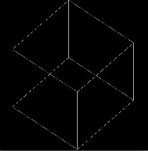
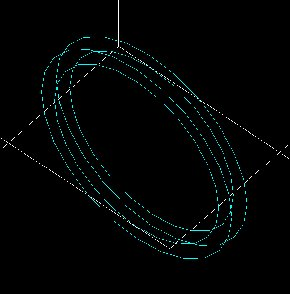
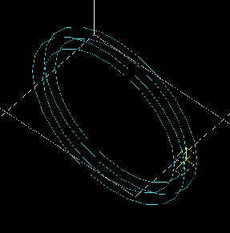
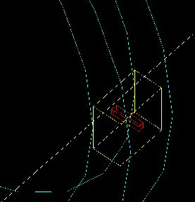
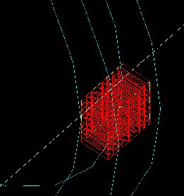
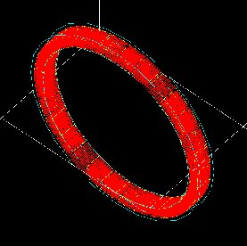
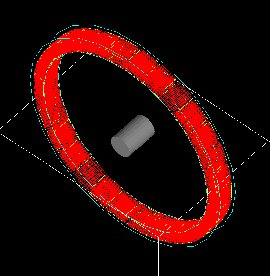
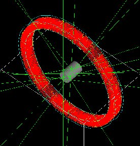
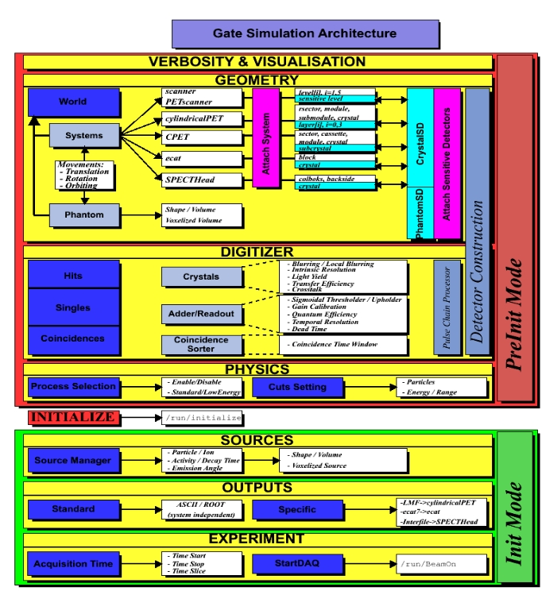

.. _getting_started-label:

Getting Started
===============

.. contents:: Table of Contents
   :depth: 15
   :local:

This section is an overview of the main steps one must go through to perform a
simulation using Gate. It is presented in the form of a simple example that the
user is encouraged to try out, while reading this section. A more detailed
description of the different steps is given in the following sections of this
user's guide. The use of Gate does not require any C++ programming, thanks to a
dedicated scripting mechanism that extends the native command interpreter of
Geant4. This interface allows the user to run Gate programs using command
scripts only. The goal of this first section is to give a brief description of
the user interface and to provide understanding of the basic principles of Gate
by going through the different steps of a simulation.

Simulation architecture for imaging applications
------------------------------------------------

In each simulation, the user has to:

#. define the scanner geometry
#. define the phantom geometry
#. set up the physics processes
#. initialize the simulation::

   /gate/run/initialize

#. set up the detector model
#. define the source(s)
#. specify the data output format
#. start the acquisition

Steps 1) to 4) concern the initialization of the simulation. Following the
initialization, the geometry can no longer be changed.

Simulation architecture for dosimetry and radiotherapy applications
-------------------------------------------------------------------

In each simulation, the user has to:

#. define the beam geometry
#. define the phantom geometry
#. specify the output (actor concept for dose map etc...)
#. set up the physics processes
#. initialize the simulation::

   /gate/run/initialize

#. define the source(s)
#. start the simulation with the following command lines::

     /gate/application/setTotalNumberOfPrimaries [particle_number]
     /gate/application/start

The user interface: a macro language
------------------------------------

Gate, just as GEANT4, is a program in which the user interface is based on
scripts. To perform actions, the user must either enter commands in interactive
mode, or build up macro files containing an ordered collection of commands.

Each command performs a particular function, and may require one or more
parameters. The Gate commands are organized following a tree structure, with
respect to the function they represent. For example, all geometry-control
commands start with *geometry*, and they will all be found under the
*geometry* branch of the tree structure.

When Gate is run, the **Idle>** prompt appears. At this stage the command
interpreter is active; i.e. all the Gate commands entered will be interpreted
and processed on-line. All functions in Gate can be accessed to using command
lines. The geometry of the system, the description of the radioactive source(s),
the physical interactions considered, etc., can be parameterized using command
lines, which are translated to the Gate kernel by the command interpreter. In
this way, the simulation is defined one step at a time, and the actual
construction of the geometry and definition of the simulation can be seen
on-line. If the effect is not as expected, the user can decide to re-adjust the
desired parameter by re-entering the appropriate command on-line. Although
entering commands step by step can be useful when the user is experimenting with
the software or when he/she is not sure how to construct the geometry, there
remains a need for storing the set of commands that led to a successful
simulation.

Macros are ASCII files (with '.mac' extension) in which each line contains
a command or a comment. Commands are GEANT4 or Gate scripted commands; comments
start with the character '#'. Macros can be executed from within the
command interpreter in Gate, or by passing it as a command-line parameter to
Gate, or by calling it from another macro. A macro or set of macros must include
all commands describing the different components of a simulation in the right
order. Usually these components are visualization, definitions of volumes
(geometry), systems, digitizer, physics, initialization, source, output and
start. These steps are described in the next sections. A single simulation may
be split into several macros, for instance one for the geometry, one for the
physics, etc. Usually, there is a master macro which calls the more specific
macros. Splitting macros allows the user to re-use one or more of these macros
in several other simulations, and/or to organize the set of all commands.
Examples of complete macros can be found on the web site referenced above. To
execute a macro (mymacro.mac in this example) from the Linux prompt, just type::

  Gate mymacro.mac

To execute a macro from inside the Gate environment, type after the
"Idle>" prompt::

  Idle>/control/execute mymacro.mac

And finally, to execute a macro from inside another macro, simply write in the
master macro::

  /control/execute mymacro.mac

In the following sections, the main steps to perform a simulation for imaging
applications using Gate are presented in details. To try out this example, the
user can run Gate and execute all the proposed commands, line by line.

Step 1: Defining a scanner geometry
-----------------------------------

   World volume. 

The user needs to define the geometry of the simulation based on volumes. All
volumes are linked together following a tree structure where each branch
represents a volume. Each volume is characterized by shape, size, position, and
material composition. The default material assigned to a new volume is Air. The
list of available materials is defined in the GateMaterials.db file. (See :ref:`materials-label`). The location of the material
database needs to be specified with the following command::

  /gate/geometry/setMaterialDatabase MyMaterialDatabase.db

The base of the tree is represented by the world volume (:numref:`chap2-f1`) which
sets the experimental framework of the simulation. All Gate commands related to
the construction of the geometry are described in detail in :ref:`defining_a_geometry-label`. The world volume
is a box centered at the origin. It can be of any size and has to be large
enough to include the entire simulation geometry. The tracking of any particle
stops when it escapes from the world volume. The example given here simulates a
system that fits into a box of 40 x 40 x 40 cm3. Thus, the world volume may be
defined as follows::

  # W O R L D
  /gate/world/geometry/setXLength 40. cm
  /gate/world/geometry/setYLength 40. cm
  /gate/world/geometry/setZLength 40. cm

The world contains one or more sub volumes referred to as daughter volumes::

  /gate/world/daughters/name vol_name

The name vol_name of the first daughter of the world has a specific
meaning and name. It specifies the type of scanner to be simulated. :ref:`defining_a_system-label` gives the specifics
of each type of scanner, also called system. In the current example, the system
is a CylindricalPET system. This system assumes that the scanner is based on a
cylindrical configuration (:numref:`chap2-f2`) of blocks, each block containing a
set of crystals::

  #  S Y S T E M
  /gate/world/daughters/name cylindricalPET
  /gate/world/daughters/insert cylinder
  /gate/cylindricalPET/setMaterial Water
  /gate/cylindricalPET/geometry/setRmax 100 mm
  /gate/cylindricalPET/geometry/setRmin 86 mm
  /gate/cylindricalPET/geometry/setHeight 18 mm
  /gate/cylindricalPET/vis/forceWireframe
  /vis/viewer/zoom 3

   Cylindrical scanner

These seven command lines describe the global geometry of the scanner. The shape
of the scanner is a cylinder filled with water with an external radius of 100 mm
and an internal radius of 86 mm. The length of the cylinder is 18 mm. The last
command line sets the visualization as wireframe.

You may see the following message when creating the geometry::

  G4PhysicalVolumeModel::Validate() called.
  Volume of the same name and copy number ("world_phys", copy 0) still exists and is being used.
  WARNING: This does not necessarily guarantee it's the same
  volume you originally specified in /vis/scene/add/.

This message is normal and you can safely ignore it.

At any time, the user can list all the possible commands. For example, the
command line for listing the visualization commands is::

  Idle> ls /gate/cylindricalPET/vis/

Let's assume that the scanner is made of 30 blocks (box1), each block containing
8 times 8 LSO crystals (box2).

The following command lines describe this scanner (see :ref:`defining_a_geometry-label` to find a detailed explanation of
these commands). First, the geometry of each block needs to be defined as the
daughter of the system (here cylindricalPET system)::

  # FIRST LEVEL OF THE SYSTEM
  /gate/cylindricalPET/daughters/name box1
  /gate/cylindricalPET/daughters/insert box
  /gate/box1/placement/setTranslation 91. 0 0 mm
  /gate/box1/geometry/setXLength 10. mm
  /gate/box1/geometry/setYLength 17.75 mm
  /gate/box1/geometry/setZLength 17.75 mm
  /gate/box1/setMaterial Water
  /gate/box1/vis/setColor yellow
  /gate/box1/vis/forceWireframe

   First level of the scanner

Once the block is created (:numref:`chap2-f3`), the crystal can be defined as a
daughter of the block (:numref:`chap2-f4`)

The zoom command line in the script allows the user to zoom the geometry and the
panTo command translates the viewer window in 60 mm in horizontal and 40 mm in
vertical directions (the default is the origin of the world (0,0,0)).

To obtain the complete matrix of crystals, the volume box2 needs to be repeated
in the Y and Z directions (:numref:`chap2-f5`). To obtain the complete ring
detector, the original block is repeated 30 times (:numref:`chap2-f6`)::

  # C R Y S T A L
  /gate/box1/daughters/name box2
  /gate/box1/daughters/insert box
  /gate/box2/geometry/setXLength 10. mm
  /gate/box2/geometry/setYLength 2. mm
  /gate/box2/geometry/setZLength 2. mm
  /gate/box2/setMaterial LSO
  /gate/box2/vis/setColor red
  /gate/box2/vis/forceWireframe

  # Z O O M
  /vis/viewer/zoom 4
  /vis/viewer/panTo 60 -40 mm

  # R E P E A T    C R Y S T A L
  /gate/box2/repeaters/insert cubicArray
  /gate/box2/cubicArray/setRepeatNumberX 1
  /gate/box2/cubicArray/setRepeatNumberY 8
  /gate/box2/cubicArray/setRepeatNumberZ 8
  /gate/box2/cubicArray/setRepeatVector 0. 2.25 2.25 mm

   Crystal, daughter of the block

   Matrix of crystals

The geometry of this simple PET scanner has now been specified. The next step is
to connect this geometry to the system in order to store data from particle
interactions (called hits) within the volumes which represent detectors
(sensitive detector or physical volume). Gate only stores hits for those volumes
attached to a sensitive detector. Hits regarding interactions occurring in
non-sensitive volumes are lost. A volume must belong to a system before it can
be attached to a sensitive detector. Hits, occurring in a volume, cannot be
scored in an output file if this volume is not connected to a system because
this volume can not be attached to a sensitive detector. The concepts of system
and sensitive detector are discussed in more detail in :ref:`defining_a_system-label` and :ref:`attaching_the_sensitive_detectors-label`
respectively.

The following commands are used to connect the volumes to the system::

  # R E P E A T    R S E C T O R 
  /gate/box1/repeaters/insert ring
  /gate/box1/ring/setRepeatNumber 30
  # Z O O M
  /vis/viewer/zoom 0.25
  /vis/viewer/panTo 0 0 mm
  # A T T A C H   V O L U M E S   T O   A   S Y S T E M 
  /gate/systems/cylindricalPET/rsector/attach box1 
  /gate/systems/cylindricalPET/module/attach box2

   Complete ring of 30 block detectors

The names rsector and module are dedicated names and correspond to the first and
the second levels of the CylindricalPET system (see :ref:`defining_a_system-label`).

In order to save the hits (see :ref:`digitizer_and_readout_parameters-label`) in the volumes corresponding
to the crystals the appropriate command, in this example, is::

  # D E F I N E   A   S E N S I T I V E   D E T E C T O R
  /gate/box2/attachCrystalSD
  
Sinse Gate9.3 it is possible to attach a Sensitive Detector without system defined:: 

  # D E F I N E   A   S E N S I T I V E   D E T E C T O R   W I T H O U T   A   S Y S T E M   D E F I N E D
  /gate/box2/attachCrystalSDnoSystem

At this level of the macro file, the user can implement detector movement. One
of the most distinctive features of Gate is the management of time-dependent
phenomena, such as detector movements and source decay leading to a coherent
description of the acquisition process. For simplicity, the simulation described
in this tutorial does not take into account the motion of the detector or the
phantom. :ref:`defining_a_geometry-label`
describes the movement of volumes in detail.

Second step: Defining a phantom geometry
----------------------------------------

The volume to be scanned is built according to the same principle used to build
the scanner. The external envelope of the phantom is a daughter of the *world*.
The following command lines describe a cylinder with a radius of 10 mm and a
length of 30 mm. The cylinder is filled with water and will be displayed in
gray. This object represents the attenuation medium of the phantom::

  # P H A N T O M
  /gate/world/daughters/name my_phantom
  /gate/world/daughters/insert cylinder
  /gate/my_phantom/setMaterial Water
  /gate/my_phantom/vis/setColor grey
  /gate/my_phantom/geometry/setRmax   10. mm
  /gate/my_phantom/geometry/setHeight 30. mm

   Cylindrical phantom

To retrieve information about the Compton and the Rayleigh interactions within
the phantom, a sensitive detector (*phantomSD*) is associated with the volume
using the following command line::

  # P H A N T O M   D E F I N E D   A S   S E N S I T I V E
  /gate/my_phantom/attachPhantomSD

Two types of information will now be recorded for each hit in the hit
collection:

-  The number of scattering interactions generated in all physical
   volumes attached to the *phantomSD*.
-  The name of the physical volume attached to the *phantomSD* in which
   the last interaction occurred.

These concepts are further discussed in :ref:`attaching_the_sensitive_detectors-label`.

Third step: Setting-up the physics processes
--------------------------------------------

Once the volumes and corresponding sensitive detectors are described, the
interaction processes of interest in the simulation have to be specified. Gate
uses the GEANT4 models for physical processes. The user has to choose among 
these processes for each particle. Then, user can customize the simulation by
setting the production thresholds, the cuts, the electromagnetic options...

Some typical physics lists are available in the directory
*examples/PhysicsLists*:

-  egammaStandardPhys.mac (physics list for photons, e- and e+ with
   standard processes and recommended Geant4 "option3")
-  egammaLowEPhys.mac (physics list for photons, e- and e+ with low
   energy processes)
-  egammaStandardPhysWithSplitting.mac (alternative
   egammaStandardPhys.mac with selective bremsstrahlung splitting)
-  hadrontherapyStandardPhys.mac (physics list for hadrontherapy with
   standard processes and recommended Geant4 "option3")
-  hadrontherapyLowEPhys.mac (physics list for hadrontherapy with low
   energy processes)

The details of the interactions processes, cuts and options available in Gate
are described in :ref:`setting_up_the physics-label`.

Fourth step: Initialization
---------------------------

When the 3 steps described before are completed, corresponding to the
pre-initialization mode of GEANT4, the simulation should be initialized using::

  # I N I T I A L I Z E
  /gate/run/initialize

This initialization actually triggers the calculation of the cross section
tables. After this step, the physics list cannot be modified any more and new
volumes cannot be inserted into the geometry.

Fifth step: Setting-up the digitizer
------------------------------------

The basic output of Gate is a *hit* collection in which data such as the
position, the time and the energy of each hit are stored. The history of a
particle is thus registered through all the *hits* generated along its track.
The goal of the *digitizer* is to build physical observables from the *hits* and
to model readout schemes and trigger logics. Several functions are grouped under
the Gate *digitizer* object, which is composed of different modules that may be
inserted into a linear signal processing sequence. As an example, the following
command line inserts an *adder* to sum the hits generated per elementary volume
(a single crystal defined as box2 in our example)::

  /gate/digitizer/Singles/insert adder

Another module can describe the readout scheme of the simulation. Except when
one crystal is read out by one photo-detector, the readout segmentation can be
different from the elementary geometrical structure of the detector. The readout
geometry is an artificial geometry which is usually associated with a group of
sensitive detectors. In this example, this group is box1::

  /gate/digitizer/Singles/insert readout
  /gate/digitizer/Singles/readout/setDepth 1

In this example, the readout module sums the energy deposited in all crystals
within the block and determines the position of the crystal with the highest
energy deposited ("winner takes all"). The setDepth command specifies at which
geometry level (called "depth") the readout function is performed. In the
current example:

-  base level (CylindricalPET) = depth 0
-  1srt daughter (box1) of the system = depth 1
-  next daughter (box2) of the system = depth 2
-  and so on ....

In order to take into account the energy resolution of the detector and to
collect singles within a pre-defined energy window only, other modules can be
used::

  # E N E R G Y   B L U R R I N G
  /gate/digitizer/Singles/insert blurring
  /gate/digitizer/Singles/blurring/setResolution 0.19
  /gate/digitizer/Singles/blurring/setEnergyOfReference 511. keV 
  # E N E R G Y   W I N D O W
  /gate/digitizer/Singles/insert thresholder
  /gate/digitizer/Singles/thresholder/setThreshold 350. keV
  /gate/digitizer/Singles/insert upholder
  /gate/digitizer/Singles/upholder/setUphold 650. keV 

Here, an energy resolution of 19% at 551 KeV is considered.

Furthermore, the energy window is set from 350 keV to 600 keV.

For PET simulations, the coincidence sorter is also implemented at the
*digitizer* level::

  # C O I N C I D E N C E   S O R T E R
  /gate/digitizer/Coincidences/setWindow 10. ns

Other *digitizer* modules are available in Gate and are described in :ref:`digitizer_and_readout_parameters-label`.

Sixth step: Setting-up the source
---------------------------------

In Gate, a source is represented by a volume in which the particles (positron,
gamma, ion, proton, ...) are emitted. The user can define the geometry of the
source and its characteristics such as the direction of emission, the energy
distribution, and the activity. The lifetime of unstable sources (radioactive
ions) is usually obtained from the GEANT4 database, but it can also be set by
the user.

A voxelized phantom or a patient dataset can also be used to define the source,
in order to simulate realistic acquisitions. For a complete description of all
functions to define the sources, see :ref:`voxelized_source_and_phantom-label`.

In the current example, the source is a 1 MBq line source. The line source is
defined as a cylinder with a radius of 0.5 mm and a length of 50 mm. The source
generates pairs of 511 keV gamma particles emitted 'back-to-back' (for a more
realistic source model, the range of the positron and the non collinearity of
the two gammas can also be taken into account)::

  # S O U R C E
  /gate/source/addSource twogamma
  /gate/source/twogamma/setActivity 100000. becquerel
  /gate/source/twogamma/setType backtoback
  # POSITION
  /gate/source/twogamma/gps/centre 0. 0. 0. cm 
  # PARTICLE
  /gate/source/twogamma/gps/particle gamma
  /gate/source/twogamma/gps/energytype Mono
  /gate/source/twogamma/gps/monoenergy 0.511 MeV
  # TYPE = Volume or Surface
  /gate/source/twogamma/gps/type Volume
  # SHAPE = Sphere or Cylinder
  /gate/source/twogamma/gps/shape Cylinder
  /gate/source/twogamma/gps/radius 0.5 mm
  /gate/source/twogamma/gps/halfz 25 mm

  # SET THE ANGULAR DISTRIBUTION OF EMISSION
  /gate/source/twogamma/gps/angtype iso
  # SET MIN AND MAX EMISSION ANGLES
  /gate/source/twogamma/gps/mintheta 0. deg
  /gate/source/twogamma/gps/maxtheta 180. deg
  /gate/source/twogamma/gps/minphi    0. deg
  /gate/source/twogamma/gps/maxphi 360. deg
  /gate/source/list

Seventh step: Defining data output
----------------------------------

By default, the data output formats for all systems used by Gate are ASCII and
ROOT as described in the following command lines::

  # ASCII OUTPUT FORMAT
  /gate/output/ascii/enable
  /gate/output/ascii/setFileName test
  /gate/output/ascii/setOutFileHitsFlag 0
  /gate/output/ascii/setOutFileSinglesFlag 1
  /gate/output/ascii/setOutFileCoincidencesFlag 1
  # ROOT OUTPUT FORMAT
  /gate/output/root/enable
  /gate/output/root/setFileName test
  /gate/output/root/setRootSinglesFlag 1
  /gate/output/root/setRootCoincidencesFlag 1

Given this script, several ASCII files (.dat extension) and A ROOT file
(test.root) will be created. :ref:`data_output-label` explains how to read the resulting files.

For some scanner configurations, the events may be stored in a sinogram format
or in List Mode Format (LMF). The sinogram output module stores the coincident
events from a cylindrical scanner system in a set of 2D sinograms according to
the parameters set by the user (number of radial bins and angular positions).
One 2D sinogram is created for each pair of crystal-rings. The sinograms are
stored either in raw format or ecat7 format. The List Mode Format is the format
developed by the Crystal Clear Collaboration (LGPL licence). A library has been
incorporated in Gate to read, write, and analyze the LMF format. A complete
description of all available outputs is given in :ref:`data_output-label` .

.. _eighth_step_starting_an_acquisition-label:

Eighth step: Starting an acquisition
------------------------------------

In the next and final step the acquisition is defined. The beginning and the end
of the acquisition are defined as in a real life experiment. In addition, Gate
needs a time slice parameter which defines time period during which the
simulated system is assumed to be static. At the beginning of each time-slice,
the geometry is updated according to the requested movements. During each
time-slice, the geometry is kept static and the simulation of particle transport
and data acquisition proceeds. Each slice corresponds to a Geant4 run.

If the sources involved in the simulation are not radioactive or if activity is
not defined, user can fix the total number of events. In this case, the number
of particles is splitted between slices in function of the time of each slice::

  /gate/application/setTotalNumberOfPrimaries [N]

User can also fix the same number of events per slice. In this case, each event
is weighted by the ratio between the time slice and the total simulation time::

  /gate/application/setNumberOfPrimariesPerRun [N]

It also can be useful to set a different number of primaries for each run. This can be done using a file containing the number of primaries and with the command::

   /gate/application/readNumberOfPrimariesInAFile [path/to/filename]

An `example of use <https://github.com/OpenGATE/GateContrib/tree/master/dosimetry/Radiotherapy/example11>`_ can be found in GateContrib

Regular time slice approach
~~~~~~~~~~~~~~~~~~~~~~~~~~~

This is the standard Gate approach for imaging applications (PET, SPECT and CT).
User has to define the beginning and the end of the acquisition using the
commands setTimeStart and setTimeStop. Each slice has the same duration. User
has to define the slice duration (setTimeSlice)::

  /gate/application/setTimeSlice     1.  s
  /gate/application/setTimeStart     0.  s
  /gate/application/setTimeStop      1.  s

The choice of the generator seed is also extremely important. There are 3 ways
to make that choice:

-  The ’default’ option. In this case the default CLHEP internal seed is
   taken. This seed is always the same.

-  The ’auto’ option. In this case, a new seed is automatically
   generated each time GATE is run.

To randomly generate the seed, the time in millisecond since January 1, 1970 and
the process ID of the GATE instance (i.e. the system ID of the running GATE
process) are used. So each time GATE is run, a new seed is used.

-  The ’manual’ option. In this case, the user can manually set the
   seed. The seed is an unsigned integer value and it is recommended to
   be included in the interval [0,900000000].

The commands associated to the choice of the seed with the 3 different options
are the following::

  /gate/random/setEngineSeed default
  /gate/random/setEngineSeed auto
  /gate/random/setEngineSeed 123456789

It is also possible to control directly the initialization of the engine by
selecting the file containing the seeds with the command::

  /gate/random/resetEngineFrom fileName

  # S T A R T  the A C Q U I S I T I O N
  /gate/application/startDAQ

The number of projections or runs of the simulation is thus defined by:

:math:`N run = \frac {setTimeStop-setTimeStart} {setTimeSlice}`

   Simulation is started

In the current example, there is no motion, the acquisition time equals 1 second
and the number of projections equals one.

If you want to exit from the Gate program when the simulation time exceed the
time duration, the last line of your program has to be **exit**.

As a Monte Carlo tool, GATE needs a random generator. The CLHEP libraries
provide various ones. Three different random engines are currently available in
GATE, the Ranlux64, the James Random and the Mersenne Twister. The default one
is the Mersenne Twister, but this can be changed easily using::

  /gate/random/setEngineName aName    (where aName can be: Ranlux64, JamesRandom, or MersenneTwister)

**NB** Several users have reported artifacts in PET data when using the Ranlux64
generator. These users have said that the artifacts are not present in data
generated with the Mersenne Twister generator.

Slices with variable time
~~~~~~~~~~~~~~~~~~~~~~~~~

In this approach, each slice has a specific duration. User has to define the
time of each slice. The first method is to use a file of time slices::

  /gate/application/readTimeSlicesIn [File Name]

the second method is to add each slice with the command::

  /gate/application/addSlice [value] [unit]

User has to define the beginning of the acquisition using the command
setTimeStart. The end of acquisition is calculated by summing each time slice.
The simulation is started with the commands::

  /gate/application/start

or::

  /gate/application/startDAQ

Verbosity
---------

The level of verbosity of the random engine can be chosen. It consists into
printing the random engine status, depending on the type of generator used. The
command associated to the verbosity is::

  /gate/random/verbose 1

Values from 0 to 2 are allowed, higher values will be interpreted as 2. A value
of 0 means no printing at all, a value of 1 results in one printing at the
beginning of the acquisition, and a value of 2 results in one printing at each
beginning of run.

   GATE simulation architecture
