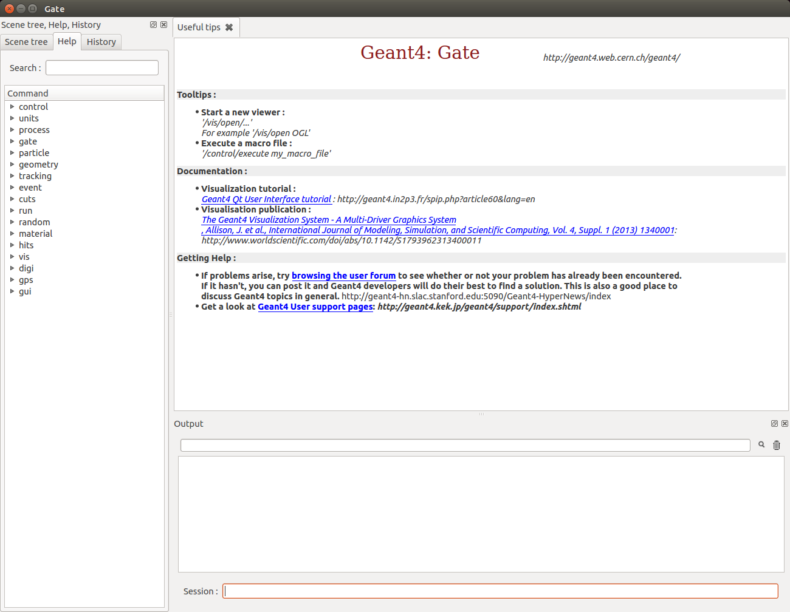
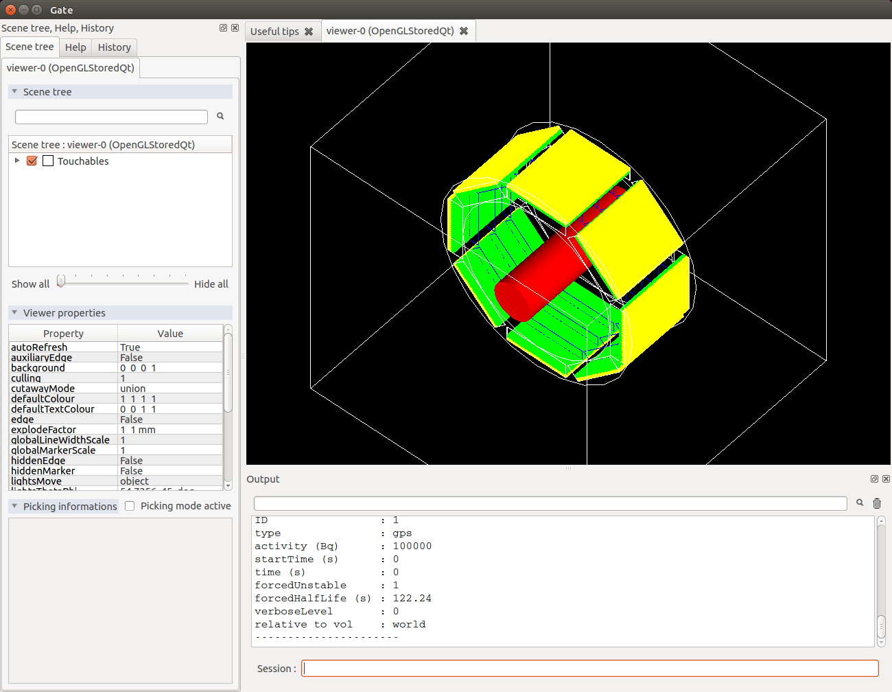

How to run Gate
===============

.. contents:: Table of Contents
   :depth: 15
   :local:

Interactive mode
----------------

To start Gate in interactive mode, simply type::

   $ Gate

and the following output (or something similar) will appear on the screen::

   1  [G4] *************************************************************
   2  [G4]  Geant4 version Name: geant4-10-03    (4-December-2015)
   3  [G4]                       Copyright : Geant4 Collaboration
   4  [G4]                       Reference : NIM A 506 (2003), 250-303
   5  [G4]                             WWW : http://cern.ch/geant4
   6  [G4] *************************************************************
   7  [G4] 
   8  [Core-0] Initialization of geometry
   9  [Core-0] Initialization of physics
   10 [Core-0] Initialization of actors
   11 [Core-0] 
   12 [Core-0] **********************************************************************
   13 [Core-0]  GATE version name: gate_v8.0                                        
   14 [Core-0]                     Copyright : OpenGATE Collaboration                
   15 [Core-0]                     Reference : Phys. Med. Biol. 49 (2004) 4543-4561  
   16 [Core-0]                     Reference : Phys. Med. Biol. 56 (2011) 881-901    
   17 [Core-0]                     WWW : http://www.opengatecollaboration.org        
   18 [Core-0] **********************************************************************
   19 [Core-0] 
   20 [Core-0] You are using Geant4 version 10.3.0
   21 Idle> 

This output will vary depending on your Gate installation, that is which version of Geant4 software was installed and how it was installed. 

Line 2 indicates the version of the Geant4 software in your installation.
Lines 8-10 are initialization messages from Geant4. 
Line 13 indicates the version of the Gate software you are using.
Finally, and if everything went right, then Gate outputs the interpreter command prompt (line 21). This means Gate is ready to read commands entered by the user.

If you are not yet familiar with Gate commands, you can get help by typing *ls*::

   1	Idle> ls
   2	Command directory path : /
   3	 Sub-directories :
   4	   /control/   UI control commands.
   5	   /units/   Available units.
   6         /process/   Process Table control commands.
   7         /gate/   GATE detector control.
   8         /particle/   Particle control commands.
   9         /geometry/   Geometry control commands.
   10        /tracking/   TrackingManager and SteppingManager control commands.
   11        /event/   EventManager control commands.
   12        /cuts/   Commands for G4VUserPhysicsList.
   13        /run/   Run control commands.
   14        /random/   Random number status control commands.
   15        /material/   Commands for materials
   16        /hits/   Sensitive detectors and Hits
   17        /vis/   Visualization commands.
   18        /digi/   DigitizerModule
   19        /gps/   ...Title not available...
   Commands : 

When the *Sub-directories* names end with a \\ (slash), 
it means you can go deeper in that sub-directory.
For instance, let's say you want to find out more about how to run macros::

   1      Idle> ls /control
   2      Command directory path : /control/
   3
   4
   5      Guidance :
   6      UI control commands.
   7
   8       Sub-directories : 
   9         /control/cout/   Control cout/cerr for local thread.
   10        /control/matScan/   Material scanner commands.
   11      Commands : 
   12        macroPath * Set macro search pathwith colon-separated list.
   13        execute * Execute a macro file.
   14        loop * Execute a macro file more than once.
   15        foreach * Execute a macro file more than once.
   16        suppressAbortion * Suppress the program abortion caused by G4Exception.
   17        verbose * Applied command will also be shown on screen.
   18        saveHistory * Store command history to a file.
   19        stopSavingHistory * Stop saving history file.
   20        alias * Set an alias.
   21        unalias * Remove an alias.
   22        listAlias * List aliases.
   23        getEnv * Get a shell environment variable and define it as an alias.
   24        getVal * Get the current value of the UI command and define it as an alias.
   25        echo * Display the aliased value.
   26        shell * Execute a (Unix) SHELL command.
   27        manual * Display all of sub-directories and commands.
   28        createHTML * Generate HTML files for all of sub-directories and commands.
   29        maximumStoredHistory * Set maximum number of stored UI commands.
   30        if * Execute a macro file if the expression is true.
   31        doif * Execute a macro file if the expression is true.
   32        add * Define a new alias as the sum of two values.
   33        subtract * Define a new alias as the subtraction of two values.
   34        multiply * Define a new alias as the multiplification of two values.
   35        divide * Define a new alias as the division of two values.
   36        remainder * Define a new alias as the remainder of two values.

A *\** at the end of the *Sub-directories* names means that it is the
last level for that subdirectory.
In line 13, it is explained that the command **/control/execute** executes a macro file. This command basically reads
the macro file and executes the lines as they appear in the file. Suppose, you
have a file named *myScanner.mac* that contains all the necessary commands
to run a particular simulation. Then type::

    1	Idle> /control/execute myScanner.mac

to run the macro file. The macro file *myScanner.mac* can contain additional
**/control/execute** commands to run other macro files and so on. Gate will read
and execute those files in the order in which they appear. Notice that 
**/control/execute** does not start a simulation (data acquisition), it simply reads the 
commands and executes them.
The command that starts the actual simulation is **/gate/application/startDAQ**, which is
usually the last command found in you macro files. 

Depending on the level of verbosity that you have specified
in your macro, you will see more or less messages about the simulation. If your
simulation contains visualization commands, you will see an OpenGL window appear with
a beautiful picture of your scanner.

At the end of your simulation, the command line interpreter prompt will appear again.
To exit the interpreter, type::

   Idle> exit
   Graphics systems deleted.
   Visualization Manager deleting...

You can display the help typing this command::

   $ Gate -h

and the following output (or something similar) will appear on the screen::

   [Core-0] Gate command line help
   [Core-0] Usage: Gate [OPTION]... MACRO_FILE
   [Core-0] 
   [Core-0] Mandatory arguments to long options are mandatory for short options too.
   [Core-0]   -h, --help             print the help
   [Core-0]   -v, --version          print the version
   [Core-0]   -a, --param            set alias. format is '[alias1,value1] [alias2,value2] ...'
   [Core-0]   --d                    use the DigiMode
   [Core-0]   --qt                   use the Qt visualization mode

Running GATE in Qt mode
-----------------------

First you need to compile Geant4 with the variable 'GEANT4_USE_QT' setting to 'ON'.
You can visualize the position of your system using the Qt mode.

Then you need to type the following command to your console::

   $ Gate --qt

A window will display:

   Gate Qt

Afterwards you can launch your macro GATE using the 'Session:' section and typing /control/execute benchPET.mac.
You will be able to visualize your system in the viewer windows:

   Gate Qt

In order to use Qt you have to write this line in your GATE macro::

   /vis/open OGLSQt

IMPORTANT!!!: Qt visualization mode is a visualization after the simulation. In fact you could zoom, translate, etc... only at the end of the simulation.

Running parameterized macros
----------------------------

It is very common for users to run several simulations that differ in only a few parameters.
For instance, a user might have designed a small animal PET scanner and would like to estimate
its performance for five different crystal materials and three energy windows. 
In that case, the user does not
need to write a complete set of macros for each simulation scenario. Instead, he
can write parameterized macros. The actual values of the parameters are specified on the command
line when running Gate or they can be defined with the interpreter.

For instance, suppose we want to parameterize the lower and upper level energy discriminators 
and the length of coincidence window. Here is the corresponding macro command lines::

   #       D I G I T I Z E R
   1	/gate/digitizer/Singles/insert adder
   2	/gate/digitizer/Singles/insert readout
   3	/gate/digitizer/Singles/readout/setDepth 1
   4	/gate/digitizer/Singles/insert blurring
   5	/gate/digitizer/Singles/blurring/setResolution 0.26
   6	/gate/digitizer/Singles/blurring/setEnergyOfReference 511. keV
   7	/gate/digitizer/Singles/insert thresholder
   8	/gate/digitizer/Singles/thresholder/setThreshold {lld} keV
   9	/gate/digitizer/Singles/insert upholder
   10	/gate/digitizer/Singles/upholder/setUphold {uld} keV
   #       C O I N C I D E N C E   S O R T E R
   11	/gate/digitizer/Coincidences/setWindow {CoincWindow} ns

Lines 8, 10, and 11 define aliases for the lower level discriminator,
the upper level discriminator, and the length of the coincidence window, respectively.

An alias is always specified between **{** and **}** (curled brackets) and it can consist
of any set of characters. 

To pass actual values to the macro file, you can run Gate, for instance, as follows::

   $ Gate -a [CoincWindow,10][lld,350][uld,650]

It is worth emphasizing the following points about aliases:

* The order of the aliases at the command line does not matter.
* Aliases are case sensitive, so **[lld,350]** is not the same as **[LLD,350]**.
* All aliases in your macro file(s) must be defined when you run Gate. If some are undefined the simulation will fail.

How to launch *DigiGate*
------------------------

GATE offers an operating mode dedicated to digitizer optimization, known as *DigiGate* (see :ref:`digitizer_and_readout_parameters-label`). *DigiGate* works by re-reading a previously generated ROOT hit-file.

The use of **DigiGate** consists of two steps. 

* In the first step, the simulation runs according to **MacroTest.mac**. This macro file should save the **Hits** data in the root output file with the name **gate.root** (which is the default name). 
* In the second step, the digitizer modifications are made in **MacroTest.mac** (like a new module for the energy resolution, or a different dead-time...), and then the analysis is repeated by using the **gate.root** file as an input file for the program **DigiGate**. This is achieved by launching **Gate** with a '-d' option::

    Gate < MacroTest.mac

-> a root output file is produced with *Hits* information.

-> the digitizer of MacroTest.mac is changed along with the name of the root output file::

   Gate --d < MacroTest.mac 

-> a new root output file is produced which incorporates the changes due to a different digitizer without having to repeat the particle generation and
its propagation.
user can use the following GATE command to read the hit file replaced the name **gate.root**::

   /gate/hitreader/setFileName FileName

How to separate the phantom and detector tracking - Phase space approach
------------------------------------------------------------------------

To speed-up the simulation, it is possible to split and separate the particle tracking. This is a phase space approach with the possibility to store the phantom tracking particle history in a root file and to use it as an input file for the detector tracking.

Using Gate in the tracker mode: phantom tracking
~~~~~~~~~~~~~~~~~~~~~~~~~~~~~~~~~~~~~~~~~~~~~~~~

Basically, as illustrated in the folder example_TrackerDetector, 3 major command lines are available to use the phantom tracker mode::

   # Selection of the tracking mode
   #
   /gate/stepping/SetMode Tracker
   #
   # Setting of the policy regarding the tracker mode
   #
   /gate/stepping/SetPolicy Option1
   /gate/stepping/SetPolicy Option2

The **Option1** variable  can be chosen from the following list:

* StopOnPhantomBoundary (Default): the particles are tracked until the last hit before the phantom boundary ;
* StopAfterPhantomBoundary: the particles are traked until the first hit after phantom boundary ;
* KillTrackAndSecondaries: StopOnPhantomBoundary + no secondary production.

The **Option2** variable may be chosen from:

* KeepAll (Default): all particles (primary and secondary) are stored
* KeepOnlyPrimaries: only source particles are stored
* KeepOnlyPhotons: only photons are stored
* KeepOnlyElectrons: only electrons are stored

Two additional command line options are also available::

   /gate/stepping/SetEnergyThreshold aThreshold keV

WIth this option, only particles reaching the phantom boundary with an energy greater than a threshold in energy of **aThreshold** (expressed in keV) will be stored::

   /gate/stepping/SetTextOutput status

with a status flag set as On or Off. This command will print *Tracks* information in the PostStepInfo.txt file.

Finally the tracker mode acquisition will generate N root files named OutPutRoot_TrackerData_number.root.
The base output name, which is OutPutRoot in the case of this example, is chosen by the user with the usual output command line to set the file name::

   /gate/output/root/setFileName OutPutRoot

Using Gate in the detector mode: detector tracking
~~~~~~~~~~~~~~~~~~~~~~~~~~~~~~~~~~~~~~~~~~~~~~~~~~

During the tracker mode acquisition, N files are generated with the following name architecture:

* OutPutRoot_TrackerData.root
* OutPutRoot_TrackerData_1.root
* OutPutRoot_TrackerData_2.root
* ...
* OutPutRoot_TrackerData_(N-1).root

To use the Detector Mode, the user must select the mode and specify that N TrackerData files were
generated during the tracker mode. All this can be done using the 2 following command lines::

   /gate/stepping/SetMode Detector
   /gate/stepping/SetNumberOfTrackerDataFiles N

New commands in detector mode
~~~~~~~~~~~~~~~~~~~~~~~~~~~~~~~~~~~~~~~~~~~~~~~~~~

In Detector Mode, we need to tell GATE that N TrackerData files were generated during tracker mode and we should use these command lines::

   /gate/stepping/SetMode Detector
   /gate/stepping/SetNumberOfTrackerDataFiles N

Batch mode
----------

It is possible to run a Gate simulation in *batch* mode, i.e. without the need to enter the interpreter and run the **/control/execute** and
**exit** commands each time.

If you want to run simulations in *batch* mode, you can do so by typing the alias values or (--qt parameter) before the file name of the macro you want to run. For example::

   $ Gate -a [CoincWindow,10][lld,350][uld,650] myScanner.mac

Or::

   $ Gate --qt myScanner.mac

In order to return to command prompt, the last line in **myScanner.mac** file must be::

   exit

This is very important, especially when you are running a series of simulations in sequence. If Gate does not find the exit
command, it will return to the user interface prompt and the rest of the simulations will not run.

It is recommended to redirect the terminal output of the simulation (listing of physics processes, sources, run time, etc.) by writing it to a text file instead of printing it in the terminal. This allows one to store the terminal output of each simulation for later viewing. For example::

   $ Gate -a [CoincWindow,10][lld,350][uld,650] myScanner.mac > terminal_output.txt

The above command creates a file named terminal_output.txt and does not print to the terminal window.

When running multiple simulations simultaneously from the command line in batch mode, it is often desirable to have the process run in the background. This can be accomplished by inserting an ampersand "&" symbol at the end of the command. For example::

   $ Gate -a [CoincWindow,10][lld,350][uld,650] myScanner.mac > terminal_output.txt &

It is recommended (although not compulsory) to avoid running visualization commands in batch mode.
