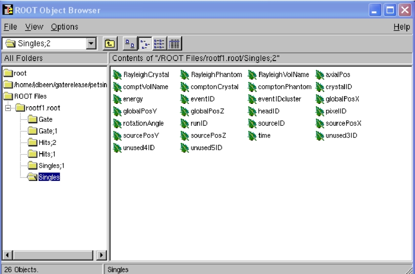

How to use Gate on a Cluster
============================

.. contents:: Table of Contents
   :depth: 15
   :local:

To reduce the overall computing time of GATE experiments, a parallel computing platform for running simulations in a cluster of computers was developed which significantly shortens the setup time and provides fast data output handling. To use Gate in cluster mode you need 3 components:

* The job splitter (gjs)
* The file merger (gjm)
* A cluster aware version of Gate

Installation of the job splitter (gjs)
--------------------------------------

The job splitter can be installed in the same directory as Gate. Two environment variables are already added to the environment file used to compile Gate (but you can customize them)::

    export GC_DOT_GATE_DIR=/somedir/
    export GC_GATE_EXE_DIR=/somedir/bin/Linux-g++/

The first variable indicates the location of a hidden directory called .Gate. The directory will contain the split macros for each part of the simulation. Even when splitting the same macro several times, a new directory will be created for each instance (with an incremental number). In normal circumstances, one does not need to look into it. In case of an error, it can be used to run only a specific part of a simulation again (See :ref:`what_about_errors-label`).

The second environment variable indicates the location of the job splitter executable. As the Gate environment file will be used to compile the job splitter source code, the executable will likely be located in the same directory as the Gate executable. 

To install, load the Gate/Geant4 environment variables, go to the job splitter directory (bash example)::

   source env_gate.sh
   cd jobsplitter
   make

By default, the executable will be created in the jobsplitter directory. If the GATEHOME variable is correctly defined, the executable will also be copied in the same directory as the Gate executable (same for the dynamic library).

Installation of the file merger (gjm)
-------------------------------------

To install, it is the same way, go to the file merger directory and compile (bash example)::

   cd filemerger
   make

The file merger executable is located in the current directory (and will also be copied in the Gate bin directory as for the gjs program).

Preparing your macro
--------------------

The cluster software should be able to handle all GATE macros. However, only ROOT is currently supported as an output format for the gjm program. So be aware that other output formats cannot yet be merged with the gjm program and you will have to do this on  your own (but it is usually quite simple ~ addition or mean most of the time).

If an isotope with a shorter half life than the acquisition time is simulated, then it may be useful to specify the half life in your macro as follows::

    /gate/cluster/setTimeSplitHalflife 6600. s

This way, the CPU time will be approximately equal for each job.

In planning simulation time, it is important to be aware that Gate simulations currently seem to benefit only from the addition of physical CPUs. A computer with 8 hyper-threaded physical CPU cores (16 logical CPUs) will have the same computational efficiency if 8 processes are run simultaneously as it would with 16 simultaneous processes.

Using the job splitter
----------------------

To view information regarding general usage, you can run the job splitter executable without any options::

    +-------------------------------------------+
    | gjs -- The GATE cluster job macro spliter |
    +-------------------------------------------+
   
    Usage: gjs [-options] your_file.mac
   
    Options (in any order):
    -a value alias             : use any alias
    -numberofsplits, -n   n    : the number of job splits; default=1
    -clusterplatform, -c  name : the cluster platform, name is one of the following:
                                 openmosix - condor - openPBS - xgrid
                                 This executable is compiled with condor as default
   
    -openPBSscript, os         : template for an openPBS script 
                                 see the example that comes with the source code (script/openPBS.script)
                                 overrules the environment variable below
   
    -condorscript, cs          : template for a condor submit file
                                 see the example that comes with the source code (script/condor.script)
    -v                         : verbosity 0 1 2 3 - 1 default 
   
    Environment variables:
    GC_DOT_GATE_DIR  : indicates the .Gate directory for splitted mac files
    GC_GATE_EXE_DIR  : indicates the directory with the Gate executable
    GC_PBS_SCRIPT : the openPBS template script (!optionnal variable!)
   
    Usage (bash):
      export GC_DOT_GATE_DIR=/home/user/gatedir/
      export GC_GATE_EXE_DIR=/home/user/gatedir/bin/Linux-g++/
   
    Examples:
      gjs -numberofsplits 10 -clusterplatform openmosix macro.mac
      gjs -numberofsplits 10 -clusterplatform openmosix -a /somedir/rootfilename ROOT_FILE macro.mac
      gjs -numberofsplits 10 -clusterplatform openPBS -openPBSscript /somedir/script macro.mac
      gjs -numberofsplits 10 -clusterplatform xgrid macro.mac
      gjs -numberofsplits 10  /somedir/script macro.mac

The supported platforms are currently: openMosix, openPBS, Condor and Xgrid.

Let's take openMosix as an example::

    gjs -numberofsplits 5 -clusterplatform openmosix macro.mac  

The job splitter will subdivide the simulation macro into fully resolved, non-parameterized macros. In this case there are 5 such macros. They are located in the .Gate directory, as specified by the GC_DOT_GATE_DIR environment variable. 

A list of all the data output options is given after successful completion, as well as a list of all activated actors. The user is asked to clearly enable each needed output module and to give them an output file name. It is the same for actors. Remember that by default, no output module nor actor is enabled.

If an alias was expected for output files and it was not supplied, then this will be mentioned in the output options list. A standard name will be supplied automatically, as well as appropriate numbering.

The time of each sub-macro is manage using a virtual timeStart and a virtual timeStop calculated by the gjs and used by the command /gate/application/startDAQCluster. All defined runs and geometry updates will be totally respected. The only inconsistency in the use of gjs is when using the projection output: the virtualStop minus virtualStart time have to be a multiple of timeSlice, otherwise the GateToProjectionSet output will lead to an error.

The .Gate directory will have a subdirectory called as the macro name, that contains the following files::

   macro1.mac 
   macro2.mac 
   macro3.mac 
   macro4.mac 
   macro5.mac 
   macro.split  

The 5 macros are listed as well as well as the .split file that contains information about the splitted simulation and that will be used to merge the data after the simulation (using the gjm program). The current directory, from which the jobsplitter was called, now contains the cluster submit file. In order to run the split simulation on the cluster, one only needs to execute or call this file with a certain program (depending on the cluster platform used).

The .Gate directory supports automatic numbering. If the same macro is used repeatedly, then the subsequent directories will be numbered using an incremental number.

Using the file merger
---------------------

The file merger have to be run giving the split file as input. To view information on general usage, just run the file merger executable without any options::

    +-------------------------------------------+
    | gjm -- The GATE cluster job output merger |
    +-------------------------------------------+
   
    Usage: gjm [-options] your_file.split
   
    You may give the name of the split file created by gjs (see inside the .Gate directory).
    !! This merger is only designed to ROOT output. !!
   
    Options: 
    -outDir path              : where to save the output files default is PWD
    -v                        : verbosity 0 1 2 3 - 1 default 
    -f                        : forced output - an existing output file will be overwritten
    -cleanonly                : do only a the cleanup step i.e. no merging
                                erase work directory in .Gate and the files from the parallel jobs
    -cleanonlyTest            : just tells you what will be erased by the -cleanonly
    -clean                    : merge and then do the cleanup automatically
    -fastMerge                : correct the output in each file, to be used with a TChain (only for Root output)
   
    Environment variable: 
    GC_DOT_GATE_DIR : points to the .Gate directory

To merge the output files into a single file, just supply the split file to the file merger. The output file could be used as a usual single CPU output file::

    gjm macro.split
   
    Combining: ./rootf1.root ./rootf2.root ./rootf3.root ./rootf4.root ./rootf5.root $->$ ./rootf.root 

In case a single output file is not required, it is possible to use the option **fastMerge**. This way, the eventIDs in the ouput files are corrected locally. :numref:`Rootexample` shows the newly created tree in each ROOT file.

   Example of ROOT file with added cluster eventIDs

A ROOT chain, which is a list of files containing the same tree, is then required to link the output files together for analysis. A chain for the Singles could be made as follows (in a file called chain.c)::  

   \{ 
   gROOT->Reset(); 
   TChain chain("Singles"); 
   chain.Add("rootf1.root"); 
   chain.Add("rootf2.root"); 
   chain.Add("rootf3.root"); 
   chain.Add("rootf4.root"); 
   chain.Add("rootf5.root"); 
   \} 

Once all files are added to the chain, one can use the chain as a regular Ttree, and the normal ROOT prompt is returned::

    $root chain.c  
   
   FreeType Engine v2.1.3 used to render TrueType fonts. 
   Compiled for linux with thread support. 
   CINT/ROOT C/C++ Interpreter version 5.15.94, June 30 2003 
   Type ? for help. Commands must be C++ statements. 
   Enclose multiple statements between \{ \}. 
   root [0]  
   Processing chain.c... 
   root [1]  
   root [1] Singles->Draw("energy")

Alternative to the file merger
------------------------------

Root files can also be merged by using the **hadd** utility on the command line::

   hadd result.root file1.root file2.root ... filen.root

.. _what_about_errors-label:

What about errors?
------------------

If something went wrong during a simulation and a ROOT file is corrupted or incomplete, then this will be detected by the file merger. There are two options. First, one can restart only the specific part of the simulation that went wrong. This can be easily done, as the ROOT files are numbered and one can edit the submit file so it only launches that specific part. Alternatively, one can find the macro file that was used to start that part of the simulation in the .Gate directory and start the simulation directly with the macro file and its corresponding seed file.  

The second option is to edit the split file, located in the .Gate directory. Once the reference to the corrupted root file is removed from it, it is possible to merge the files again. At this point, the eventIDs will not be valid anymore.
