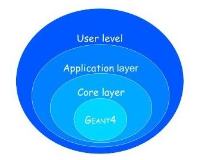

Introduction
============

.. figure:: gate_logo.png
   :alt: Figure 1: GoldGate
   :name: GoldGate

.. contents:: Table of Contents
   :depth: 15
   :local:

GATE a Monte-Carlo simulation toolkit for medical physics applications

Authors
-------

- OpenGATE collaboration : http://www.opengatecollaboration.org
- OpenGATE spokesperson: L. Maigne (LPC UMR 6533 CNRS/IN2P3, Clermont-Ferrand, France)
- OpenGATE technical coordinator: D. Sarrut (CREATIS UMR CNRS 5220, Lyon, France)
- Gate authors: `authors <https://github.com/OpenGATE/Gate/blob/develop/AUTHORS>`_
- Members of the OpenGATE Collaboration: `members <http://www.opengatecollaboration.org/Members>`_
- Special Thanks: `Geant4 Collaboration <https://geant4.web.cern.ch/>`_ and LOW energy WG

Forewords
---------

Monte Carlo simulation is an essential tool in emission tomography to
assist in the design of new medical imaging devices, assess new
implementations of image reconstruction algorithms and/or scatter
correction techniques, and optimise scan protocols. Although dedicated
Monte Carlo codes have been developed for Positron Emission Tomography
(PET) and for Single Photon Emission Computerized Tomography (SPECT),
these tools suffer from a variety of drawbacks and limitations in terms
of validation, accuracy, and/or support (Buvat). On the other hand,
accurate and versatile simulation codes such as GEANT3 (G3), EGS4, MCNP,
and GEANT4 have been written for high energy physics. They all include
well-validated physics models, geometry modeling tools, and efficient
visualization utilities. However these packages are quite complex and
necessitate a steep learning curve.

GATE, the *GEANT4 Application for Tomographic Emission* (MIC02, Siena02,
ITBS02, GATE, encapsulates the GEANT4 libraries in order to achieve a
modular, versatile, scripted simulation toolkit adapted to the field of
nuclear medicine. In particular, GATE provides the capability for
modeling time-dependent phenomena such as detector movements or source
decay kinetics, thus allowing the simulation of time curves under
realistic acquisition conditions.

GATE was developed within the OpenGATE Collaboration with the objective
to provide the academic community with a free software, general-purpose,
GEANT4-based simulation platform for emission tomography. The
collaboration currently includes 21 laboratories fully dedicated to the
task of improving, documenting, and testing GATE thoroughly against most
of the imaging systems commercially available in PET and SPECT
(Staelens, Lazaro).

Particular attention was paid to provide meaningful documentation with
the simulation software package, including installation and user's
guides, and a list of FAQs. This will hopefully make possible the long
term support and continuity of GATE, which we intend to propose as a new
standard for Monte Carlo simulation in nuclear medicine.

In name of the OpenGATE Collaboration

Christian MOREL CPPM CNRS/IN2P3, Marseille, 2004

Overview
--------

GATE combines the advantages of the GEANT4 simulation toolkit well-validated
physics models, sophisticated geometry description, and powerful visualization
and 3D rendering tools with original features specific to emission tomography.
It consists of several hundred C++ classes. Mechanisms used to manage time,
geometry, and radioactive sources form a core layer of C++ classes close to the
GEANT4 kernel :numref:`GATE_layers`. An application layer allows for the
implementation of user classes derived from the core layer classes, e.g.
building specific geometrical volume shapes and/or specifying operations on
these volumes like rotations or translations. Since the application layer
implements all appropriate features, the use of GATE does not require C++
programming: a dedicated scripting mechanism - hereafter referred to as the
macro language - that extends the native command interpreter of GEANT4 makes it
possible to perform and to control Monte Carlo simulations of realistic setups.

   Structure of GATE

One of the most innovative features of GATE is its capability to synchronize all
time-dependent components in order to allow a coherent description of the
acquisition process. As for the geometry definition, the elements of the
geometry can be set into movement via scripting. All movements of the
geometrical elements are kept synchronized with the evolution of the source
activities. For this purpose, the acquisition is subdivided into a number of
time-steps during which the elements of the geometry are considered to be at
rest. Decay times are generated within these time-steps so that the number of
events decreases exponentially from time-step to time-step, and decreases also
inside each time-step according to the decay kinetics of each radioisotope. This
allows for the modeling of time-dependent processes such as count rates, random
coincidences, or detector dead-time on an event-by-event basis. Moreover, the
GEANT4 interaction histories can be used to mimic realistic detector output. In
GATE, detector electronic response is modeled as a linear processing chain
designed by the user to reproduce e.g. the detector cross-talk, its energy
resolution, or its trigger efficiency.

The first users guide was organized as follow: chapter 1 of this document guides
you to get started with GATE. The macro language is detailed in Chapter 2.
Visualisation tools are described in Chapter 3. Then, Chapter 4 illustrates how
to define a geometry by using the macro language, Chapter 5 how to define a
system, Chapter 6 how to attach sensitive detectors, and Chapter 7 how to set up
the physics used for the simulation. Chapter 8 discusses the different
radioactive source definitions. Chapter 9 introduces the digitizer which allows
you to tune your simulation to the very experimental parameters of your setup.
Chapter 10 draws the architecture of a simulation. Data output are described in
Chapter 11. Finally, Chapter 12 gives the principal material definitions
available in GATE. Chapter 13 illustrates the interactive, bathc, or cluster
modes of running GATE.

The GATE mailing list
---------------------

You are encouraged to participate in the dialog and post your suggestion or even implementation on the
Gate-users mailing list, the GATE mailing list for users.
You can subscribe to the Gate-users mailing list, by `signing up to the gate-users mailing list <https://listserv.in2p3.fr/cgi-bin/wa?A0=OPENGATE-L>`_.

If you have a question, it is possible that it has been asked and answered before, and stored in the `archives <https://listserv.in2p3.fr/cgi-bin/wa?A0=OPENGATE-L>`_ or `old archives <https://lists.opengatecollaboration.org/pipermail/gate-users/>`_.
These archives are public and are indexed by the usual search engines. By starting your Google search string with *site:lists.opengatecollaboration.org* you'll get list of all matches of your search on the gate-users mailing list, e.g. `site:lists.opengatecollaboration.org pencilbeam <https://www.google.com/search?q=site%3Alists.opengatecollaboration.org+pencilbeam>`_.

The GATE project on GitHub
--------------------------

GATE project is now publicly available on `GitHub <https://github.com/OpenGATE/Gate>`_. You can use this to:

* Check out the bleeding edge development version
* Report bugs by creating a new `issue <https://github.com/OpenGATE/Gate/issues>`_. (If you are not entirely sure that what you are reporting is indeed a bug in Gate, then please first check the `gate-users mailing list <http://lists.opengatecollaboration.org/mailman/listinfo/gate-users>`_.)
* Contribute to Gate by changing the source code to fix bugs or implement new features:

  * Get a (free) account on GitHub, if you do not have one already.
  * `Install Git <https://git-scm.com/download/linux>`_ on the computer where you do your development, if it has not yet been installed already. And make sure to configure git `with your name <https://help.github.com/articles/setting-your-username-in-git/>`_ and `with your email address <https://help.github.com/articles/setting-your-commit-email-address-in-git/>`_.
  * Start by `making a fork <https://help.github.com/articles/fork-a-repo/>`_ of the GATE public repository (click the "Fork" button in the upper right corner on the `Gate main page <https://github.com/OpenGATE/Gate/>`_ on GitHub.
  * Note that we use the *develop* branch to collect all the bleeding edge developments and the *master* to track the releases. In the future we may merge these two, and use only *master*, like it's done in most other projects on GitHub. Releases are defined using "tags".
  * Then clone your own fork: *git clone https://github.com/YOUR_USERNAME/Gate.git* to get the code on the computer that you will use to develop and compile Gate.
  * Make a new branch, dedicated to the bugfix or new feature that want to implement in Gate. You can either create the branch first on GitHub and then *git pull* it to your clone, or create it directly in your clone and *git push* it later. Make sure that your branch is based on the *develop* branch. Note that after creating your branch you also need to check it out.
  * With *git branch -l* you can check which branches are available in your clone and which one is currently checked out. With *git checkout <branchname>* you can change between branches. Be careful not to do this when you still have uncommitted changes (unless you deliberately want to undo those changes).
  * Now: implement your bugfix or your new feature and *commit* your changes to your new branch. It's usually better to make many small commits than a single big one (though it is of course also desirable that every commit leaves the code in a compilable state). Please provide `concise but informative commit messages <https://gist.github.com/robertpainsi/b632364184e70900af4ab688decf6f53>`_ ! Use *git push* to upload your commits to (your fork on) GitHub. This facilitates developing on multiple machines and also avoids loss of time and effort in the unfortunate event of a hardware failure.
  * If you are working for a longer time on your fix or new feature, like a few days, weeks or even months, then it is important to make sure to `keep your fork in sync with the upstream repository <https://help.github.com/articles/syncing-a-fork/>`_.
  * Once you are convinced that your code is OK, make sure it's all pushed to your fork on GitHub. Then:

    1) Create a `pull-request <https://help.github.com/articles/using-pull-requests/>`_ from the branch on your Gate repository to the official Gate repository
    2) Provide an example that tests your new feature
    3) If you implemented a new feature, have the associated documentation ready
    4) Inform these three people from the collaboration (Sebastien Jan, David Sarrut and David Boersma) who will then get in touch with you to integrate your changes in the official repository.

  * For your next bugfix or new feature you do not need to make a new fork, you can use the existing one. But before doing any new work you should make sure to `synchronize <https://help.github.com/articles/syncing-a-fork/>`_ the *develop* branch in your fork with the "upstream" (main) *develop* branch:

    1) Check your "remote repositories" with *git remote -v*
    2) The "origin" repository should be your own fork on GitHub, *https://github.com/YOUR_USERNAME/Gate*.
    3) The "upstream" repository should be the main Gate one, that is *https://github.com/OpenGATE/Gate*.
    4) If your clone does not yet have an "upstream", then add it with *git remote add upstream https://github.com/OpenGATE/Gate*.
    5) Run *git status* to make sure that you checked out the *develop* branch, and *git pull* to make sure that it is in sync with your fork on GitHub and that there no uncommitted edits.
    6) Then run *git fetch upstream*, followed by *git merge upstream/develop*.
    7) Now you are ready to create new branches for new bugfixes and features.

* For more detailed references, recipes, and tutorials on git: please check the web. When copypasting commands, remember that in Gate the "develop" branch currently plays the role of the "master" branch. Our "master" branch is used to track the releases. You will not find the latest bleeding edge code on it. We may change this policy in the near future, to be more conforming to the predominant conventions.

.. include:: gatert.rst

