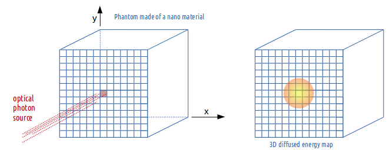

Nanoparticle mediated hyperthermia
==================================

.. contents:: Table of Contents
   :depth: 15
   :local:

Pre-requisite
-------------

To use the nanoparticle mediated hyperthermia capabilities of GATE, you have to install ITK and turn the CMake flag GATE_USE_ITK to ON in the configuration process using ccmake. Please find detailed instructions here: :ref:`installation_guide-label`

Theory
------

Optical photon deposited energy map
~~~~~~~~~~~~~~~~~~~~~~~~~~~~~~~~~~~

The optical photons emitted by an illumination light (i.e. laser) will be absorbed by the tissues (*OpticalAbsorption process*) or/and by a tissue loaded with a certain concentration of nanoparticles (*NanoAbsorption process*). 

In GATE, the optical photon is transported following a step length which is randomly sampled using the mean free path of each physics process associated to the optical photon. The mean free path of the optical photon interaction with the *nanoparticle-infused* medium is :math:`L_a`. The inverse of the absorption length is referred to as the absorption coefficient (:math:`\mu_a`) and is a function of the density of nanoparticles in the medium (N in m-3) and the nanoparticle absorption cross-section area (:math:`C_{abs}` in m²) : 
:math:`\mu_a = N \times C_{abs}`.

Pennes bioheat model and the analytical solution
~~~~~~~~~~~~~~~~~~~~~~~~~~~~~~~~~~~~~~~~~~~~~~~~

The mathematical model that describes the thermal behavior in biological perfused tissues is the Pennes bioheat model :

:math:`\frac{\partial T(x,y,z,t)}{\partial t} = \frac{k}{\rho c} \nabla^2 T(x,y,z,t) + \frac{\rho_b c_b}{\rho c} w_b [T_a(x,y,z,t)-T(x,y,z,t)] + Q(x,y,z,t)`

where :math:`Q` represents the energy deposition by any external heat source such as the metabolic heat production in the tissue and is considered to be 0.

The first term of the equation describes the transfer of energy between objects in contact (i.e. conduction); the second term accounts for the effects of blood perfusion in tissues. 
:math:`k, \rho` and :math:`c` are the biological tissue thermal conductivity, density and specific heat. Values for blood are given by :math:`\rho_b` and :math:`c_b`; :math:`w_b` is the tissue blood perfusion rate which represents the volume of fluid (i.e. blood) that passes per unit time and per tissue volume. :math:`T_a` is the temperature of blood in the main arteries and :math:`T(x,y,z,t)` is the local tissue temperature. Pennes equation is solved analytically via Fourier transformations and convolution theorem. 
The analytical solution to the Pennes bioheat equation is 

:math:`T(x,y,z,t) = [T(x,y,z,0)-T_a] \otimes \frac{1}{(4\pi K_1 t)^{3/2}} e^{{x^2+y^2+z^2}/4K_1t} \times e^{-K_2t} + T_a`

with :math:`K_1 = \frac{k}{\rho c}` the tissue thermal diffusivity.

The solution of the diffusion equation is equivalent to convolving the initial conditions (3D energy map) with a Gaussian with a standard deviation :math:`\sigma = \sqrt{2t K_1}`. The blood perfusion term appears as an exponential function. The implementation of the heat diffusion in GATE is performed using the *Insight Segmentation and Registration Toolkit* (ITK) which is an open-source, cross-platform system that provides developers with an extensive suite of tools for image analysis.

Hybrid Monte-Carlo and analytical simulation: a dynamic process
~~~~~~~~~~~~~~~~~~~~~~~~~~~~~~~~~~~~~~~~~~~~~~~~~~~~~~~~~~~~~~~

During light illumination of a biological tissue, the thermal heat produced by the optical photons deposited energy does not accumulate locally in the tissue; it diffuses in biological tissues during illumination. This dynamic effect has been taken into account in the GATE code. The n seconds light illumination simulation is sampled into p time frame 3D images by setting the simulation parameter *setNumberOfTimeFrames* to p. Each of the p sample images is diffused for a duration of [1, 2, ..., p-1] x n/p seconds. The final voxelized image illustrating the heat distribution in the tissues at the end of the illumination time is obtained by adding all diffused images to the last n/p seconds illumination image. This thermal energy (or heat) map will then diffuse in the biological tissues by setting the simulation parameter *setDiffusionTime* to the value of interest. At a certain point in time after the initial temperature boost induced by nanoparticles, the temperature of the tissues will go back to its initial value due to diffusion. This boundary condition is taken into account in a post processing-step of the GATE simulation.

Illustration of the heat diffusion 3D map obtained by the ThermalActor
----------------------------------------------------------------------

In the following example, a cubic phantom made of a material defined with an absorption length :math:`L_a` and a thermal diffusivity is illuminated by a light source of optical photons with a certain photon flux (i.e. counts per second). The source direction is set perpendicular and positioned towards the phantom surface.  

   ThermalActor

The *ThermalActor* provides the 3D map of the deposited optical photon energy which has diffused during illumination. The actor outputs the following images : 

* FinalAbsorptionMap.img/hdr <= The image at the end of the light illumination (photon energy diffuses during illumination) 
* FinalHeatDiffusionMap.img/hdr <= The image after a certain diffusion time following the end of the light illumination

Command lines
-------------

Example::

   /gate/actor/addActor ThermalActor                 MyActor
   /gate/actor/MyActor/save                          3DMap.hdr
   /gate/actor/MyActor/attachTo                      phantom
   /gate/actor/MyActor/stepHitType                   random
   /gate/actor/MyActor/setPosition                   0. 0. 0. cm
   /gate/actor/MyActor/setVoxelSize                  0.5 0.5 0.5 mm

   Tissue thermal property : 
   /gate/actor/MyActor/setThermalDiffusivity         0.32 mm2/s

Density and heat capacity should just be in the same unit for both blood and tissue. In the following example, the density is in kg/mm3 and the heat capacity in mJ kg-1 C-1::

     /gate/actor/MyActor/setBloodDensity               1.06E-6
     /gate/actor/MyActor/setBloodHeatCapacity          3.6E6
     /gate/actor/MyActor/setTissueDensity              1.04E-6
     /gate/actor/MyActor/setTissueHeatCapacity         3.65E6
     /gate/actor/MyActor/setBloodPerfusionRate         0.004

     /gate/actor/MyActor/setDiffusionTime              5 s
     /gate/actor/MyActor/setNumberOfTimeFrames         5
