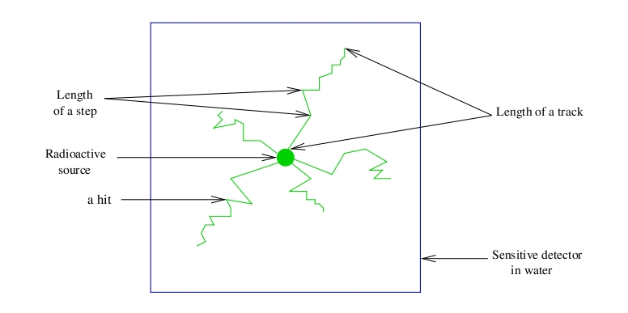

.. _attaching_the_sensitive_detectors-label:

Attaching the sensitive detectors
=================================

.. contents:: Table of Contents
   :depth: 15
   :local:

General purpose
---------------

Once a model has been defined for the scanner through the construction of a system (see :ref:`defining_a_system-label`), the next step is to attach a **sensitive detector** (SD) to some volumes of the geometry. As in any Geant4 simulation, these sensitive detectors are used to store information regarding interactions of a particle in the matter (*hits*) using information from the steps occuring along the particle track. A hit is a snapshot of a physical interaction of a track in a sensitive region of the detector. :numref:`Sensitive_detector` illustrates these notions. Hits contain various pieces of information associated to a step object, such as the energy deposition of a step, geometrical information, position and time of a step, etc.

   Particle interactions in a sensitive detector

GATE records and stores information related to the hits only for those volumes that are attached to a sensitive detector. All information regarding the interactions occuring in *non-sensitive* volumes is lost.

.. _the_crystalsd-label:

The crystalSD
~~~~~~~~~~~~~

The *crystalSD* is used to record information regarding interactions taking place inside the volumes belonging to a scanner for instance (crystals or collimators) : energy deposition, positions of interaction, origin of the particle (emission vertex), type of interaction (name of the physical processes involved), etc.

A *crystalSD* can be attached only to those volumes that belong to a given system. Once a *crystalSD* has been attached, it is considered as attached to this system. This sensitive detector can be attached using the command **attachCrystalSD**. These volumes are essentially meant to be scintillating elements (crystals) but can also be attached to non-scintillating elements such as collimators, shields or septa. 

Below is an example of command lines that should be included in a macro using the *crystalSD*. These command lines must be inserted after the description of the attachment to the system:

The first command is used to attach the scintillation crystal to the detection level *crystal* of the SPECThead system::
 
   /systems/SPECThead/crystal/attach crystal 

Then, the second command attaches the crystalSD to the volume representing the scintillation crystal in the geometry::
 
   /gate/crystal/attachCrystalSD
   
Sinse Gate9.3 it is possible to attach a Sensitive Detector without system defined::

   /gate/box2/attachCrystalSDnoSystem
   

The phantomSD
~~~~~~~~~~~~~

The *phantomSD* plays a crucial role in GATE simulations, as it is used to record information regarding Compton and Rayleigh interactions taking place in the volumes before the detection in the scanner system (e.g., for a SPECT camera, these volumes can be the table, phantom, and collimator, in which it can be relevant to retrieve information about Compton and Rayleigh interactions). These data can then be used to estimate whether a photon reaching a detector is a direct or a Compton-scattered photon. Thus, in PET, the *phantomSD* is currently the only way to discriminate scattered from true coincidences. To simulate low energy X-ray acquisitions (for example mammography acquisitions from 7 to 28 keV), information concerning Rayleigh interactions is significant.

Using this type of sensitive detector, it is possible to retrieve two pieces of information related to the hits: 

* The number of Compton and Rayleigh interactions occuring in all the volumes attached to the *phantomSD* : **nPhantomCompton** and **nPhantomRayleigh**. These pieces of information are also available for the *crystalSD* with the variables **nCrystalCompton** and **nCrystalRayleigh**. It is impossible to attach both sensitive detectors to the same volume. 
* The last volume attached to the *phantomSD* in which a Compton or a Rayleigh interaction occured: **compVolName** and **RayleighVolName**.

**IMPORTANT:** To retrieve data output information regarding hits occuring in the *phantomSD* (nPhantomCompton and compVolName), a *crystalSD* has to be defined in the simulation. Otherwise, data output variables will be created but will be empty. When all these conditions are satisfied, any interaction taking place within the field of view (FOV) of the scanner is automatically recorded by the *phantomSD*, so that the number of Compton interactions for each photon can be accurately computed. 

This procedure does not take into account Compton interactions taking place within the detectors, so that inter-crystal cross-talk via Compton interactions is not detected. Here is an example of command-lines that should be included within the macro in order to use the *phantomSD*. These command lines must be inserted after the description of the attachment to the system. First, commands are used to attach the scattering volumes to the detection level *base* of the SPECThead system::

   /systems/SPECThead/base/attach FOV 
   /systems/SPECThead/base/attach head 
   /systems/SPECThead/base/attach body 

Then, we can attach the phantomSD to the volumes representing the scattering volumes in the geometry::

   /FOV/attachPhantomSD 
   /head/attachPhantomSD 
   /body/attachPhantomSD 

Finally, the last commands are used to attach the scintillation crystal to the detection level *crystal* of the SPECThead system and to attach the crystalSD to the volume representing the scintillation crystal in the geometry::

   /systems/SPECThead/crystal/attachCrystalSD 
   /gate/crystal/attachCrystalSD 

**In the case of a voxellized matrix:** Previous commands to attach sensitive detectors are used for the volumes created using the geometry commands of GATE (see :ref:`defining_a_geometry-label`). In order to record the same information concerning the interactions occuring in a voxellized matrix, see :ref:`voxelized_source_and_phantom-label`.
