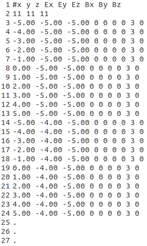

.. _setting_up_the physics-label:

Setting up the physics
======================

.. contents:: Table of Contents
   :depth: 15
   :local:

New physics list mechanism
--------------------------

**WARNING : big change from Gate V7.0**

Up to now, physic lists were set in GATE according to macro files containing list of command to add physical processes. From GATE Version 7.0, we highly recommend to switch to the "physic list builder" mechanism. The physic-list builders are provided by the Geant4 community. To use a builder, use the "addPhyslicsList" command as follow::

  /gate/physics/addPhysicsList QGSP_BERT_EMV

The name of the builder is one of the following for the electromagnetic physic-lists: 

* emstandard
* emstandard_opt1
* emstandard_opt2
* emstandard_opt3
* emlivermore
* emlivermore_polar
* empenelope

And for the hadronic physics list builders: 

* QGSP
* QGSP_EMV
* QGSC 
* QGSC_EMV
* QGSP_EFLOW
* QGSP_BERT
* QGSP_BERT_EMV
* QGSP_BERT_HP
* QGSP_BERT_TRV
* QGSP_BIC
* QGSP_BIC_HP
* QGSP_NEQ
* QGSP_EMV_NQE
* QGSP_BERT_NQE
* QGSP_INCLXX
* FTFP_BERT
* FTFP
* FTFP_EMV
* ...

See more details in the `Geant4 physics reference manual <http://geant4-userdoc.web.cern.ch/geant4-userdoc/UsersGuides/PhysicsListGuide/html/index.html>`_. Another (short, old) guide can be found `here <http://geant4.in2p3.fr/IMG/pdf_PhysicsLists.pdf>`_.

The production cuts special cuts can still be used as exemplified below::

   /gate/physics/Gamma/SetCutInRegion      world 10 mm
   /gate/physics/Electron/SetCutInRegion   world 10 mm
   /gate/physics/Positron/SetCutInRegion   world 10 mm
   /gate/physics/Proton/SetCutInRegion     world 10 mm

   /gate/physics/Gamma/SetCutInRegion      patient 1 mm
   /gate/physics/Electron/SetCutInRegion   patient 1 mm
   /gate/physics/Positron/SetCutInRegion   patient 1 mm
   /gate/physics/Proton/SetCutInRegion     patient 1 mm

   /gate/physics/SetMaxStepSizeInRegion patient 1 mm
   /gate/physics/ActivateStepLimiter proton

Physics list selection
----------------------

Processes have three possible states: "Available", "Enabled" and "Initialized". In a simulation, GATE uses initialized processes. By default, all processes are only "Available". To initialize processes you want to use, you have to choose them in the list of available processes and put them in the list of "Enabled" processes with the *addProcess*/*removeProcess* commands. Then, you have to define models, data sets or energy range if it is necessary. Enabled processes are initialized when the command */gate/run/initialize* is called. After initialization, physics list cannot be modified. Processes must be initialized before the source definition.

To obtain the list of processes available, enabled or initialized::

   /gate/physics/processList [State] [Particle]
   
   Parameter : State
   Parameter type  : s
   Omittable       : True
   Default value   : Available
   Candidates      : Available Enabled Initialized
   
   Parameter : Particle
   Parameter type  : s
   Omittable       : True
   Default value   : All

User can print the list of initialized processes for each particles and the list of enabled processes with all informations (particles, models, data sets and energy range)::

   /gate/physics/print [File name]
   
   Parameter : File Name
   Parameter type  : s
   Omittable       : False

Particles
~~~~~~~~~

To designate a particle in a macro command for physics, you have to use the Geant4 name of the particle. The command ''/particle/list'' gives the list of particles available in GATE. Note that there are 5 particles defined for nuclei: "deuteron", "triton", "alpha", "He3" and a generic particle for all ions called "GenericIon". For more information about particles in Geant4, see Geant4 user support.

User can also use a particle group name. For example,  "Charged" designates all charged particles or “EM” designates gamma, e+ and e-. Here, the list of particle groups available in GATE:

* Default : defaults particles defined for a process (see the "processList" command before for more informations)
* EM : e+, e-, gamma
* Charged : all charged particles

**< ! > Particle name in non-physics macro command could be slightly different in particular for ions!**

Adding a process
~~~~~~~~~~~~~~~~

To add a process to the list of "Enabled" processes for a particle or a group of particles::
 
   /gate/physics/addProcess [Process] [Particle]
   
   Parameter : Process
   Parameter type  : s
   Omittable       : False
   
   Parameter : Particle 
   Parameter type  : s
   Omittable       : True
   Default value   : Default

Removing a process
~~~~~~~~~~~~~~~~~~

To remove a process of the "Enabled" processes list::

   /gate/physics/removeProcess [Process] [Particle]
   
   Parameter : Process
   Parameter type  : s
   Omittable       : False
   
   Parameter : Particle
   Parameter type  : s
   Omittable       : True
   Default value   : Default

Models and Data sets
~~~~~~~~~~~~~~~~~~~~

Some processes have several models or several data sets available. To known if you can choose a model or a data set for a process, use the commands::

   /gate/physics/processes/[Process Name]/modelList [Particle]
   /gate/physics/processes/[Process Name]/dataSetList [Particle]
   
   Parameter : Particle
   Parameter type  : s
   Omittable       : True
   Default value   : Default

To select or unselect a model or a data set, use the command::

   /gate/physics/processes/[Process Name]/setModel   [Model Name] [Particle]
   /gate/physics/processes/[Process Name]/unSetModel [Model Name] [Particle]
   /gate/physics/processes/[Process Name]/setDataSet   [DataSet Name] [Particle]
   /gate/physics/processes/[Process Name]/unSetDataSet [DataSet Name] [Particle]
   
   Parameter : Model/DataSet Name
   Parameter type  : s
   Omittable       : False
   Candidates      : .............
   
   Parameter : Particle
   Parameter type  : s
   Omittable       : True
   Default value   : Default

Models can be selected for an energy range or for specific materials or elements. To do this, use commands::

   /gate/physics/processes/[Process Name]/[Model Name]/setEmax [Value] [Unit] [Particle] [Option]
   /gate/physics/processes/[Process Name]/[Model Name]/setEmin [Value] [Unit] [Particle] [Option]
   
   Parameter : Value
   Parameter type  : d
   Omittable       : False
   Default value   : 0.0
   
   Parameter : Unit
   Parameter type  : s
   Omittable       : False
   Default value   : MeV
   Candidates      : eV keV MeV GeV
   
   Parameter : Particle
   Parameter type  : s
   Omittable       : True
   Default value   : Default
   
   Parameter : Option
   Parameter type  : s
   Omittable       : True
   Default value   : NoOption

The parameter "Option" allow to define material or element for this model (see chapter on detector construction for more informations on materials and elements). For example::

   /gate/physics/processes/IonInelastic/G4BinaryLightIonReaction/setEmin 100 keV
   /gate/physics/processes/IonInelastic/G4BinaryLightIonReaction/setEmin 200 keV GenericIon Water

A command allows to clear energy ranges defined for a model::

   /gate/physics/[Process Name]/[Model Name]/clearEnergyRange [Particle]
   
   Parameter : Particle
   Parameter type  : s
   Omittable       : True
   Default value   : All

Physics processes
-----------------

Electromagnetic processes
~~~~~~~~~~~~~~~~~~~~~~~~~

Electromagnetic processes are used to simulate the electromagnetic interaction of particles with matter. The mean free path of a process, :math:`\lambda`, also called the interaction length, can be given in terms of the total cross section:

:math:`\lambda(E) =  \left( \sum_{i} \left[n_{i} \cdot \sigma(Z_{i},E) \right] \right)^{-1}`

where :math:`\sigma(Z_{i},E)` is the cross section of the process for atom :math:`i` composing the material. Cross-sections per atom and mean free path values are tabulated during initialization.

In Geant4, three models are available for electromagnetic processes:
  
* Standard processes are effective between 1 keV and 100 TeV
* Low energy processes are effective between 250 eV and 100 GeV (there is also the LivermorePolarizedModel for polarized gamma)
* Penelope processes are effective between 250 eV and 1 GeV

Models and cross-sections are based on the theoretical calculations and on exploitation of evaluated data. For the standard processes based on data, models and cross-sections rely on parameterizations of these data. Because atomic shell structure is more important in most cases at low energies, the low energy processes make direct use shell cross section data. The data used for the determination of cross-sections and for sampling of the final state are extracted from a set of freely distributed evaluated data libraries: 

* EPDL97 (Evaluated Photons Data Library)
* EEDL (Evaluated Electrons Data Library)
* EADL (Evaluated Atomic Data Library)
* stopping power data
* binding energy values based on data of Scofield .

The Penelope models have been specifically developed for Monte Carlo simulation and great care was given to the low energy description (i.e. atomic effects, etc.). These processes are the Geant4 implementation of the physics models developed for the PENELOPE code (PENetration and Energy LOss of Positrons and Electrons), version 2001. 

***< ! > For the low energy processes, the download of G4EMLOW data files is required.**

***< ! > Positron have no low energy process.'***

***< ! > Since Geant4 9.3, users can mixed electromagnetic models.***

Photoelectric effect
^^^^^^^^^^^^^^^^^^^^

The photoelectric effect is the absorption of a photon by an atomic electon with the ejection of this electron from the atom. The energy of the outgoing electron is:

:math:`E = h \nu - L`

where :math:`L` is the binding energy of the electron. Since a free electron cannot absorb a photon and also conserve momentum, the photoelectric effect always occurs on bound electrons while the nucleus absorbs the recoil momentum. The cross-section calculation is complex due to the combinaison of the electron Dirac wave functions. It is simulated by using a parameterized photon absorption cross section to determine the mean free path, atomic shell data to determine the energy of the ejected electron, and the K-shell angular distribution to sample the direction of the electron.

The cross-section depends on the atomic number :math:`Z` of the material. The photoelectric process is favored by high :math:`Z` materials. In the current implementation the relaxation of the atom is not simulated, but instead is counted as a local energy deposit. For low energy process, the deexcitation of the atom is simulated.

To add photoelectric effect in GATE::

   /gate/physics/addProcess PhotoElectric gamma

Note that the two following macro are equivalent because the default particle for the photoelectric process is the gamma only:

 /gate/physics/addProcess PhotoElectric
 /gate/physics/addProcess PhotoElectric Default
 /gate/physics/addProcess PhotoElectric gamma

Then, choose the model::

   /gate/physics/processes/PhotoElectric/setModel StandardModel 

or::

   /gate/physics/processes/PhotoElectric/setModel LivermoreModel 

or::

   /gate/physics/processes/PhotoElectric/setModel LivermorePolarizedModel

or::

   /gate/physics/processes/PhotoElectric/setModel PenelopeModel

Compton scattering
^^^^^^^^^^^^^^^^^^

Compton process describes the photon scattering by free electrons. Although electrons are bound in matter, the electron can be considered as essentially free for photons of energy much greater than the binding energy of the electron.

In the simulation, an empirical cross section formula is used, which reproduces the cross section data down to 10 keV. The final state is generated following the Klein-Nishina formula. For low energy incident photons, the simulation of the Compton scattering process is performed according to the same procedure used for the standard
Compton scattering simulation, with the addition that Hubbel’s atomic form factor (or scattering function) is taken into account. The angular and energy distribution of the incoherently scattered photon is then given by
the product of the Klein-Nishina formula and the scattering function.

To add Compton scattering in GATE::

   /gate/physics/addProcess Compton gamma

Note that the two following macro are equivalent because the defaut particle for the Compton process is only the gamma::

   /gate/physics/addProcess Compton
   /gate/physics/addProcess Compton Default
   /gate/physics/addProcess Compton gamma

Then, choose the model::

   /gate/physics/processes/Compton/setModel StandardModel 

or::

   /gate/physics/processes/Compton/setModel LivermoreModel 

or::

   /gate/physics/processes/Compton/setModel LivermorePolarizedModel

or::

   /gate/physics/processes/Compton/setModel PenelopeModel

Rayleigh scattering
^^^^^^^^^^^^^^^^^^^

Thomson and Rayleigh scattering are linked to Compton scattering. Thomson scattering is similer to Compton scattering in the classical limit *i.e.* the scattering of photons by free electrons. For Rayleigh scattering, all the electrons of the atom contribute in a coherent way (this process is also called coherent scattering).

For these processes, no energy is transferred to the target. The direction of the photon is the only modified parameter. Atoms are not excited or ionized. At high energies, the cross-sections of Thomson and Rayleigh scattering are very small and are neglected. For these reasons, the Rayleigh process is defined only for low energy and Penelope models::

   /gate/physics/addProcess RayleighScattering gamma
   /gate/physics/processes/RayleighScattering/setModel LivermoreModel 
   /gate/physics/processes/RayleighScattering/setModel LivermorePolarizedModel
   /gate/physics/processes/RayleighScattering/setModel PenelopeModel

Pair production
^^^^^^^^^^^^^^^

The process of pair production describes the transformation of a photon into an electron-positron pair. In order to conserve momentum, this can only occur in the presence of a third body, usually a nucleus. Moreover, the minimum energy required to create a pair is equal to the sum of the electron mass and positron mass (1.022 MeV).

To add pair production process in GATE::

   /gate/physics/addProcess GammaConversion

Then, choose the model::

   /gate/physics/processes/GammaConversion/setModel StandardModel 

or::

   /gate/physics/processes/GammaConversion/setModel LivermoreModel 

or::

   /gate/physics/processes/GammaConversion/setModel LivermorePolarizedModel

or::

   /gate/physics/processes/GammaConversion/setModel PenelopeModel

Ionization
^^^^^^^^^^

A charged particle passing through matter loses energy due to inelastic collision with atomic electrons of the material. Lost energy is transferred to the atom causing ionization or excitation. The ionization energy loss is calculated using the Bethe-Bloch formula. The particle energy loss :math:`E` is divided into continuous energy loss and production of secondary electrons. The production threshold is defined as the minimum energy :math:`E_{cut}` above which secondary particles will be produced and tracked. When :math:`E < E_{cut}`, :math:`E` is included into the continuous energy loss and when :math:`E > E_{cut}`, secondary electrons are produced. Energy loss due to excitation is included into continuous energy loss.

The mean excitation potential :math:`I` is the main parameter of the Bethe-Bloch formula. This quantity can be defined by user for each material (see chapter about geometry and materials).

There are three processes to handle ionization:
  
* for electron and positron::

   /gate/physics/addProcess ElectronIonisation e+
   /gate/physics/addProcess ElectronIonisation e-

* for hadrons and ions::

   /gate/physics/addProcess HadronIonisation [Particle Name]

* for ions::

   /gate/physics/addProcess IonIonisation [Particle Name]

The electron ionization process has three models available::

   /gate/physics/processes/ElectronIonisation/setModel StandardModel e+
   /gate/physics/processes/ElectronIonisation/setModel StandardModel e-
   /gate/physics/processes/ElectronIonisation/setModel LivermoreModel e-
   /gate/physics/processes/ElectronIonisation/setModel PenelopeModel e+
   /gate/physics/processes/ElectronIonisation/setModel PenelopeModel e-

The new Geant4 model selection has not yet implemented for hadron ionization process in GATE V6.2. So users have to the old process/model selection.
 
The low energy model have a specific process for ionization of hadrons, ions, muons and taus::

   /gate/physics/addProcess LowEnergyHadronIonisation

For the energy range between 1 keV and 2 MeV, this process has several models for the parametrization of electronic and nuclear stopping power::

   /gate/physics/processes/LowEnergyHadronIonisation/setModel Elec_Ziegler1977p proton

Electronic stopping power models:

* Elec_ICRU_R49p (default)
* Elec_ICRU_R49He
* Elec_Ziegler1977p
* Elec_Ziegler1977He
* Elec_Ziegler1985p
* Elec_SRIM2000p

Nuclear stopping power models:

* Nuclear_ICRU_R49 (default)
* Nuclear_Ziegler1977
* Nuclear_Ziegler1985

It is possible to enable/disable nuclear stopping power for all hadrons and ions ionization processes::

   /gate/physics/processes/[Process name]/setNuclearStoppingOn
   /gate/physics/processes/[Process name]/setNuclearStoppingOff

Example::

   /gate/physics/processes/HadronIonisation/setNuclearStoppingOff

Bremsstrahlung
^^^^^^^^^^^^^^

Bremsstrahlung process is the production of an electromagnetic radiation by a charged particle accelerated in the field of another charged particle, such as a nucleus. The cross-section of bremsstrahlung is inversely proportional to the mass squared. Thus this process is more important for electron and positron than other charge particles. As for ionization process, above a given threshold energy the energy loss is simulated by the explicit production of photons. Below the threshold, emission of soft photons is treated as a continuous energy loss. The bremsstrahlung energy spectrum is continuous::

   /gate/physics/addProcess Bremsstrahlung e+
   /gate/physics/addProcess Bremsstrahlung e-

The electron ionization process has three models available::

   /gate/physics/processes/Bremsstrahlung/setModel StandardModel e+
   /gate/physics/processes/Bremsstrahlung/setModel StandardModel e-
   /gate/physics/processes/Bremsstrahlung/setModel LivermoreModel e-
   /gate/physics/processes/Bremsstrahlung/setModel PenelopeModel e+
   /gate/physics/processes/Bremsstrahlung/setModel PenelopeModel e-

Positron and electron annihilation
^^^^^^^^^^^^^^^^^^^^^^^^^^^^^^^^^^

In Geant4, the process which simulated the in-flight annihilation of a positron with an atomic electron is attached to positron. As is usually done in shower programs, it is assumed here that the atomic electron is initially free and at rest. Also, annihilation processes producing one, or three or more, photons are ignored because these processes are negligible compared to the annihilation into two photons::

   /gate/physics/addProcess G4PositronAnnihilation e+

Then, choose the model::

   /gate/physics/processes/G4PositronAnnihilation/setModel StandardModel 

or::

   /gate/physics/processes/G4PositronAnnihilation/setModel PenelopeModel

An improvement of the positron-electron annihilation has been developed to take into account the :math:`\gamma\gamma` non-colinearity . The mean value of the angle distribution is :math:`\simeq 0.5^{0}` (do not need model selection)::

   /gate/physics/addProcess PositronAnnihilation  e+

Single and multiple Scattering
^^^^^^^^^^^^^^^^^^^^^^^^^^^^^^

In addition to inelastic collisions with atomic electrons, charged particles passing through matter also suffer repeated elastic Coulomb scatterings from nuclei. Elastic cross section is huge when particle energy decreases, so multiple scattering approach (MSC) should be introduced in order to have acceptable CPU performance of the simulation. The MSC model used in GEANT4 belongs to the class of condensed algorithm in which the global effects of the collisions are simulated at the end of a track segment (step). The global effects generally computed in these codes are the net displacement, energy loss, and change of direction of the charged particle. The model is based on Lewis' MSC theory and uses model functions to determine the angular and spatial distributions after a step. The functions have been chosen in such a way as to give the same moments of the (angular and spatial) distributions as the Lewis theory. Two processes are available for multiple scattering. These processes are similar but they allow to define some sets of options for group of particles (electron/positron and hadron). The new Geant4 model selection has not yet implemented for multiple scattering process in GATE V6.2. So users have to the old process/model selection. The old MultipleScattering is now deprecated::

   /gate/physics/addProcess eMultipleScattering e-
   /gate/physics/addProcess eMultipleScattering e+

   /gate/physics/addProcess hMultipleScattering proton
   /gate/physics/addProcess hMultipleScattering alpha
   /gate/physics/addProcess hMultipleScattering GenericIon
   ...

Single elastic scattering process is an alternative to the multiple scattering process. The advantage of the single scattering process is in possibility of usage of theory based cross sections, in contrary to the Geant4 multiple scattering model, which uses a number of phenomenological approximations on top of Lewis theory. Because each of elastic collisions are simulated the simulation CPU time of charged particles significantly increasing in comparison with the multiple scattering approach::

   /gate/physics/addProcess SingleScattering ...

Muon electromagnetic processes
^^^^^^^^^^^^^^^^^^^^^^^^^^^^^^

Muons have their own electromagnetic processes:

* Ionization::

   /gate/physics/addProcess MuIonisation mu+
   /gate/physics/addProcess MuIonisation mu-

* Bremsstrahlung::

   /gate/physics/addProcess MuBremsstrahlung mu+
   /gate/physics/addProcess MuBremsstrahlung mu-

* Direct production of (e+, e-) pairs by mu+ and mu-::

   /gate/physics/addProcess MuPairProduction mu+
   /gate/physics/addProcess MuPairProduction mu-

For ionization, the low energy model can handle muons.

Electromagnetic options
^^^^^^^^^^^^^^^^^^^^^^^

**< ! > This part is recommanded for advanced users only!**

**< ! > Valid only from Geant4 version 9.2 - Gate V6.0 & V6.0.p01**

**< ! > In Geant4 version 9.2, options are available only for standard processes - Gate V6.0 & V6.0.p01**

**< ! > In case of using Gate V6.2, users must compile with Geant4 version 9.5 patch 01 - This Gate release is NOT compatible with previous Geant4 version**

Options are available for steering the standard electromagnetic processes. Some options modify all electromagnetic processes initialized in the simulation (Global options). Some options have to be defined for each processes.

*Global options:*

The following options manage the DEDX, mean free path and cross sections tables. User can defined the table range (default 0.1 keV - 100 TeV)::

   /gate/physics/setEMin 0.1 keV
   /gate/physics/setEMax 10 GeV

the number of bins of the DEDX table (default = 84)::

   /gate/physics/setDEDXBinning 500

and the number of bins of the mean free path table (default = 84)::

   /gate/physics/setLambdaBinning 500

Using cubic spline interpolation of DEDX and cross section tables, better interpolation was found to increase stability when varying transport parameters, such as cuts, of energy deposition of hadrons. Cubic spline interpolation is enabled by default. If the option was disable, the old linear interpolation is used::

   /gate/physics/setSplineFlag true
   /gate/physics/setSplineFlag false

*Step function*

Continuous energy loss imposes a limit on the step size because of the energy dependence of the cross sections. It is generally assumed in MC programs that the particle cross sections are approximately constant along a step, i.e. the step size should be small enough that the change in cross section, from the beginning of the step to the end, is also small. In principle one must use very small steps in order to insure an accurate simulation, however the computing time increases as the step size decreases. A good compromise is to limit the step size by not allowing the stopping range of the particle to decrease by more than a value *[Ratio]* during the step ([Ratio] = :math:`\Delta` range/range). This condition works well for particles with kinetic energies > 1 MeV, but for lower energies it gives very short step sizes.

To cure this problem a lower limit on the step size was introduced (*[Final range]*). The step size limit varies smoothly with decreasing energy from the value *[Ratio]* to the lowest possible value range cut *[Final range]*. By default for electron, [Ratio] = 0.2 and [Final range] = 0.1 mm::

   /gate/physics/processes/[Process name]/SetStepFunction [Particle] [Ratio] [Final range] [Unit]
   
   Parameter : [Particle]
   Parameter type  : s
   Omittable       : False
   
   Parameter : [Ratio] (step/range)
   Parameter type  : d
   Omittable       : False
   
   Parameter : [Final range]
   Parameter type  : d
   Omittable       : False
   
   Parameter : [Unit]
   Parameter type  : s
   Omittable       : False

Example::

   /gate/physics/processes/ElectronIonisation/setStepFunction e+ 0.01 1 mm

*Linear loss limit*

This cut is an other approach to limit the step size. In a step, the energy loss by a particle with a kinetic energy :math:`E` cannot exceed a value :math:`E_{cut}` such as :math:`E_{cut}`/:math:`E` < *[Ratio]*. By default for the ionization of an electron, the limit is 0.01::

   /gate/physics/processes/IonIonisation/setLinearLossLimit [Particle] [Ratio]
   
   Parameter : Particle or Group of particles
   Parameter type  : s
   Omittable       : False
   
   Parameter : Limit
   Parameter type  : d
   Omittable       : False

Example::

   /gate/physics/processes/HadronIonisation/setLinearLossLimit proton 0.0001

*Geometrical step limit type*

This option allow to choose the transport algorithm for the multiple scattering process near to boundary. The two options proposed are *safety* and *distanceToBoundary* For instance, the *distanceToBoundary* algorithm limit the step size near to geometrical boundaries: only single scattering is applied very close to the boundaries::

   /gate/physics/processes/MultipleScattering/setGeometricalStepLimiterType [Particle] [Limit type]
   
   Parameter : Particle or Group of particles
   Parameter type  : s
   Omittable       : False
   
   Parameter : Limit type
   Parameter type  : s
   Omittable       : False

Example::

   /gate/physics/processes/MultipleScattering/setGeometricalStepLimiterType proton distanceToBoundary

Hadronic processes
~~~~~~~~~~~~~~~~~~

Hadronic processes described the interactions between incident hadrons/ions and the target nuclei. We also include decays of hadron and nuclei in this part. There is no strict frontier between nucleon-nucleon collision processes but we can distinguish four main process types in function of the energy and the impact parameter. At low energies, collisions lead to incomplete fusion in central collisions and to elastic scattering or inelastic scattering in peripherical collisions. At higher energies, there is fragmentation into several lighter fragments or nucleons for central collisions and into participant and the spectator regions for peripherical collisions. In Geant4, fusion, inelastic scattering and fragmentation processed are included in the inelastic process type. Inelastic processes had three main steps:

* cascade: the incident particle interacts strongly with the target and produces secondary particles
* preequilibrium (thermalization process): the excited target nucleus switches into equilibrated state by emitting excitons and light nuclei.
* de-excitation: the equilibrated nuclear residues evaporates into nucleons/light nuclei or breaks up into several fragments.

Each hadronic process may have one or more data sets associated with it. The term "data set" is meant, in a broad sense, to be an object that encapsulates methods and data for calculating total cross sections for a given process. The methods and data may take many forms, from a simple equation using a few hard-wired numbers to a sophisticated parameterization using large data tables. For the evaluation of cross sections, the list has a LIFO (Last In First Out) priority, meaning that data sets added later to the list will have priority over those added earlier to the list. 

The final state is produced using models coupled to processes. In Geant4, any model can be run together with any other model and the ranges of applicability for the different models can be steered. This way, highly specialized models (valid only for one material and particle, and applicable only in a very restricted energy range) can be used in the same application, together with more general code, in a coherent fashion. Each model has an intrinsic range of applicability, and the model chosen for a simulation depends very much on the use-case. Three types of hadronic models have been implemented: parametrization driven models, data driven models, and theory driven models.

Most of hadronic processes need an explicit choice of models while a lots of processes have a default data set.

Main Geant4 models
^^^^^^^^^^^^^^^^^^

*LHEP*

LHEP is the model used by default. It is based on code GHEISHA developed since 1978 by H. Fesefeldt to simulate hadron-nucleus interactions. The low energy part is valid from few hundred MeV to 20 GeV. The model is based on the principle of the intranuclear cascade and only the first hadron-nucleus interaction is simulated in detail. Other interactions in the nucleus are simulated by generating additional hadrons, simply treated as secondary particles can themselves generate their own intranuclear cascade. LHEP is a fully parameterized model but the physical meaning of the large number of adjustable parameters is sometimes unclear. Its main assets are the broad energy range covered, good reproduction of average values of distributions and computation times.

Example: G4LCapture, G4LENeutronInelastic, G4LFission, G4LCapture, G4LEProtonInelastic, G4LEPionMinusInelastic, G4LEPionPlusInelastic...

*Bertini cascade*

The intranuclear cascade model of Bertini has been developed by H W. Bertini in 1963. This code includes the intranuclear cascade model of Bertini, a pre-equilibrium model, a simple model of nucleus explosion, a model of fission and evaporation model.

*Binary cascade*

The Geant4 Binary Cascade is an intranuclear cascade propagating primary and secondary particles in a nucleus. The energy range and type of projectile covered are the same as Bertini model. From a theoretical point of view, this model is much more evolved taking into account a large number of resonances and fully modeled in three dimensions. Interactions are between a primary or secondary particle and an individual nucleon of the nucleus, leading to the name Binary Cascade. Cross section data are used to select collisions. Where available, experimental cross sections are used by the simulation. Propagating of particles is the nuclear field is done by numerically solving the equation of motion. The cascade terminates when the average and maximum energy of secondaries is below threshold. The remaining fragments are treated by precompound and de-excitation models.

*QMD*

*Pre compound*

Elastic scattering
^^^^^^^^^^^^^^^^^^

In elastic scattering, the projectile and the target particles do not changed during the collision and no other particles are produced. Two processes are available for hadrons and ions. The first one is the old elastic process::

   /gate/physics/addProcess HadronElastic Default
   /gate/physics/processes/HadronElastic/setModel G4LElastic Default

or::

   /gate/physics/addProcess HadronElastic 
   /gate/physics/processes/HadronElastic/setModel G4LElastic 

or::

   /gate/physics/addProcess HadronElastic proton
   /gate/physics/processes/HadronElastic/setModel G4LElastic proton
   /gate/physics/addProcess HadronElastic alpha
   /gate/physics/processes/HadronElastic/setModel G4LElastic alpha
   .........

This process has a default dataset (G4HadronElasticDataSet) and 6 models

* G4LElastic
* G4NeutronHPElastic
* G4NeutronHPorLElastic
* G4ElasticHadrNucleusHE
* G4LEpp
* G4LEnp

The alternative process is an improvement of the first process. It is supposed to be a good mix between the models of the fist process::

   /gate/physics/addProcess HadronElastic
   /gate/physics/processes/HadronElastic/setModel G4HadronElastic
   /gate/physics/processes/HadronElastic/setDataSet G4HadronElasticDataSet

For this process, there is only one model and a main dataset (G4HadronElasticDataSet). An other dataset for low energy neutrons is also available (G4NeutronHPElasticData).

Inelastic process for proton
^^^^^^^^^^^^^^^^^^^^^^^^^^^^

This process manage inelastic interaction of proton with matter. For example, the selection of two models with energy range for proton inelastic process (the only default particle is the proton)::

   /gate/physics/addProcess ProtonInelastic
   /gate/physics/processes/ProtonInelastic/setModel G4BinaryCascade
   /gate/physics/processes/ProtonInelastic/G4BinaryCascade/setEmin 170 MeV
   /gate/physics/processes/ProtonInelastic/G4BinaryCascade/setEmax 500 GeV
   /gate/physics/processes/ProtonInelastic/setModel PreCompound
   /gate/physics/processes/ProtonInelastic/PreCompound/setEmin 0 MeV
   /gate/physics/processes/ProtonInelastic/PreCompound/setEmax 170 MeV

This process has a default dataset (G4HadronInelasticDataSet) and an alternative dataset (G4ProtonInelasticCrossSection). There are 6 models available:

* G4LEProtonInelastic
* G4BertiniCascade
* G4BinaryCascade
* PreCompound
* G4QMDReaction

Inelastic process for ion
^^^^^^^^^^^^^^^^^^^^^^^^^

This process manage inelastic interaction of ions with matter. This process is valid for GenericIon, alpha, deuteron and triton. For example, a complete selection of models and data set for ions::

   /gate/physics/addProcess IonInelastic Default
   /gate/physics/processes/IonInelastic/setModel G4BinaryLightIonReaction Default
   /gate/physics/processes/IonInelastic/setModel G4LEDeuteronInelastic deuteron
   /gate/physics/processes/IonInelastic/setModel G4LETritonInelastic triton
   /gate/physics/processes/IonInelastic/setModel G4LEAlphaInelastic alpha
   /gate/physics/processes/IonInelastic/G4BinaryLightIonReaction/setEmin 80 MeV deuteron
   /gate/physics/processes/IonInelastic/G4BinaryLightIonReaction/setEmax 20 GeV deuteron
   /gate/physics/processes/IonInelastic/G4BinaryLightIonReaction/setEmin 80 MeV triton
   /gate/physics/processes/IonInelastic/G4BinaryLightIonReaction/setEmax 20 GeV triton
   /gate/physics/processes/IonInelastic/G4BinaryLightIonReaction/setEmin 80 MeV alpha
   /gate/physics/processes/IonInelastic/G4BinaryLightIonReaction/setEmax 20 GeV alpha
   /gate/physics/processes/IonInelastic/G4LEDeuteronInelastic/setEmin 0 MeV deuteron
   /gate/physics/processes/IonInelastic/G4LEDeuteronInelastic/setEmax 80 MeV deuteron
   /gate/physics/processes/IonInelastic/G4LETritonInelastic/setEmin 0 MeV triton
   /gate/physics/processes/IonInelastic/G4LETritonInelastic/setEmax 80 MeV triton
   /gate/physics/processes/IonInelastic/G4LEAlphaInelastic/setEmin 0 MeV alpha
   /gate/physics/processes/IonInelastic/G4LEAlphaInelastic/setEmax 80 MeV alpha
   /gate/physics/processes/IonInelastic/setDataSet G4IonsShenCrossSection GenericIon
   /gate/physics/processes/IonInelastic/setDataSet G4TripathiLightCrossSection deuteron
   /gate/physics/processes/IonInelastic/setDataSet G4TripathiLightCrossSection triton
   /gate/physics/processes/IonInelastic/setDataSet G4TripathiLightCrossSection alpha

The IonInelastic process includes the G4IonInelasticProcess for GenericIon, the G4DeuteronInelasticProcess for deuteron, the G4TritonInelasticProcess for triton and the G4AlphaInelasticProcess for alpha. The G4QMDReaction model and the G4BinaryLightIonReaction model are available for all ions. For GenericIon, one additional model (G4BinaryLightIonReaction) and 5 datasets are available :

* G4TripathiCrossSection
* G4IonsKoxCrossSection
* G4IonsShenCrossSection
* G4IonsSihverCrossSection
* G4TripathiLightCrossSection

Alpha, deuteron and triton have a default data set (G4HadronInelasticDataSet) and a alternative dataset (G4TripathiLightCrossSection). There are also specific models for each particle: G4LEDeuteronInelastic, G4LETritonInelastic, G4LEAlphaInelastic.

Pions
^^^^^

The inelastic interaction of pi+ and pi- with matter is handled by PionPlusInelastic and PionMinusInelastic processes. These processes have two specific models (G4LEPionMinusInelastic - G4LEPionPlusInelastic) and three common models:

* Bertini Cascade
* Binary Cascade
* Leading Particle Bias

The default dataset is G4HadronInelasticDataSet. There is an alternative dataset: G4PiNuclearCrossSection::

   /gate/physics/addProcess PionPlusInelastic pi+
   /gate/physics/processes/PionPlusInelastic/setModel G4LEPionPlusInelastic pi+
   /gate/physics/addProcess PionMinusInelastic pi-
   /gate/physics/processes/PionMinusInelastic/setModel G4LEPionMinusInelastic pi-

Neutrons
^^^^^^^^

The interactions of neutrons at low energies are split into four parts. We consider radiative capture, elastic scattering, fission, and inelastic scattering as separate processes. Each processes have standard models and datasets like others particles. In additions, some "high precision" models and datasets are provided for low energy interactions. The high precision neutron models depend on an evaluated neutron data library (G4NDL) for cross sections, angular distributions and final state information. G4NDL data comes largely from the ENDF/B-VI library.

**< ! > For the low energy processes, the download of G4NDL data files is required.**

*Radiative Capture*

The G4LCapture model generates the final state for neutron capture. The G4NeutronHPCapture model generates the final state for neutron capture using the high precision neutron model. 
The G4NeutronHPorLCapture model generates the final state for neutron capture using the high precision neutron model when sufficient high precision data is available for the selected element or isotope. When there is insufficient data, the neutron is captured using the less precise Low Energy Parameterized model.

The G4HadronCaptureDataSet is the default dataset for this process. The alternative high precision dataset is G4NeutronHPCaptureData::

   /gate/physics/addProcess NeutronCapture
   /gate/physics/processes/NeutronCapture/setModel G4LCapture

*Inelastic scattering*

The G4NeutronInelasticProcess is similar than proton inelastic and ion inelastic processes. In addtion to the standard models (G4LENeutronInelastic, G4BertiniCascade, G4BinaryCascade, PreCompound, LeadingParticleBias), two models using the high precision data are available. The G4NeutronHPInelastic model generates the final state for inelastic neutron scattering. The G4NeutronHPorLEInelastic model generates the final state for inelastic neutron scattering using the high precision neutron model when sufficient high precision data is available for the selected element or isotope. When there is insufficient data, the neutron is scattered inelastically using the less precise Low Energy Parameterized model (G4LENeutronInelastic).

The G4HadronInelasticDataSet is the default dataset for this process. An alternative dataset is the G4NeutronInelasticCrossSection. The high precision dataset is G4NeutronHPInelasticData::

   /gate/physics/addProcess NeutronInelastic
   /gate/physics/processes/NeutronInelastic/setModel PreCompound

*Fission*

The G4LFission model generates the final state for fission. The G4NeutronHPFission model generates the final state for neutron-induced fission using the high precision neutron model. The G4NeutronHPorLFission model generates the final state for neutron-induced fission using the high precision neutron model when sufficient high precision data is available for the selected element or isotope. When there is insufficient data, neutron-induced fission is performed using the less precise Low Energy Parameterized model.

The G4HadronFissionDataSet is the default dataset for this process. The alternative high precision dataset is G4NeutronHPFissionData::

   /gate/physics/addProcess Fission
   /gate/physics/processes/Fission/setModel G4LFission

Particle decay
^^^^^^^^^^^^^^

Particle decay is the spontaneous process of one elementary particle transforming into other elementary particles. If the particles created are not stable, the decay process can continue. The majority of decays in Geant4 are implemented using the G4PhaseSpaceDecayChannel class. It simulates phase space decays with isotropic angular distributions in the center-of-mass system::

   /gate/physics/addProcess Decay

Radioactive decay
^^^^^^^^^^^^^^^^^

Radioactive decay is the process in which an unstable atomic nucleus spontaneously loses energy by emitting ionizing particles and radiation. In Geant4, the decay of radioactive nuclei by :math:`\alpha`, :math:`\beta+`, and :math:`\beta` emission and by electron capture are taken into account. The simulation model is empirical and data-driven, and uses the Evaluated Nuclear Structure Data File (ENSDF).

**< ! > The download of radioactive decay data files is required.**:

   /gate/physics/addProcess RadioactiveDecay

Optical physics processes
~~~~~~~~~~~~~~~~~~~~~~~~~

For detailed information, see :ref:`generating_and_tracking_optical_photons-label` .

Bulk Absorption
^^^^^^^^^^^^^^^

This process kills the optical photon. It requires the Material properties filled by the user with the Absorption length (average distance traveled by a photon before being absorbed by the medium)::

   /gate/physics/addProcess OpticalAbsorption

Rayleigh Scattering
^^^^^^^^^^^^^^^^^^^

This process depends on the particle’s polarization. A photon which is not assigned a polarization at production may not be Rayleigh scattered. The photon is scattered in a new direction that is required to be perpendicular to the photon’s new polarization in such a way that the final direction, initial and final polarizations are all in one plane. The process requires the Material properties filled with Rayleigh scattering length (average distance traveled by a photon before it is Rayleigh scattered in the medium). 

N.B: For Water ONLY, when scattering lengths are not specified but the user, the Geant4 code calculates them following the Einstein-Smoluchowski formula::
 
   /gate/physics/addProcess OpticalRayleigh

Mie Scattering
^^^^^^^^^^^^^^

Mie Scattering is an analytical solution of Maxwell’s equations for scattering of optical photons by spherical particles. It is significant only when the radius of the scattering object is of order of the wave length.The analytical expressions for Mie Scattering are very complicated since they are a series sum of Bessel functions.One common approximation made is call Henyey-Greenstein (HG). The implementation in GATE (Geant4) follows the HG approximation and the treatment of polarization and momentum are similar to that of Rayleigh scattering. 

The process requires Material properties to be filled by the user with Mie scattering length data (MIEHG). In practice, the user not only needs to provide the attenuation length of Mie scattering, but also needs to provide the constant parameters of the approximation: MIEHG_FORWARD, MIEHG_BACKWARD, and MIEHG_FORWARD_RATIO::

   /gate/physics/addProcess OpticalMie

Processes at Boundaries
^^^^^^^^^^^^^^^^^^^^^^^

The optical boundary process design relies on the concept of surfaces: physical properties of the surface itself (stored in Materials.xml) and characteristics of the surface specifying the two ordered pairs of physical volumes touching at the surface (Surface.xml).

When the surface concept is not needed, and a perfectly smooth surface exists between two dielectric materials, the only relevant property is the index of refraction, a quantity stored with the material::

   /gate/physics/addProcess OpticalBoundary

Wavelength Shifting or Fluorescence
^^^^^^^^^^^^^^^^^^^^^^^^^^^^^^^^^^^

Fluorescence is the result of a three-stage process that occurs in certain molecules called fluorophores or fluorescent dyes. A fluorescent probe is a fluorophore designed to respond to a specific stimulus or to localize within a specific region of a biological specimen. The process responsible for the fluorescence involves the creation of an excited electronic singlet state by optical absorption and subsequent emission of an optical photon of lower energy than the excitation photon::

   /gate/physics/addProcess OpticalWLS

DNA physics processes
~~~~~~~~~~~~~~~~~~~~~

Thé Geant4 DNA processes can be setup using the following command lines::

   /gate/physics/addPhysicsList emDNAphysics_option4

Available DNA physics lists: emDNAphysics, emDNAphysics_option1, emDNAphysics_option2, emDNAphysics_option3, emDNAphysics_option4, emDNAphysics_option5, emDNAphysics_option6, emDNAphysics_option7, emDNAphysics_option8.

Users can also setup the DNA physics lists only for specific regions while keeping the available physics list in other regions using the following command lines::

   /gate/physics/addPhysicsList emstandard_opt4
   /process/em/AddDNARegion Region1 DNA_Opt4
   /process/em/AddDNARegion Region3 DNA_Opt4

Note that the DNA physics lists names to use are: DNA_Opt0, DNA_Opt2, DNA_Opt4, DNA_Opt4a, DNA_Opt6, DNA_Opt6a, DNA_Opt7.
In this example, Region1 and Region3 have to be created as specific geometries in the macro file.

X-ray at boundary
~~~~~~~~~~~~~~~~~

Provided that you compile Gate with GATE_USE_XRAYLIB ON , *i.e.*, that you activate the dependency to the `xraylib <https://github.com/tschoonj/xraylib>`_, you can account for x-ray refraction by using::

   /gate/physics/addProcess XrayBoundary

This will only work with shapes described analytically because the orthogonal to a boundary is not well defined in voxelized volume.

The process is computed following what is described in `Wang et al, NSS/MIC, 2009 <http://dx.doi.org/10.1109/NSSMIC.2009.5402180>`_.

An example is available at `GateContrib: XRayRefraction <https://github.com/OpenGATE/GateContrib/tree/master/imaging/CT/XRayRefraction>`_.

Magnetic field
--------------

A magnetic field can be defined. It will be attached and thus active in the whole world volume. It is currently not possible to confine the field to another volume. The following command can be used to activate and define the magnetic field properties::

   /gate/geometry/setMagField  Bx  By  Bz  Unit

Here is the help for the command::

   Command /gate/geometry/setMagField
   Guidance :
   Define magnetic field.
   
   Parameter : Bx
    Parameter type  : d
    Omittable       : False
   
   Parameter : By
    Parameter type  : d
    Omittable       : False
   
   Parameter : Bz
    Parameter type  : d
    Omittable       : False
   
   Parameter : Unit
    Parameter type  : s
    Omittable       : True
    Default value   : tesla
    Candidates      : T kG G tesla kilogauss gauss

Electromagnetic field
---------------------

A custom electromagnetic field can be generated from an external look-up table (e.g., text file) containing the spatial positions (x, y, z) in centimeter and their associated electric and magnetic field strengths (Ex, Ey, Ez) in volt per meter and (Bx, By, Bz) in tesla. The 3 dimensional field grid is read in and interpolated to the entire simulation geometry determined by the minimum and maximum value of the grid using a linear interpolation method. The structure of the input file is shown in :numref:`em_input_file`. 

   
   Input file for electromagnetic vector field maps.

The coordinates specified in the input file are assumed to be absolute cartesian coordinates. The first line of the file must be the number of values per coordinate, e.g., for a field reaching from −5cm ≤ x,y,z ≤ 5cm and a grid size of 1cm, the number of values per coordinate is 11. The permittivity and permeability of various materials are assumed to be already taken into account in the field strength. The method can also be used for pure magnetic or electric fields, by setting the corresponding field values to zero.

The following command can be used to activate and define the electromagnetic field::
   
   /gate/geometry/setElectMagTabulateField3D PATH_TO_TEXT_FILE
   
   
   **Warning about Cherenkov process:**
It has been shown in recent Gate releases that activating the Cherenkov using in the physics list
/gate/physics/addPhysicsList empenelope (or others)
/gate/physics/addProcess    Cerenkov
is not enough to add the Cerenkov process in a Volume 
one **needs** to define an appropriate physics cut in the volume of interest, for the particule type of interest
/gate/physics/Electron/SetCutInRegion  Volume  0.1 mm 
in order to generate Cherenkov photon. The reason of the feature is still unclear.

