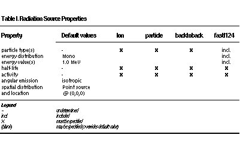
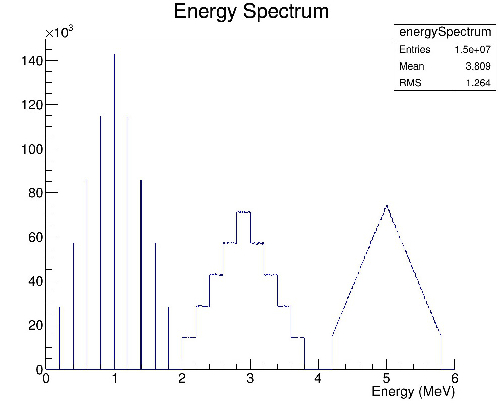
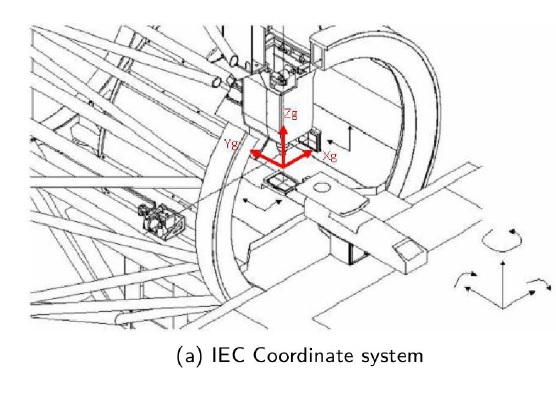
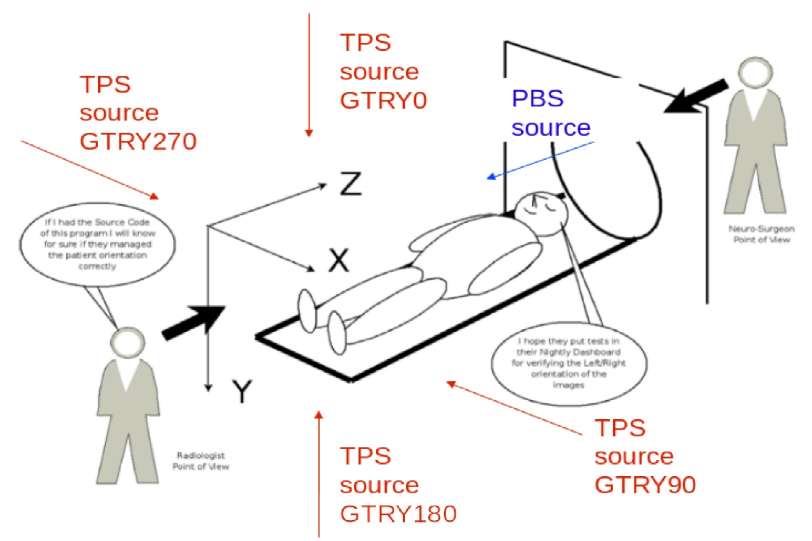

Source
======

.. contents:: Table of Contents
   :depth: 15
   :local:

To introduce a source into a GATE simulation, the user has to define the type of source (voxelized, linacBeam, phaseSpace, PencilBeam, TPSPencilBeam or GPS) and its feature (angle, energy, and position). Many activity distributions are available in GATE. At each new event, the source manager decides randomly which source decays, and generates for it one or more primary particles.

Creating a source
-----------------

Different type of sources can be defined in the same GATE simulation. Each source is independent. The command to create a source is given below::

   /gate/source/NAME 

where "NAME" defines the name of the source.

Adding a source
~~~~~~~~~~~~~~~

The next step is to add the source. For this, user has to type the following GATE command::
 
   /gate/source/addSource NAME

or::

   /gate/source/addSource NAME gps

In this example, a source "NAME" is added. Once a source has been added, a series of properties must be assigned to it. These properties are: activity, type of particle(s), energy distribution, energy value or bounds, angular emission, spatial distribution and location, and half-life. The commands required to assign these properties are described in the following paragraphs.

Defining the type of source
~~~~~~~~~~~~~~~~~~~~~~~~~~~

**Ion source**

The ion source type can simulate any ion by defining its atomic number (Z), atomic weight (A), ionic charge in units of energy (Q), and its excitation energy in keV (E). It incorporates both the radioactive decay and the atomic de-excitation. This is the most "realistic" way of simulating a radionuclide; however, it is also the slowest.

To use the ion source::
  
   /gate/source/NAME/gps/particle ion
   /gate/source/NAME/gps/ion 8 15 0 0 
   /gate/source/NAME/setForcedUnstableFlag true
   /gate/source/NAME/useDefaultHalfLife
 
In the above example, an ion source of oxygen-15 has been defined with Z=8, A=15, Q=0, E=0 . If it is too slow, other options are available, as described below.

**Simple particles**

You can choose from a long list of simple particles :math:`( e^{-} , e^{+}` , gamma, etc) to use in your simulations (use the help command to obtain the full list). For example::
 
   /gate/source/NAME/gps/particle gamma 

defines a photon source and::
 
   /gate/source/NAME/gps/particle e+ 

defines a positron source. If you choose to use a particle, you will have to define more properties. As an example, the correct use of a positron source simulating fluorine-18 is::
 
   /gate/source/NAME/gps/particle e+
   /gate/source/NAME/gps/energytype Fluor18
   /gate/source/NAME/setForcedUnstableFlag true
   /gate/source/NAME/setForcedHalfLife 6586 s 

In the above example, more properties of fluorine-18 have been added by using the helper keyword Fluor18 (see below): half-life and energy distribution. Note that the branching ratios are not respected with this kind of simulation because no decay is simulated, i.e. emission is 100% positron. You may want to lower the activity by an appropriate factor to take this better point into account.

**Helper keywords**

These keywords are defined to help you to define the particle properties. The first three keywords define an positron energy distribution resulting from common beta emitters, and the last one defines a special two-particle source.

For instance, **Fluor18** defines the positron energy spectrum of fluorine-18. Note that this keyword define only the energy spectrum, you still have to specify the particle :math:`e^{+}` and the half-life.

**Back-to-back**
This keyword is implemented for PET simulations where two annihilation photons are generated at 180 degrees. This type of source is faster to simulate than the ion source or the positron source and allows for selecting emission angle. To use the back-to-back source type::
 
   /gate/source/NAME/setType backtoback 

Note that there are no radioactive decays simulated when using the back-to-back type and that you still have to define the particle (gamma), energy type (Mono) and energy-value (0.511 MeV).

Note: the 'Accolinearity' flag that once exist in Gate is no more valid. See https://github.com/OpenGATE/Gate/issues/381 for details. 

**FastI124**

FastI124 is a special source implementing a simplified decay scheme of the non-pure beta emitter iodine-124 in which positrons are emitted but not neutrinos, there is no nuclear recoil, gammas are emitted if their emission probability is > 1%; and no atomic de-excitation occurs (no x-rays, Auger electrons). These simplifications allow for an increase in speed with respect to the ion source while retaining important features of iodine-124, i.e. gammas may be emitted concurrently with positrons to possibly create "dirty" coincidences. Since decay is simulated, branching ratios are respected hence no activity compensation is necessary.

To use the fastI124 source::
 
   /gate/source/NAME/setType fastI124 

The source takes care of particle definitions (gamma, positron) and energy distribution so that there is no need to specify a particle or mention its energy.

**Defining the activity**

To define the activity of the given source, the user defines the amount of activity and its unit using the following command::
 
   /gate/source/NAME/setActivity 5. becquerel 

In this example, the total activity of the source referred to as "NAME" is set to 5 Bq. The activity can be defined in Curie (Ci) as well as in Becquerel (Bq).

Defining the energy
~~~~~~~~~~~~~~~~~~~

**Energy distribution**

If the source does not take care of the type of energy distribution (e.g. fastI124), then it has to be explicitly defined. This can be achieved either by using a pre-defined spectrum (see helper keywords above) or by using built-in distributions. 

Candidates for built-in energy distributions are: mono-energetic "Mono", linear "Lin", powerlaw "Pow", exponential "Exp", Gaussian "Gauss", bremstrahlung "Brem", black-body "Bbody", cosmic diffuse gamma ray "Cdg", user-defined histogram "UserSpectrum", arbitrary point-wise spectrum "Arb", and user-defined energy per nucleon histogram "Epn". Capitalization is important: only strings given exactly as above will be recognized.

In the following example, all particles have the same energy::
 
   /gate/source/NAME/gps/energytype Mono 
 

**Energy value**

You may have to specify the energy value (or bounds) depending on the type of energy distribution you have selected. For example, for monoenergetic distributions (like back-to-back sources), you specify the energy value with::
 
   /gate/source/NAME/gps/monoenergy 511. keV 
 
In the case of ions, the kinetic energy must be 0 since the ions are at rest::
 
   /gate/source/NAME/gps/monoenergy 0. ev 
 
Any type of energy unit within the International System of Units (SI) can be used: eV, GeV, MeV, keV...

**Examples**

1) ion source for fluorine-18::

   /gate/source/NAME/gps/particle ion 
   /gate/source/NAME/gps/ion 9 18 0 0 
   /gate/source/NAME/gps/monoenergy 0. keV 
   /gate/source/NAME/setForcedUnstableFlag true # WARNING - DEBUG - New command line to debug the use of ion particle type
   /gate/source/F18/useDefaultHalfLife  

2) positron source for flourine-18::

   /gate/source/NAME/gps/particle e+ 
   /gate/source/NAME/gps/energytype Fluor18 
   /gate/source/NAME/setForcedUnstableFlag true 
   /gate/source/NAME/setForcedHalfLife 6586 s

3) backtoback for fluorine-18::

   /gate/source/NAME/setType backtoback 
   /gate/source/NAME/gps/particle gamma 
   /gate/source/NAME/gps/monoenergy 511. keV 
   /gate/source/NAME/setForcedUnstableFlag true 
   /gate/source/NAME/setForcedHalfLife 6586 s

4) fast iodine-124 source::

   /gate/source/NAME/setType fastI124 
   /gate/source/NAME/setForcedUnstableFlag true 
   /gate/source/NAME/setForcedHalfLife 360806 s 

   Properties of radioactive source

Another way to define the energy of a radioactive source is to use the energytype UserSpectrum. You can define 3 different user spectra: a discrete spectrum, a histogram or a linear interpolated spectrum

**Example**::

    ###################### Mode 1: Discrete Spectrum ###################
   /gate/source/addsource spectrumLine gps
   /gate/source/spectrumLine/gps/particle gamma
   /gate/source/spectrumLine/gps/energytype UserSpectrum
   /gate/source/spectrumLine/gps/setSpectrumFile ../data/DiscreteSpectrum.txt
   /gate/source/spectrumLine/setIntensity 1
    #################### Mode 1: Discrete Spectrum ####################
    
     
    #################### Mode 2: Histogram ####################
   /gate/source/addSource histogram gps
   /gate/source/histogram/gps/particle e-
   /gate/source/histogram/gps/energytype UserSpectrum
   /gate/source/histogram/gps/setSpectrumFile ../data/Histogram.txt
   /gate/source/histogram/setIntensity 10
   #################### Mode 2: Histogram ####################
   
    
   #################### Mode 3: Linear interpolation spectrum ####################
   /gate/source/addSource interpolationSpectrum gps
   /gate/source/interpolationSpectrum/gps/particle e-
   /gate/source/interpolationSpectrum/gps/energytype UserSpectrum
   /gate/source/interpolationSpectrum/gps/setSpectrumFile ../data/InterpolationSpectrum.txt                                                                                                                          
   /gate/source/interpolationSpectrum/setIntensity 10
   #################### Mode 3: Linear interpolation spectrum ####################

The user spectra are specified by a text file. The first number on the first line indicates the mode as follows: 1 - discrete, 2 - histogram, and 3 - interpolated spectrum. The second number on the first line specifies the energy, in MeV, of the lower edge of the first bin in histogram mode. (Though ignored in the discrete and interpolated modes, it must be present for the file to parse correctly.) The remaining lines specify the energy, in MeV, and the associated probability weighting. The probabilities will normalized by the GATE software.

The discrete spectrum generates particles with one of the listed energies::

   ################DiscreteSpectrum.txt ###################
   1   0
   0.2   0.2
   0.4   0.4
   0.6   0.6
   0.8   0.8
   1.0   1.0
   1.2   0.8
   1.4   0.6
   1.6   0.4
   1.8   0.2
   ###################################################

In histogram mode, the energy specified on each line corresponds to the upper edge of the respective bin. The energies of the generated particles will be between the minimum energy, specified on the first line of the file, and the upper edge of the last bin. Within each bin, the energies are distributed uniformly::
 
   ################## Histogram.txt #####################
   2   2
   2.2   0.2
   2.4   0.4
   2.6   0.6
   2.8   0.8
   3.0   1
   3.2   0.8
   3.4   0.6
   3.6   0.4
   3.8   0.2
   ##################################################

In interpolated mode, the energy of the generated particle will fall between the first and last energy specified, according to the probability distribution created by piecewise-linear interpolation between the points provided::

   ################ InterpolationSpectrum.txt #############
   3   0
   4.2   0.2
   4.4   0.4
   4.6   0.6
   4.8   0.8
   5.0   1
   5.2   0.8
   5.4   0.6
   5.6   0.4
   5.8   0.2
   #################################################

The following image present the result obtain for the 3 examples (available in example_UserSpectrum repository)

   3 different User spectra

Defining the angular distribution of the emission
~~~~~~~~~~~~~~~~~~~~~~~~~~~~~~~~~~~~~~~~~~~~~~~~~

An emission angle distribution can be defined with the angular span using::
 
   /gate/source/NAME/gps/angtype iso 
   /gate/source/NAME/gps/mintheta 90. deg 
   /gate/source/NAME/gps/maxtheta 90. deg 
   /gate/source/NAME/gps/minphi 0. deg 
   /gate/source/NAME/gps/maxphi 360. deg 

In this case, all particles have the same polar angle (theta) of 90 degrees. They are all emitted along directions orthogonal to the z-axis. The particles are emitted with an azimuthal angle (phi) between 0 and 360 degrees, along all possible directions.

By default, a full span of 0-180 degrees for the polar angle and 0-360 degrees for the azimuthal angle are defined. The emission span can be reduced for back-to-back sources to speed up the simulation.

Defining the shape of the source
~~~~~~~~~~~~~~~~~~~~~~~~~~~~~~~~

The last step is to define its geometry. The following command defines the type of source distribution::

   /gate/source/NAME/gps/type Volume 

In the above description, a volumic source distribution has been chosen. Other types of source distribution can be used: *Point*, *Beam*, *Plane*, or *Surface*. The default value is *Point*.

For a *Plane* source, the source shape type can be *Circle*, *Annulus*, *Ellipsoid*, *Square*, or *Rectangle*. For both *Surface* and *Volume* sources, this can be *Sphere*, *Ellipsoid*, *Cylinder*, or *Para*. The default source is a *Point* source and so *Shape* is not set to any of the above types. Each shape has its own parameters::

   /gate/source/NAME/gps/shape Cylinder 
   /gate/source/NAME/gps/radius 1. cm 
   /gate/source/NAME/gps/halfz 1. mm 

In the previous commands, the source is a cylinder with a radius of 1 cm and a length of 2 mm. Very often, the half-length is given rather than the full length.

* To define a circle, the radius (*radius*) should be set. (In reality it is not really a circle but a disk).
* To define an annulus, the inner (*radius0*) and outer radii (*radius*) should be given.
* To define an ellipse, square , or rectangle, the half-lengths along x (*halfx*) and y (*halfy*) have to be given.
* To define a sphere, only the radius (*radius*) only has to be specified.
* To define an ellipsoid, its half-lenghths in x (*halfx*), y (*halfy*), and z (*halfz*) have to be given.
* To define a cylinder with its  axis along the z-axis, only the radius (*radius*) and the z half-length (*halfz*) have to be specified.
* To define parallelepipeds, the x (*halfx*), y (*halfy*), and z (*halfz*) half-lengths, and the angles alpha (*paralp*), theta (*parthe*), and phi (*parphi*) have to be given.

Define the placement of the source
~~~~~~~~~~~~~~~~~~~~~~~~~~~~~~~~~~

The position of the source distribution can be defined using::

   /gate/source/NAME/gps/centre 1. 0. 0. cm 

In that example, the centre of the source distribution is 1 cm off-centered along the x-axis.

Movement of a source
~~~~~~~~~~~~~~~~~~~~

Attach to a volume
^^^^^^^^^^^^^^^^^^

The source can be attached to a volume::

   /gate/source/[Source name]/attachTo   [Volume Name]

If the volume moves during the simulation, the source moves along with the volume. Note that when attaching a source to a volume, the source's placement becomes relative to the volume.

Confining a source
^^^^^^^^^^^^^^^^^^

**Note: this is the old way of moving a source. It is very inefficient. Please consider using the "Attach to a volume" method instead.**

To define sources in movement, the source distribution have to be confined in a Geant4 volume. This volume will be animated using the usual GATE command as described in Chapter 4 of this manual.

The command::

    /gate/source/NAME/gps/confine NAME_phys 

specifies that the emission must be confined to a volume of the Geant4 geometry. In this case, the emission distribution is the intersection of the General Particle Source (GPS) and the Geant4 volume. The Geant4 volume must be specified by its physical volume name: GATEname + '_phys'.

One should note that the confinment slows down the simulation, the confinement volume must have an intersection with the GPS shape, and the confinement volume must not be too large as compared to the GPS shape.

A complete example of a moving source can be found in the SPECT benchmark or in the macro hereafter::

   # Define the shape/dimensions of the moving source 
   /gate/MovingSource/geometry/setRmax 5. cm 
   /gate/MovingSource/geometry/setRmin 0. cm 
   /gate/MovingSource/geometry/setHeight 20. cm 
   /gate/MovingSource/moves/insert translation 
   /gate/MovingSource/translation/setSpeed 0 0 0.04 cm/s 

   # Define the shape/dimensions of the large sourcecontainer 
   # that should contain the full trajectory of the moving source 
   /gate/source/SourceContainer/gps/type Volume 
   /gate/source/SourceContainer/gps/shape Cylinder 
   /gate/source/SourceContainer/gps/radius 4. cm 
   /gate/source/SourceContainer/gps/halfz 30. cm 
   # Define the placement of the SourceContainer 
   /gate/source/SourceContainer/gps/centre 0. 0. 0. cm 
   # Define the source as a gamma source 
   /gate/source/SourceContainer/gps/particle gamma 
   # Define the gamma energy 
   /gate/source/SourceContainer/gps/energy 140. keV 
   # Set the activity of the source 
   /gate/source/SourceContainer/setActivity 5000. Bq 
   # Define a confinement and confine the large container to
   # the MovingSource at a position defined by the time and 
   # the translation speed 
   /gate/source/SourceContainer/gps/confine MovingSource_phys

Example: two gammas
^^^^^^^^^^^^^^^^^^^

The following example gives a script to insert a point source of back-to-back type::

   # A new source with an arbitrary name #(``twogamma'') is created 
   /gate/source/addSource twogamma 
   # The total activity of the source is set 
   /gate/source/twogamma/setActivity 0.0000001 Ci 
   # The source emits pairs of particles back-to-back 
   /gate/source/twogamma/setType backtoback 
   # The particles emitted by the source are gammas 
   /gate/source/twogamma/gps/particle gamma 
   # The gammas have an energy of 511 keV 
   /gate/source/twogamma/gps/energytype Mono 
   /gate/source/twogamma/gps/monoenergy 0.511 MeV 
   # The source is a full sphere with radius 0.1 mm, 
   # located at the centre of the FOV 
   /gate/source/twogamma/gps/type Volume 
   /gate/source/twogamma/gps/shape Sphere 
   /gate/source/twogamma/gps/radius 0.1 mm 
   /gate/source/twogamma/gps/centre 0. 0. 0. cm 
   # The angular distribution of emission angles is isotropic 
   /gate/source/twogamma/gps/angtype iso 
   # The parameters below mean that the source emits 
   # at all angles along the z axis 
   /gate/source/twogamma/gps/mintheta 0. deg 
   /gate/source/twogamma/gps/maxtheta 180. deg 
   # Uncomment the parameters below if you want the source 
   # to emit in an XY (transverse) plane 
   /gate/source/twogamma/gps/mintheta 90. deg 
   /gate/source/twogamma/gps/maxtheta 90. deg 
   # The parameters below mean that the source emits 
   # at all angles in the transverse (XY) directions 
   /gate/source/twogamma/gps/minphi 0. deg 
   /gate/source/twogamma/gps/maxphi 360. deg

Defining a cold source
~~~~~~~~~~~~~~~~~~~~~~

To define a cold (i.e. with no activity) volume in a phantom, a dedicated command is available.

The command::
 
   /gate/source/NAME/gps/Forbid Volume_Name 

The following example explains how to use this option. First you must define a volume that defines the cold region::
 
   /gate/world/daughters/name cold_area 
   /gate/world/daughters/insert cylinder 
   /gate/cold_area/vis/forceWireframe 
   /gate/cold_area/vis/setColor green 
   /gate/cold_area/geometry/setRmax 3.0 cm 
   /gate/cold_area/geometry/setHeight 1. cm 

Then you describe your source with the Forbid command::
 
   /gate/source/addSource number1 
   /gate/source/number1/setActivity 100000. becquerel 
   /gate/source/number1/gps/particle gamma 
   /gate/source/number1/setType backtoback 
   /gate/source/number1/gps/type Volume 
   /gate/source/number1/gps/shape Cylinder 
   /gate/source/number1/gps/radius 5. cm 
   /gate/source/number1/gps/halfz 0.5 cm 
   /gate/source/number1/gps/centre 0. 0. 0. cm 
   /gate/source/number1/gps/monoenergy 511. keV 
   /gate/source/number1/gps/angtype iso 
   /gate/source/number1/gps/Forbid cold_area_phys 
   /gate/source/number1/dump 1 
   /gate/source/list

It is important to remember that the /gate/run/initialize command must have been executed prior to using the Forbid command because phantom geometries are not available until after they are initialized.

Visualizing a source
~~~~~~~~~~~~~~~~~~~~~~~

To check that sources are at the right location in the geometry, you can use the following command::

   /gate/source/[Source name]/visualize 
 
along with a real time viewer (e.g. OpenGL). To visualize a source, Gate will randomly pick a certain number of points within the source and display them on the screen, along with the geometry. The full syntax is::
 
   /gate/source/[Source name]/visualize count color size 

where name is the name of the source, count is the number of random points to pick up (must be > 0 and <= 10000), color is the color to assign to those points (valid colors are: white, gray, grey, black, red, green, blue, cyan, magenta, yellow), and size is the screen size (in pixels) of each point (must be > 0 and <= 20 ).

Depending on the size and shape of the source, more or fewer points may be necessary.

* Example::

   /gate/source/backgroundSource/visualize 2000 yellow 3 
   /gate/source/hotRegion/visualize 5000 red 2

Intensity
~~~~~~~~~

If several sources have been added and no activity is defined, user can use intensity to define the source priorities. A high intensity correspond to a high priority. For each event, the source is randomly selected taking into account the intensity of each sources::

   /gate/source/MyBeam/setIntensity [value]

Pencil Beam source
------------------

The simulation source can be a pencil beam. This source allows for characterizing a beam of particles having energy and optical properties. This beam can be used for instance in order to characterize a clinical beam interacting in a passive beam line or to characterize a spot from an active scanning beam delivery system.

Create the source::

   /gate/source/addSource [Source name] PencilBeam

One can select the type of particle used for the pencil beam (proton, e-, etc.)::

   /gate/source/  [Source name]  /setParticleType [particle_type]

Alternatively, one can define a specific type of ion, by defining the particle type as "GenericIon" and then specifying the particle parameters of the ion to be generated:  Z: AtomicNumber, A: AtomicMass, Q: Charge of Ion (in unit of e), E: Excitation energy (in keV). As an example,  the definition of a C12 ion beam is given::

   /gate/source/  [Source name]  /setParticleType GenericIon
   /gate/source/PBS/setIonProperties 6 12 6 0

The energy spectrum of the source is Gaussian and is defined by a mean energy and standard deviation::

   /gate/source/ [Source name] /setEnergy [mean_energy] [Unit]
   /gate/source/ [Source name] /setSigmaEnergy [energy_standard_deviation] [Unit]

The source position can be set as follows::

   /gate/source/ [Source name] /setPosition [Pos_X Pos_Y Pos_Z] [Unit]

The pencil beam shape is Gaussian. The spot size can is defined by the standard deviation of the normal probability density function in x and y directions. The beam default direction being +z::

   /gate/source/ [Source name] /setSigmaX [spot_size_X] [Unit]
   /gate/source/ [Source name] /setSigmaY [spot_size_Y] [Unit]

The beam is also characterized by its divergences: Theta in the XoZ plan and Phi in the YoZ plan. The beam divergence is defined by the standard deviation of the normal probability density function::

   /gate/source/ [Source name] /setSigmaTheta [divergence_Theta] [Unit]
   /gate/source/ [Source name] /setSigmaPhi [divergence_Phi] [Unit]

The correlation between spot size and divergence (in the two plans) is characterized by the beam emittance. The beam emittance is defined by the standard deviation of the normal probability density function.
The Emittance of the beam has to be lower (or equal) than the ellipse phase space area: [Emittance_X_Theta] <= Pi* [divergence_Theta] * [spot_size_X] and [Emittance_Y_Phi] <= Pi* [divergence_Phi] * [spot_size_Y].

Please note that for emittance, the unit cannot be selected and has to be "mm*mrad"::

   /gate/source/ [Source name] /setEllipseXThetaEmittance [Emittance_X_Theta] mm*mrad
   /gate/source/ [Source name] /setEllipseYPhiEmittance [Emittance_Y_Phi] mm*mrad

When defining the beam parameters, one can define the beam convergence or divergence in the two plans (XoZ and YoZ), by setting the "RotationNorm" either to "positive" for a convergent beam or to "negative" for a divergent beam::

   /gate/source/ [Source name] /setEllipseXThetaRotationNorm [negative or positive]
   /gate/source/ [Source name] /setEllipseYPhiRotationNorm [negative or positive]

Users can also define the direction of the beam, which is by default +z (0 0 1), by rotating the beam along the x, y and z axis.
For instance, to rotate the beam direction around the x-axis by 90°::

   /gate/source/ [Source name] /setRotationAxis 1 0 0
   /gate/source/ [Source name] /setRotationAngle 90 deg

A TestFlag can be turned on for advanced testing of the source only. It provides additional output::

   /gate/source/ [Source name] /setTestFlag true

The number of particles simulated is defined using the conventional command::

   /gate/application/setTotalNumberOfPrimaries [number_of_primaries]

**Example**

In the following example, we defined a 180 MeV proton beam, with 1 MeV energy spread. The beam is asymmetrical and convergent. The direction is -Y::

   /gate/source/addSource PBS PencilBeam
   /gate/source/PBS/setParticleType proton
   /gate/source/PBS/setEnergy 188.0 MeV
   /gate/source/PBS/setSigmaEnergy 1.0 MeV
   /gate/source/PBS/setPosition 0 0 0 mm
   /gate/source/PBS/setSigmaX 2 mm
   /gate/source/PBS/setSigmaY 4 mm
   /gate/source/PBS/setSigmaTheta 3.3 mrad
   /gate/source/PBS/setSigmaPhi 3.8 mrad
   /gate/source/PBS/setEllipseXThetaEmittance 15 mm*mrad
   /gate/source/PBS/setEllipseXThetaRotationNorm negative
   /gate/source/PBS/setEllipseYPhiEmittance 20 mm*mrad
   /gate/source/PBS/setEllipseYPhiRotationNorm negative
   /gate/source/PBS/setRotationAxis 1 0 0
   /gate/source/PBS/setRotationAngle 90 deg
   /gate/application/setTotalNumberOfPrimaries 10

**Pencil beam source coordinate system**

   PBS coordinate

TPS Pencil Beam source
----------------------

The source of the simulation can be a stack of pencil beams.
This source has been designed in order to allow the simulation of real treatment plans for active beam scanning delivery techniques.

For a more practical understanding of the source, the user is invited to execute the TPS source validation procedure available in the GitHub `GateContrib <https://github.com/OpenGATE/GateContrib>`_ of Gate, in the GATE-RTion branch.

Create the source::
  
   /gate/source/addSource [Source name]  TPSPencilBeam

One can select the type of particle used for the pencil beam (proton, e-, etc.)::

   /gate/source/ [Source name] /setParticleType [particle_type]

Alternatively, one can define a specific type of ion, by defining the particle type as "GenericIon" and then specifying the particle parameters of the ion to be generated:  Z: AtomicNumber, A: AtomicMass, Q: Charge of Ion (in unit of e), E: Excitation energy (in keV). As an example,  the definition of a C12 ion beam is given::

   /gate/source/  [Source name]  /setParticleType GenericIon
   /gate/source/PBS/setIonProperties 6 12 6 0

A treatment plan is made of one or multiple fields, each field being described by a gantry angle and a collection of pencil beams having different energies, directions, weights etc. user has to select the "plan description file" of the simulation::

   /gate/source/ [Source name] /setPlan [plan_description_file]

It is possible to simulate all fields simultaneously or only some of them, by using the setting the "setAllowedFieldID" or "setNotAllowedField" commands.
In the example below, all fields will be simulated except the field [field_ID_3]::

   /gate/source/ [Source name] /setNotAllowedFieldID [field_ID_3]

In the example below, only the field [field_ID_3] will be simulated::

   /gate/source/ [Source name] /setAllowedFieldID [field_ID_3]

In case a single field for delivery is selected, it is also possible to select a specific layer in that field::

   /gate/source/ [Source name] /setAllowedFieldID [field_ID]
   /gate/source/ [Source name] /selectLayerID [n; n=0 being the first layer]

In case a single field and a single layer for delivery are selected, it is also possible to select a specific spot in that field::

   /gate/source/ [Source name] /setAllowedFieldID [field_ID]
   /gate/source/ [Source name] /selectLayerID [n; n=0 being the first layer]
   /gate/source/ [Source name] /selectSpotID [m; m=0 being the first spot of that layer]

In the "plan description file", each single spot is characterized by its position at treatment isocenter and also by its weight or metersetweight (intensity).
In some cases the spot metersetweight provided by in the "treatment plan file" corresponds directly to a number of particles N (first scenario).
In this case, the user should use the following command::

   /gate/source/ [Source name] /setSpotIntensityAsNbIons true

In other cases, the spot metersetweight provided by in the "treatment plan file" corresponds to a number of Monitor Units MU (or counts) and the relationship between MU and number of particles N must be inserted in the simulation (second scenario).
In this case, the user should use the command below and provide a polynomial description of the calibration curve (N/MU) as a function of energy E into the "source description file" (default option)::

   /gate/source/ [Source name] /setSpotIntensityAsNbIons false

It is possible to simulate each spot either with the same probability (flat generation) or stochasticaly by accounting for the spot intensity (probability density function).
The second option is strongly advised (for efficiency) and used by default. In case the first option will be selected, the intensity of each spot will be set to 1 and the scoring of each spot will be weighted by the initial spot intensity.
It is possible to select the first or second option by setting the "FlatGenerationFlag" to true or false, respectively::

   /gate/source/ [Source name] /setFlatGenerationFlag [true or false]

The delivery of each spot in the treatment plan can either be sorted (from first spot read in the "treatment plan file" to the latest) or randomly (i.e. in a stochastic fashion) accordingly the spot intensity (default option)::

   /gate/source/ [Source name] /setSortedSpotGenerationFlag [true or false]

The physical properties of each single pencil beam delivered are computed using the "source description file". This file consists in a set of polynomial equations allowing to define the physical and optical properties of each single pencil beam with energy, as well as the calibration N/MU as a function of energy (in case the option setSpotIntensityAsNbProtons is set to false).
Pencil beam properties are those described in the previous section "Pencil Beam source"::

   /gate/source/ [Source name] /setSourceDescriptionFile [source_description_file]

Irradiation systems can be tuned with either a convergent beam or a divergent beam. By default, the system is defined as divergent::

   /gate/source/ [Source name] /setBeamConvergence [true or false]

In some cases, it could be that one axis is divergent and the other convergent (or vice-versa). The following options allow setting the convergence/divergence properties of the beam separately::

   /gate/source/ [Source name] /setBeamConvergenceXTheta [true or false]
   /gate/source/ [Source name] /setBeamConvergenceYPhi [true or false]

The polynomial function describing the energy spread of the beam can be provided either in percentage of the mean energy (default option) or in absolute MeV::

   /gate/source/ [Source name] /setSigmaEnergyInMeVFlag [true or false]

A TestFlag can be turned on for advanced testing of the source only. It provides additional output::

   /gate/source/ [Source name] /setTestFlag true

The number of particles simulated is defined using the conventional command::

   /gate/application/setTotalNumberOfPrimaries 10

**Example**

The following example shows how to simulate a proton treatment plan based on the 2 following input files: "MyPlanDescriptionFile.txt" and "MySourceDescriptionFile.txt".
The beam is considered convergent and the spot intensities are defined as number of protons::

   /gate/source/addSource PBS TPSPencilBeam
   /gate/source/PBS/setParticleType proton
   /gate/source/PBS/setPlan MyPlanDescriptionFile.txt
   /gate/source/PBS/setNotAllowedFieldID 1
   /gate/source/PBS/setFlatGenerationFlag false
   /gate/source/PBS/setSourceDescriptionFile MySourceDescriptionFile.txt
   /gate/source/PBS/setSpotIntensityAsNbIons true
   /gate/source/PBS/setBeamConvergence true
   /gate/application/setTotalNumberOfPrimaries 10

**About the "source_description_file"**

It contains the source to isocenter distance, and scanning magnets distance to isocenter in x- and y-directions. These parameters allow for computing the position and direction of each single pencil beam at the source position defined by the user (nozzle entrance or exit).
It contains 9 polynomial equations: 2 describing the energy properties (mean energy in MeV and energy spread in % or MeV), 6 describing the optical properties of the beam (spot size in mm, beam divergence in rad and beam emittance in mm.rad; each in x- and y-directions), 1 describing the beam monitor calibration in number of particles per monitor unit (N/MU). Polynomials are functions of the system energy, which is read in the "plan description file" for each pencil beam.
For each polynomial, one has to give the polynomial order and then the polynomial parameters. For instance, for a second order polynomial (ax² + bx + c), one has to give the polynomial order: 2, followed by the a, b and c parameters in this order.
Please note that their is no choice about the units used for the different polynomials!!
Please have a look to example "example_Radiotherapy/example5" in the source code.
Warning, it is possible to override the definition of the energy spread (% or MeV) directly in the source description file, by adding “%” or “PERCENT” or “percent” or “MeV” directly before the polynomial order in the source description file.

**About the "plan_description_file"**

It contains many informations about the plan, but not all of them are taken into account for the simulation, as for instance the number of fractions.
These additional informations may be used in further releases. Please have a look to example "example_Radiotherapy/example5" and "Gate/examples/example_Radiotherapy/example5/data/PlanDescriptionToGATE.txt" file.
Warning, the unused fields of the plan description file cannot be removed. The main parameters of the file are the number of fields, gantry angle for each field, energy of each layer from each field, number of spots in each layer, spot description (position in x- and y- direction at isocenter and intensity) for each spot from each layer.

**TPS Pencil Beam source coordinate system in relationship with the Pencil Beam Source**

The Pencil Beam source (PBS) is set-up according to IEC coordinate system; i.e. beam direction +Z, spot position in X and Y (see picture below)

   TPS coordinate

The TPS PencilBeam source (TPS) consists in a collection of PencilBeam sources and DICOM image coordinate system is considered as shown in the picture. Relationship between the two sources (from IEC coordinates to DICOM coordinates) is summarized in the table below:

.. table:: PBS source
   :widths: auto
   :name: PBS_source

   +------------+-------------------------+
   |            | PBS source (+X, +Y, +Z) |
   +============+=========================+
   | Gantry 0   | TPS source (+X, +Z, +Y) |
   +------------+-------------------------+
   | Gantry 90  | TPS source (+Y, +Z, -X) |
   +------------+-------------------------+
   | Gantry 180 | TPS source (-X, +Z, -Y) |
   +------------+-------------------------+
   | Gantry 270 | TPS source (-Y, +Z, +X) |
   +------------+-------------------------+

**Activated default options:  SUMMARY**

.. table:: Activated default options
   :widths: auto
   :name: Activated_default_options

   +---------------------------+-----------------------------+-----------------------------------+
   | TPS source characteristic | Active option by default    | Related command                   |
   +===========================+=============================+===================================+
   | Spot weight (intensity)   | Number of Monitor Unit (MU) | setSpotIntensityAsNbIons false    |
   +---------------------------+-----------------------------+-----------------------------------+
   | Dose scoring weight       | Set to 1                    | setFlatGenerationFlag false       |
   +---------------------------+-----------------------------+-----------------------------------+
   | Spot delivery             | Random (stochastic fashion) | setSortedSpotGenerationFlag false |
   +---------------------------+-----------------------------+-----------------------------------+
   | Beam convergence          | Divergent                   | setBeamConvergence false          |
   +---------------------------+-----------------------------+-----------------------------------+
   | Beam energy spread*       | Percentage                  | setSigmaEnergyInMeVFlag false     |
   +---------------------------+-----------------------------+-----------------------------------+

*\*warning: it can be overwritten based on your source description file!*

The fastY90 source
------------------

*The fastY90 source will be part of GATE release 8.0, but it is also available in the development versions of GATE 7.2 availiable on GitHub as of June 2016*
 
The *fastY90* source can be used to simulate PET or SPECT imaging of Y90 sources. Rather than simulating the full electron transport of the emitted beta particle, the *fastY90* source uses a pre-calculated bremsstrahlung kernel to generate the photons directly to speed up the simulation. Note that since the kernel has been calculated using a point source in water, simulations that use this source are only valid for modelling sources inside water or materials of similar density and Zeff. For accurate simulation, the attenuating media must also extend somewhat beyond the range of the source by several mm. Although the size of the pre-calculated kernel has a radius of 12 mm,  more than 95% of all bremsstrahlung is generated within 6 mm of the source, a higher fraction if only the higher energy bremsstrahlung is considered.

The *fastY90* model includes the positron arising from internal pair production (0+/0+ transition), though not the 2.186 MeV gamma (2+/0+ transition).

To use the fastY90 source::

   /gate/source/addSource mySource fastY90

Simuations with the *fastY90* source can be further sped up by adding a low energy cutoff to the bremsstrahlung generation, effictively ignoring those bremsstrahlung photons with too little energy to play any role in imaging. For example::

   /gate/source/mySource/setMinBremEnergy  50 keV

The Y90 decay produces a positron with a prevalence of about 31.86 ppm. Although the model defaults to this value, it can be modified (for testing purposes, for example) by the setPositronProbabiliity command::

   /gate/source/mySource/setPositronProbability  0.00003186

**Using a voxelized distribution with the fastY90 source**

The *fastY90* source can be used with a voxelized distribution. The voxelized distribution must be in the Interfile format, with a header file that contains, at minimum, the name of the data file, the matrix size, and the scale factor::

   /gate/source/mySource/loadVoxelizedPhantom tia_map.h.hdr

   !INTERFILE :=
   !name of data file :=tia_map.v
   matrix size[1] := 256
   matrix size[2] := 256
   matrix size[3] := 147
   scale factor (mm/pixel) [1]:= 1.91
   scale factor (mm/pixel) [2]:= -1.91
   scale factor (mm/pixel) [3]:= -2.00

The data file must be a raw binary containing data in IEEE 32-bit floating point format. The voxelized distribution will be scaled internally to create a 3D probability map of the geometry of the source, but the total activity is set by the setActivity command as for any other source. By default, the location of the voxelized source will be centred at the origin. The position of the voxelized distribution can also be changed using the setVoxelizedPhantomPosition command to specify the position of the first pixel in the data file::

   gate/source/mySource/setVoxelizedPhantomPosition -3.5 6.0 -10.0 cm
