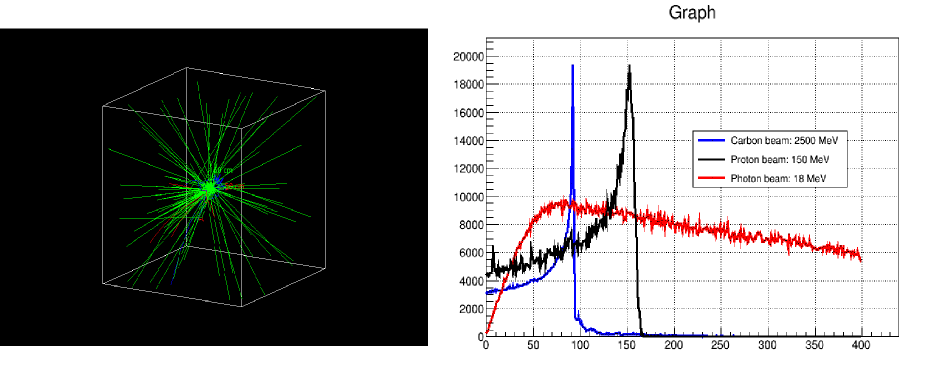
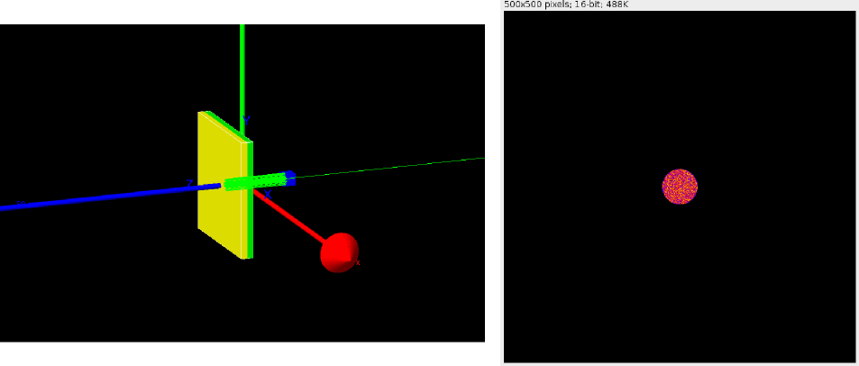
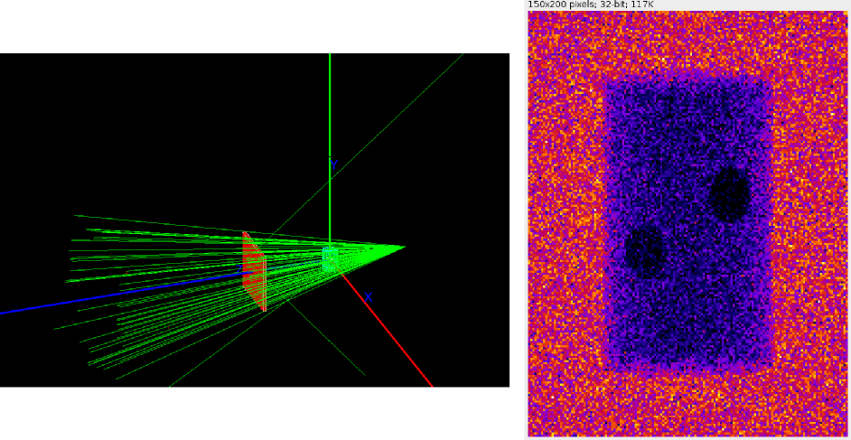
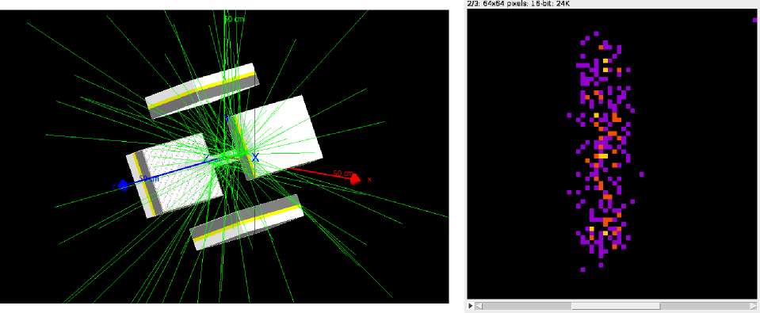
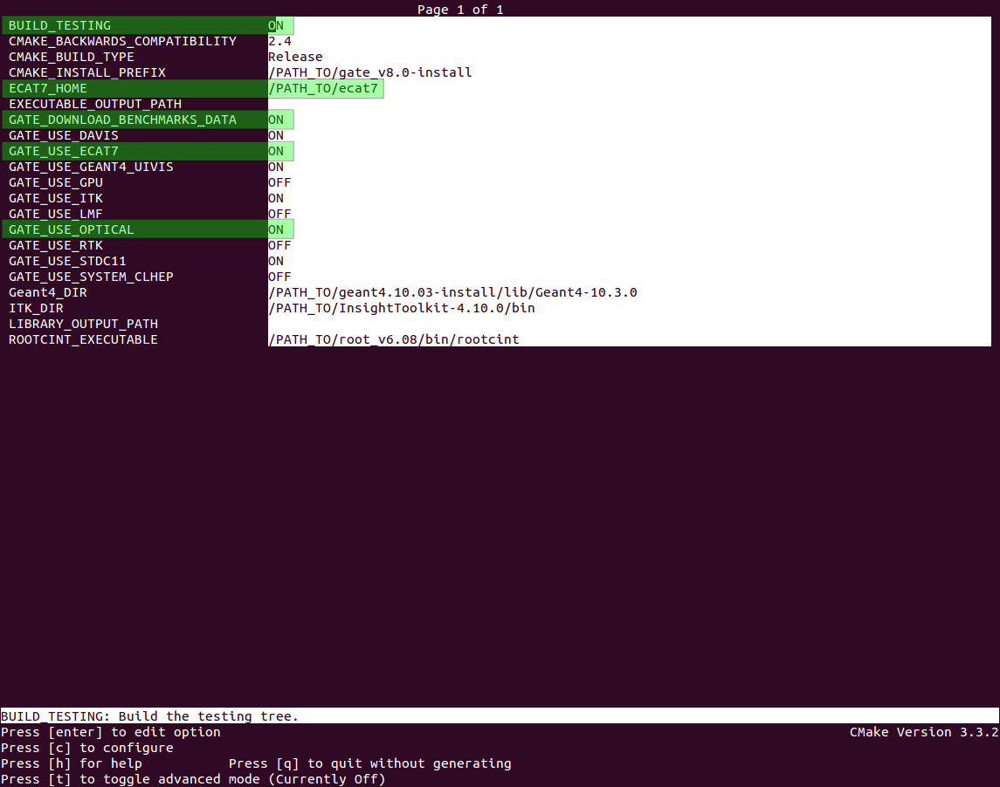

.. _validating_installation-label:

Validating Installation
=======================

.. contents:: Table of Contents
   :depth: 15
   :local:

Benchmarks tests
----------------

**Warning: benchmark tests are only provided for Gate compiled with Geant 10.3 distribution**

In order to ensure regular updates of the revised Gate software modules to be developed and ensure a faster public release, we have included in Gate V8.0 a new benchmarking system. It provides 3 benchmark tests dedicated to radiation therapy applications and 4 to imaging applications.

Radiation therapy applications benchmark tests
~~~~~~~~~~~~~~~~~~~~~~~~~~~~~~~~~~~~~~~~~~~~~~

All these tests are located in benchmarks/benchRT folder.

They all consists of a water box through which a gamma (*gamma.mac*), a proton (*proton.mac*), and a carbon (*carbon.mac*) beam is launched.

They all have a less than 10-seconde duration.

Imaging applications benchmark tests
~~~~~~~~~~~~~~~~~~~~~~~~~~~~~~~~~~~~

All these tests are located in benchmarks/benchImaging folder.

The **optical** test mimics a bioluminescence experiment using optical photon as source distribution (*optical.mac*)

The **CT** test consists of a CTScanner system together with an X-ray source distribution defined using a histogram (*ct.mac*)

The **SPECT** test consists of a SPECTHead system in orbiting movement together with a 140 keV-gamma ray source distribution (*spect.mac*)

The **PET** test consists of a ECAT system together with a voxelized phantom of human brain and a source distribution of 18-F (*pet.mac*)

.. figure:: BenchImaging12.png
   :alt: Figure 5: BenchImaging12
   :name: BenchImaging12

They all have a less than 1-minute duration.

How to run tests
~~~~~~~~~~~~~~~~

All benchmark tests can be run with 3 different methods:

1) **Automatically**, every night in the dashboard
See: http://my.cdash.org/index.php?project=GATE

2) **Manually**, by executing *make test* after completing the build process

Be careful, it requires some prior adjustments in CMake configuration

After *make* and *make install*, you just have to type *make test* to automatically run all the tests

At the end of make test process, you should see::

   Running tests...
   Test project /PATH_TO/gate_v8.0-build
       Start 1: benchRT_gamma
   1/7 Test #1: benchRT_gamma ....................   Passed   15.04 sec
       Start 2: benchRT_proton
   2/7 Test #2: benchRT_proton ...................   Passed    1.55 sec
       Start 3: benchRT_carbon
   3/7 Test #3: benchRT_carbon ...................   Passed    6.11 sec
       Start 4: benchImaging_ct
   4/7 Test #4: benchImaging_ct ..................   Passed   37.71 sec
       Start 5: benchImaging_optical
   5/7 Test #5: benchImaging_optical .............   Passed    4.09 sec
       Start 6: benchImaging_spect
   6/7 Test #6: benchImaging_spect ...............   Passed   27.70 sec
       Start 7: benchImaging_pet
   7/7 Test #7: benchImaging_pet .................   Passed   14.18 sec
   100% tests passed, 0 tests failed out of 7
   Total Test time (real) = 106.38 sec

3) **Manually**, by running the same shell script for each test
In /PATH_TO/benchmarks folder, type::

   ./gate_run_test.sh <folder>  <testname>

For instance::
  
  ./gate_run_test.sh benchRT gamma

This script will do the following:

* Sanity checks
* Execute Gate, generate a log
* Get reference results (downloaded by CMake)
* Perform some diff commands
* Return result (success/failure)

This script needs data and macro files (in /data and /mac folders, respectively) + parameters : *testname.txt*

* Contains the list of files to be compared
* Tools to perfom the comparisons: *diff*,  *diff_stat*,  *diff_dose* ...

If everything went well, you should see at the end of each test::

   -----------------------
   exit_status_final is:
   0
   -----------------------
   (Gate output in gate_simulation_log.txt)
