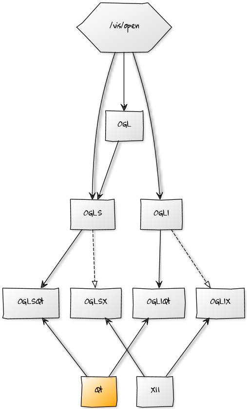
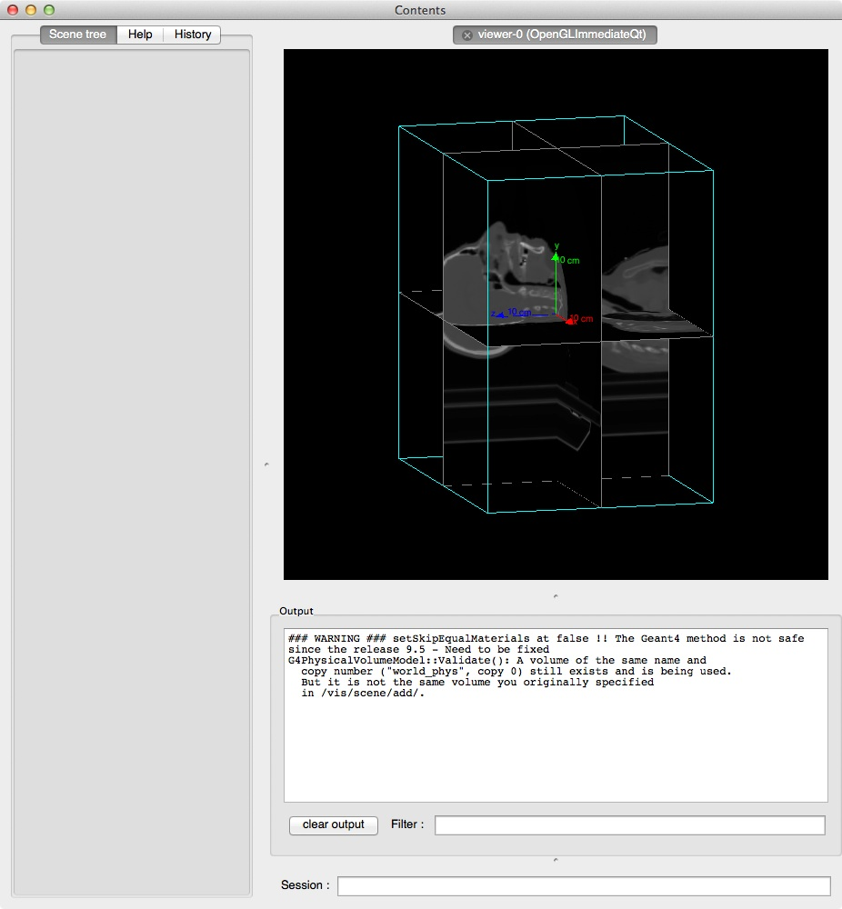
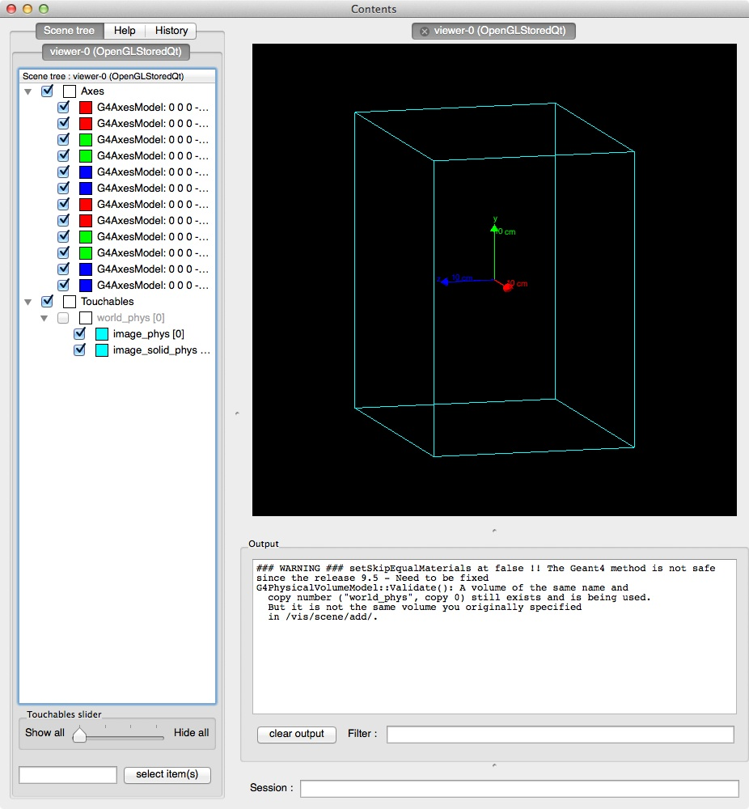

Visualization
=============

.. contents:: Table of Contents
   :depth: 15
   :local:

Introduction
------------

The visualization options in GATE provide the same functionalities as provided in GEANT4. Most options in GEANT4 to visualize detector geometry, particle trajectories, tracking steps, etc. are also available in GATE. The graphics systems that can be selected in GATE are: DAWNFILE, VRMLFILE (versions 1 and 2) and OpenGL in stored and immediate mode, with OpenGL required as an external library. Most of the libraries are freely available.

Important Hints
---------------

When loading digital images using OpenGL, the OpenGL Immediate-X viewer is recommended instead of the frequently used Stored-X viewer.

Using DAWN and VRMLVIEW, complicated geometries, like a huge number of crystals in a cylindrical PET system, may take very long to get rendered. To decrease the file size and to speed up the visualization, the following option may be used::

   /gate/crystal/vis/setVisible 0 

Using that option, the individual crystals are not rendered but they are shown as a wireframe instead.

Command Lines
-------------

Basic commands provided by the GEANT4-package can be used to set basic vizualisation options, as shown below. 

Visualization with OpenGL
~~~~~~~~~~~~~~~~~~~~~~~~~

The best method is to let Geant4 choose the best OpenGL mode with **/vis/open OGL** and not force a mode which can be present or not on user system.

* All OpenGL commands are available here:

http://geant4.slac.stanford.edu/Presentations/vis/G4OpenGLTutorial/G4OpenGLTutorial.html

For example, if you wish to change the center of your simulation in order to zoom to a specific part of it, you can use the pan command and zoom in::

   /vis/viewer/panTo -5 -1
   /vis/viewer/zoom 4.

   # V I E W E R #
   /vis/open OGL
   # define the zoom factor
   /vis/viewer/zoom 1.5
   # Set the viewing angle
   /vis/viewer/set/viewpointThetaPhi 5 60
   # Set the drawing style 
   /vis/viewer/set/style surface
   # Tell the viewer to draw the volumes 
   /vis/drawVolume
   # The trajectories for each run should be drawn together 
   # don't store trajectories = 0; store trajectories = 1 
   /tracking/storeTrajectory 1
   # Requests viewer to refresh hits, tracks, etc., at end of event. 
   # Or to accumulate drawings. Detector remains or is redrawn. 
   /vis/scene/endOfEventAction accumulate 

   OGL

The following commands implement additional options relevant within GATE::

   # draw object in WireFrame Mode
   /gate/block/vis/forceWireframe 

or::
 
   # draw object to appear as a solid 
   /gate/block/vis/forceSolid
   
   # define object color
   /gate/block/vis/setColor blue 

Instead of block as in the example here, objects like crystal, source, scanner can be assigned specific vizualization properties.

The "autoUpdate" capability has been removed since version 6.0.0 and manual geometry update has to be used instead. This can be done using the following command at any moment in the GATE command prompt environment::

   /gate/geometry/rebuild

Otherwise the complete geometry building is done when /gate/run/initialize command is given.

Visualization of Images
-----------------------

Since 7.0, GATE can show images with OpenGL but only in Immediate mode and the volume of the image must be in WireFrame mode.
This functionality works with X11 and Qt.

Immediate mode
--------------

Command::

   /vis/open OGLI

   OpenGL Immediate mode

Stored mode
-----------

Command::
 
   /vis/open OGLS

   OpenGL Stored mode

Visualization with DAWN
~~~~~~~~~~~~~~~~~~~~~~~

Instead of real-time visualization based on OpenGL, storing images in a file (mostly eps) for further processing might be useful. DAWN offers such options.

The package can be downloaded from the Internet and installed following the instruction given at http://geant4.kek.jp/~tanaka/src/dawn_3_85e.taz 

To use DAWN and DAWNFILE in your macro, a specific open command should be used, in replacement of the opening of OpenGL::

   /vis/open DAWNFILE
   /vis/viewer/reset
   /vis/viewer/set/viewpointThetaPhi 30 0
   /vis/viewer/zoom 1.5
   /vis/drawVolume
   /tracking/storeTrajectory 1
   /vis/scene/endOfEventAction accumulate
   /vis/viewer/update /vis/viewer/refresh 

Specific environment variables have to be set in your shell script to have access to DAWN inside GATE. For instance, in a C-shell::

   if ( Xn == Xy ) then
   setenv G4VIS_BUILD_DAWN_DRIVER 1 
   echo "On this machine the G4VIS_BUILD_DAWN_DRIVER= G4VIS_BUILD_DAWN_DRIVER"
   endif 

and also::

   if ( Xn == Xy ) then
   setenv G4VIS_USE_DAWN 1$
   echo "On this machine the G4VIS_USE_DAWN= G4VIS_USE_DAWN"
   endif

Visualization with VRML
~~~~~~~~~~~~~~~~~~~~~~~

Sometimes, it may be helpful to check a geometry setup by interactively manipulating the visualized scene. These features are offered by the option VRML2FILE in connection with an appropriate viewer like vrmlview. Such a viewer can be freely downloaded from: http://www.sim.no/products/VRMLview/ 
 
A specific environment variable has to be set first::

   setenv G4VRMLFILE_VIEWER vrmlview 

For using this option in Gate, the following line has to be added to the macro instead of the corresponding OpenGL opening::

   /vis/open VRML2FILE 

Again, the environment variables have to be properly set (here C-schell example)::
 
   if [ Xn = Xy ] ;
   then G4VIS_BUILD_VRML_DRIVER=1 
   export G4VIS_BUILD_VRML_DRIVER
   echo "On this machine the G4VIS_BUILD_VRML_DRIVER=$G4VIS_BUILD_VRML_DRIVER"
   fi

   if [ Xn = Xy ] ;
   then G4VIS_USE_VRML=1
   export G4VIS_USE_VRML
   echo "On this machine the G4VIS_USE_VRML=$G4VIS_USE_VRML"
   fi

During processing in GATE, a file is written with the extension wrl.

Axes
~~~~

Any position in the *world* is defined with respect to a three-axis system: X, Y and Z. These three axes can be seen in the display window using::

   /vis/scene/add/axes
