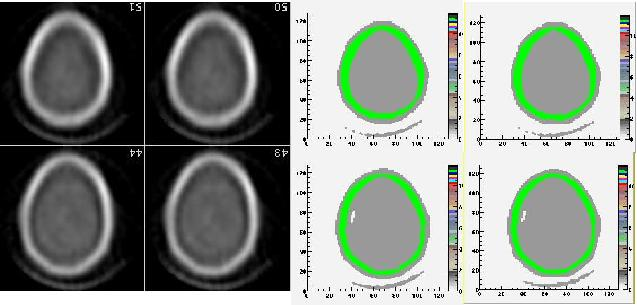
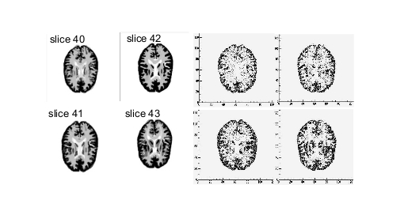
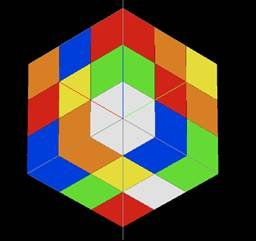

.. _voxelized_source_and_phantom-label:

Voxelized source and phantom
============================

.. contents:: Table of Contents
   :depth: 15
   :local:

Introduction
------------

Voxelized source and phantom's purpose is the use of digital phantoms or patient data as inhomogeneous anthropomorphic attenuation maps or emission sources so as to simulate and thus reproduce realistic acquisitions.

From its first public release, GATE is able to read digital phantom or clinic data stored in various image file formats so as to allow users to read attenuation maps or emission data from these voxelized phantoms and sources.

To read in voxelized geometry, GATE requires a text file for the description of materials (AttenuationRange.dat for instance) and a 3D image stored in one of the following formats: **ASCII**, **Interfile** (8-bit, 16- or 32-bit Signed and Unsigned, and 32- or 64-bit Real), **Analyze**, **MetaImage** and **DICOM**. The text file must provide a number of subdivisions, define intervals associated to each subdivision and attach them with a correlated material name.

Example of AttenuationRange.dat file::

   # Number of subdivisions
   3
   # Define the intervals and attach a correlated material
   0 10 Air
   11 200 Water
   201 255 SpineBone

To read in voxelized sources, GATE requires a text file for the description of activity levels (ActivityRange.dat for instance) and a 3D image stored in one of the following formats: **ASCII**, **Interfile** (8-bit, 16- or 32-bit Signed and Unsigned, and 32- or 64-bit Real), **Analyze**, **MetaImage** and **DICOM**. The text file must provide a number of subdivisions, define intervals associated to each subdivision and attach them with a correlated activity (in Bq). The possibility to extend image file formats for voxelized sources is still under development.

Example of ActivityRange.dat file::

   # Number of subdivisions
   6
   # Define the intervals and attach a correlated activity (in Bq)
   200 210 1.
   211 220 3.
   221 230 5.
   231 240 10.
   241 250 20.
   251 255 40.

Voxelized phantoms
------------------

Description of voxelized geometry
~~~~~~~~~~~~~~~~~~~~~~~~~~~~~~~~~

To import digital phantom or patient data as a voxelized geometry, GATE to use a special "navigator" algorithm that allow to quickly track particles from voxel to voxel. There are several navigators available. We recommend "**ImageNestedParametrisedVolume**" for most use.  

Regular parameterization method
^^^^^^^^^^^^^^^^^^^^^^^^^^^^^^^

Since Geant4.9.1 a new navigation algorithm, dubbed regular navigation, can be used for the tracking of particles in voxelized volumes. The regular navigation algorithm performs fast direct neighbouring voxel identification without a large memory overhead. This is the major source of acceleration of the implemented regular navigation algorithm. In addition, boundaries between voxels which share the same material can be ignored. Using this option, the geometry only limits tracking at the boundary between voxels with different materials, providing a significant reduction of the number of propagation steps. The regular navigator uses a new algorithm that performs this search only for the neighbours of the actual voxel. It therefore highly reduces the time spent on this search, as much as the number of voxels is large. It also includes a new method called ComputeStepSkippingEqualMaterials; when a boundary is encountered, the navigator searches for the next voxel it should enter and check if its material is the same as the actual one. If this is the case, this method is directly called again without passing through the navigator manager which loads the new properties of the next voxel, etc. Therefore the fewer the materials, the faster the simulation. In conclusion, the time saved using the regular navigator is directly dependent on the number of voxels and the number of different materials contained in the voxelized phantom. The better acceleration factors were obtained while simulating PET acquisitions (3 different materials: air, water, bone) with finely sampled phantom definitions. This factor could be around 3 in those cases. However in any case, even with a lot of different materials, this navigator will always be faster than using older navigators such as parameterizedBoxMatrix or compressedMatrix. That is the reason why these navigators still be progressively deprecated.

Additionally, as the SkipEqualMaterials method can lead to fewer G4steps, one may want to force the stepping process at each boundary. In that case, the method can be inactivated using the following command:: 

   /gate/world/anyname/setSkipEqualMaterials 0

Also the particle tracking will inevitably be less effective. 

Nested parameterization method
^^^^^^^^^^^^^^^^^^^^^^^^^^^^^^

Another method of creating parametrized volumes in Geant4, using nested parametrization and the corresponding navigation algorithm has been available in GATE since version 6.1. Based on parametrized approach, this method allows GATE storing a single voxel representation in memory and dynamically changing its location and composition at run-time during the navigation. The main advantage of this method is high efficiency in memory space. While reusing the same mechanism as parameterized volume, Nested representation also splits the 3D volume along the three principal directions, allowing logarithmic finding of neighbouring voxels. Nested approach supposes geometry has three-dimensional regular reputation of same shape and size of volumes without gap between volumes and material of such volumes are changing according to the position. Instead of direct three-dimensional parameterized volume, one can use replicas for the first and second axes sequentially, and then use one-dimensional parameterization along the third axis. This approach requires much less memory access and consumption for geometry optimization and gives much faster navigation for ultra-large number of voxels. Using Nested representation, images are split into sub-volumes of homogeneous composition, which are parallelepipeds, either of the voxel size or larger. The main drawback is that all the particles are forced to stop at the boundaries of all parallelepipeds, generating a supplementary step and additional time cost, even if the two neighboring parallelepipeds share the same content. Such artificial steps occur very often as human organs are far from being parallelepipedic.

Regionalized parameterization method
^^^^^^^^^^^^^^^^^^^^^^^^^^^^^^^^^^^^

Recently, some GATE developers have proposed a new method for efficient particle transportation in voxelized geometry for Monte Carlo simulations, especially for calculating dose distribution in CT images for radiation therapy. The proposed approach, based on an implicit volume representation named segmented volume, coupled with an adapted segmentation procedure and a distance map, allows them to minimize the number of boundary crossings, which slows down simulation. Before being implemented within GATE, the method was developed using the GEANT4 toolkit and compared to four other methods: one box per voxel, parameterized volumes, octree-based volumes, and nested parameterized volumes. For each representation, they compared dose distribution, time, and memory consumption. The proposed method allows them to decrease computational time by up to a factor of 15, while keeping memory consumption low, and without any modification of the transportation engine. Speeding up is related to the geometry complexity and the number of different materials used. They obtained an optimal number of steps with removal of all unnecessary steps between adjacent voxels sharing a similar material. However, the cost of each step is increased. When the number of steps cannot be decreased enough, due for example, to the large number of material boundaries, such a method is not considered suitable. Thus, optimizing the representation of an image in memory potentially increases computing efficiency.

**Warning**. In some situations, for example computation of dose distribution, StepLimiter could be required to avoid too large steps. In doubt, use ImageNestedParametrisation.

Fictitious interaction
^^^^^^^^^^^^^^^^^^^^^^

**Important note:** so far, this method is available in GATE v7.0 version using Interfile reader only.

For detailed information, please refer to Fictitious interaction section

Description of voxelized phantoms
~~~~~~~~~~~~~~~~~~~~~~~~~~~~~~~~~

Regular, Nested and Regionalized parametrization methods together with their corresponding navigation algorithms are available in GATE V7.0 for voxelized phantoms. Note that so far their current implementations do not support voxel visualization attributes on a per material basis. 

To create a parameterized phantom object using any of the three above-mentioned methods, one can use the corresponding command lines as follows::

   /gate/world/daughters/name anyname 
   /gate/world/daughters/insert  ImageRegularParametrisedVolume

Or::

   /gate/world/daughters/name anyname 
   /gate/world/daughters/insert ImageNestedParametrisedVolume

Or::

   /gate/world/daughters/name anyname 
   /gate/world/daughters/insert ImageRegionalizedVolume

All these three methods supports 3D images stored in various image file formats, which is automatically defined from their extension:

* ASCII
* Interfile format: header .h33 + raw image .i33
* Analyze format: header .hdr + raw image .img
* MetaImage format: header. mhd + raw image .raw
* DICOM format: a series of .dcm files

Conversion into material definitions
^^^^^^^^^^^^^^^^^^^^^^^^^^^^^^^^^^^^

Whatever the navigation algorithm selected, conversion of image grayscales into material definitions is performed as follows:

When already defined in GateMaterials.db file, appropriate material properties are assigned to each voxel encoded value using either a range translator (to be used with images providing label values) or a units to materials conversion descriptor (to be used with images providing label or HU values).

Range translator
++++++++++++++++

Tables read by the range translator have a prescribed format. 

The first line defines the number of material subdivisions (i.e. the number of subsequent lines). The following lines describe the intervals (i.e. range) of encoded values (bits or segmented values) associated to each subdivision (i.e material), followed by a material name. A particular material will be assigned to each voxel whose value falls within the material range. 

One can keep specifying visibility boolean (true or false) and color attribute values (red, green, blue components and transparency coefficient) within the range translator as he did when using a previous GATE version. However, as previously mentioned, so far current implementations of any of the three new parametrization methods do not support voxel visualization attributes on a per material basis, hence preventing the voxelized phantom from being displayed.

Example of a range translation table (AttenuationRange.dat, for instance)::

   4 
   0 0 Air false 0.0 0.0 0.0 0.2
   4 4 Water true 1.0 0.0 1.0 0.2
   5 5 Water true 0.0 1.0 0.0 0.2
   6 15 SpineBone true 0.0 0.0 1.0 0.2

In this example, the number of material subdivisions is 4. Material Air is assigned to pixels with value 0, Water to pixels with value 4 and 5, and SpineBone to pixels with value between 6 and 15. 

Units to materials conversion descriptor
++++++++++++++++++++++++++++++++++++++++

Units to materials conversion descriptor is a simple text file with three columns: Label or HU_start, Label or HU_end and material_name. It allows to associate a material to each label or HU voxel encoded value in the image. This text file can be written by hand or generated with the automated method, especially for HU values (see :ref:`for_rt_applications_only_automated_hu_stoichiometric_calibration-label`)

Example of a units to materials conversion descriptor (AttenuationRange.dat, for instance)::

   6 
   0 1  Air
   1 4  Water
   4 6  Bone
   6 16 SpineBone

In this example, the material Air is assigned to pixels with value 0, Water to pixels with value between 1 and 3 and 4 and 5, and SpineBone to pixels with value between 6 and 15.

Example of voxelized phantom description macro
^^^^^^^^^^^^^^^^^^^^^^^^^^^^^^^^^^^^^^^^^^^^^^

Example::

   # VOXELIZED PHANTOM BASED ON PATIENT DATA
   /gate/world/daughters/name                        patient
   
   # INSERT THE PARAMETERIZATION METHOD AND THE CORRESPONDING NAVIGATION ALGORITHM THE MOST APPROPRIATE TO YOUR SIMULATION
   /gate/world/daughters/insert                      ImageRegularParametrisedVolume
   /gate/world/daughters/insert                      ImageNestedParametrisedVolume
   /gate/world/daughters/insert                      ImageRegionalizedVolume
   
   # READ IMAGE HEADER FILE (.H33 FOR INTERFILE, .MHD FOR METAIMAGE AND .HDR FOR ANALYZE FORMATS)
   ## In this example, patient.h33 is the header filename of the image stored in Interfile file format. This file format is simple. It consists of two files: 1) patient.h33 is a ASCII file
   with the header description of the image (sizes, spacing and origin and other information), and 2) pixels values as binary patient.i33 data. 
   /gate/patient/geometry/setImage                   data/patient.h33
   
   
   # [OPTIONAL]
   ## patient-HUmaterials.db is a text file with patient-related material description. If all the wanted material are already into the GateMaterials.db you do not need such additional file.
   HU means Hounsfield Units because RT applications mainly used CT images. However, any image type can be used (with floating point voxel value). 
   /gate/geometry/setMaterialDatabase                data/patient-HUmaterials.db
   
   
   # INSERT THE TRANSLATOR THAT WILL CONVERT THE IMAGE FROM DIGITAL VALUES TO MATERIAL INFORMATION
   # RANGE TRANSLATOR (LABEL VALUES)
   /gate/patient/geometry/setRangeToMaterialFile     data/patient-HU2mat.dat
   #UNITS TO MATERIALS CONVERSION DESCRIPTOR (LABEL OR HU VALUES)
   ## When dealing with HU values, this text file can be written by hand or generated with the automated method (see Automated HU stoichiometric calibration). 
   /gate/patient/geometry/setHUToMaterialFile        data/patient-HU2mat.dat
   
   
   # AS WITH OTHER OBJECTS, ADDITIONAL OPTIONS REGARDING THE POSITION OF THIS PHANTOM CAN ALSO BE SPECIFIED
   /gate/patient/placement/setTranslation            0. 0. 0. mm
   /gate/patient/placement/setRotationAxis           1 0 0
   /gate/patient/placement/setRotationAngle          0 deg
   
   # ADD THIS COMMAND LINE, IF YOU WANT TO RETRIEVE INFORMATION ABOUT THE COMPTON AND RAYLEIGH INTERACTIONS WITHIN THIS PHANTOM VOLUME
   /gate/hof_brain/attachPhantomSD
   
   # FOR IMAGEREGULARPARAMETRISEDVOLUME NAVIGATOR ONLY. COMMAND USED TO SPEED-UP NAVIGATION
   /gate/hof_brain/setSkipEqualMaterials             1

Example of Interfile format header::

   !INTERFILE := 
   !GENERAL IMAGE DATA := 
   !type of data := Tomographic 
   !total number of images := 16 
   study date := 1997:11:28 
   study time := 00:00:00 
   imagedata byte order := LITTLEENDIAN 
   !number of images/energy window := 16 
   !process status := Reconstructed 
   !matrix size [1] := 32 
   !matrix size [2] := 32 
   !number format := unsigned integer 
   !number of bytes per pixel := 2 
   scaling factor (mm/pixel) [1] := +8.8
   scaling factor (mm/pixel) [2] := +8.8 
   !number of projections := 16 
   !extent of rotation := 
   !time per projection (sec) := 0 
   study duration (sec) := 0 
   !maximum pixel count := +2.000000e+02 
   patient orientation := head_in patient
   rotation := supine 
   !GENERAL DATA := 
   !data offset in bytes := 0 
   !name of data file := brain_phantom.i33

Using such an image reader, digital phantom or patient data can be read in as voxelized attenuation geometries. Additionally, when a sensitive detector (phantomSD) is associated to this phantom, the system can retrieve information about the Compton and Rayleigh interactions within this volume.

   attenuation map from digital Hoffman phantom (left:data - right: after translation to material definition).

.. _for_rt_applications_only_automated_hu_stoichiometric_calibration-label:

For RT applications only: Automated HU stoichiometric calibration
^^^^^^^^^^^^^^^^^^^^^^^^^^^^^^^^^^^^^^^^^^^^^^^^^^^^^^^^^^^^^^^^^

To generate a correspondence between HU (voxel values) and material, you may use the following commands::

   /gate/HounsfieldMaterialGenerator/SetMaterialTable                  data/Schneider2000MaterialsTable.txt 
   /gate/HounsfieldMaterialGenerator/SetDensityTable                   data/Schneider2000DensitiesTable.txt
   /gate/HounsfieldMaterialGenerator/SetDensityTolerance               0.1 g/cm3
   /gate/HounsfieldMaterialGenerator/SetOutputMaterialDatabaseFilename data/patient-HUmaterials.db
   /gate/HounsfieldMaterialGenerator/SetOutputHUMaterialFilename       data/patient-HU2mat.txt
   /gate/HounsfieldMaterialGenerator/Generate

In this case, you need to provide:

* "Schneider2000MaterialsTable.txt" calibration text file allowing to split the HU range into several materials (see [Schneider2000]).
* "Schneider2000DensitiesTable.txt" calibration text file to indicate the relation between HU and mass density (g/cm3). It is normaly given by calibration of you CT scanner. It is critical that you note that density values you provide must match to the HU values you declare, so if you set initial HU values for the materials you have to provide initial density values also. It is a common mistake that you provide the mean density, making Gate overestimate it when perform the interpolation, so be careful.
* the parameter "DensityTolerance" allows the user to define the density tolerance. Even if it is possible to generate a new Geant4 material (atomic composition and density) for each different HU, it would lead to too much different materials, with a long initialization time. So we define a single material for a range of HU belonging to the same material range (in the first calibration Table) and with densities differing for less than the tolerance value. 
* the files "patient-HUmaterials.db" and "patient-HU2mat.txt" are generated and can be used with setMaterialDatabase and SetHUToMaterialFile macros.

Examples are available :ref:`gatert-label`

Voxelized sources
-----------------

Since release V7.1, possibilities to read in voxellized sources within GATE have been extended. They all require the user to provide 3D image stored in one of the following formats: Interfile (8-bit, 16- or 32-bit Signed and Unsigned, and 32- or 64-bit Real), Analyze, MetaImage and DICOM.

Conversion into activity values
~~~~~~~~~~~~~~~~~~~~~~~~~~~~~~~

Each voxel of the grayscale image is converted into actual activity value using either a linear or a range (same kind as the voxelized phantom one) translation table.

An example of a range translation table from voxel encoded values to activities (ActivityRange.dat in the example) is shown below::
 
   3
   4 4   1
   5 5   3
   14 15 5

where you specify the number of subdivisions or intervals (3 in this example), followed by the intervals definition and the correlated activity attached to each interval. If the number in the ASCII file, for a given voxel, is for instance between 14 and 15, then the activity for that voxel is set to 5. Bq. The resulting voxelized source has thus a discretized number of activity values (preliminar segmentation). 

Position
~~~~~~~~

By default the activity image is placed in the "first quarter", i.e. the image is placed starting at 0 0 0 mm (x, y, z). This is different from the placing of volumes in Geant4 and GATE where volumes are centered on their geometrical center. In order to align the activity image with a phantom volume, a translation is needed which in the simplest case (where the activity image has the same size and position as the volume) is a translation of half the size of the volume in the negative direction.

However, when the activity image and volume have different size and/or offset, the above translation should be added to the the image and phantom offset in order to correctly place the phantom and the activity image.

Example below::

    #Activity image of 100 100 100 mm with an offset of 50 50 50 mm
    #Phantom volume of 200 200 200 mm with an offset of 0 0 0 mm
    #Phantom placement by GATE will be -100 -100 -100 mm
    #The translation to apply is:
    #translation = (50 50 50) + (0 0 0) + (-100 -100 -100) = (-50 -50 -50)
    /gate/source/activityImage/setPosition -50 -50 -50 mm

Note: when reading .mhd images GATE doesn't take into account the Offset keyword. To take the Offset keyword into account for the geometry the method /gate/volumeName/geometry/TranslateTheImageAtThisIsoCenter x y z unit has to be applied. For the source, the method /gate/source/sourceName/TranslateTheSourceAtThisIsoCenter x y z unit has to be applied. These methods can be used to align the source on the geometry.

Example of voxelized source description macro
~~~~~~~~~~~~~~~~~~~~~~~~~~~~~~~~~~~~~~~~~~~~~

Example of voxelized source description macro reading in an InterFile image as source distributions is detailed below::

   !!!WARNING: Macro commands related to voxelized source description have been modified in GATE V7.1!!!
   Older ones are being deprecated and will be removed from the next release

   # DECLARATION OF THE FACT THAT A VOXELIZED SOURCE WILL BE USED 
   # Always use the keyword voxel to declare the type
   /gate/source/addSource                                            hof_brain voxel
   # DECLARATION THAT THE VOXELIZED SOURCE WILL BE ENTERED USING IMAGE DATA
   /gate/source/hof_brain/reader/insert                              image
     
   # INSERT THE TRANSLATOR THAT WILL CONVERT THE IMAGE FROM DIGITAL VALUES TO ACTIVITY VALUES 
   # Example for a linear translator: this scales all image values directly into activities
   /gate/source/hof_brain/imageReader/translator/insert              linear
   /gate/source/hof_brain/imageReader/linearTranslator/setScale      1. Bq
   # Example for a range translator (can not be used simultaneously)
   # Here the values of the image file are discretized in intervals and are then converted to predefined activities  
   /gate/source/hof_brain/imageReader/translator/insert              range 
   /gate/source/hof_brain/imageReader/rangeTranslator/readTable      ActivityRange.dat 
   /gate/source/hof_brain/imageReader/rangeTranslator/describe       1
    
   # THE FOLLOWING LINE ALLOWS YOU TO INSERT THE IMAGE DATA USING THE APPROPRIATE EXTENSION FILE
   /gate/source/hof_brain/imageReader/readFile                       hof_brain_phantom.h33 
   /gate/source/hof_brain/imageReader/verbose                        1
   
   # THE DEFAULT POSITION OF THE VOXELIZED SOURCE IS IN THE 1ST QUARTER
   # SO THE VOXELIZED SOURCE HAS TO BE SHIFTED OVER HALF ITS DIMENSION IN THE NEGATIVE DIRECTION ON EACH AXIS  
   /gate/source/hof_brain/setPosition                                -128. -128. 0. mm 
   /gate/source/hof_brain/dump                                       1 
   
   # THE FOLLOWING LINES CHARACTERIZE THE SIZE (NO DIFFERENCE WITH AN ANALYTICAL SOURCE) 
   /gate/source/voxel/setType backtoback 
   /gate/source/voxel/gps/particle gamma 
   /gate/source/voxel/gps/energytype Mono 
   /gate/source/voxel/gps/monoenergy 140. keV 
   /gate/source/voxel/gps/angtype iso 
   /gate/source/voxel/gps/mintheta 0. deg 
   /gate/source/voxel/gps/maxtheta 90. deg 
   /gate/source/voxel/gps/minphi 0. deg 
   /gate/source/voxel/gps/maxphi 360. deg 
   /gate/source/voxel/gps/confine NULL 

Using this image file reader any digital phantom or patient data, stored in any image format among ASCII, Interfile, Analyze, MetaImage and DICOM, can be read in as emission distribution. Afterwards, activity levels can be used to determine the number of primary particles for each voxel. 

An example of the Hoffman brain phantom, where the gray scales have been translated to activity distributions is shown in :numref:`Emission_map`.

   
   emission map from digital Hoffman phantom (left:data - right: translated activity values).

Dose collection
---------------

To collect absorbed dose deposited in the phantom, attach the phantom sensitive detector with the new attachVoxelPhantomSD command (and not attachPhantomSD) and add a dose output module::
 
   /gate/anyname/attachVoxelPhantomSD 
   /gate/anyname/addOutput outputModuleName 

The output module responds to the following commands::
 
   /gate/output/outputModuleName/saveUncertainty [true|false] 
   /gate/output/outputModuleName/setFileName anyFileName 

The output file is a binary file (number format is 4 bytes float) containing the absorbed dose in cGy. It has the same dimensions as the phantom. The output module optionally writes a second binary file containing the uncertainty on absorbed dose expressed as a fraction between 0 and 1. The uncertainty file also has the same dimensions as the phantom and its creation is controlled by the saveUncertainty command. The file name is the same as the absorbed dose file with a capital **U** appended. By default, the output file name is **doseMatrix.bin** and the uncertainty file is not created.

**Example**::
 
   # Create a simple phantom called CCD 
   /gate/world/daughters/name CCD 
   /gate/world/daughters/insert parameterizedBoxMatrix
   
   # Read the file : a 300x300x1 array 
   /gate/CCD/geometry/insertReader image 
   /gate/CCD/imageReader/insertTranslator tabulated 
   /gate/CCD/imageReader/tabulatedTranslator/readTable ccdTable.dat 
   /gate/CCD/imageReader/readFile ccd300Phantom.dat
   
   # Place the phantom and rotate it so that it is in the XZ plane 
   /gate/CCD/placement/setTranslation 0 -82.269 0 mm 
   /gate/CCD/placement/setRotationAxis 1 0 0 
   /gate/CCD/placement/setRotationAngle 90 deg
   
   # Attach the phantom SD and the output module 
   /gate/CCD/attachVoxelPhantomSD 
   /gate/CCD/addOutput doseOutput 
   /gate/output/doseOutput/saveUncertainty true 
   /gate/output/doseOutput/setFileName ccdDose.bin

**Comments**

Depending on the phantom dimensions, the use of a parameterizedBoxMatrix may increase memory usage by up to a factor of 2 and increase CPU time by 5-50.

If you plan to collect only dose in the phantom, it is suggested that you disable other types of output, for example::

   /gate/output/ascii/disable

   
   A simple voxellized phantom without transparency

.. figure:: Image2.jpg
   :alt: Figure 4: A simple voxellized phantom with transparency
   :name: image2
   
   A simple voxellized phantom with transparency

**Dose calculations**

The relative uncertainty on dose is calculated on a per voxel basis.  Let :math:`\{d_{i}\} i = 1,...,N` be the sequence of energy deposits in a given voxel, we can calculate the following quantities:

Mean energy deposit:

:math:`\overline{d}=E(d)=\frac{1}{N}\sum_{i=1}^{N} d_{i}`

Sample variance:

:math:`s^{2}=E(d^{2})-E(d)^{2}`

:math:`s^{2}=\frac{1}{N^{2}}\lbrack N\sum d_{i}^{2}-(\sum d_{i})^{2}\rbrack`

Population variance estimator:

:math:`s^{2}=\frac{N}{N-1}s^{2}`

Standard deviation:

:math:`s=s\sqrt{\frac{N}{N-1}}`

Standard error of the mean:

:math:`\hat{d}=\frac{s}{N}=\frac{s}{\sqrt{N-1}}`

Real-time motion management for voxellized source and phantom
-------------------------------------------------------------

* Generate N frames for the phantom corresponding to the time acquisition desired for example  50 frames for 5s so each frame is for .1 s ;
* I assume the 50 frames are NCAT_frame\_.i33,  NCAT_frame_2.i33, NCAT_frame_3.i33,  NCAT_frame_4.i33 $...$ NCAT_frame_N.i33::

   /gate/world/daughters/name Ncat
   /gate/world/daughters/insert compressedMatrix
   /gate/Ncat/geometry/insertReader interfile
   /gate/RTPhantom/insert RTVPhantom
   /gate/RTVPhantom/AttachTo Ncat
   /gate/RTVPhantom/setBaseFileName NCAT
   /gate/RTVPhantom/setHeaderFileName NCAT_header.h33
   /gate/RTVPhantom/SetNumberOfFrames 50
   /gate/RTVPhantom/SetTimePerFrame 0.1 s
   /gate/Ncat/interfileReader/insertTranslator range
   /gate/Ncat/interfileReader/rangeTranslator/readTable range.dat
   /gate/Ncat/interfileReader/rangeTranslator/describe 1
   /gate/Ncat/attachPhantomSD
   /gate/Ncat/placement/setTranslation  0. 0. 0. mm
   /gate/Ncat/interfileReader/describe 1 
 

The header NCAT_header.h33 looks like::

   !matrix size [1] := 128 
   !matrix size [2] := 128 
   !number format := unsigned integer 
   scaling factor (mm/pixel) [1] := +3.125000e+00 
   scaling factor (mm/pixel) [2] := +3.125000e+00 
   !number of slices := 128 
   slice thickness (pixels) := +3.125000e+00 

For the activity source::

   # V O X E L    S O U R C E
   /gate/source/addSource voxel voxel
   /gate/source/voxel/reader/insert interfile
   /gate/RTVPhantom/AttachToSource voxel
   /gate/source/voxel/interfileReader/translator/insert range
   /gate/source/voxel/interfileReader/rangeTranslator/readTable activityRange_test.dat
   /gate/source/voxel/interfileReader/rangeTranslator/describe 1
   /gate/source/voxel/setType backtoback
   /gate/source/voxel/gps/particle gamma
   /gate/source/voxel/setForcedUnstableFlag true
   /gate/source/voxel/setForcedHalfLife 6586.2 s
   /gate/source/voxel/gps/energytype Mono
   /gate/source/voxel/gps/monoenergy 0.511 MeV
   /gate/source/voxel/setPosition  -200. -200. -200 mm
   /gate/source/voxel/gps/confine NULL
   /gate/source/voxel/gps/angtype iso
   /gate/source/voxel/dump 1

   #TIME ACTIVITY option
   /gate/source/voxel/interfileReader/SetTimeActivityTablesFrom TimeActivity_Tables.dat
   /gate/source/voxel/interfileReader/SetTimeSampling 0.001 s

The activityRange_test.dat is a text file looking like this::

   12
   46    46     0
   61    61     0
   123   123    0
   215   215    0
   246   246    0
   261   261    0
   352   352    352
   369   369    0
   770   770    0
   831   831    0
   2300  2300   0
   950   950    950

The TimeActivity_Tables.dat is a text file looking like this::

   2
   950  lesion.dat
   352  liver.dat

Where the value 950 is the key corresponding in the attenuation map to the lesion and 352 is the key corresponding in the attenuation map to the liver.

Note that lesion.dat is a text file which contains the time activity table curve for the lesion, as explain here::

   19
   0       0
   0.01    89.5
   0.02    158.8
   0.03    199.3
   0.04    228.1
   0.05    250.4
   0.06    268.7
   0.08    297.4
   0.1     319.7
   0.15    360.3
   0.2     389.1
   0.3     429.6
   0.4     458.4
   0.5     480.7
   0.6     498.9
   0.7     514.3
   0.8     527.7
   0.9     539.5
   1       550.0

Where first column is the time in second and the second one is the activity in Bq at time t.

Examples
--------

You can find several examples related to the use of voxelized phantom and source in the new repository dedicated to examples (https://github.com/OpenGATE/GateContrib).

* `A complete simulation description about How To Use the new voxelized approach for imaging applications <https://github.com/OpenGATE/GateContrib/tree/master/imaging/PhantomSource/Voxelized_Phantom_Source>`_

Since GATE v7.0, this new approach is common for both imaging and RT applications.
Users need to execute the mainMacro.mac file to start the complete example.

The list of macro files which are involved in this example is the following:

  - mainMacro.mac
  - MoveVisu.mac
  - VoxelizedPhantom.mac
  - VoxelizedSource.mac
  - MoveVisu.mac
  - Verbose.mac

The phantom used in this application (Interfile Format)

  - Raw data:    brain_phantom.i33
  - Header file: brain_phantom.h33

And the associated ASCII files to convert phantom voxel values in material properties and activity values

  - range_atten_brain.dat
  - activity_range_brain.dat

* `Example of photon beam in patient CT image <https://github.com/OpenGATE/GateContrib/tree/master/dosimetry/Radiotherapy/example2>`_

Two different navigators are tested NestedParameterized and Regionalized, with two number of materials.

Output is a 3D dose distribution map (with associated uncertainty). 

* `Comparison between MetaImage and DICOM formats <https://github.com/OpenGATE/GateContrib/tree/master/imaging/DICOM/mhd-dcm-comparison>`_

The main simulation files are constructed as follows:

  - main-[series name]-[input format].mac
  - [series name] : ffp, ffs, hfp, hfs
  - [input format]: mhd, dcm

Each main file will generate two mhd images:

  - one containing the density dump of the image (density-[series name]-[input format].mhd/.raw)
  - one containing the deposited dose in the image (DA-[series name]-[input format]-Dose.mhd/.raw)
    
Comparison between input formats can be made by the diff command::

   diff DA-[seriesA]-mhd-Dose.raw DA-[seriesA]-dcm-Dose.raw

